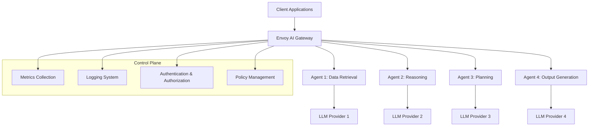
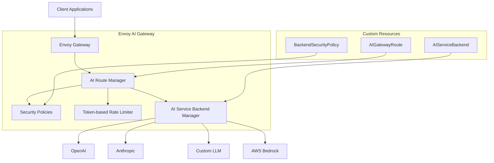
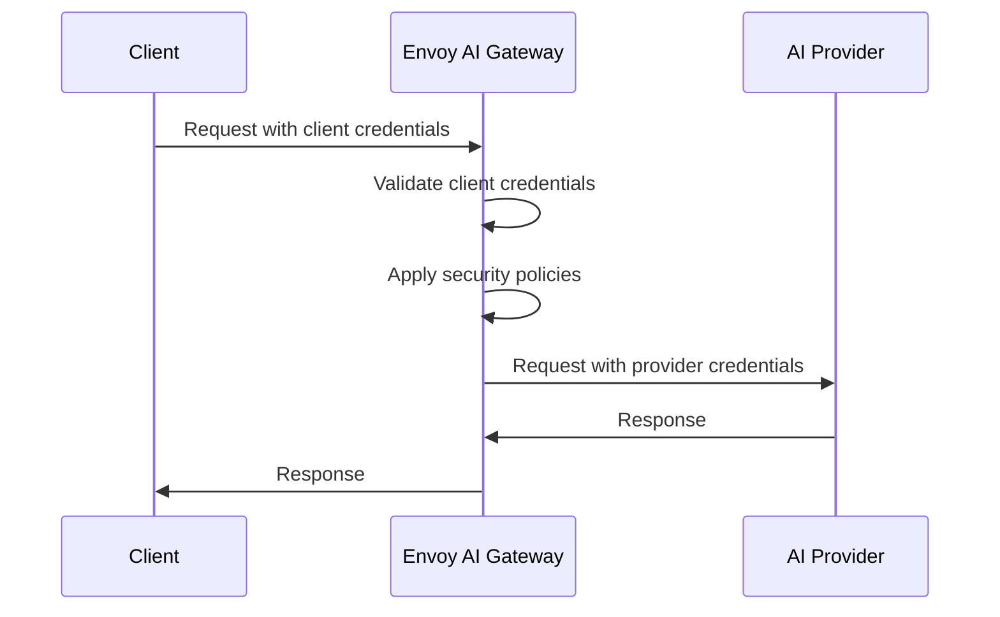
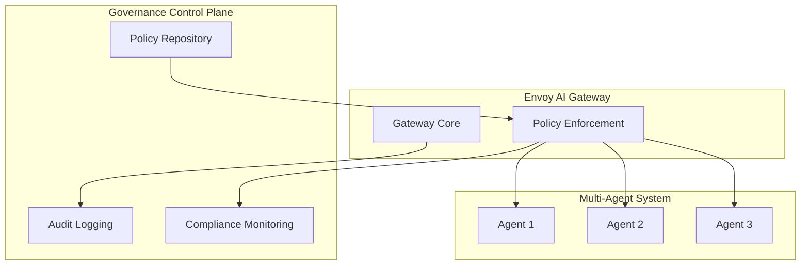
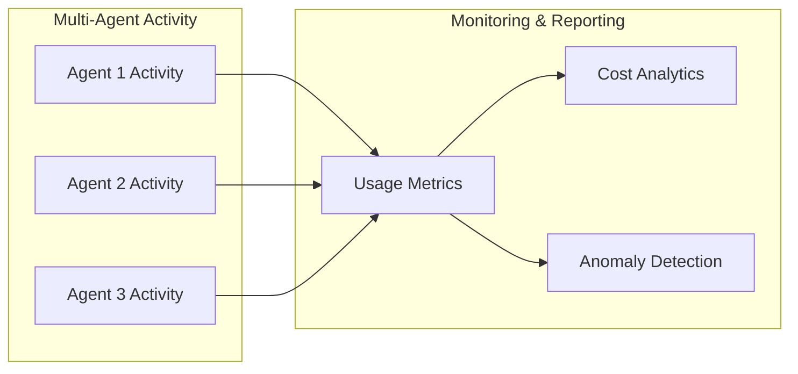
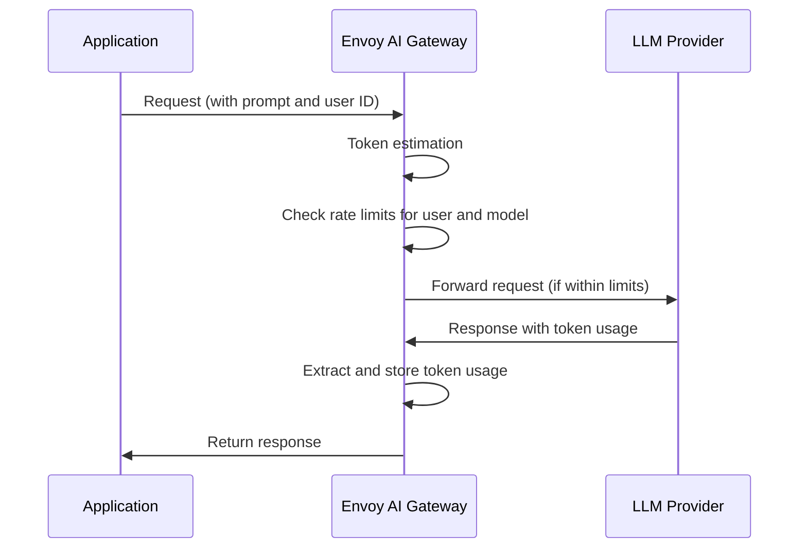
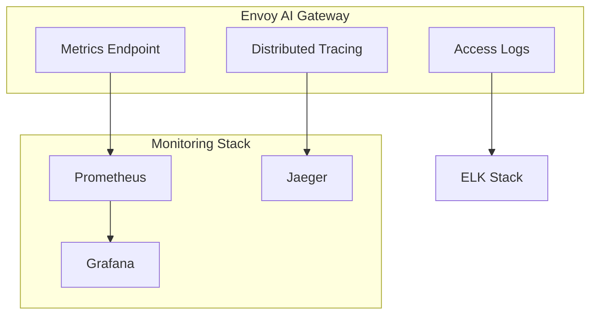

# Securing and Optimizing Multi-Agent Generative AI Systems with Envoy AI Gateway

## Introduction

Organizations are increasingly adopting multi-agent generative AI systems to solve complex business problems. These systems, composed of multiple specialized AI agents working together, offer enhanced capabilities but also introduce new challenges in security, governance, and cost management.

Envoy AI Gateway, an open-source project built on the proven Envoy Proxy and Envoy Gateway technology, provides a robust solution for managing traffic between application clients and generative AI services. Released in February 2025 as a collaborative effort between Tetrate, Bloomberg, and the Cloud Native Computing Foundation (CNCF) community, Envoy AI Gateway is designed to address the unique challenges of AI traffic management.

This blog explores how Envoy AI Gateway can enhance security, governance, and cost management in multi-agent generative AI systems, making them more reliable, secure, and efficient.

## Understanding Multi-Agent Generative AI Systems

### What are Multi-Agent Systems?

Multi-agent systems in AI consist of multiple autonomous agents that interact with each other to solve complex problems. Each agent specializes in a specific task, contributing its expertise to achieve a common goal. Unlike single-agent systems, multi-agent architectures distribute responsibilities across specialized components, enabling more efficient problem-solving and enhanced capabilities.

### The Rise of Multi-Agent Architectures

Multi-agent systems have gained significant traction in the generative AI space because they address several limitations of single-agent approaches:

1. **Specialized Expertise**: Each agent can focus on a specific task, leading to more accurate and efficient outcomes.
2. **Scalability**: The modular nature of multi-agent systems makes them highly scalable.
3. **Resilience**: Failure of one agent doesn't necessarily compromise the entire system.
4. **Collaborative Intelligence**: Agents can work together, share insights, and build on each other's ideas.

### Challenges in Multi-Agent Systems

While multi-agent systems offer numerous advantages, they also introduce specific challenges:

1. **Security Concerns**: Multiple agents mean multiple potential attack vectors and increased risk of data exposure.
2. **Governance Complexity**: Managing permissions and behaviors across diverse agents becomes more complicated.
3. **Cost Management**: Without proper controls, costs can escalate quickly due to the increased number of model calls.
4. **Integration Overhead**: Each agent may require integration with different LLM providers or models.

This is where Envoy AI Gateway comes in as a critical component to address these challenges.

## What is Envoy AI Gateway?

Envoy AI Gateway is an open-source project that leverages Envoy Gateway to manage request traffic between application clients and generative AI services. It serves as a unified layer for routing and managing LLM/AI traffic with built-in security, token-based rate limiting, and policy control features.

### Key Features

- **Standardized Interface**: Exposes a unified API (currently OpenAI-compatible) to clients while routing to different AI service backends
- **Token-based Rate Limiting**: Controls cost by limiting usage based on token consumption
- **Backend Authentication**: Secure management of credentials for multiple LLM providers
- **Failover Management**: Automatic rerouting in case of service disruptions
- **Observability**: Comprehensive monitoring and logging capabilities

### Currently Supported Providers

Envoy AI Gateway currently supports integration with:

- **OpenAI** - Connect to OpenAI's GPT models
- **AWS Bedrock** - Access AWS Bedrock's suite of foundation models

More providers are planned for future releases. The project recommends following security best practices when configuring providers, including:

- Storing credentials securely using Kubernetes secrets
- Never committing API keys or credentials to version control
- Regularly rotating credentials
- Using the principle of least privilege when setting up access
- Monitoring usage and setting up appropriate rate limits

## Architecture of Multi-Agent Systems with Envoy AI Gateway

Let's explore how Envoy AI Gateway fits into a multi-agent generative AI architecture:



In this architecture, Envoy AI Gateway acts as the central hub for routing traffic between client applications and various AI agents. Each agent may connect to different LLM providers based on their specialization. The gateway handles all cross-cutting concerns like authentication, rate limiting, and observability.

### Detailed Component Architecture

Let's look at the internal architecture of Envoy AI Gateway:



Envoy AI Gateway introduces three Custom Resource Definitions (CRDs) for Kubernetes:
1. **AIGatewayRoute**: Defines the unified API schema and routing rules to AI service backends
2. **AIServiceBackend**: Specifies the AI service backend schema and connection details
3. **BackendSecurityPolicy**: Configures authentication for upstream AI services

## Enhancing Security in Multi-Agent Systems

Multi-agent systems inherently increase the attack surface for potential security breaches. Envoy AI Gateway addresses these concerns through several security mechanisms:

### Backend Authentication and Authorization



Envoy AI Gateway handles secure storage and management of LLM provider credentials, ensuring that client applications never need direct access to these sensitive keys. It also performs fine-grained authentication and authorization of client requests, leveraging existing identity providers and security infrastructure.

### Protection Against AI-Specific Threats

Multi-agent systems can be vulnerable to unique attack vectors, including:

1. **Prompt Injection**: Attackers might attempt to manipulate agent behavior through carefully crafted inputs
2. **Data Exfiltration**: Sensitive data might be inadvertently shared between agents
3. **Model Manipulations**: Attempts to bypass restrictions or generate harmful content

Envoy AI Gateway can implement guardrails for prompt requests and responses, protecting against these threats and ensuring compliance with organizational policies.

## Improving Governance in Multi-Agent Systems

Managing governance across multiple AI agents presents significant challenges. Envoy AI Gateway provides a centralized control plane for implementing and enforcing governance policies.

### Centralized Policy Management



Through this architecture, organizations can:

1. **Define unified policies** for all AI agents, regardless of the underlying LLM providers
2. **Enforce access controls** consistently across all agents
3. **Maintain comprehensive audit logs** for compliance and governance requirements
4. **Monitor policy adherence** in real-time

### Usage Tracking and Reporting

Governance isn't just about restrictions—it's also about visibility. Envoy AI Gateway provides comprehensive monitoring and reporting capabilities that give organizations insights into how their AI systems are being used:



This comprehensive visibility enables organizations to enforce governance policies effectively while gaining insights into system usage patterns.

> **Note on API Changes**: The token rate limiting implementation in Envoy AI Gateway has evolved. While earlier versions used a `TokenRateLimitPolicy` CRD, the current implementation leverages Envoy Gateway's Global Rate Limit API through the `BackendTrafficPolicy` resource and token tracking in the `AIGatewayRoute` resource.

## Cost Optimization in Multi-Agent Systems

One of the significant challenges in multi-agent systems is managing costs, especially when different agents might use different LLM providers with varying pricing models. Envoy AI Gateway offers several mechanisms for cost optimization:

### Token-Based Rate Limiting



Envoy AI Gateway implements token-based rate limiting by automatically extracting token usage from LLM responses. Unlike simple request-based rate limiting, this approach makes cost management more accurate and effective for generative AI services.

Key benefits of token-based rate limiting include:

1. **Set model-specific token budgets** for different teams, projects, or individual agents, accounting for the varying costs of different models
2. **Prevent unexpected cost spikes** due to large or inefficient prompts by monitoring actual token usage
3. **Track different types of token usage** (input tokens, output tokens, or total tokens) to implement more nuanced cost control strategies
4. **Create custom token calculation formulas** using CEL expressions to weight different types of usage based on their cost impact

The check for whether the total count has reached the limit happens during each request. When a request is received, AI Gateway checks if processing this request would exceed the configured token limit. If the limit would be exceeded, the request is rejected with a 429 status code. If within the limit, the request is processed and its token usage is counted towards the total.

### Unified API and Provider Selection

The unified API approach of Envoy AI Gateway enables organizations to efficiently manage costs by:

1. **Dynamically routing** to different providers based on cost considerations
2. **Switching providers** without application changes to take advantage of pricing changes
3. **Selecting appropriate models** based on the complexity of the task

## Implementation Guide for Multi-Agent Systems

Let's walk through a practical implementation of Envoy AI Gateway for multi-agent systems:

### Installation and Setup

```bash
# Install Envoy Gateway
helm upgrade -i eg oci://docker.io/envoyproxy/gateway-helm \
  --version v0.0.0-latest \
  --namespace envoy-gateway-system \
  --create-namespace

# Install Envoy AI Gateway
helm upgrade -i aieg oci://docker.io/envoyproxy/ai-gateway-helm \
  --version v0.0.0-latest \
  --namespace envoy-ai-gateway-system \
  --create-namespace

# Deploy a basic configuration
kubectl apply -f https://raw.githubusercontent.com/envoyproxy/ai-gateway/main/examples/basic/basic.yaml

# Verify installations are ready
kubectl wait --timeout=2m -n envoy-gateway-system deployment/envoy-gateway --for=condition=Available
kubectl wait --timeout=2m -n envoy-ai-gateway-system deployment/ai-gateway-controller --for=condition=Available
```

### Configuring and Testing the Gateway

First, let's see how to set up and test a basic gateway:

```bash
# Deploy a basic configuration
kubectl apply -f https://raw.githubusercontent.com/envoyproxy/ai-gateway/main/examples/basic/basic.yaml

# Wait for the Gateway pod to be ready
kubectl wait pods --timeout=2m \
  -l gateway.envoyproxy.io/owning-gateway-name=envoy-ai-gateway-basic \
  -n envoy-gateway-system \
  --for=condition=Ready

# Configure Gateway URL
export GATEWAY_URL=$(kubectl get gateway/envoy-ai-gateway-basic -o jsonpath='{.status.addresses[0].value}')

# If EXTERNAL-IP is <pending>, use port forwarding instead:
# export GATEWAY_URL="http://localhost:8080"
# kubectl port-forward -n envoy-gateway-system svc/[service-name] 8080:80

# Make a test request
curl -H "Content-Type: application/json" \
  -d '{
      "model": "some-cool-self-hosted-model",
      "messages": [
          {
              "role": "system",
              "content": "Hi."
          }
      ]
  }' \
  $GATEWAY_URL/v1/chat/completions
```

This will return a test response from the mock backend. For real AI model integration, you'll need to connect providers as shown in the next section.

### Configuring Multi-Agent Access

Now let's look at an example configuration for a multi-agent system:

```yaml
# Define an AI Gateway Route
apiVersion: ai.gateway.envoyproxy.io/v1alpha1
kind: AIGatewayRoute
metadata:
  name: multi-agent-route
spec:
  parentRefs:
  - name: ai-gateway
  routes:
  - backends:
    - name: reasoning-agent
      weight: 100
    matches:
    - path:
        type: PathPrefix
        value: /v1/reasoning
  - backends:
    - name: data-agent
      weight: 100
    matches:
    - path:
        type: PathPrefix
        value: /v1/data
  - backends:
    - name: planning-agent
      weight: 100
    matches:
    - path:
        type: PathPrefix
        value: /v1/planning

---
# Define AI Service Backends
apiVersion: ai.gateway.envoyproxy.io/v1alpha1
kind: AIServiceBackend
metadata:
  name: reasoning-agent
spec:
  provider: openai
  endpoint: https://api.openai.com
---
apiVersion: ai.gateway.envoyproxy.io/v1alpha1
kind: AIServiceBackend
metadata:
  name: data-agent
spec:
  provider: anthropic
  endpoint: https://api.anthropic.com
---
apiVersion: ai.gateway.envoyproxy.io/v1alpha1
kind: AIServiceBackend
metadata:
  name: planning-agent
spec:
  provider: aws-bedrock
  endpoint: https://bedrock.us-west-2.amazonaws.com
```

### Implementing Security Policies

```yaml
# Define Backend Security Policy
apiVersion: ai.gateway.envoyproxy.io/v1alpha1
kind: BackendSecurityPolicy
metadata:
  name: backend-auth
spec:
  targetRefs:
  - name: reasoning-agent
  - name: data-agent
  - name: planning-agent
  authenticationRefs:
  - name: api-keys
    namespace: default
```

### Setting Up Token-Based Rate Limiting

Envoy AI Gateway provides token-based rate limiting for AI traffic through integration with Envoy Gateway's Global Rate Limit API. This allows organizations to control costs by limiting token usage rather than just request counts.

First, configure token tracking in your `AIGatewayRoute`:

```yaml
apiVersion: ai.gateway.envoyproxy.io/v1alpha1
kind: AIGatewayRoute
metadata:
  name: multi-agent-route
spec:
  # Other settings...
  llmRequestCosts:
    - metadataKey: llm_input_token
      type: InputToken    # Counts tokens in the request
    - metadataKey: llm_output_token
      type: OutputToken   # Counts tokens in the response
    - metadataKey: llm_total_token
      type: TotalToken    # Tracks combined usage
```

Then, configure actual rate limits using a `BackendTrafficPolicy`:

```yaml
apiVersion: gateway.envoyproxy.io/v1alpha1
kind: BackendTrafficPolicy
metadata:
  name: model-specific-token-limit-policy
  namespace: default
spec:
  targetRefs:
    - name: envoy-ai-gateway
      kind: Gateway
      group: gateway.networking.k8s.io
  rateLimit:
    type: Global
    global:
      rules:
        # Rate limit rule for expensive models
        - clientSelectors:
            - headers:
                - name: x-user-id
                  type: Distinct
                - name: x-ai-eg-model
                  type: Exact
                  value: gpt-4
          limit:
            requests: 1000000    # 1M tokens per hour
            unit: Hour
          cost:
            request:
              from: Number
              number: 0      # Set to 0 so only token usage counts
            response:
              from: Metadata
              metadata:
                namespace: io.envoy.ai_gateway
                key: llm_total_token    # Uses total tokens from responses
        
        # Rate limit rule for less expensive models
        - clientSelectors:
            - headers:
                - name: x-user-id
                  type: Distinct
                - name: x-ai-eg-model
                  type: Exact
                  value: gpt-3.5-turbo
          limit:
            requests: 10000000    # 10M tokens per day
            unit: Day
          cost:
            request:
              from: Number
              number: 0
            response:
              from: Metadata
              metadata:
                namespace: io.envoy.ai_gateway
                key: llm_total_token
```

This configuration enables you to set different token limits for different models based on their costs, helping to prevent unexpected expenses while allowing flexibility with more cost-effective models.

## Monitoring and Observability

To maintain visibility into your multi-agent system, implement comprehensive monitoring:



## Case Study: Financial Services Multi-Agent System

Let's consider a financial services organization implementing a multi-agent system for risk analysis:

1. **Data Retrieval Agent**: Collects and processes financial data
2. **Analysis Agent**: Performs risk calculations and trend analysis
3. **Documentation Agent**: Generates regulatory reports and documentation
4. **Advisory Agent**: Provides investment recommendations

By implementing Envoy AI Gateway, the organization achieved:

- **Enhanced Security**: Prevented sensitive financial data leakage between agents
- **Improved Governance**: Implemented consistent policies for regulatory compliance
- **Cost Savings**: Reduced token usage by 37% through effective rate limiting
- **Operational Efficiency**: Simplified integration across multiple LLM providers

## Conclusion

As organizations increasingly adopt multi-agent generative AI systems to tackle complex problems, the need for robust security, governance, and cost management becomes paramount. Envoy AI Gateway addresses these challenges by providing a unified interface for managing AI traffic, implementing token-based rate limiting, and enforcing consistent security policies.

By leveraging Envoy AI Gateway in your multi-agent architecture, you can:

1. **Enhance security** through centralized authentication and authorization
2. **Improve governance** with comprehensive policy management and audit logging
3. **Optimize costs** through token-based rate limiting and efficient provider selection
4. **Simplify integration** with a unified API interface for diverse LLM providers

As the AI landscape continues to evolve, open-source projects like Envoy AI Gateway will play a crucial role in making advanced AI architectures more accessible, secure, and cost-effective for organizations of all sizes.

If you run into any issues while implementing Envoy AI Gateway in your multi-agent system, you can get help from the community through the [Envoy AI Gateway Slack channel](https://envoyproxy.slack.com/archives/C07Q4N24VAA) or by filing an issue on [GitHub](https://github.com/envoyproxy/ai-gateway/issues).

## Summary of Updates (March 2025)

This blog post has been updated with the latest information from the Envoy AI Gateway documentation:

1. **Installation and Setup**: Updated with the latest Helm-based installation commands, which replace the previous kubectl-based approach.

2. **Token Rate Limiting**: The token rate limiting implementation in Envoy AI Gateway has evolved. While earlier versions used a `TokenRateLimitPolicy` CRD, the current implementation leverages Envoy Gateway's Global Rate Limit API through the `BackendTrafficPolicy` resource and token tracking in the `AIGatewayRoute` resource.

3. **Provider Support**: Added details about the currently supported providers (OpenAI and AWS Bedrock) and how credentials are managed securely.

4. **Usage-Based Rate Limiting**: Added details on the token tracking capabilities that include InputToken, OutputToken, TotalToken, and custom CEL expressions for advanced token calculations.

5. **Testing Gateway**: Added instructions for configuring and testing a basic gateway deployment, including how to handle port forwarding when EXTERNAL-IP is pending.

## Additional Resources

- [Envoy AI Gateway GitHub Repository](https://github.com/envoyproxy/ai-gateway)
- [Envoy AI Gateway Documentation](https://aigateway.envoyproxy.io/)
- [Getting Started Guide](https://aigateway.envoyproxy.io/docs/getting-started/)
- [Weekly Community Meetings](https://docs.google.com/document/d/10e1sfsF-3G3Du5nBHGmLjXw5GVMqqCvFDqp_O65B0_w/edit?tab=t.0) (Thursdays)
- [Join the Envoy AI Gateway Slack](https://envoyproxy.slack.com/archives/C07Q4N24VAA)
- [GitHub Discussions](https://github.com/envoyproxy/ai-gateway/issues?q=is%3Aissue+label%3Adiscussion)
