# Advanced AI Agent Systems: From Fundamentals to Scalable Architecture
## Introduction: The Rising Bar for AI-Powered Agents

The landscape of AI-powered agents has undergone a remarkable transformation over the past few years. What once began as simple conversational interfaces has evolved into sophisticated systems capable of using tools, conducting research, making decisions, and executing complex objectives at scale. This evolution represents a fundamental shift in how we build and interact with AI systems.

Today's most advanced agents don't just respond to queries—they proactively solve problems through a combination of reasoning, tool use, and coordinated workflows. This post explores the architecture and development of these advanced agent systems, from core fundamentals to scalable, production-ready implementations.

## Fundamentals of Agent Systems

At their core, effective agent systems rely on three fundamental capabilities:

1. **Tool-calling**: The ability to interact with external tools and APIs
2. **State management**: Maintaining context and progress throughout multi-step tasks
3. **Content pipelines**: Processing, transforming, and routing information efficiently

Let's examine the architecture that enables these capabilities:

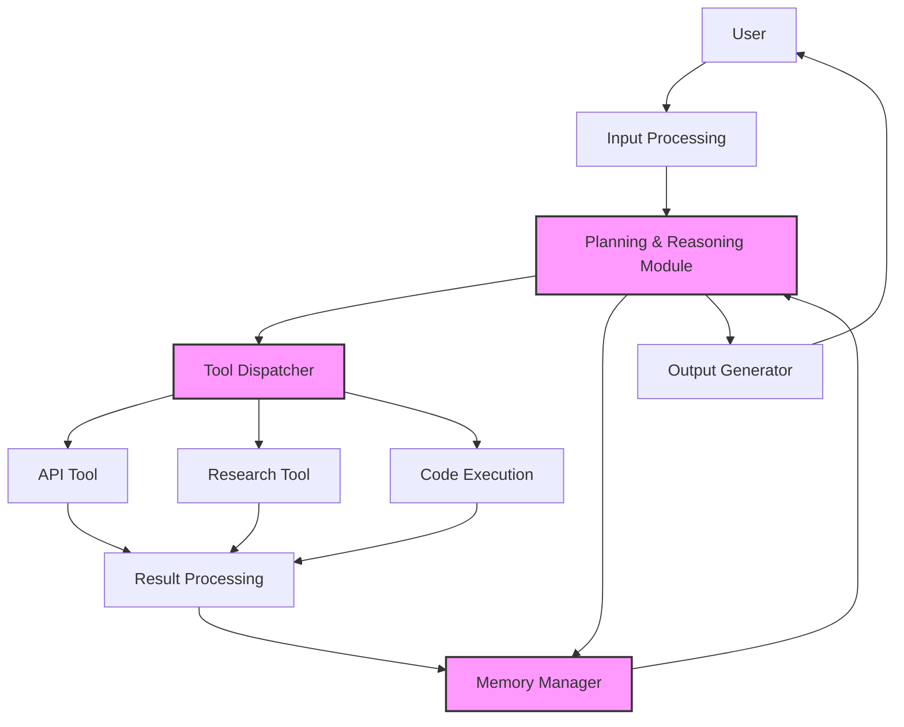

### Tool-Calling Architecture

Tool-calling is the mechanism that allows agents to interact with external systems. This capability transforms agents from conversational interfaces into systems that can take action in the world.

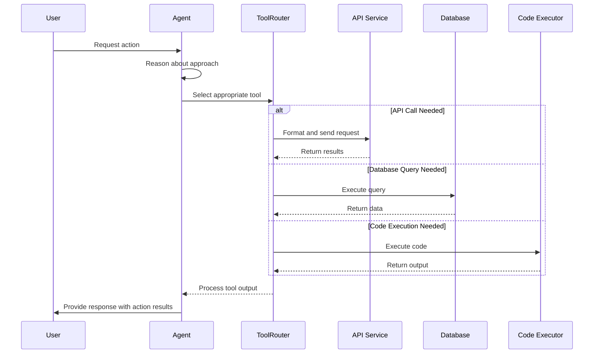

Effective tool-calling requires:

1. **Tool selection logic**: Determining which tool is appropriate for a given task
2. **Parameter formatting**: Ensuring inputs are correctly structured for each tool
3. **Result handling**: Processing and integrating tool outputs back into the agent's workflow
4. **Error management**: Gracefully handling failures and retrying when appropriate

### State Management Systems

Unlike simple stateless LLM calls, sophisticated agents must maintain state across multiple steps of complex tasks. This requires robust memory and context management.

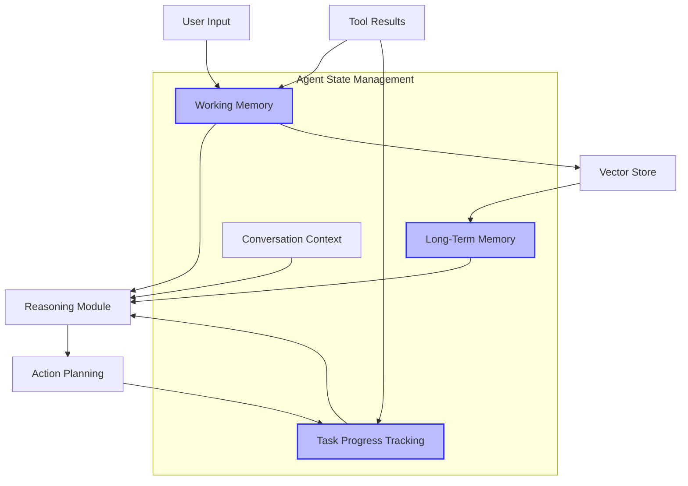

Effective state management implementations typically include:

1. **Working memory**: Temporary storage for the current context and immediate task
2. **Long-term memory**: Persistent storage of important information using vector databases
3. **Task progress tracking**: Monitoring multi-step workflows and maintaining progress
4. **Context window management**: Techniques to handle limited context windows through summarization and pruning

### Content Pipelines

Content pipelines govern how information flows through the agent system, from initial input processing to final output generation.

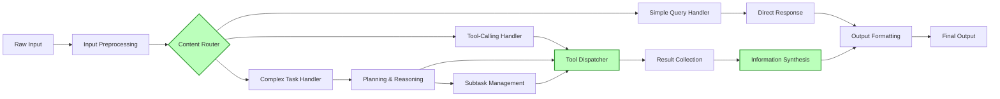

Effective content pipelines require:

1. **Content routing**: Directing inputs to appropriate handlers based on task type
2. **Preprocessing**: Cleaning and normalizing inputs for consistent processing
3. **Result collection**: Gathering outputs from multiple sources or steps
4. **Synthesis**: Combining information into coherent, useful outputs

## Developing Concurrent, Multi-Threaded Agents

As agent tasks grow more complex, sequential processing becomes a bottleneck. Modern agent architectures leverage concurrency and multi-threading to execute multiple operations simultaneously, dramatically improving performance.

### LangChain for Concurrent Execution

LangChain provides a solid foundation for building concurrent agent operations:

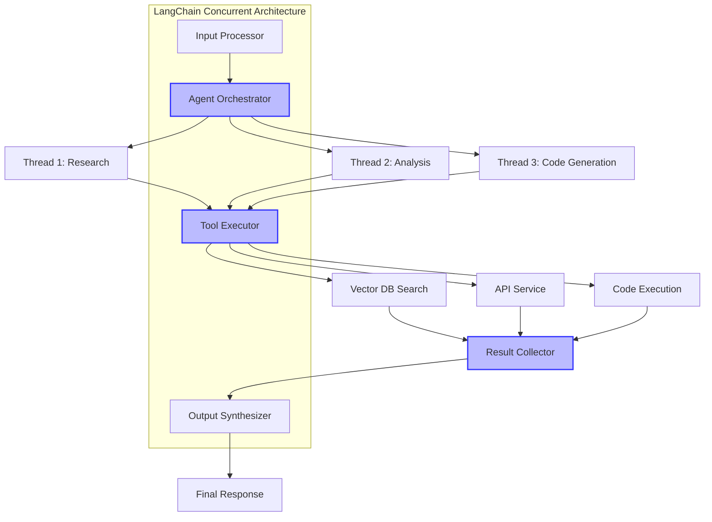

Key implementation patterns include:

1. **Asynchronous tooling**: Using `async`/`await` patterns to prevent blocking operations
2. **Parallel tool execution**: Running compatible tools simultaneously
3. **Subtask management**: Breaking complex tasks into independent units that can run concurrently

### LangGraph for Workflow Orchestration

LangGraph extends LangChain's capabilities with sophisticated state management and workflow design:

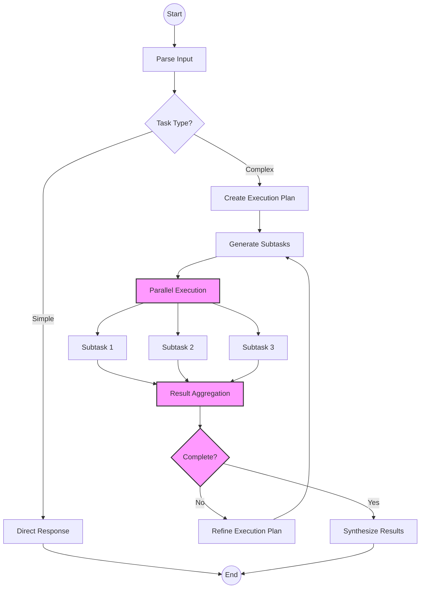

LangGraph enables:

1. **Dynamic workflows**: Adapting execution paths based on intermediate results
2. **State transitions**: Defining clear transitions between different agent states and operations
3. **Cycle detection and handling**: Managing recursive or repeating execution patterns
4. **Conditional branching**: Taking different paths based on task requirements and results

## Adapting Expert Systems for Real-Time Data

Modern agent architectures often incorporate elements from traditional expert systems, enhanced with real-time data capabilities.

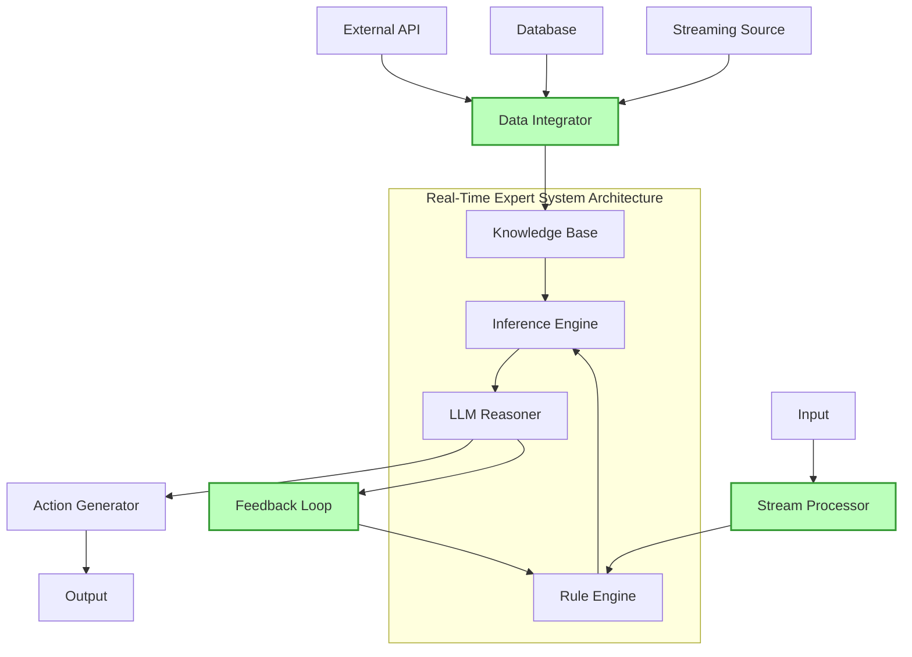

### Real-Time Data Retrieval

Real-time data integration requires specialized architectures:

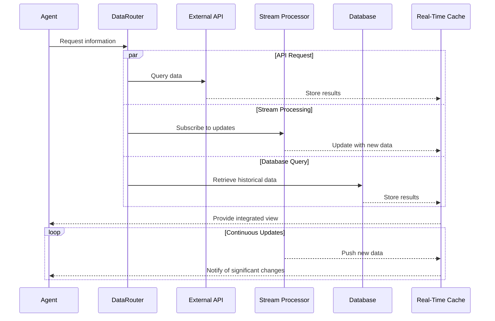

Effective real-time data systems incorporate:

1. **Data connectors**: Standardized interfaces to various data sources
2. **Streaming data processing**: Handling continuous data flows efficiently
3. **Caching strategies**: Balancing freshness with performance
4. **Update notifications**: Alerting the agent to significant new information

### Adaptive Feedback Mechanisms

Sophisticated agents continuously improve through feedback:

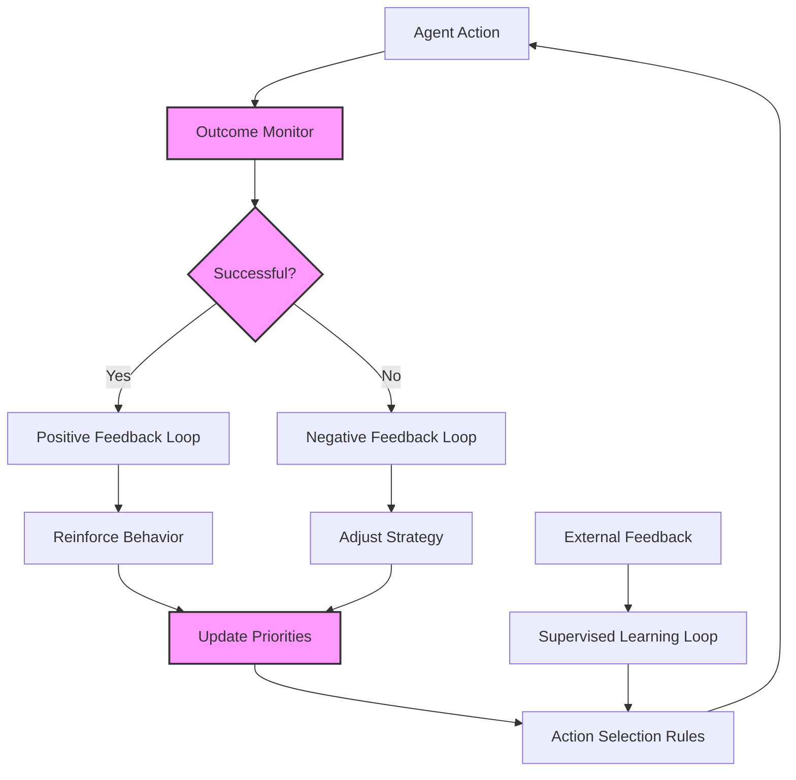

Implementing adaptive feedback requires:

1. **Outcome monitoring**: Tracking the results of agent actions
2. **Success criteria**: Clear definitions of what constitutes successful execution
3. **Adjustment mechanisms**: Ways to modify behavior based on observed outcomes
4. **External feedback integration**: Incorporating human feedback into the learning loop

## Scalable Frameworks for Real-World Applications

Deploying agents in production environments requires scalable, robust architectures.

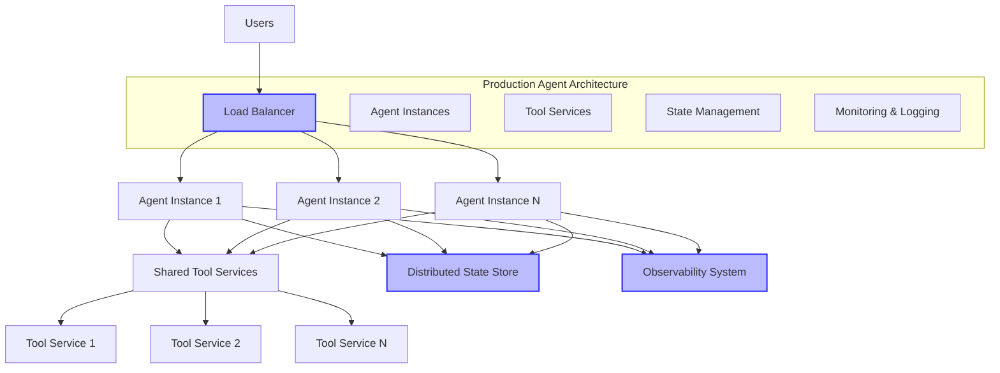

### Horizontal Scaling Strategies

Production agent systems must scale to handle varying loads:

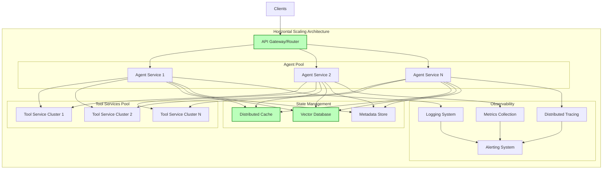

Key considerations for scalable frameworks include:

1. **Stateless design**: Enabling horizontal scaling through distributable components
2. **Distributed state management**: Shared, reliable state storage across instances
3. **Microservice architecture**: Breaking functionality into independently scalable services
4. **Resource isolation**: Preventing resource contention between agent instances

### Robust Error Handling and Recovery

Production-grade agents require sophisticated error handling:

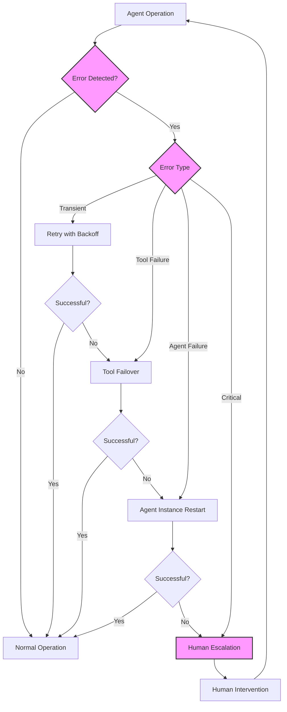

Implementing robust error handling includes:

1. **Error classification**: Categorizing errors by type and severity
2. **Retry strategies**: Intelligent retry mechanisms with exponential backoff
3. **Failover mechanisms**: Switching to backup systems when primary systems fail
4. **Circuit breakers**: Preventing cascading failures by failing fast
5. **Human escalation paths**: Clear processes for involving humans when necessary

## Conclusion: Building Future-Proof Agent Architectures

The field of AI agents is evolving rapidly, with new capabilities emerging regularly. Building future-proof architectures requires focusing on:

1. **Modularity**: Creating systems that can incorporate new models and tools
2. **Observable operation**: Comprehensive monitoring and understanding of agent behavior
3. **Graceful degradation**: Maintaining core functionality even when parts of the system fail
4. **Continuous improvement**: Incorporating feedback to enhance performance over time

As models continue to improve and new techniques emerge, these architectural patterns will serve as the foundation for increasingly capable and reliable agent systems that can tackle ever more complex real-world tasks.

By focusing on solid fundamentals, embracing concurrency, integrating real-time data, and designing for scale, developers can create agent systems that not only meet today's requirements but can evolve to address tomorrow's challenges as well.
