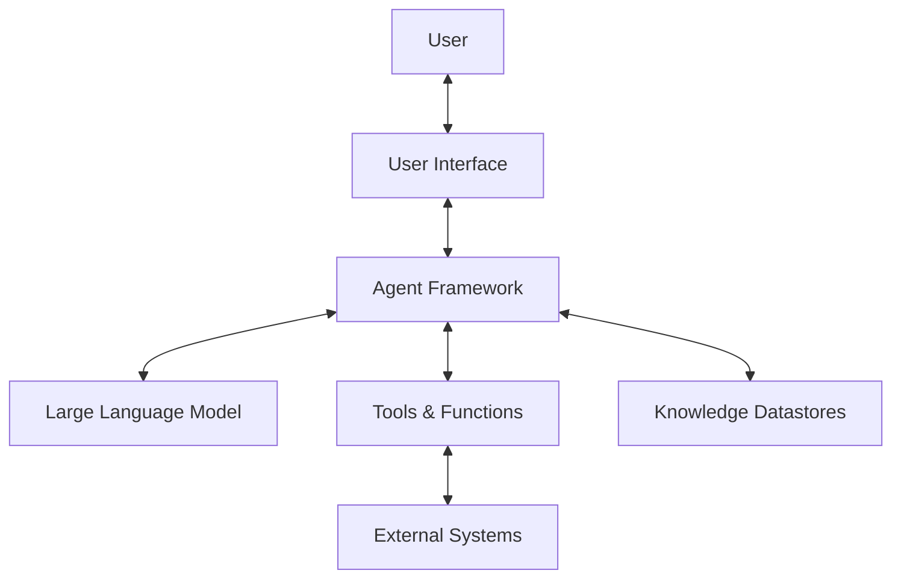
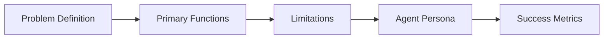
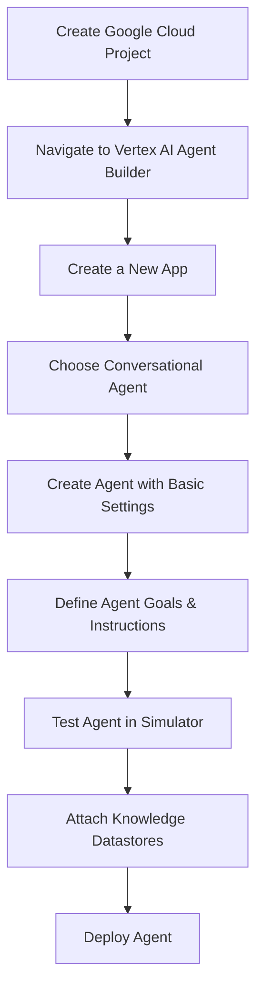
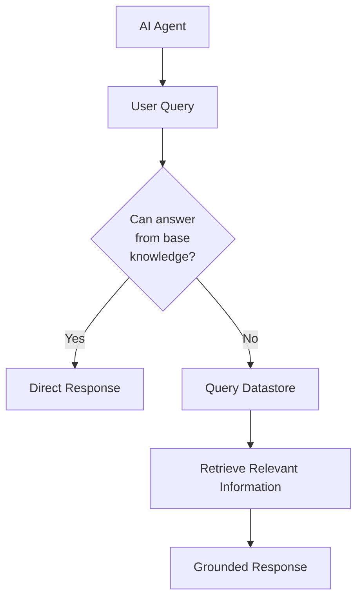
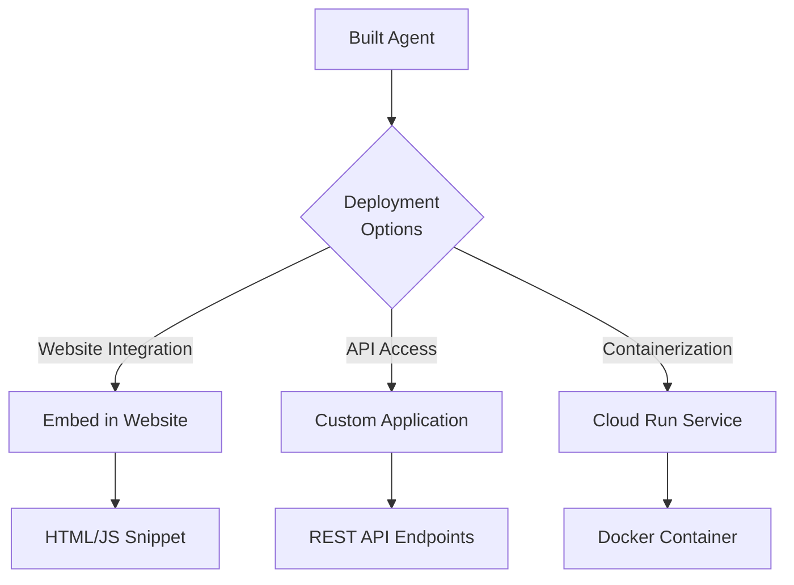
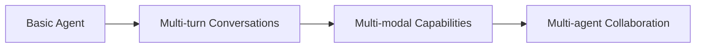

---
categories:
- AI
- Cloud
date: 2025-03-21
description: A comprehensive guide to designing, building, and deploying generative
  AI agents using Google Cloud's Vertex AI Agent Builder
header_image_path: /assets/img/blog/headers/2025-03-21-building-generative-ai-agents-vertex-ai.jpg
image_credit: Photo by Possessed Photography on Unsplash
layout: post
tags:
- generative-ai
- vertex-ai
- agent-builder
- google-cloud
thumbnail_path: /assets/img/blog/thumbnails/2025-03-21-building-generative-ai-agents-vertex-ai.jpg
title: Building Generative AI Agents with Vertex AI Agent Builder
---

# Building Generative AI Agents with Vertex AI Agent Builder

In today's rapidly evolving technological landscape, Generative AI agents are transforming how businesses interact with customers and manage internal operations. These intelligent virtual assistants can understand natural language, respond to complex queries, and execute tasks with remarkable efficiency. This blog post will guide you through the process of creating your own AI agent using Google Cloud's Vertex AI Agent Builder.

## What Are Generative AI Agents?

Generative AI agents are software entities powered by large language models (LLMs) that can understand, process, and respond to human language in contextually relevant ways. Unlike traditional chatbots with rigid, rule-based responses, generative AI agents can:

- Understand nuanced questions and provide comprehensive answers
- Maintain context throughout a conversation
- Access and utilize external data sources
- Execute complex workflows based on user inputs
- Adapt their responses based on user feedback

## Architecture of a Generative AI Agent

Before diving into the development process, let's understand the architectural components of a modern AI agent:



1. **User Interface**: Where users interact with the agent (website, mobile app, messaging platform)
2. **Agent Framework**: Orchestrates the conversation flow and connects various components
3. **Large Language Model**: The AI model that powers understanding and generation capabilities
4. **Tools & Functions**: Additional capabilities the agent can use to complete tasks
5. **Knowledge Datastores**: External information sources that ground the agent's responses
6. **External Systems**: Third-party services or APIs the agent can integrate with

## Designing Your AI Agent

Before writing a single line of code, it's crucial to establish a clear vision for your agent:



Ask yourself these key questions:

1. **What problem will it solve?** Define the main purpose of your agent.
2. **What are its primary functions?** List the core capabilities needed.
3. **What are its limitations?** Identify constraints and edge cases.
4. **What personality should it have?** Define the tone and communication style.
5. **How will you measure success?** Establish key performance indicators.

For example, if you're building a travel agent, your answers might look like:

- **Problem**: Simplify trip planning by helping users discover destinations, create itineraries, and book accommodations.
- **Functions**: Answer destination questions, plan customized itineraries, provide booking assistance.
- **Limitations**: Limited to text responses (no image generation), knowledge constrained by model training data.
- **Persona**: Knowledgeable, helpful, enthusiastic about travel, clear communicator.
- **Success Metrics**: User satisfaction with recommendations, successful bookings, reduced planning time.

## Building an AI Agent with Vertex AI Agent Builder

Google Cloud's Vertex AI Agent Builder provides a streamlined platform for creating, testing, and deploying AI agents. Here's how to build one:



### Step-by-Step Implementation

1. **Set up your Google Cloud project** with billing enabled
2. **Navigate to Vertex AI Agent Builder** and activate the API
3. **Create a conversational agent**:
   - Choose "Build your own" agent
   - Set a display name (e.g., "Travel Buddy")
   - Select appropriate region settings
4. **Configure your agent**:
   - Define a clear goal (e.g., "Help customers answer travel-related queries")
   - Provide detailed instructions (e.g., "Greet users, then ask how you can help them today")
5. **Test your agent** using the simulator with your chosen LLM (e.g., Gemini 1.5 Flash)

## Grounding Your Agent with Knowledge Datastores

One of the most powerful features of Vertex AI Agent Builder is the ability to enhance your agent's knowledge with external data sources:



Without proper grounding, AI agents can provide incorrect or fabricated information. Datastores solve this problem by providing:

1. **Factual information** specific to your business or use case
2. **Up-to-date knowledge** beyond the model's training cutoff
3. **Authoritative content** that reduces hallucinations

### Adding a Datastore

1. **Create a datastore tool**:
   - Name your tool (e.g., "Alternative Location")
   - Provide a clear description of when to use it
2. **Select or create a data source**:
   - Upload documents from Cloud Storage
   - Import web pages
   - Connect to existing databases
3. **Configure grounding settings**:
   - Adjust stringency levels to control how closely the agent adheres to the datastore content
4. **Update agent instructions** to include the datastore tool

### Datastores in Action

Let's see how datastores can improve agent responses. If a user asks about a fictional location like Wakanda, an agent without a datastore might simply say it doesn't exist. With a properly configured datastore, it could suggest:

- Similar real locations that inspired the fictional place
- Alternative travel experiences related to the theme
- Other ways to engage with the fictional universe

## Deploying Your AI Agent

Once your agent is built and tested, it's time to deploy it for users:



### Website Integration

The simplest deployment method is to integrate your agent directly into your website:

1. **Publish your agent** and enable unauthenticated API access (for demo purposes only)
2. **Copy the provided code snippet** containing your agent's configuration
3. **Embed the snippet** in your website's HTML

### Creating a Web Application

For a more customized experience, you can create a dedicated web application:

```python
from flask import Flask, render_template_string

app = Flask(__name__)

html_template = """
<!DOCTYPE html>
<html lang="en">
<head>
    <meta charset="UTF-8">
    <meta name="viewport" content="width=device-width, initial-scale=1.0">
    <title>AI Travel Agent</title>
    <link rel="stylesheet" href="https://www.gstatic.com/dialogflow-console/fast/df-messenger/prod/v1/themes/df-messenger-default.css">
    <script src="https://www.gstatic.com/dialogflow-console/fast/df-messenger/prod/v1/df-messenger.js"></script>
    <style>
        df-messenger {
            z-index: 999;
            position: fixed;
            bottom: 16px;
            right: 16px;
        }
    </style>
</head>
<body>
    <h1>Welcome to Your AI Travel Assistant!</h1>
    <p>Start planning your next adventure with our AI assistant.</p>
    
    <!-- Agent Integration Code -->
    <df-messenger
        project-id="YOUR_PROJECT_ID"
        agent-id="YOUR_AGENT_ID"
        language-code="en">
        <df-messenger-chat-bubble
            chat-title="Travel Buddy">
        </df-messenger-chat-bubble>
    </df-messenger>
</body>
</html>
"""

@app.route("/")
def index():
    return render_template_string(html_template)

if __name__ == "__main__":
    app.run(debug=True)
```

### Containerization and Cloud Run Deployment

For production-ready deployment, containerizing your application and hosting it on Cloud Run offers scalability and reliability:

1. **Create necessary files**:
   - `requirements.txt` for Python dependencies
   - `Dockerfile` for container configuration
2. **Build and deploy**:
   - Build your Docker image with Cloud Build
   - Deploy to Cloud Run with the appropriate configuration

## Future Enhancements and Best Practices

As you continue developing your AI agent, consider these advanced capabilities:



### Best Practices

1. **Start simple**: Focus on core functionality before adding complex features
2. **Test thoroughly**: Validate your agent with diverse queries and edge cases
3. **Iterate based on feedback**: Continuously improve based on user interactions
4. **Monitor performance**: Track key metrics and adjust as needed
5. **Stay updated**: Keep up with the latest Vertex AI capabilities and best practices

## Conclusion

Building generative AI agents with Vertex AI Agent Builder offers a powerful way to create intelligent, conversational experiences without deep expertise in machine learning. By carefully designing your agent, grounding it with relevant knowledge, and deploying it strategically, you can create solutions that genuinely help users and add value to your business.

The future of AI agents is incredibly promising, with advancements in multi-modal interactions, reasoning capabilities, and integration possibilities. Start building your agent today, and you'll be well-positioned to leverage these exciting developments as they emerge.

Ready to build your own AI agent? Share your experiences or questions in the comments below!