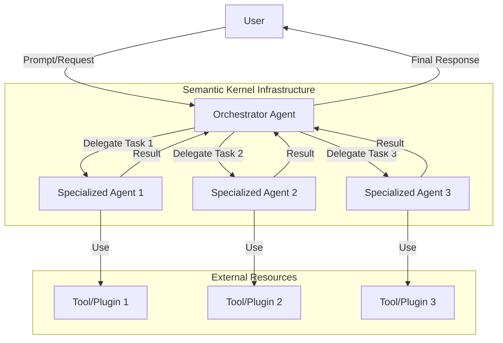
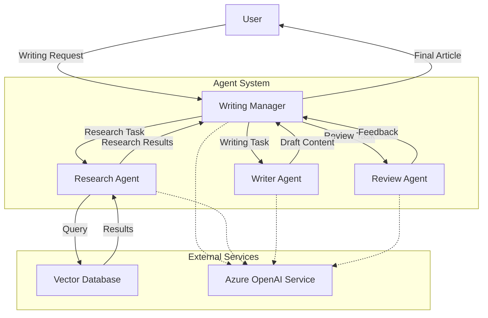
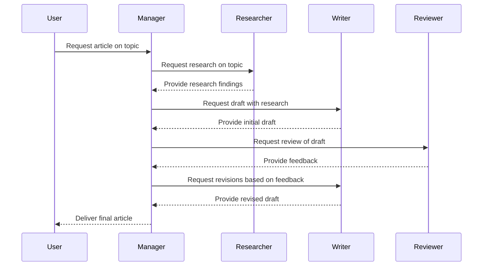
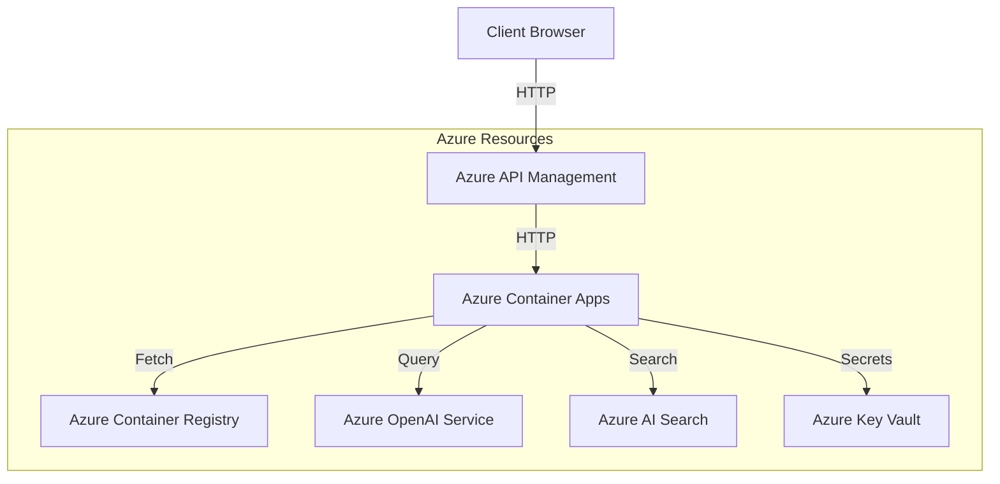

---
categories:
- AI
- Development
date: 2025-03-22
description: Learn how to build intelligent multi-agent systems using Microsoft's
  Semantic Kernel framework and Azure services to create powerful, collaborative AI
  applications.
header_image_path: /assets/img/blog/headers/2025-03-22-building-intelligent-agents-with-semantic-kernel.jpg
image: /assets/images/semantic-kernel-agents-header.jpg
image_credit: Photo by Solen Feyissa on Unsplash
image_credit_url: https://unsplash.com/photos/a-close-up-of-a-person-touching-a-cell-phone-GZyELVkOmi0
layout: post
tags:
- semantic-kernel
- agents
- dotnet
- azure
- openai
thumbnail_path: /assets/img/blog/thumbnails/2025-03-22-building-intelligent-agents-with-semantic-kernel.jpg
title: 'Intelligent Agents with Semantic Kernel: A Comprehensive Guide'
---

# Intelligent Agents with Semantic Kernel: A Comprehensive Guide

Developers are constantly seeking efficient ways to integrate large language models (LLMs) into their applications. Microsoft's Semantic Kernel provides a powerful framework for building AI agents that can collaborate to solve complex problems. In this comprehensive guide, we'll explore how to build intelligent multi-agent systems using Semantic Kernel, with a focus on the Creative Writing Assistant example.

## What is Semantic Kernel?

Semantic Kernel is a lightweight, open-source development kit that lets you easily build AI agents and integrate the latest AI models into your codebase. It serves as efficient middleware that enables rapid delivery of enterprise-grade solutions. 

One of the key advantages of using Semantic Kernel is that it allows you to:

1. Easily integrate with different LLM providers (Azure OpenAI, OpenAI, etc.)
2. Develop modular AI capabilities through plugins
3. Create autonomous and collaborative agents
4. Orchestrate complex workflows between multiple agents

## Understanding AI Agents

Before diving into the implementation details, let's clarify what we mean by "AI agents" in this context:

An AI agent is a software entity designed to perform tasks autonomously or semi-autonomously by receiving input, processing information, and taking actions to achieve specific goals. Unlike simple LLM-powered chatbots, agents can:

- Make decisions based on context and goals
- Use tools and functions to interact with external systems
- Work collaboratively with other agents
- Adapt to changing conditions and requirements

## Agent Architecture in Semantic Kernel

Semantic Kernel's agent framework is built on several key principles:

The Agent Framework was developed with key priorities in mind: The Semantic Kernel framework serves as the core foundation for implementing agent functionalities. Multiple agents can collaborate within a single conversation, while integrating human input.

Let's visualize the high-level architecture of a multi-agent system built with Semantic Kernel:



## Case Study: Creative Writing Assistant

To illustrate how multi-agent systems work in practice, let's examine the Creative Writing Assistant example from the [aspire-semantic-kernel-creative-writer](https://github.com/Azure-Samples/aspire-semantic-kernel-creative-writer) repository. This project demonstrates a collaborative writing system where multiple agents work together to create polished content.

### System Overview

The Creative Writing Assistant is built using:

1. .NET Aspire - For cloud-native application development
2. Semantic Kernel - For agent orchestration and LLM integration
3. Microsoft AI Chat Protocol - For handling chat interactions

The application consists of a WebAPI backend and a React frontend, with the backend handling the complex agent interactions.

### Multi-Agent Architecture

Let's visualize the specific architecture of the Creative Writing Assistant:



### Agent Roles and Responsibilities

In the Creative Writing Assistant, each agent has a specific role:

1. **Writing Manager**: Coordinates the overall process, delegates tasks, and ensures the final output meets requirements
2. **Research Agent**: Gathers relevant information about the topic from various sources, including vector databases
3. **Writer Agent**: Creates the initial draft based on research and requirements
4. **Review Agent**: Provides feedback and suggests improvements to the draft

## Building Your Own Multi-Agent System

Now, let's walk through the process of building your own multi-agent system using Semantic Kernel:

### Step 1: Setting Up the Environment

First, ensure you have the necessary prerequisites:

- .NET SDK (version 8.0 or newer)
- Azure subscription (for Azure OpenAI Service)
- Azure OpenAI Service instance

### Step 2: Creating the Project Structure

Set up a new .NET project with the required packages:

```bash
dotnet new webapi -n YourAgentApp
cd YourAgentApp
dotnet add package Microsoft.SemanticKernel
dotnet add package Microsoft.SemanticKernel.Agents
```

### Step 3: Defining Agent Roles

Each agent needs clear instructions about its role and responsibilities. These instructions shape the agent's behavior and decision-making process.

```csharp
// Define agent instructions
var managerInstructions = @"
You are the Writing Manager, responsible for coordinating the writing process.
Your job is to understand the user's requirements, delegate tasks to specialized agents,
and ensure the final output meets the user's expectations.
";

var researcherInstructions = @"
You are the Research Agent, responsible for gathering relevant information.
Your job is to search for information about the topic and provide factual, accurate data
that will be used to create the content.
";

var writerInstructions = @"
You are the Writer Agent, responsible for creating engaging content.
Your job is to take the research results and requirements to craft a well-structured,
engaging piece of content that meets the user's needs.
";

var reviewerInstructions = @"
You are the Review Agent, responsible for quality control.
Your job is to review the content, provide feedback, and suggest improvements
to ensure the final output is polished and meets all requirements.
";
```

### Step 4: Creating the Agents

Use Semantic Kernel to create each agent based on their instructions:

```csharp
using Microsoft.SemanticKernel;
using Microsoft.SemanticKernel.Agents;

// Create kernel and configure AI service
var builder = Kernel.CreateBuilder()
    .AddAzureOpenAIChatCompletion(
        deploymentName: "gpt-4o", 
        endpoint: "https://your-endpoint.openai.azure.com/", 
        apiKey: "your-api-key");
var kernel = builder.Build();

// Create the agents
var manager = new ChatCompletionAgent(
    kernel,
    "WritingManager",
    managerInstructions
);

var researcher = new ChatCompletionAgent(
    kernel,
    "ResearchAgent",
    researcherInstructions
);

var writer = new ChatCompletionAgent(
    kernel,
    "WriterAgent",
    writerInstructions
);

var reviewer = new ChatCompletionAgent(
    kernel,
    "ReviewerAgent",
    reviewerInstructions
);
```

### Step 5: Setting Up Plugins

Plugins extend agent capabilities by providing tools they can use:

```csharp
// Create a vector search plugin
var vectorSearchPlugin = kernel.CreatePluginFromFunctions(
    "VectorSearch",
    new List<KernelFunction>
    {
        kernel.CreateFunctionFromMethod(
            (string query) => 
            {
                // Implement vector search logic here
                return "Search results for: " + query;
            },
            "SearchVector",
            "Search for information in the vector database")
    }
);

// Add the plugin to the researcher agent
researcher.AddPlugin(vectorSearchPlugin);
```

### Step 6: Implementing Agent Communication

The next step is to implement the communication flow between agents:



### Step 7: Orchestrating the Multi-Agent Workflow

The final piece is orchestrating the workflow between agents:

```csharp
public async Task<string> CreateContentAsync(string userRequest)
{
    // Start with the manager
    var managerChat = manager.NewChat();
    await managerChat.AddUserMessageAsync(userRequest);
    var managerResponse = await managerChat.GetChatCompletionsAsync();
    
    // Manager delegates to researcher
    var researchChat = researcher.NewChat();
    await researchChat.AddUserMessageAsync($"Research this topic: {userRequest}");
    var researchResults = await researchChat.GetChatCompletionsAsync();
    
    // Manager sends research to writer
    await managerChat.AddUserMessageAsync($"Research results: {researchResults}");
    await managerChat.GetChatCompletionsAsync();
    
    // Manager delegates to writer
    var writerChat = writer.NewChat();
    await writerChat.AddUserMessageAsync($"Write content about {userRequest} based on this research: {researchResults}");
    var initialDraft = await writerChat.GetChatCompletionsAsync();
    
    // Manager sends draft to reviewer
    var reviewerChat = reviewer.NewChat();
    await reviewerChat.AddUserMessageAsync($"Review this draft: {initialDraft}");
    var reviewFeedback = await reviewerChat.GetChatCompletionsAsync();
    
    // Manager sends feedback to writer for revision
    await writerChat.AddUserMessageAsync($"Revise the draft based on this feedback: {reviewFeedback}");
    var finalDraft = await writerChat.GetChatCompletionsAsync();
    
    // Manager delivers final result
    await managerChat.AddUserMessageAsync($"Final draft completed: {finalDraft}");
    var finalResponse = await managerChat.GetChatCompletionsAsync();
    
    return finalDraft;
}
```

## Advanced Multi-Agent Patterns

When building a multi-agent scenario, you need to define a termination logic. This logic determines when the conversation is completed and the chat between the agents must end. Semantic Kernel provides several termination strategies, including:

1. **Fixed rounds termination**: Ends after a specific number of interactions
2. **Function-based termination**: Uses a function to determine when to stop
3. **KeyWord termination**: Ends when a specific keyword appears

Here's how you can implement a function-based termination strategy:

```csharp
// Create termination logic using a kernel function
var terminationFunction = kernel.CreateFunctionFromPrompt(@"
    Analyze the conversation history: {{$history}}
    
    Determine if the final content meets all requirements and is ready for delivery.
    If the content is ready, respond with 'DONE'.
    Otherwise, respond with 'CONTINUE'.
");

// Create the termination strategy
var terminationStrategy = new KernelFunctionTerminationStrategy(
    terminationFunction,
    "DONE"
);

// Configure group chat with termination strategy
var groupChat = new GroupChat(
    new List<IChatAgent> { manager, researcher, writer, reviewer },
    manager, // Coordinator agent
    terminationStrategy
);
```

## Evaluating Agent Performance

To ensure your multi-agent system delivers high-quality results, it's essential to implement evaluation metrics. The Creative Writing Assistant example uses four key metrics:

1. **Coherence**: How well the content flows and maintains consistency
2. **Fluency**: The quality of language and readability
3. **Relevance**: How well the content addresses the requested topic
4. **Groundedness**: Whether the content is factually accurate and well-supported

These evaluations can be automated using Semantic Kernel's evaluation framework:

```csharp
// Create an evaluator agent
var evaluatorInstructions = @"
You are an Evaluation Agent responsible for assessing content quality.
Rate the content on a scale of 1-10 for each of these criteria:
- Coherence: How well the content flows and maintains consistency
- Fluency: The quality of language and readability
- Relevance: How well the content addresses the requested topic
- Groundedness: Whether the content is factually accurate and well-supported
";

var evaluator = new ChatCompletionAgent(
    kernel,
    "EvaluatorAgent",
    evaluatorInstructions
);

// Evaluate content
public async Task<string> EvaluateContentAsync(string content, string originalRequest)
{
    var evaluatorChat = evaluator.NewChat();
    await evaluatorChat.AddUserMessageAsync($@"
        Original request: {originalRequest}
        
        Content to evaluate: {content}
        
        Provide ratings and justification for each criterion.
    ");
    
    return await evaluatorChat.GetChatCompletionsAsync();
}
```

## Deploying Multi-Agent Systems

When you're ready to deploy your multi-agent system, there are several options available:

### 1. Azure Deployment

The Creative Writing Assistant example uses Azure for deployment:



### 2. Local Development with Aspire

For local development, the project uses .NET Aspire to simplify the experience:

```bash
# Navigate to AppHost directory
cd ChatApp.AppHost

# Run the application
dotnet run
```

## Best Practices for Building Multi-Agent Systems

Based on the Creative Writing Assistant example and other best practices, here are some recommendations for building effective multi-agent systems:

1. **Clear Agent Instructions**: Each agent should have clear, specific instructions about its role and responsibilities.

2. **Modular Design**: Design your agents with specific focuses rather than creating "do everything" agents.

3. **Effective Communication Flow**: Design a clear communication pattern between agents to avoid confusion.

4. **Termination Logic**: Implement robust termination strategies to avoid infinite loops.

5. **Error Handling**: Implement fallback mechanisms for when agents fail to complete their tasks.

6. **Evaluation Metrics**: Establish clear metrics to evaluate agent performance.

7. **Resource Management**: Monitor and optimize resource usage, especially token consumption.

## Conclusion

Building intelligent multi-agent systems with Semantic Kernel opens up new possibilities for creating sophisticated AI applications. By leveraging the framework's capabilities, developers can create collaborative agent systems that tackle complex tasks through division of labor and specialization.

The Creative Writing Assistant is just one example of what's possible. The same patterns can be applied to various domains such as customer service, data analysis, decision support systems, and more.

As you embark on your journey with Semantic Kernel and multi-agent systems, remember that effective agent design is as much about communication patterns and clear role definition as it is about technical implementation.

## Resources

For more information about Semantic Kernel and agent development, check out these resources:

- [Semantic Kernel Documentation](https://learn.microsoft.com/semantic-kernel/overview/)
- [Semantic Kernel Agent Framework Documentation](https://learn.microsoft.com/semantic-kernel/frameworks/agent/)
- [Semantic Kernel GitHub Repository](https://github.com/microsoft/semantic-kernel)
- [Creative Writing Assistant Example](https://github.com/Azure-Samples/aspire-semantic-kernel-creative-writer)
