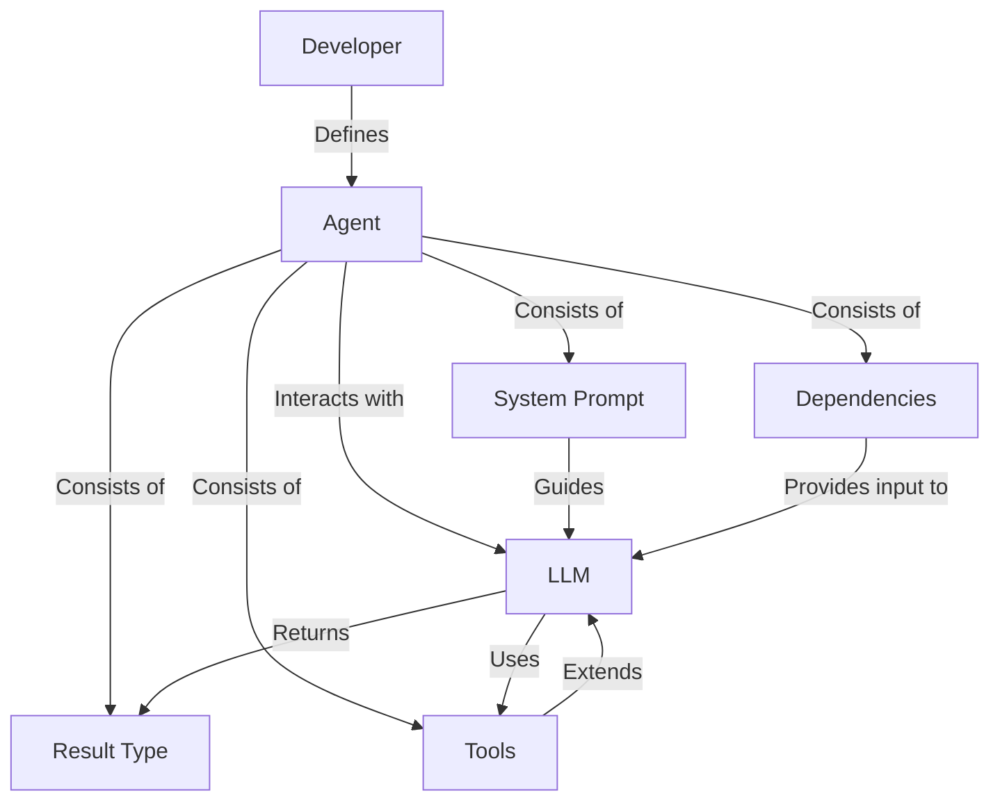
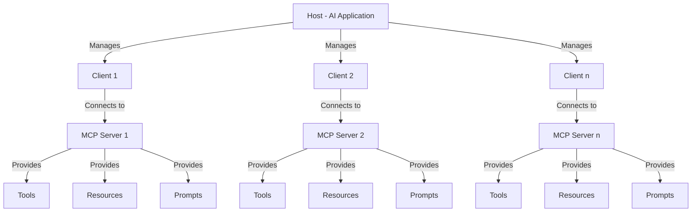
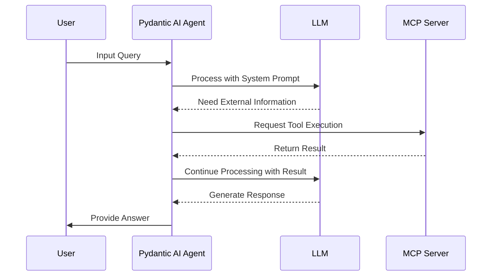

---
categories:
- ai
- development
date: 2025-04-01 14:00:00 -0400
header_image_path: /assets/img/blog/headers/2025-04-01-building-powerful-ai-agents-with-pydantic-ai-and-mcp-servers.jpg
image_credit: Photo by Nik on Unsplash
layout: post
tags: pydantic-ai mcp llm agents ai-development
thumbnail_path: /assets/img/blog/thumbnails/2025-04-01-building-powerful-ai-agents-with-pydantic-ai-and-mcp-servers.jpg
title: Building Powerful AI Agents with Pydantic AI and MCP Servers
---

# Building Powerful AI Agents with Pydantic AI and MCP Servers

## Introduction

With the emergence of sophisticated AI agents capable of performing complex tasks and interacting with the world around them. Two powerful technologies, Pydantic AI and the Model Context Protocol (MCP), are at the forefront of this development, offering developers the tools to create robust and versatile AI agents.

In this comprehensive guide, we'll explore the intricacies of Pydantic AI and MCP, examining their individual capabilities and how their integration can lead to the creation of truly powerful AI agents. Whether you're new to AI agent development or looking to enhance your existing applications, this blog will provide you with the knowledge and best practices to leverage these cutting-edge technologies effectively.

## Understanding Pydantic AI

### Overview and Architecture

Pydantic AI is a Python framework designed to streamline the development of production-grade applications leveraging generative AI. Inspired by the user-friendly design of FastAPI, Pydantic AI aims to bring a similar level of intuitiveness and efficiency to the realm of AI agent development. It acts as a bridge between developers and Large Language Models (LLMs), providing a structured approach to building agents that can execute specific tasks based on system prompts, functions, and structured outputs.

At its core, Pydantic AI's architecture revolves around the `Agent` class, which orchestrates interactions with LLMs. This framework is built upon the foundation of Pydantic, a widely adopted Python library for data validation and settings management using type annotations.



### Key Design Principles

Pydantic AI operates based on a set of key design principles that prioritize ease of development, reliability, and production readiness:

1. **Strong Foundation**: Built by the same team behind Pydantic, ensuring a strong foundation in data validation and structuring.
2. **Model Agnostic**: Provides flexibility by allowing developers to switch between different LLMs without significant code changes.
3. **Real-time Monitoring**: Seamless integration with Pydantic Logfire offers real-time debugging, performance monitoring, and behavior tracking, crucial for production applications.
4. **Python-centric Design**: Leverages familiar control flow and agent composition, making it easier for Python developers to adopt and apply standard best practices.
5. **Structured Responses**: By harnessing Pydantic's power, Pydantic AI ensures structured and validated responses from LLMs, leading to more consistent and predictable outputs.
6. **Dependency Injection**: Optional dependency injection system facilitates the provision of data and services to various components of the agent, enhancing testability and enabling iterative development.
7. **Streamed Responses**: Supports streamed responses with immediate validation, improving user experience by providing rapid feedback.
8. **Complex Workflows**: For complex applications, integration with Pydantic Graph allows defining application logic as graphs using typing hints.

### Features and Capabilities

Pydantic AI boasts a rich set of features designed to simplify the development lifecycle of AI-powered applications:

- **Type Safety**: Foundation in Pydantic ensures structured, validated, and type-safe outputs from LLMs, which is particularly useful for applications requiring strict adherence to schemas.
- **Model Flexibility**: Model-agnostic nature allows for flexibility in choosing the most appropriate LLM for a given task.
- **External Integration**: Dependency injection system simplifies the integration of external data sources and services, promoting modular and testable code.
- **Monitoring**: Integration with Pydantic Logfire provides robust debugging and monitoring capabilities, essential for tracking performance and identifying issues in real-time.
- **Execution Modes**: Supports various methods for running agents, including asynchronous, synchronous, and streaming modes, offering flexibility in handling different types of interactions.
- **Conversation Management**: Facilitates the management of conversations, allowing for both single-run and multi-run interactions where state can be maintained across multiple turns.
- **Prompt Adaptability**: Enables the use of both static and dynamic system prompts, providing adaptability to different contexts and user roles.
- **Extensibility**: Function tools can be easily registered to extend the agent's capabilities by accessing external information or performing specific logic.
- **Self-correction**: Incorporates mechanisms for reflection and self-correction, such as automatic retries upon validation errors, enhancing the robustness of the agents.

### Integration with Pydantic Models

The integration of Pydantic models is central to Pydantic AI's functionality. Pydantic models are used to define the structure of both the input dependencies required by the agent and the expected format of the results returned by the LLM. This ensures that all data processed by the agent adheres to predefined schemas, leading to more reliable and predictable behavior.

```python
from pydantic_ai.agent import Agent
from pydantic import BaseModel, Field

# Define input dependencies
class UserInput(BaseModel):
    query: str = Field(..., description="User's question or request")
    language: str = Field("english", description="Preferred language for response")

# Define expected result structure
class AgentResponse(BaseModel):
    answer: str = Field(..., description="Response to the user's query")
    confidence: float = Field(..., ge=0, le=1, description="Confidence level of the response")
    sources: list[str] = Field(default_factory=list, description="Sources of information used")

# Create an agent with defined types
agent = Agent(
    system_prompt="You are a helpful assistant...",
    dependencies=UserInput,
    result_type=AgentResponse
)
```

By defining result types using Pydantic models, developers can guarantee that the output from the LLM conforms to a specific structure, making it easier to integrate AI-generated data into other systems or applications. This type-safe approach catches errors early in the development process and improves the overall maintainability of the code.

### Tool Support and LLM Compatibility

Pydantic AI provides robust tool support, allowing developers to extend the capabilities of their AI agents by integrating external functions. These tools, registered using the `@agent.tool` decorator, can perform a wide range of tasks, such as fetching real-time data, querying databases, or interacting with other APIs.

```python
@agent.tool
def search_database(query: str) -> list[dict]:
    """
    Searches the database for information related to the query.
    
    Args:
        query: The search query
        
    Returns:
        A list of matching records
    """
    # Implementation details
    return database_client.search(query)
```

The framework automatically handles the conversion of tool arguments into a schema that is passed to the LLM, simplifying the process of making external functionalities accessible to the agent. Pydantic is used to validate the arguments passed to the tool functions, and any validation errors are relayed back to the LLM, enabling self-correction and retries.

Pydantic AI is designed with broad LLM compatibility in mind, supporting a wide array of models from different providers. This model-agnostic approach allows developers to choose the best LLM based on factors like cost, performance, and specific capabilities. The framework provides a consistent interface for interacting with these different models, abstracting away the underlying API differences and simplifying the process of switching between providers if needed.

## Understanding the Model Context Protocol (MCP)

### Overview and Purpose

The Model Context Protocol (MCP) is an open protocol designed to standardize how applications provide context and tools to LLMs. It aims to address the challenge of integrating LLMs with external data sources and functionalities by providing a universal interface, much like a USB-C port for AI applications. Instead of requiring custom integrations for each data source, MCP offers a standardized way for AI systems to access the information and tools they need to perform tasks more effectively.

### Architecture and Components

The MCP specification outlines a client-server architecture where an MCP host (the AI application) connects to one or more MCP servers that provide access to specific capabilities. The host manages multiple client instances, each maintaining a connection to a server, ensuring security and isolation. Communication between clients and servers follows the JSON-RPC 2.0 standard, enabling stateful sessions focused on context exchange and coordination.



MCP servers expose their functionalities through primitives such as:
- **Prompts**: Pre-defined instructions
- **Resources**: Structured data
- **Tools**: Executable functions that the LLM can invoke

On the client side, primitives include:
- **Roots**: Access points to the host's environment
- **Sampling**: Allowing servers to request the host LLM to generate completions

The protocol defines a clear lifecycle for client-server connections, including initialization, operation, and shutdown phases, ensuring proper capability negotiation and state management.


| Component     | Description                                      | Responsibility                                                                                   |
|---------------|--------------------------------------------------|--------------------------------------------------------------------------------------------------|
| Host          | The AI application or agent environment.         | Coordinates the overall system, manages client connections, enforces security policies.           |
| Client        | Intermediary within the host that manages a 1:1 connection with an MCP server. | Sends requests to servers, handles responses, manages communication lifecycle, maintains security boundaries. |
| Server        | Provides specialized context and capabilities (tools, resources, prompts). | Exposes resources, tools, and prompts via MCP primitives, operates independently, respects security constraints. |
| Protocol      | Defines the communication standards between hosts, clients, and servers. | Specifies message formats (JSON-RPC), transport mechanisms, and connection lifecycle. |


### Design Rationale

The design rationale behind MCP stems from the need to simplify the integration of AI models with the vast ecosystem of external data and tools. By establishing a standardized protocol, MCP aims to replace ad-hoc integrations with a more unified and scalable approach. This standardization reduces development time and complexity, allowing developers to connect AI assistants to various data sources and services more efficiently.

The open-source nature of MCP fosters collaboration and community contributions, encouraging the development of a rich ecosystem of shared connectors. Security and control are also key considerations in MCP's design, with an emphasis on user consent and the ability to manage the AI's access to external resources.

### Flexible Implementations

Beyond the standard client-server model, MCP's architecture allows for flexible implementations. While the client-server interaction is fundamental, MCP supports different transport mechanisms, including standard input/output (stdio) for local communication and HTTP over Server-Sent Events (SSE) for both local and remote connections.

This flexibility enables MCP servers to run on the same machine as the host or on remote servers, catering to various deployment scenarios. The protocol's design also facilitates the creation of specialized AI "servers" that can be used by any MCP-compatible "client," promoting modularity and reusability.

## Developing Agents with Pydantic AI and MCP

### Pydantic AI as an MCP Client

Pydantic AI can act as an MCP client, enabling it to connect and interact with MCP servers to enhance its capabilities. The Pydantic AI documentation explicitly mentions "MCP. Client. Server. MCP Run Python," indicating built-in support for the protocol.

Developers can add MCP servers to a Pydantic AI agent using the `mcp_servers` parameter in the `Agent` class. Pydantic AI utilizes the MCP client protocol to communicate with these servers, sending requests and receiving responses in the standardized JSON-RPC format. This integration abstracts away the underlying communication details, allowing developers to focus on defining how the agent leverages the tools and resources provided by the MCP servers.

### Types of MCP Servers and Their Capabilities

MCP servers offer access to a wide range of external systems and functionalities, significantly expanding the potential of Pydantic AI agents:

1. **Web Information Retrieval**: MCP servers can be developed for web information retrieval, allowing agents to perform web searches and incorporate the findings into their responses.
2. **Database Querying**: Database querying is another common use case, where MCP servers can execute SQL queries and return the results, enabling agents to access and utilize structured data.
3. **Code Execution**: Code execution servers can provide agents with the ability to run code in a sandboxed environment, facilitating tasks that require computation or interaction with code.
4. **File System Access**: MCP servers can grant agents access to the local file system, enabling them to read and write files under controlled permissions.
5. **Business Tool Integration**: Integration with various business tools, such as CRMs like Salesforce, collaboration platforms like Slack, and project management tools like GitHub, is also possible through MCP servers, allowing agents to interact seamlessly with these systems.

Setting up and configuring these servers typically involves following their specific documentation and requirements, which may include defining connection parameters and authentication credentials. Notably, pre-built MCP servers are available for many popular enterprise systems, simplifying the integration process.

### Integration Workflow



To integrate a Pydantic AI agent with MCP servers, developers configure the agent by specifying the desired servers using the `mcp_servers` parameter. The communication flow begins with the Pydantic AI agent (acting as the MCP client) initializing and establishing a connection with the designated MCP server.

Once connected, the agent can query the server for its available tools and resources, often using methods like `list_tools()`. When the agent encounters a task that necessitates external information or action, it can instruct the LLM to utilize a specific tool provided by the MCP server.

Pydantic AI then sends a request to the MCP server to call the tool, including any necessary parameters, typically using a method like `call_tool()`. The MCP server executes the requested tool and returns the result to the Pydantic AI agent in a structured format, usually JSON. The agent can then process this result to formulate a response to the user or continue with further internal operations.

### Using Pydantic Models for Data Exchange

Pydantic models play a crucial role in defining the structure of data exchanged between Pydantic AI agents and MCP servers. Developers can create Pydantic models that correspond to the expected input parameters for the tools exposed by MCP servers, ensuring that the agent sends correctly formatted requests.

```python
from pydantic import BaseModel, Field
from pydantic_ai.agent import Agent
from typing import List, Optional

# Define model for MCP tool input
class WebSearchParams(BaseModel):
    query: str = Field(..., description="Search query")
    max_results: int = Field(5, description="Maximum number of results to return")
    site_filter: Optional[str] = Field(None, description="Limit search to specific domain")

# Define model for MCP tool output
class SearchResult(BaseModel):
    title: str
    url: str
    snippet: str
    relevance_score: float

class WebSearchResults(BaseModel):
    results: List[SearchResult]
    total_found: int
    query_time_ms: int

# Configure agent with MCP server
agent = Agent(
    system_prompt="You are a research assistant...",
    mcp_servers=["web_search_server"],
    # Other configuration...
)
```

Similarly, Pydantic models can be used to define the structure of the data returned by the MCP server tools, providing type safety and facilitating data validation within the Pydantic AI agent. The `result_type` parameter in the Pydantic AI Agent class can be used to specify the expected structure of the overall agent response, which may incorporate data retrieved from MCP servers. This ensures that the entire workflow, from the agent's initial request to the final output, adheres to well-defined data structures.

### System Prompt Engineering

Crafting effective system prompts is essential for guiding Pydantic AI agents on how and when to utilize the tools provided by MCP servers. Clear and concise instructions within the system prompt should describe the available tools and their functionalities, enabling the LLM to understand when it is appropriate to invoke them.

Example of a system prompt for an agent with MCP tools:

```
You are a research assistant with access to the following tools:

1. Web Search: Use this to find current information from the internet.
   - Input: Search query
   - Output: List of relevant search results with titles and snippets

2. Database Query: Use this to retrieve information from our product database.
   - Input: SQL-like query
   - Output: Structured data results

When answering questions:
- If the user asks about current events or recent information, use the Web Search tool
- If the user asks about our products or inventory, use the Database Query tool
- Always cite sources when using Web Search results
- Format database results in a readable manner
- If you need information that isn't available through these tools, acknowledge the limitation
```

Providing context about the types of tasks for which specific MCP server tools are best suited helps the LLM make informed decisions about tool usage. Developers may also need to employ prompt engineering strategies to address scenarios where the LLM might misuse or not effectively utilize the available tools, ensuring that the agent leverages the external capabilities as intended.

## Best Practices and Advanced Topics

### Model Design for MCP Interactions

When defining dependencies and result structures using Pydantic models for agents interacting with MCP servers, it is crucial to be specific and precise in defining the data types and constraints. Using clear and descriptive field names and descriptions enhances documentation and understanding. Structuring models logically to reflect the organization of the data being exchanged, and considering nested models for complex data structures, contributes to better code maintainability. Leveraging Pydantic's validation features, such as ge, le, and constr, helps enforce data quality. Designing result models to be comprehensive yet easy to work with ensures that all relevant information is captured effectively.

### Effective System Prompts

Crafting effective system prompts for MCP-enabled agents involves clearly instructing the agent on its role and objectives. Providing specific guidance on when and how to use the available MCP tools, along with examples of queries or commands that necessitate their use, is essential. Employing few-shot learning techniques within the prompt can demonstrate proper tool usage. It is also important to iteratively refine prompts based on the agent's performance and monitor its tool usage to identify areas for improvement.

### Monitoring and Logging

Monitoring and logging are critical for understanding and debugging Pydantic AI agents integrated with MCP. Pydantic AI seamlessly integrates with Pydantic Logfire, providing real-time debugging, performance monitoring, and behavior tracking. Logfire enables detailed monitoring of an agent's flow, helping developers understand how models and tools interact during execution. It allows for tracking token usage, monitoring response times, and analyzing the entire conversation flow. Instrumenting Pydantic models with Logfire provides further insights into the data validation process.

Beyond Logfire, logging MCP server interactions, including requests and responses, is important. MCP supports structured logging capabilities. Utilizing standard Python logging libraries for general agent activity and exploring tracing tools to follow execution flow across Pydantic AI and MCP servers can also be beneficial.

### Security Considerations

Security must be a paramount concern when integrating AI agents with external systems via MCP. Ensuring user consent and control over data access and tool usage is fundamental. The MCP architecture provides security boundaries between the host, client, and servers. Implementing robust authorization and authentication mechanisms for MCP servers is crucial. Sanitizing inputs to prevent injection attacks is also a critical security measure.

Considerations for LLM sampling and the need for human approval to prevent unintended actions should be carefully addressed. Implementing TLS encryption protects data in transit, and rate limiting can help mitigate denial-of-service attacks. Monitoring for unusual patterns and implementing proper firewall rules are additional best practices for securing MCP integrations.

## Conclusion

### Benefits of Integration

The combination of Pydantic AI and MCP servers represents a significant step forward in the development of powerful and versatile AI agents. Pydantic AI provides a robust, type-safe framework for building agents, while MCP offers a standardized way to connect these agents with a wide range of external data sources and tools.

This integration enables the creation of AI applications that are not only intelligent but also deeply connected to the real world, capable of performing complex tasks that require accessing and processing information from various systems.

The benefits of this integration include:

1. **Enhanced Capabilities**: AI agents gain access to a wide range of external tools and data sources, significantly expanding their capabilities.
2. **Standardization**: MCP provides a standardized way to connect agents with external systems, reducing development time and complexity.
3. **Type Safety**: Pydantic ensures that data exchanged between agents and external systems adheres to well-defined structures, improving reliability.
4. **Modularity**: The modular architecture allows for easy addition and removal of capabilities without disrupting the entire system.
5. **Scalability**: As needs evolve, new MCP servers can be added to extend the agent's capabilities without major rewrites.

### Future Trends

As AI technology continues to advance, the trend towards more integrated and context-aware applications will only accelerate. Standards like MCP will play an increasingly important role in facilitating this integration, making it easier for developers to build sophisticated AI agents that can seamlessly interact with diverse digital environments.

We can expect to see:

1. **Growing Ecosystem**: An expanding ecosystem of pre-built MCP servers for various domains and applications.
2. **Enhanced Security**: More sophisticated security models for managing AI access to sensitive systems.
3. **Cross-agent Collaboration**: Frameworks for enabling multiple AI agents to collaborate using shared MCP servers.
4. **Domain-specific Extensions**: Extensions to the MCP protocol to better support specific domains like healthcare, finance, and legal.

### Call to Action

By leveraging the strengths of Pydantic AI and MCP, developers can unlock new possibilities in AI-powered automation, creating solutions that are more efficient, reliable, and ultimately more impactful.

Developers are encouraged to explore the documentation for both Pydantic AI and MCP and experiment with building their own integrated AI agents to fully appreciate the potential of these powerful technologies. The growing community around these tools provides ample resources and support for those looking to embark on this exciting journey.

To get started:

1. **Explore Documentation**: Dive into the documentation for both Pydantic AI and MCP.
2. **Start Small**: Begin with simple integrations before moving on to more complex scenarios.
3. **Join the Community**: Engage with the growing community around these tools for support and inspiration.
4. **Contribute**: Consider contributing to the open-source projects to help improve and extend these technologies.

## Resources

- [Pydantic AI Documentation](https://docs.pydantic-ai.dev/)
- [MCP Specification](https://mcp.ai/)
- [Pydantic Documentation](https://docs.pydantic.dev/)
- [Pydantic Logfire Documentation](https://docs.logfire.dev/)
