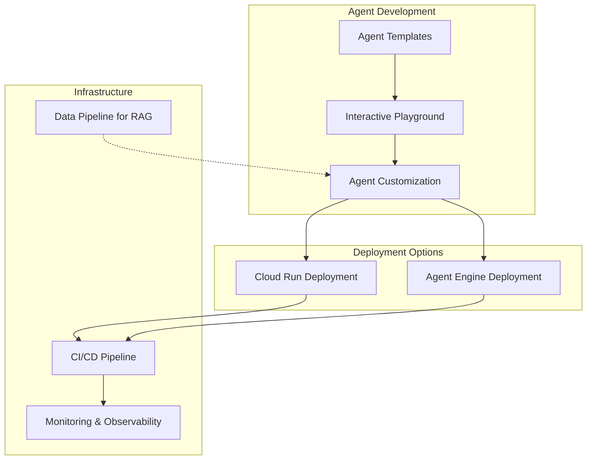
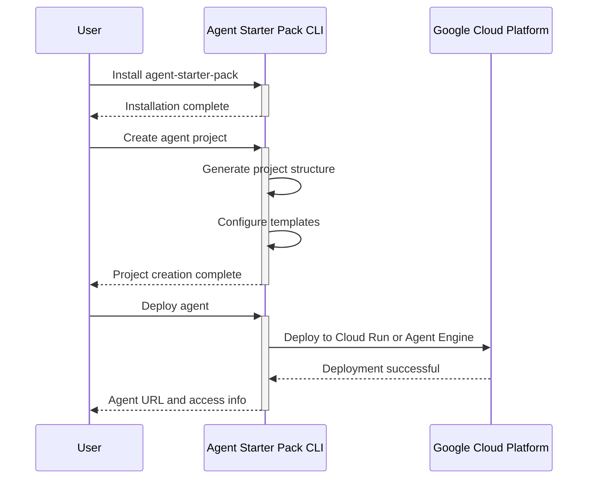
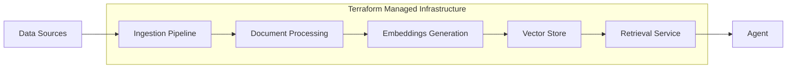

---
categories:
- cloud
- generative-ai
- development
date: 2025-04-04
description: A deep dive into Google Cloud's Agent Starter Pack - a collection of
  production-ready Generative AI Agent templates designed to accelerate development
  and deployment of AI agents.
header_image_path: /assets/img/blog/headers/2025-04-04-comprehensive-guide-to-google-cloud-agent-starter-pack.jpg
image: /assets/images/agent-starter-pack.png
image_credit: Photo by Rami Al-zayat on Unsplash
layout: post
tags:
- google-cloud
- generative-ai
- agent
- rag
- react
- langgraph
- crewai
- vertex-ai
thumbnail_path: /assets/img/blog/thumbnails/2025-04-04-comprehensive-guide-to-google-cloud-agent-starter-pack.jpg
title: 'Comprehensive Guide to Google Cloud Agent Starter Pack: Accelerating Generative
  AI Agent Development'
---

# Comprehensive Guide to Google Cloud Agent Starter Pack

## Introduction

Developing production-ready agents can be challenging and time-consuming. Moving from a prototype to a robust, scalable, and secure deployment often involves navigating complex infrastructure, testing, deployment pipelines, UI integration, and performance measurement challenges.

Google Cloud's Agent Starter Pack addresses these challenges by providing a comprehensive solution that significantly reduces the time-to-production for developers building Generative AI applications. It offers a collection of production-ready Generative AI Agent templates built specifically for Google Cloud, accelerating development by providing a holistic solution that addresses common challenges in deployment, operations, evaluation, customization, and observability.

In this comprehensive guide, we'll explore the Agent Starter Pack, its features, available agent templates, deployment options, and how to get started with building your own Generative AI agents on Google Cloud.

## What is the Agent Starter Pack?

The Agent Starter Pack is a collection of production-ready Generative AI Agent templates built for Google Cloud. It accelerates development by providing a holistic, production-ready solution that addresses common challenges in building and deploying GenAI agents. It emerged as an evolution of the previous e2e-gen-ai-app-starter-pack, adding significant improvements such as a streamlined CLI, expanded agent options, and simplified setup procedures.

The starter pack enables developers to quickly set up and deploy AI agents with minimal configuration, providing everything needed from the backend to the frontend and deployment infrastructure. This project represents the next evolution of the e2e-gen-ai-app-starter-pack, with improvements including a new command-line interface that simplifies project creation, template selection, and deployment.

## Key Features and Benefits

The Agent Starter Pack offers several key features designed to simplify and accelerate the development and deployment of Generative AI agents:

1. **Pre-built Agent Templates** - Including ReAct, RAG, multi-agent, and Live Multimodal API templates that serve as starting points for your applications
   
2. **Vertex AI Evaluation and Interactive Playground** - Tools for testing and refining your agent before deployment

3. **Production-Ready Infrastructure** - Complete with monitoring, observability, and CI/CD capabilities on Cloud Run or Agent Engine

4. **Extensibility and Customization** - Templates that can be extended and customized to meet specific requirements

5. **CI/CD Automation** - One command to set up a complete GitHub + Cloud Build pipeline for all environments

6. **Data Pipeline for RAG** - Seamless integration of a data pipeline to process embeddings for RAG into your agent system, supporting Vertex AI Search and Vector Search

## Architecture Overview

The Agent Starter Pack provides a comprehensive architecture that addresses all aspects of agent development, from prototyping to monitoring. Here's a high-level view of its architecture:



## Available Agent Templates

The Agent Starter Pack offers several ready-to-use agent templates, each designed for specific use cases:

### 1. LangGraph Base ReAct

A foundational ReAct agent built with LangGraph for general-purpose tasks. ReAct (Reasoning and Acting) is a paradigm that combines reasoning and acting in Large Language Models, allowing them to make decisions and take actions. 

The ReAct agent architecture is the most generic agent architecture available. This architecture uses tool calling to select the correct tools to call, and loops until done. LangGraph provides a powerful framework for building these agents by structuring them as graphs, with nodes representing states and edges representing transitions.

### 2. Agentic RAG

This agent enhances the Agent Starter Pack with a production-ready data ingestion pipeline, enriching Retrieval Augmented Generation (RAG) applications. It enables ingestion, processing, and embedding of custom data, improving the relevance and context of generated responses.

The agent provides infrastructure to create a Vertex AI Pipeline with your custom code, benefiting from features like scheduled runs, recurring executions, and on-demand triggers.

Key features include:
- Support for terabyte-scale data processing
- Flexible datastore options including Vertex AI Search or Vertex AI Vector Search
- Cloud Build integration for deployment of ingestion pipelines

### 3. CrewAI Coding Crew

This template uses CrewAI to create a multi-agent system focused on coding tasks. CrewAI is a Python framework that enables creation of AI agent teams that work together to tackle complex tasks. The Coding Crew template sets up multiple specialized agents that collaborate on coding projects.

CrewAI empowers developers with both high-level simplicity and precise low-level control, ideal for creating autonomous AI agents tailored to any scenario. In this template, agents can have designated roles like architect, developer, and tester, working collaboratively to develop code.

### 4. Live API

A real-time multimodal RAG agent powered by Gemini, supporting audio/video/text chat with vector DB-backed responses. This template enables building applications that can process and respond to different types of inputs, making it ideal for interactive and media-rich applications.

## Deployment Options

The Agent Starter Pack offers two primary deployment targets:

### 1. Cloud Run

This option deploys your agent as a containerized application on Google Cloud Run, giving you full control over the deployment and scaling. It includes:
- A pre-built FastAPI server
- Real-time chat interface
- Auto-generated documentation
- Scalable infrastructure

### 2. Vertex AI Agent Engine

Vertex AI Agent Engine (formerly known as LangChain on Vertex AI or Vertex AI Reasoning Engine) is a fully managed Google Cloud service enabling developers to deploy, manage, and scale AI agents in production.

The Agent Starter Pack offers full support for Agent Engine, providing a streamlined deployment experience to this managed service. For a streamlined, IDE-based development and deployment experience with Vertex AI Agent Engine, the agent-starter-pack provides ready-to-use templates, a built-in UI for experimentation, and simplifies deployment, operations, evaluation, customization, and observability.

Agent Engine benefits include:
- Fully managed runtime
- Robust security features including VPC-SC compliance
- Comprehensive end-to-end management capabilities
- Framework agnostic deployment supporting LangGraph, Langchain, AG2, and CrewAI

## Getting Started

Getting started with the Agent Starter Pack is straightforward. Here's a step-by-step guide:



### Installation

There are several ways to install the Agent Starter Pack. The recommended approach is using pipx:

```bash
# Install pipx if you don't have it
python3 -m pip install --user pipx && python3 -m pipx ensurepath
source ~/.bashrc  # or ~/.zshrc depending on your shell

# Install the Agent Starter Pack
pipx install agent-starter-pack
```

Alternatively, you can install it in a virtual environment:

```bash
# Create and activate a Python virtual environment
python -m venv venv && source venv/bin/activate

# Install the Agent Starter Pack
pip install agent-starter-pack
```

### Creating a New Agent

Once installed, you can create a new agent project with a single command:

```bash
agent-starter-pack create my-awesome-agent
```

This generates a fully functional agent project with backend, frontend, and deployment infrastructure.

To create a specific type of agent for deployment to Agent Engine, you can use:

```bash
agent-starter-pack create my-agent -d agent_engine -a langgraph_base_react
```

### Deployment

The Agent Starter Pack provides automated deployment options for both Cloud Run and Agent Engine:

#### Cloud Run Deployment

```bash
cd my-awesome-agent
agent-starter-pack deploy
```

#### Agent Engine Deployment

```bash
cd my-agent
agent-starter-pack deploy --target agent_engine
```

## CI/CD and Observability

One of the key advantages of the Agent Starter Pack is its integration with CI/CD pipelines and observability tools.

### CI/CD Automation

The starter pack offers CI/CD automation with one command to set up a complete GitHub + Cloud Build pipeline for all environments. This enables rapid iteration, consistent deployments, and reliable rollback mechanisms.

### Monitoring and Observability

The Agent Starter Pack integrates with Google Cloud's native observability tools:
- Cloud Logging for detailed application logs
- Cloud Trace for distributed tracing
- Pre-built Looker dashboards for visualizing key metrics

These tools provide immediate insights into your agent's performance and health, allowing you to monitor and troubleshoot effectively.

## Data Pipeline for RAG

For RAG-based agents, the starter pack provides a comprehensive data pipeline:



This pipeline enables:
- Document ingestion from various sources
- Processing and chunking of documents
- Embedding generation using Vertex AI models
- Storage in Vector Search or Vertex AI Search
- Integration with agent queries for contextual responses

## Framework Support

The Agent Starter Pack is framework-agnostic, supporting several popular agent frameworks:

### LangGraph

LangGraph is a package available in both Python and JS that enables creation of LLM workflows containing cycles, which are a critical component of most agent runtimes. It represents agents as nodes in a graph, with their connections represented as edges, making it intuitive to design complex agent architectures.

### CrewAI

CrewAI is a lean, lightning-fast Python framework built entirely from scratch, completely independent of LangChain or other agent frameworks. It focuses on creating autonomous AI agents tailored to specific scenarios, with specialized roles, tools, and goals.

### Other Frameworks

The Agent Starter Pack also supports other frameworks like the Google Agent Framework SDK, enabling flexibility in how you build and deploy your agents.

## Conclusion

The Google Cloud Agent Starter Pack represents a significant advancement in Generative AI development tooling, addressing the key challenges in moving from proof-of-concept to production. By providing pre-built templates, deployment options, evaluation tools, and production-ready infrastructure, it enables developers to focus on creating valuable AI experiences rather than building infrastructure.

Whether you're building a simple RAG application, a complex multi-agent system, or a multimodal interactive experience, the Agent Starter Pack provides the foundation you need to succeed. By leveraging Google Cloud's managed services and robust infrastructure, you can deploy reliable, scalable, and secure AI agents that deliver value to your users.

## Resources

- [Agent Starter Pack GitHub Repository](https://github.com/GoogleCloudPlatform/agent-starter-pack)
- [Vertex AI Agent Engine Documentation](https://cloud.google.com/vertex-ai/generative-ai/docs/agent-engine/overview)
- [LangGraph Documentation](https://blog.langchain.dev/langgraph-multi-agent-workflows/)
- [CrewAI Documentation](https://docs.crewai.com/introduction)
