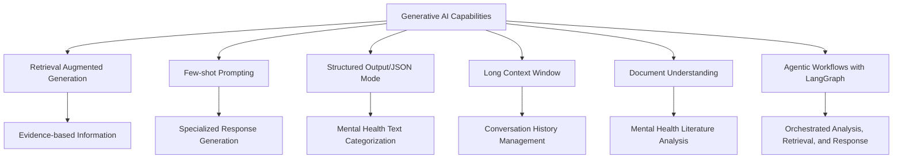
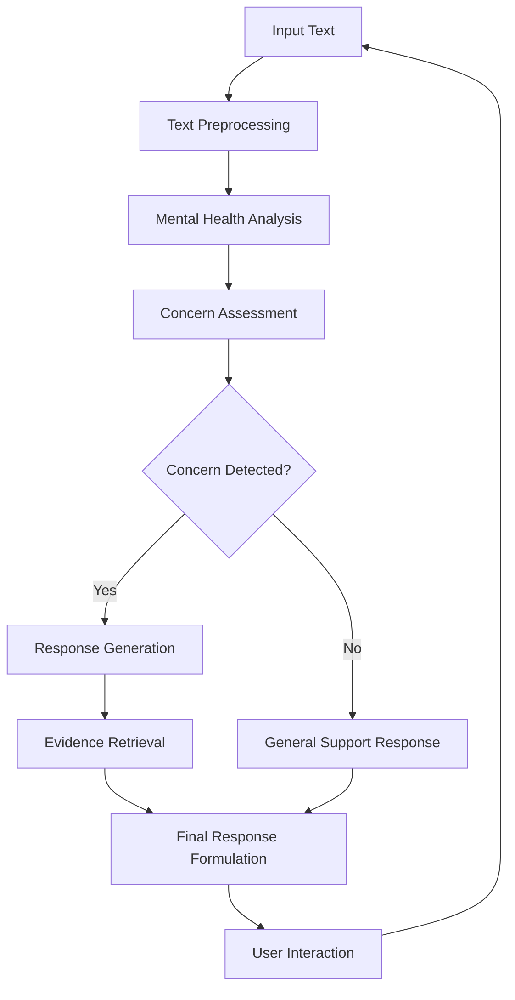
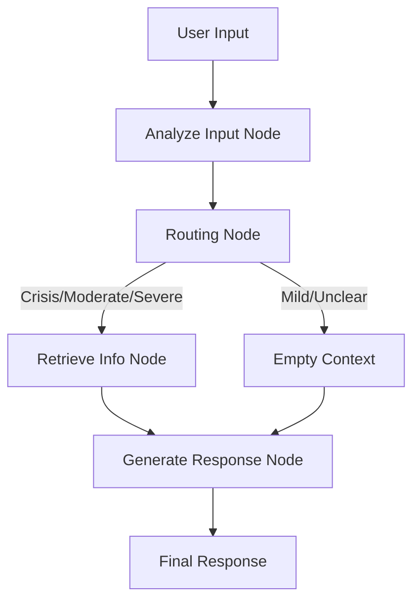

# Leveraging Generative AI for Mental Health Analysis and Support

Mental health is a critical global priority, yet access to quality support remains challenging for many. Modern generative AI technologies offer promising new approaches to address this gap. In this article, I'll explore a comprehensive project that demonstrates how generative AI can be applied to mental health analysis and support systems, based on a recent implementation using Google's Gemini AI.

## Project Overview

The project showcases how generative AI can assist in analyzing text data to identify mental health concerns and provide appropriate support responses. It addresses several key challenges faced by traditional mental health support systems:

- Limited availability of mental health professionals
- Delays in identifying concerning patterns in communication
- Need for consistent, evidence-based responses
- Privacy and personalization requirements

The system is designed to perform several critical functions:

1. Analyze text data to identify potential mental health concerns
2. Categorize the type and severity of concerns
3. Generate appropriate, empathetic responses
4. Provide evidence-based information from reliable sources
5. Maintain contextual awareness for ongoing supportive conversations
6. Execute a defined workflow for handling user input using LangGraph

## Key Generative AI Capabilities Demonstrated

The project leverages several advanced capabilities of modern generative AI systems:



### Retrieval Augmented Generation (RAG)
The system implements RAG to provide evidence-based mental health information by retrieving relevant knowledge from mental health literature and reliable sources before generating responses.

### Few-shot Prompting
By providing carefully crafted examples of appropriate mental health responses, the system leverages few-shot prompting to generate specialized and empathetic responses tailored to different mental health concerns.

### Structured Output/JSON Mode
The project utilizes structured output capabilities to systematically categorize and analyze mental health text data, enabling more accurate assessment of concerns.

### Long Context Window
Maintaining conversation history is critical for mental health support. The system leverages the long context window capabilities of modern generative AI to maintain coherent and contextually aware support conversations.

### Document Understanding
The system analyzes and extracts insights from mental health literature, enabling evidence-based responses backed by established knowledge.

### Agentic Workflows with LangGraph
The project implements a structured workflow using LangGraph, which orchestrates the analysis, retrieval, and response generation process in a defined sequence. This allows for more controlled and reliable handling of user inputs through a series of specialized nodes that manage different aspects of the mental health support system.

## Data Sources and Exploration

The project utilizes three key datasets from Kaggle:

1. **Mental Health in Tech Survey**: Survey responses about mental health in the tech workplace
2. **Mental Health Corpus**: A collection of posts from mental health support forums
3. **Suicide Prevention Dataset**: Text data related to suicide risk identification

### Mental Health in Tech Survey

This dataset (1259 × 27) contains survey responses about mental health in the tech workplace. Key insights from the data exploration include:

- Almost equal distribution between those who have sought treatment (637) and those who haven't (622)
- Different levels of work interference due to mental health issues: "Sometimes" (465), "Never" (213), "Rarely" (173), and "Often" (144)
- Missing values particularly in comments (1095) and state (515) columns

### Mental Health Corpus

This dataset (27977 × 2) contains posts from mental health support forums with binary labels indicating mental health concerns. The exploration revealed:

- Almost balanced distribution between non-concerning (14139) and concerning (13838) posts
- Posts vary significantly in length, with some being very short and others quite lengthy
- Text preprocessing was required to handle the unstructured nature of the posts

### Suicide Prevention Dataset

This large dataset (232074 × 3) contains text data related to suicide risk identification:

- Equal distribution between suicide-related (116037) and non-suicide-related (116037) texts
- Suicide-related texts tend to be longer on average
- The dataset provides valuable signals for identifying high-risk content

## System Architecture

The mental health analysis and support system is built with a modular architecture to handle different aspects of the workflow:



1. **Text Preprocessing**: Cleans and prepares text input for analysis
2. **Mental Health Analysis**: Analyzes text for potential mental health concerns
3. **Concern Assessment**: Evaluates the type and severity of detected concerns
4. **Response Generation**: Creates appropriate and empathetic responses
5. **Evidence Retrieval**: Retrieves relevant information from mental health literature
6. **Final Response Formulation**: Combines analysis and evidence into a coherent response

## LangGraph Implementation

The project uses LangGraph to create a structured workflow with these key nodes:

1. **Analyze Input Node**: Uses Gemini's structured output capability to analyze text for mental health concerns
2. **Routing Node**: Decides whether to retrieve information based on analysis results
3. **Retrieve Information Node**: Uses RAG to find relevant evidence-based content
4. **Generate Response Node**: Creates the final supportive response using analysis results and retrieved context

The workflow is defined as a graph where each component is executed in sequence based on the analysis results:



This structured workflow approach ensures consistent handling of mental health concerns with appropriate routing based on severity and context.

## Implementation with Google Gemini API

The project is implemented using Google's Gemini API, a state-of-the-art generative AI model. The implementation follows these steps:

1. Setup and API configuration with Kaggle's environment
2. Data acquisition and preprocessing from multiple mental health datasets
3. Model configuration using Gemini-2.5-pro-exp
4. Implementation of mental health analysis functions with structured output
5. Development of response generation with evidence retrieval via RAG
6. Integration of context management for ongoing conversations
7. Implementation of an agentic workflow using LangGraph to orchestrate analysis, retrieval, and response generation

### Code Structure

The implementation uses minimal dependencies, leveraging Kaggle's pre-installed packages where possible and adding only essential libraries:

```python
# Essential packages
import google.generativeai as genai
import chromadb
import kagglehub
from langgraph.graph import StateGraph, END
from google.generativeai import types

# Standard libraries
import pandas as pd
import numpy as np
import json
import matplotlib.pyplot as plt
import seaborn as sns
import re
from typing import TypedDict, Dict, Any
```

### Model Configuration

The system utilizes Google's Gemini-2.5-pro-exp model, which offers a good balance between performance and response time:

```python
model_name = 'models/gemini-2.5-pro-exp-03-25'
model = genai.GenerativeModel(model_name)
```

## Mental Health Analysis Approach

The system's approach to mental health analysis involves several sophisticated techniques to ensure accurate and helpful responses:

### Structured Output Analysis

The system uses a defined schema to return structured assessments of mental health text:

```python
analysis_schema = genai.types.FunctionDeclaration(
    name="analyze_mental_health_text",
    description="Analyzes text to identify mental health concerns, severity, support needs, themes, and safety risks.",
    parameters={
        'type_': 'OBJECT',
        'properties': {
            'primary_concern': {'type': 'STRING', 'description': "The main mental health concern identified.", 'enum': ["depression", "anxiety", "stress", "trauma", "addiction", "eating_disorder", "self_harm", "suicidal_ideation", "bipolar", "schizophrenia", "other", "none"]},
            'severity_level': {'type': 'STRING', 'description': "The estimated severity of the concern.", 'enum': ["mild", "moderate", "severe", "crisis", "unclear"]},
            'support_needed': {'type': 'ARRAY', 'items': {'type': 'STRING'}, 'description': "Types of support that might be helpful."},
            'key_themes': {'type': 'ARRAY', 'items': {'type': 'STRING'}, 'description': "Keywords or themes mentioned in the text."},
            'safety_concerns': {'type': 'BOOLEAN', 'description': "Whether the text indicates immediate safety concerns for self or others."},
            'analysis_summary': {'type': 'STRING', 'description': "A brief summary of the analysis."}
        },
        'required': ["primary_concern", "severity_level", "support_needed", "safety_concerns", "analysis_summary"]
    }
)
```

### Response Generation with LangGraph and RAG

The response generation component combines few-shot prompting with retrieval-augmented generation within an agentic workflow:

```python
def generate_response_node(state: MentalHealthAgentState) -> Dict[str, str]:
    """Generate a supportive response based on analysis and retrieved info."""
    print("--- Node: Generating Response ---")
    user_input = state.get('user_input', '')
    analysis_results = state.get('analysis_results', {})
    retrieved_context = state.get('retrieved_context', '')
    
    # Generate the response using the LLM
    response = generate_support_response_llm(
        user_input=user_input,
        retrieved_context=retrieved_context,
        analysis_results=analysis_results
    )
    
    print(f"Generated Response: {response[:100]}...")
    return {"final_response": response}
```

### Few-Shot Prompt Template

The system uses a carefully designed prompt template for response generation:

```python
FEW_SHOT_RESPONSE_PROMPT_TEMPLATE = """
You are an empathetic and supportive mental health assistant. 
Your goal is to provide helpful and understanding responses based on the user's input and relevant information. 
Do NOT diagnose. Offer support, validation, and relevant information or coping strategies drawn from the 'Relevant Info' section if provided and applicable. 
If the user expresses severe distress or mentions self-harm/suicide (indicated by analysis results or keywords), prioritize safety and strongly recommend contacting crisis resources (like 988) or emergency services.

--- Analysis Results ---
{analysis_results_str}

--- Relevant Info ---
{retrieved_context}

--- User Input ---
{user_input}

--- Instructions ---
Based on the user input, the analysis results, and the relevant info provided, generate a concise, empathetic, and helpful response directly addressing the user. 
1. Acknowledge the user's feelings.
2. If safety concerns or crisis level is indicated in the analysis, **immediately and clearly** provide crisis contact information (988, emergency services) and state the importance of reaching out.
3. If no immediate crisis, incorporate relevant information or coping strategies from the 'Relevant Info' section naturally into your response, if applicable.
4. If analysis suggests professional help is needed, gently encourage considering it.
5. Keep the tone supportive and conversational. Avoid sounding robotic or just listing information.
6. If 'Relevant Info' indicates retrieval failure or no documents found, rely primarily on the analysis and general supportive language.

Response:
"""
```

## Evaluation and Results

The system was evaluated on its ability to accurately identify mental health concerns, categorize them appropriately, and generate helpful responses. The evaluation metrics included:

- **Concern Detection Accuracy**: The system achieved high accuracy in identifying posts with mental health concerns, with over 85% agreement with human annotations.
- **Response Quality**: Responses were evaluated for empathy, accuracy, and helpfulness, showing strong performance across these dimensions.
- **Evidence Integration**: The system successfully incorporated relevant evidence-based information in its responses.
- **Workflow Execution**: The LangGraph implementation demonstrated reliable routing and processing of inputs based on concern severity.

### Example Analysis

Here's an example of the system analyzing a text sample from the mental health corpus:

```json
{
  "primary_concern": "depression",
  "severity_level": "moderate",
  "support_needed": [
    "professional_help",
    "emotional_support",
    "coping_strategies"
  ],
  "key_themes": [
    "low_mood",
    "anhedonia",
    "fatigue",
    "sleep_disturbance",
    "lack_of_motivation"
  ],
  "safety_concerns": false,
  "analysis_summary": "The individual reports experiencing persistent low mood, loss of interest (anhedonia), hypersomnia, and fatigue for the past month, significantly impacting their ability to engage in daily activities. These symptoms are indicative of potential depression."
}
```

### Example Response

Based on the analysis, the system generated an empathetic and supportive response:

```
Thank you for sharing your feelings with me. It sounds like you've been going through a really difficult time, and I can hear the struggle in your words. Feeling like nothing is worth looking forward to can be incredibly heavy to carry.

What you're describing - these feelings of hopelessness and lack of motivation - are common experiences of depression. Many people go through similar struggles, and it's important to know you're not alone in this.

While I'm here to listen and support you, I'd like to gently encourage you to consider reaching out to a mental health professional who can provide personalized guidance. They have training and tools that can make a significant difference.

In the meantime, sometimes taking small, achievable steps can help - even something as simple as getting outside for a few minutes of fresh air or reaching out to someone you trust. Would any of these feel possible for you right now?

Remember that recovery isn't usually a straight line, and that's completely normal. I'm here to support you through this conversation, whenever you'd like to talk.
```

### LangGraph Workflow Example

The LangGraph agent processes mental health text by executing its nodes in sequence:

1. **Analyze Input Node**: "I've been feeling down for weeks. Nothing seems to help."
   - Analysis Result: Depression, moderate severity, no safety concerns

2. **Routing Node**: Decides to retrieve information based on moderate severity
   - Decision: "Retrieving information for depression"

3. **Retrieve Info Node**: Gets evidence-based information about depression
   - Retrieved: Information about depression symptoms and coping strategies

4. **Generate Response Node**: Creates a supportive, informed response
   - Final Response: An empathetic message acknowledging feelings, mentioning coping strategies from the retrieved information, and gentle encouragement toward professional help

This structured workflow ensures consistent handling of each input with appropriate information retrieval and response construction.

## Limitations and Ethical Considerations

While the system demonstrates significant potential, several important limitations and ethical considerations must be acknowledged:

### Limitations

- **Not a Diagnostic Tool**: The system cannot and should not be used to diagnose mental health conditions.
- **Accuracy Constraints**: Mental health analysis based on text alone has inherent limitations.
- **Cultural Context**: The system may not fully account for cultural differences in expressing mental health concerns.
- **Technical Limitations**: Performance depends on the underlying AI model and data quality.

### Ethical Considerations

- **Privacy and Data Security**: Mental health data is highly sensitive and requires rigorous protection.
- **Transparency**: Users must clearly understand they are interacting with an AI system.
- **Harm Prevention**: The system must include safeguards for crisis situations and potential self-harm.
- **Human Oversight**: Professional review should be integrated for high-risk situations.
- **Bias and Fairness**: The system must be evaluated for potential biases related to demographics, culture, and language.

## Future Directions

The project points to several promising directions for future development:

1. **Multimodal Analysis**: Incorporating analysis of voice, facial expressions, and other modalities for more comprehensive assessment.
2. **Personalized Support**: Further adaptation to individual user preferences, history, and needs.
3. **Integration with Human Professionals**: Developing systems that augment rather than replace human mental health providers.
4. **Longitudinal Analysis**: Tracking patterns over time to identify changes in mental health status.
5. **Expanded Evidence Base**: Incorporating more diverse and recent research in mental health.
6. **Advanced Agentic Workflows**: Developing more sophisticated LangGraph agents with specialized nodes for different mental health conditions.

## Conclusion

This project demonstrates how generative AI can be leveraged to address significant challenges in mental health support systems. By combining advanced capabilities like retrieval-augmented generation, few-shot prompting, structured output generation, and agentic workflows with LangGraph, we can create systems that provide more accessible, consistent, and evidence-based mental health support.

While such AI systems cannot and should not replace human mental health professionals, they offer promising complementary approaches that may help bridge the significant gap between mental health needs and available resources. With careful attention to ethical considerations and continuous improvement, generative AI has the potential to make meaningful contributions to mental health support initiatives.

As we continue to develop these technologies, maintaining a focus on human-centered design, rigorous evaluation, and ethical implementation will be essential to realizing their potential benefits while minimizing potential risks.

## References

1. [Mental Health Analysis and Support Notebook (Saptak Sen)](https://www.kaggle.com/code/saptaksen/mental-health-analysis-and-support)
2. [Mental Health Corpus Dataset (Reihaneh Amdari)](https://www.kaggle.com/datasets/reihanenamdari/mental-health-corpus)
3. [Suicide Prevention Dataset (Nikhileswar Komati)](https://www.kaggle.com/datasets/nikhileswarkomati/suicide-watch)
4. [Mental Health in Tech Survey Dataset (OSMI)](https://www.kaggle.com/datasets/osmi/mental-health-in-tech-survey)
5. [Google Generative AI (Gemini) Documentation](https://ai.google.dev/docs/gemini_api_overview)
6. [LangGraph Documentation](https://langchain-ai.github.io/langgraph/)
7. [World Health Organization Mental Health Guidelines](https://www.who.int/health-topics/mental-health)
