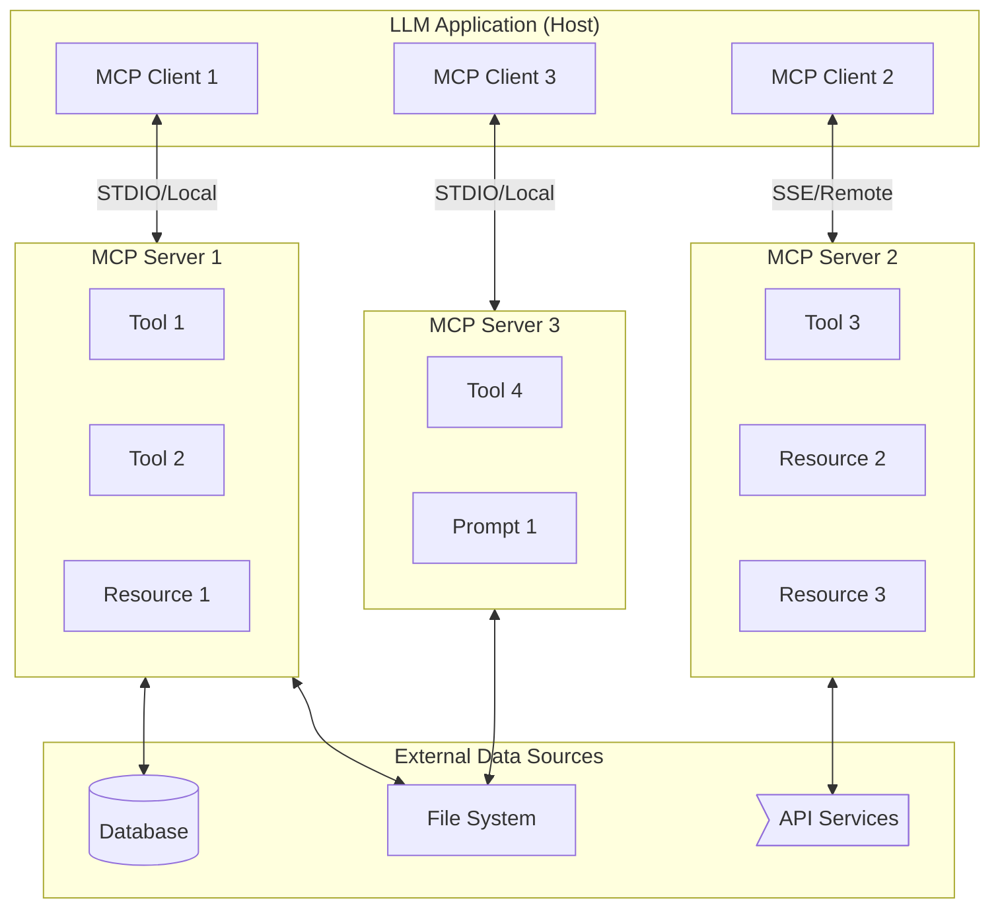
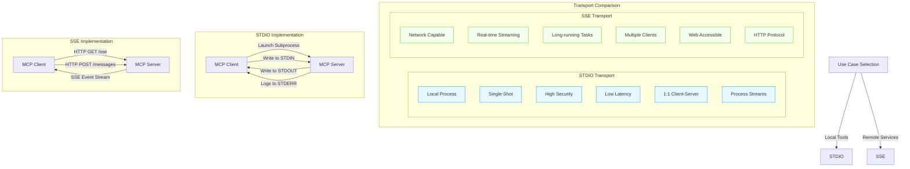
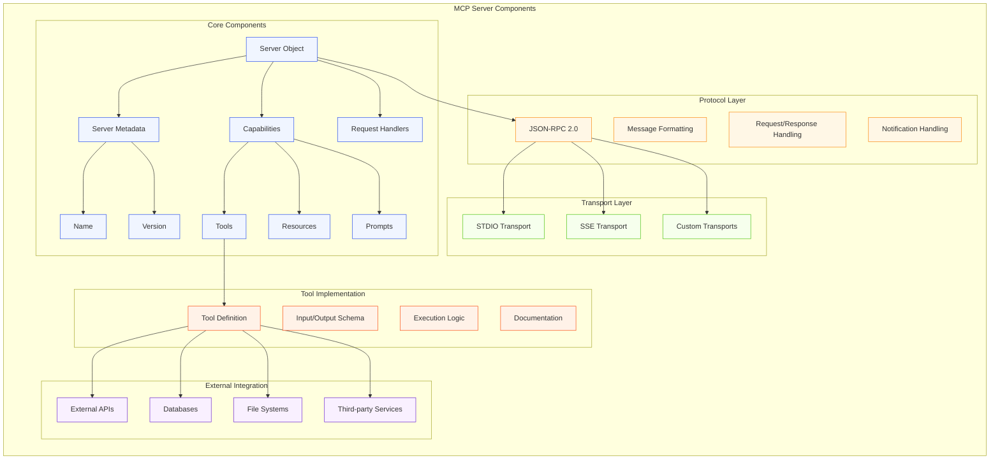

---
categories:
- ai
- technology
date: 2025-04-07
header_image_path: /assets/img/blog/headers/2025-04-07-demystifying-mcp-servers.jpg
image_credit: Photo by Firmbee.com on Unsplash
layout: post
tags:
- ai
- technology
- mcp
- anthropic
- model context protocol
thumbnail_path: /assets/img/blog/thumbnails/2025-04-07-demystifying-mcp-servers.jpg
title: 'Demystifying MCP Servers: Beyond Simple API Abstraction'
---

# Demystifying MCP Servers: Beyond Simple API Abstraction

## Introduction: The Misunderstood Intermediary

The Model Context Protocol (MCP) represents one of the most significant advancements in how AI systems interact with the world around them. Yet, despite its growing importance and adoption, there's a fundamental misunderstanding about what MCP servers actually are and the role they play in the AI ecosystem.

Most people misjudge MCP servers as just an API abstraction layer. That's a reductive view and misses the true power of MCP servers.

At its core, MCP acts as the intermediary logic fabric that enables AI systems to securely and efficiently interface with external tools, databases, and services, both locally and remotely. But to truly understand the power and nuance of MCP servers, we need to go deeper than the surface-level explanations that have dominated discussions so far.

In this article, I'll peel back the layers of MCP servers, examining their architecture, the crucial differences between transport types, and how they're fundamentally transforming AI's ability to interact with the digital world. Whether you're a developer, an AI researcher, or a technology leader, understanding MCP servers is becoming increasingly essential as we build more capable, context-aware AI systems.

## The Foundational Architecture of MCP

MCP follows a client-server architecture that may seem familiar at first glance but contains subtle yet powerful innovations. Let's break down how this architecture functions:

### Core Components

At the highest level, the MCP architecture consists of:

1. **MCP Hosts**: These are the applications users interact with, such as Claude Desktop, Cody, or other AI-powered interfaces. A host contains one or more MCP clients.

2. **MCP Clients**: Each client maintains a one-to-one connection with a specific MCP server. The client manages the communication channel and handles message formatting.

3. **MCP Servers**: Servers expose capabilities (tools, resources, and prompts) to clients through a standardized protocol. Each server can provide multiple capabilities and can connect to various data sources.

4. **External Data Sources**: These are the actual systems where data lives – databases, file systems, APIs, and other services.

What makes this architecture powerful is its standardization. By defining a common protocol for how clients and servers communicate, MCP creates a universal "language" for AI systems to interact with external resources. This solves the M×N problem that has plagued AI integrations, where each AI system (M) would need custom integrations with each data source (N).

### The Three Primitives: More Than Just Tools

While many discussions of MCP focus exclusively on "tools" (function calling), the protocol actually defines three distinct primitives:

1. **Tools**: Model-controlled functions that perform actions or computations. These are similar to function calling in other frameworks, allowing models to execute code, query APIs, or manipulate data.

2. **Resources**: Application-controlled data sources that provide context without performing significant computation. Resources are more like GET endpoints in a REST API, providing data without side effects.

3. **Prompts**: User-controlled templates that guide the model in using tools or resources optimally. These are pre-defined patterns for common tasks.

This distinction is crucial because it recognizes that different types of interactions have different control flows and security implications. Tools are invoked by the model, resources are provided by the application, and prompts are guided by the user – creating a balanced system of capabilities.

## STDIO vs. SSE: The Transport Layer Dichotomy

One of the most significant yet often overlooked aspects of MCP is the transport layer – how messages are physically exchanged between clients and servers. MCP supports two primary transport mechanisms: Standard Input/Output (STDIO) and Server-Sent Events (SSE). The choice between them has profound implications for security, performance, and use cases.

### STDIO: The Local Workhorse

STDIO transport is the default for local MCP servers, and it's designed for maximum security and simplicity:

- The client launches the server as a subprocess
- Communication happens through standard process streams (stdin/stdout)
- Messages are delimited by newlines and formatted as JSON-RPC 2.0
- The server can write logs to stderr for debugging

STDIO is single-shot by nature. It sends a request, gets a full response, then moves on. This makes it efficient for atomic tasks but limits its ability to handle ongoing, dynamic interactions. The process-based nature of STDIO creates a strong security boundary – the server can only access what the process has permission to access.

### SSE: The Remote Connector

Server-Sent Events (SSE) transport enables remote connections over HTTP:

- The client connects to an HTTP endpoint, establishing a persistent connection
- The server can push events to the client in real-time
- For client-to-server communication, the client uses HTTP POST requests
- Messages still use JSON-RPC 2.0 for compatibility

SSE shines for long-running, dynamic tasks where real-time updates are valuable. It also enables remote access, allowing MCP servers to run on different machines or even in the cloud. This opens up new possibilities for shared infrastructure and specialized services.

### The Security Implications

The difference between STDIO and SSE isn't just about output formats or technical implementations – it has profound security implications:

- STDIO servers run in a process sandbox, limiting their access to the local system
- SSE servers expose network endpoints that could potentially be accessed by other applications
- Remote SSE servers require proper authentication and authorization mechanisms
- STDIO provides automatic process isolation; SSE requires explicit security boundaries

This is why many security-sensitive applications default to STDIO for local tools and carefully controlled SSE for remote services. The protocol is designed to accommodate both patterns while encouraging appropriate security practices for each.

## The Anatomy of an MCP Server

To fully understand MCP, we need to look at what goes into building an MCP server. While the external interface is standardized, the internal components can be quite sophisticated:

### Server Initialization and Discovery

When an MCP server starts, it goes through a defined lifecycle:

1. **Initialization**: The server sets up its metadata (name, version) and capabilities
2. **Handshake**: When a client connects, they exchange protocol versions and capabilities
3. **Discovery**: The client requests information about available tools, resources, and prompts
4. **Operation**: The client can now make requests to use those capabilities

This standardized discovery process is what enables "plug-and-play" functionality. Clients don't need hardcoded knowledge of servers; they can dynamically discover what's available.

### Tool Definitions: Beyond Simple Functions

An MCP tool definition includes:

- **Name and Description**: Human-readable identifiers
- **Input Schema**: Structured JSON Schema defining expected parameters
- **Output Schema**: The format of the tool's response
- **Execution Logic**: The actual code that performs the tool's function

What makes MCP tools powerful is their rich metadata. The schemas and descriptions aren't just for documentation – they're used by language models to understand how to use the tools correctly. This enables models to make more informed decisions about when and how to use each tool.

### The Protocol Layer: JSON-RPC 2.0

MCP uses JSON-RPC 2.0 as its message format, which provides several benefits:

- **Structured Messages**: Clear separation between requests, responses, and notifications
- **Error Handling**: Standardized error codes and messages
- **Batch Processing**: Multiple requests can be sent in a single message
- **Transport Agnosticism**: The same message format works across different transports

This well-established protocol provides a solid foundation for MCP's more specialized features.

## Real-World MCP Server Applications

The rapid growth of the MCP ecosystem demonstrates its versatility. Some notable examples include:

### Development Tools Integration

MCP servers for GitHub, Git, and file systems have become essential tools for AI-assisted coding. These servers enable models to:

- Browse and search repositories
- Understand code structure
- Make targeted changes
- Run tests and debug issues

Companies like Sourcegraph, GitHub, and Replit have embraced MCP to enhance their AI-powered development tools, allowing for richer context when generating or analyzing code.

### Enterprise System Connectors

MCP servers for enterprise systems like Salesforce, Confluence, and Jira enable AI assistants to:

- Access and analyze enterprise data
- Update records and create content
- Automate workflows across systems
- Provide insights based on organizational knowledge

These connectors transform AI assistants from general-purpose tools to organization-specific collaborators with access to internal systems and data.

### Specialized Domain Expertise

Some of the most innovative MCP servers provide domain-specific capabilities:

- Financial analysis and market data
- Scientific computing and data visualization
- Medical information retrieval
- Legal document analysis

By encapsulating domain expertise in MCP servers, organizations can create AI assistants that combine the general capabilities of foundation models with specialized knowledge and tools.

## The Future of MCP Servers

As MCP continues to gain traction, several trends are emerging:

### Remote Servers and Cloud Deployment

Cloudflare's recent announcement of native support for remote MCP servers signals a shift toward cloud-hosted MCP infrastructure. This will enable:

- Centrally managed tools and resources
- Higher scalability for resource-intensive operations
- Shared capabilities across organizations
- Better security through professional management

### Authentication and Authorization

As MCP servers handle more sensitive data, sophisticated auth mechanisms are becoming essential:

- OAuth integration for user-specific access
- Fine-grained permission models
- Audit logging and compliance features
- Enterprise-grade security controls

### Multi-Agent Collaboration

The lines between MCP and protocols like Agent2Agent (A2A) are starting to blur, with emerging patterns for agent collaboration:

- Specialized agents exposing capabilities through MCP
- Orchestration of multiple agents through standardized interfaces
- Hierarchical delegation of tasks across agent networks

## Conclusion: The Logic Fabric of AI Systems

MCP servers are far more than simple API wrappers or function calling interfaces. They represent a fundamental shift in how we architect AI systems – from isolated models to interconnected networks of capabilities.

By standardizing how AI systems interact with external resources, MCP creates a universal language for AI integration. This solves the fragmentation problem that has limited AI adoption and opens the door to truly context-aware systems.

The distinction between STDIO and SSE transports isn't just a technical detail; it's a reflection of the dual nature of modern AI systems – needing both secure local access and scalable remote capabilities. Understanding these nuances is essential for building effective, secure AI architectures.

As we continue to build more sophisticated AI systems, MCP servers will likely become as fundamental as databases or APIs – a core component of our digital infrastructure, connecting the reasoning capabilities of AI models with the vast information and functionality of our digital world.

The MCP ecosystem is still evolving rapidly, with new server implementations, transport mechanisms, and security patterns emerging regularly. By understanding the deeper architectural principles behind MCP, developers and organizations can make informed decisions about how to leverage this powerful protocol in their AI strategy.
