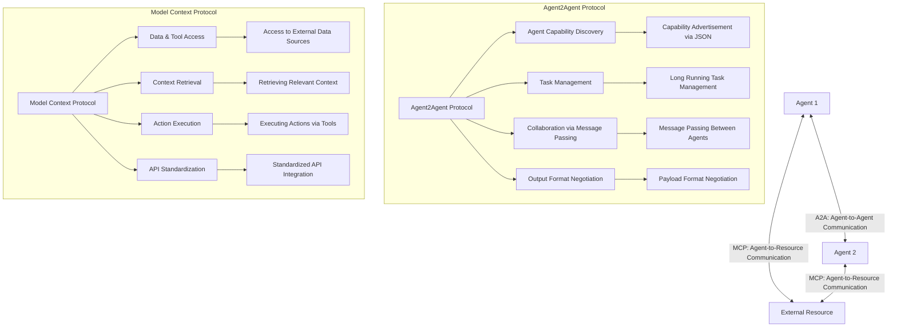
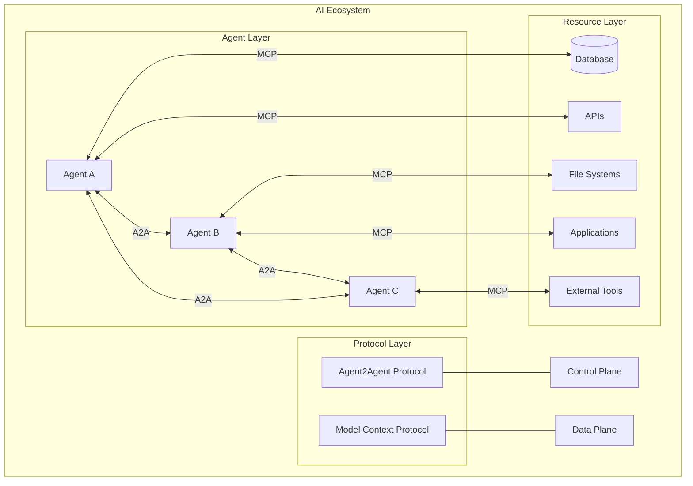

# Agent2Agent vs MCP: The Complementary Protocols Shaping the Future of Agentic AI

## The Dawn of the Multi-Agent Era

I remember the first time I encountered a true multi-agent system in action. It was at a tech demo in late 2024, where an AI assistant seamlessly delegated tasks to specialized agents, each pulling information from different systems, synthesizing insights, and collaborating to solve a complex business problem—all in seconds. The experience was nothing short of magical. What wasn't visible to the casual observer was the intricate dance of protocols happening behind the scenes, making this symphony of artificial intelligence possible.

As we stand at the threshold of what many are calling the "agentic revolution," two protocols have emerged as the foundational infrastructure for this new paradigm: Google's newly announced Agent2Agent (A2A) and Anthropic's Model Context Protocol (MCP). Just yesterday, at Google Next 2025, Google unveiled A2A with considerable fanfare and an impressive roster of partners. This announcement marked a significant milestone in the evolution of AI systems from isolated models to interconnected, collaborative networks of specialized agents.

In this exploration, we'll dive deep into these complementary protocols, understanding how they address different aspects of the AI interoperability challenge. While A2A focuses on agent-to-agent communication (the "control plane"), MCP provides standardized access to resources and tools (the "data plane"). Together, they're laying the groundwork for a future where AI systems can seamlessly collaborate, access information, and perform complex tasks across organizational boundaries.

## The Birth of Agent2Agent: Google's Vision for Agentic Collaboration

### Genesis of a Protocol

Google's announcement of Agent2Agent at Google Next 2025 didn't happen in isolation. It was the culmination of years of internal work on agent orchestration and the recognition that the industry needed a standardized way for AI systems to communicate with each other. According to Google, the A2A protocol emerged from their experiences deploying large-scale, multi-agent systems for customers and identifying the challenges in making these systems work together effectively.

What's particularly notable about A2A is the coalition Google has assembled. Over 50 technology partners—including enterprise heavyweights like Atlassian, Box, Salesforce, SAP, and ServiceNow—have aligned with Google's vision. This immediate industry support signals both the perceived importance of the protocol and Google's diplomatic success in bringing competitors together around a standard.

"We believe the A2A framework will add significant value for customers, whose AI agents will now be able to work across their entire enterprise application estates," noted Google in their announcement. For enterprise technology leaders watching the AI space, this marks a critical inflection point where agentic systems may finally overcome the integration hurdles that have limited their practical value.

### Inside the Agent2Agent Protocol: A Technical Deep Dive

At its core, A2A is deceptively simple. It provides a standardized way for agents to:

1. **Discover each other's capabilities**: Using a JSON payload, agents can advertise what they can do. This capability discovery mechanism is similar to a digital business card, allowing agents to understand who they're working with and what they can request. This solves the fundamental problem of how agents find and evaluate potential collaborators in a decentralized system.

2. **Manage long-running tasks**: Unlike simple API calls that return immediate responses, many AI-driven tasks require time to complete. A2A formalizes how agents request work, check status, and receive results from long-running operations. This is crucial for complex workflows that might take minutes, hours, or even days to complete.

3. **Collaborate through sophisticated message passing**: Beyond simple requests and responses, A2A enables rich, contextual information exchange between agents. Agents can share context, artifacts (like documents or data structures), or specific instructions in a standardized format, ensuring that collaborating agents have the information they need to contribute effectively.

4. **Negotiate output formats**: Perhaps one of the most overlooked but important features is A2A's ability to let agents agree on what forms of output they expect. This solves the common problem in AI systems where outputs might be delivered in unexpected or unusable formats.

The protocol is built on familiar web standards like HTTP, Server-Sent Events (SSE), and JSON-RPC. This wasn't an arbitrary choice—it ensures that A2A can be easily integrated into existing IT infrastructures without requiring specialized knowledge or technology stacks. It's a pragmatic approach that prioritizes adoption over theoretical elegance.

### The Design Philosophy: Embracing Agentic Autonomy

What strikes me about A2A is its philosophical approach to agent interaction. Unlike protocols that treat agents as glorified tools or functions to be called, A2A embraces the notion of agents as autonomous entities with their own capabilities, context, and memory.

Google articulated five key principles that guided A2A's design:

1. **Embracing agentic capabilities**: A2A acknowledges that agents are more than tools. They have their own memory, context, and capabilities that should be respected in their interactions.

2. **Building on existing standards**: Rather than reinventing the wheel, A2A leverages established web protocols to ensure compatibility with existing systems.

3. **Security by default**: With enterprise adoption in mind, A2A incorporates robust authentication and authorization mechanisms from day one.

4. **Focus on true multi-agent scenarios**: The protocol is designed for agent-to-agent collaboration rather than treating agents as mere tools.

5. **Open and community-driven development**: Like MCP, A2A is positioned as an open protocol that will evolve with community input.

This approach represents a significant evolution in how we think about AI systems. Rather than seeing them as tools to be invoked, A2A treats agents as collaborators that engage in a dialogue to solve problems together.

## Model Context Protocol: Anthropic's Answer to the Information Silo Problem

### The Problem MCP Solves

While A2A addresses how agents talk to each other, MCP tackles a different but equally critical challenge: how agents access the information and tools they need to be effective.

Anthropic's Claude found itself in a similar position to many frontier AI models—brilliant in a vacuum but hamstrung when it needed to access external information or perform actions in the real world. Traditional approaches to this problem involved custom integrations for each data source or tool, leading to a fragmented landscape where scaling became increasingly difficult with each new integration.

MCP emerged as Anthropic's solution to this challenge. By providing a standardized way for AI systems to access external resources, MCP eliminates the need for custom integrations with each new data source or tool. It's a universal "adapter" that allows models to pull in contextual information when needed and take actions in external systems.

### MCP Architectural Deep Dive

Under the hood, MCP consists of three main components:

1. **MCP Hosts**: Applications like Claude Desktop that need access to external data or tools.

2. **MCP Clients**: Components that maintain connections with MCP servers and facilitate the host's interactions with them.

3. **MCP Servers**: Services that provide access to specific data sources or tools. These can be simple (accessing a single API) or complex (providing sophisticated capabilities like database querying or file system access).

The protocol enables two primary types of interactions:

- **Pull interactions**: The AI model queries servers for context (e.g., checking your calendar or retrieving documents).

- **Push interactions**: The model instructs servers to take actions (e.g., sending emails or updating records).

These interactions happen through a persistent, two-way communication channel similar to WebSockets, allowing for real-time updates and continuous interaction rather than one-off requests.

### The USB Interface for AI: Why MCP Matters

The analogy of MCP as the "USB interface" for AI is particularly apt. Just as USB standardized how devices connect to computers, MCP standardizes how AI systems connect to data sources and tools.

Consider the difference in integration approaches:

- **Without MCP**: Each new integration requires custom code, authentication methods, error handling, and maintenance.

- **With MCP**: A single interface provides access to any MCP-compatible resource, dramatically reducing integration complexity.

This standardization brings several significant benefits:

1. **Simplified development**: Developers can write once and integrate multiple times without custom code for each integration.

2. **Flexibility**: Organizations can switch AI models or tools without complex reconfiguration.

3. **Real-time responsiveness**: MCP connections remain active, enabling dynamic updates and interactions.

4. **Security and compliance**: The protocol includes standardized access controls and security practices.

5. **Scalability**: Adding new capabilities is as simple as connecting another MCP server.

For organizations deploying AI systems, MCP represents a step change in how they can integrate these systems with their existing infrastructure. Rather than point solutions for each integration, MCP provides a unified approach that can scale with the organization's needs.

## When Worlds Collide: Understanding the A2A-MCP Relationship

### Complementary Protocols in a Layered Architecture

The relationship between A2A and MCP is best understood through the lens of a layered architectural model:

- **MCP operates at the data plane level**: It's concerned with how agents access resources, tools, and information. It's the protocol that connects agents to the systems where data lives.

- **A2A operates at the control plane level**: It focuses on how agents communicate with each other, coordinate tasks, and collaborate on complex workflows.

Rao Surapaneni, VP and GM of Google Cloud's Business Application platform, articulated this relationship clearly: "The way we are looking at Agent2Agent is at a higher layer of abstraction to enable applications and agents to talk to each other. So think of it as a layered stack where MCP operates with the LLM for tools and data."

This layered approach isn't accidental—it reflects the different problems each protocol was designed to solve. MCP addresses how agents interact with the world of data and tools, while A2A addresses how agents interact with each other.

### Visualizing the Protocol Landscape

Let's visualize this relationship to better understand how these protocols interact:



In a typical multi-agent scenario, we might see both protocols working together:

1. A user asks an agent to complete a complex task.
2. The agent uses A2A to discover and collaborate with specialized agents that can help with specific aspects of the task.
3. Each agent uses MCP to access the data and tools it needs to fulfill its part of the task.
4. The agents coordinate their work via A2A, sharing results and context as they make progress.
5. The original agent synthesizes the results and presents them to the user.

This combination of protocols creates a powerful framework for building sophisticated AI systems that can collaborate effectively and access the resources they need to be useful.

### The Ecosystem View: A Network of Specialized Agents

From an ecosystem perspective, these protocols enable a new paradigm of AI development—one built around specialized agents that collaborate to solve complex problems:



This networked approach represents a fundamental shift from the monolithic AI models of the past. Rather than trying to build models that can do everything, we're moving toward ecosystems of specialized agents that can collaborate to solve complex problems. This approach is more scalable, more maintainable, and ultimately more powerful than trying to build AI systems that can do everything on their own.

## Real-World Applications: A New Paradigm of AI Interaction

### The Hiring Process Reimagined

Let's walk through a concrete example of how A2A and MCP might transform a common business process: hiring new employees.

In today's world, hiring is a fragmented process involving multiple systems, manual handoffs, and considerable human effort. With A2A and MCP, this could be transformed into a seamless, AI-driven workflow:

1. A hiring manager opens a conversation with their AI assistant and describes the role they need to fill, including details about required skills, location, and salary range.

2. The assistant, acting as the orchestrating agent, uses A2A to connect with specialized recruiting agents at various staffing firms. It shares the job requirements and requests candidate suggestions.

3. Each recruiting agent uses MCP to access its proprietary databases of candidates, job market data, and contact information. They identify potential matches based on the requirements.

4. The recruiting agents use A2A to send candidate profiles back to the orchestrating agent, which synthesizes the information and presents a curated list to the hiring manager.

5. The manager selects candidates of interest, and the orchestrating agent uses A2A to instruct the recruiting agents to schedule interviews.

6. The recruiting agents use MCP to access calendar systems and email platforms to coordinate with candidates and schedule interviews.

7. After interviews, the orchestrating agent uses A2A to connect with verification agents that can perform background checks and reference verifications.

8. These verification agents use MCP to access relevant databases and systems to complete their checks.

9. Throughout the process, the orchestrating agent keeps the hiring manager informed of progress and alerts them when decisions or input are needed.

This workflow demonstrates the power of combining A2A and MCP: A2A enables coordination between specialized agents (the orchestrating agent, recruiting agents, and verification agents), while MCP provides each agent with access to the resources it needs (databases, calendars, email systems).

The result is a hiring process that requires far fewer manual interventions, moves more quickly, and can scale across multiple openings simultaneously.

### Development Workflows: A Collaboration of Code Specialists

Software development is another domain ripe for transformation through these protocols. Imagine a development environment where specialized agents collaborate to accelerate the coding process:

1. A developer describes the feature they want to implement to their AI assistant.

2. The assistant uses A2A to engage specialized agents:
   - A design agent that understands UI/UX principles
   - A code generation agent specialized in the project's programming language
   - A testing agent that excels at writing comprehensive tests
   - A documentation agent that can produce clear, accurate documentation

3. Each agent uses MCP to access relevant resources:
   - The design agent accesses design systems and component libraries
   - The code generation agent pulls in the project's codebase, dependencies, and API documentation
   - The testing agent retrieves existing test suites and testing frameworks
   - The documentation agent accesses documentation standards and existing documentation

4. The agents collaborate via A2A:
   - The design agent proposes UI components and interactions
   - The code generation agent implements the necessary code
   - The testing agent writes tests to verify the implementation
   - The documentation agent documents the new feature

5. Throughout the process, the agents coordinate their work, ensuring that design decisions are reflected in the code, tests cover the implementation, and documentation accurately describes the feature.

This approach leverages the strengths of specialized agents while providing each with the context and resources it needs to contribute effectively. The developer remains in control, guiding the process and making key decisions, but much of the mechanical work is handled by the collaborative agent network.

### Multimodal Content Creation: Orchestrating Creative Agents

Content creation—particularly multimodal content involving text, images, and interactive elements—presents another compelling use case for these protocols:

1. A marketing team member describes the content they want to create: a product announcement with text, images, and an interactive demo.

2. Their AI assistant uses A2A to engage specialized creative agents:
   - A copywriting agent with expertise in persuasive product messaging
   - A visual design agent specialized in creating product imagery
   - A technical demo agent that can create interactive product demonstrations

3. Each agent uses MCP to access relevant resources:
   - The copywriting agent pulls in brand guidelines, product specifications, and past marketing materials
   - The visual design agent accesses the product's visual assets, brand color schemes, and image libraries
   - The technical demo agent interfaces with the product's API and documentation

4. The agents collaborate via A2A to create a cohesive piece of content:
   - The copywriting agent drafts the announcement text
   - The visual design agent creates supporting imagery
   - The technical demo agent builds an interactive demonstration

5. Throughout the process, the agents exchange feedback and ensure the components work together harmoniously.

This workflow demonstrates how specialized agents can collaborate on complex creative tasks, each contributing their expertise while maintaining a cohesive vision for the final product.

## The Technical Implementation: How These Protocols Work in Practice

### A2A Behind the Scenes

Let's look at how A2A might work in practice, exploring a simplified version of what happens when one agent needs to collaborate with another:

1. **Capability Discovery**: 
   Agent A sends a request to Agent B asking about its capabilities. Agent B responds with a JSON payload describing what it can do, such as:

   ```json
   {
     "agent_id": "financial-analysis-agent",
     "capabilities": [
       {
         "id": "financial-report-analysis",
         "description": "Analyze financial reports and provide insights",
         "supported_formats": ["PDF", "XLSX"],
         "parameters": {
           "report_type": {
             "type": "string",
             "enum": ["quarterly", "annual", "audit"]
           },
           "analysis_depth": {
             "type": "string",
             "enum": ["summary", "detailed", "comprehensive"]
           }
         }
       }
     ]
   }
   ```

2. **Task Initiation**:
   Agent A sends a task request to Agent B:

   ```json
   {
     "task_id": "analyze-q2-financials",
     "capability_id": "financial-report-analysis",
     "parameters": {
       "report_type": "quarterly",
       "analysis_depth": "detailed"
     },
     "context": {
       "company": "Acme Corp",
       "quarter": "Q2 2025",
       "focus_areas": ["revenue growth", "cost optimization"]
     },
     "artifacts": [
       {
         "id": "q2-financial-report",
         "mime_type": "application/pdf",
         "url": "https://example.com/financial-reports/acme-q2-2025.pdf"
       }
     ]
   }
   ```

3. **Progress Updates**:
   As Agent B works on the task, it sends progress updates to Agent A:

   ```json
   {
     "task_id": "analyze-q2-financials",
     "status": "in_progress",
     "progress": 0.45,
     "message": "Analyzing revenue streams and identifying growth patterns"
   }
   ```

4. **Task Completion**:
   When finished, Agent B sends the completed task results to Agent A:

   ```json
   {
     "task_id": "analyze-q2-financials",
     "status": "completed",
     "results": {
       "summary": "Acme Corp's Q2 2025 financial performance shows 15% YoY revenue growth with significant gains in the widget division...",
       "key_insights": [
         "Widget division revenue increased 32% YoY due to successful product launches",
         "Operating expenses grew faster than revenue, indicating potential scaling challenges",
         "Cash reserves declined 8% due to increased R&D investments"
       ],
       "recommendations": [
         "Implement cost optimization measures in the gadget division",
         "Accelerate widget production scaling to meet growing demand",
         "Review R&D allocation across product lines"
       ]
     },
     "artifacts": [
       {
         "id": "financial-analysis-report",
         "mime_type": "application/pdf",
         "url": "https://example.com/task-results/analyze-q2-financials/report.pdf"
       },
       {
         "id": "financial-analysis-data",
         "mime_type": "application/json",
         "inline_data": {
           "revenue_growth": 0.15,
           "expense_growth": 0.18,
           "product_line_performance": {
             "widgets": 0.32,
             "gadgets": 0.08,
             "systems": 0.11
           }
         }
       }
     ]
   }
   ```

This example illustrates the structured yet flexible nature of A2A communication. Agents can exchange rich contextual information, share artifacts, and provide detailed results in a standardized format.

### MCP in Action

To complement our A2A example, let's see how MCP might be used by an agent to access a document management system:

1. **Connection Establishment**:
   The agent connects to the document management MCP server and receives information about available capabilities:

   ```json
   {
     "name": "Document Management System",
     "version": "1.0",
     "capabilities": [
       {
         "id": "search",
         "description": "Search for documents matching criteria"
       },
       {
         "id": "retrieve",
         "description": "Retrieve document content by ID"
       },
       {
         "id": "update",
         "description": "Update an existing document"
       },
       {
         "id": "create",
         "description": "Create a new document"
       }
     ]
   }
   ```

2. **Document Search**:
   The agent searches for relevant documents:

   ```json
   {
     "capability": "search",
     "parameters": {
       "query": "marketing strategy 2025",
       "filters": {
         "department": "Marketing",
         "created_after": "2025-01-01"
       },
       "limit": 5
     }
   }
   ```

   The MCP server responds with matching documents:

   ```json
   {
     "result": {
       "total_matches": 12,
       "documents": [
         {
           "id": "doc-12345",
           "title": "2025 Q1-Q2 Marketing Strategy",
           "created_by": "Jane Smith",
           "created_at": "2025-01-15T10:30:00Z",
           "last_modified": "2025-03-22T14:45:00Z",
           "summary": "Comprehensive marketing strategy for the first half of 2025, focusing on product launches and market expansion."
         },
         // Additional documents...
       ]
     }
   }
   ```

3. **Document Retrieval**:
   The agent retrieves a specific document:

   ```json
   {
     "capability": "retrieve",
     "parameters": {
       "document_id": "doc-12345",
       "format": "text"
     }
   }
   ```

   The MCP server responds with the document content:

   ```json
   {
     "result": {
       "document_id": "doc-12345",
       "title": "2025 Q1-Q2 Marketing Strategy",
       "content_type": "text/plain",
       "content": "# 2025 Q1-Q2 Marketing Strategy\n\n## Executive Summary\n\nThis document outlines our marketing approach for the first half of 2025...",
       "metadata": {
         "word_count": 4280,
         "version": 3,
         "contributors": ["Jane Smith", "John Doe"]
       }
     }
   }
   ```

4. **Document Update**:
   After processing the information, the agent might update the document:

   ```json
   {
     "capability": "update",
     "parameters": {
       "document_id": "doc-12345",
       "changes": {
         "append_section": {
           "heading": "AI Market Analysis",
           "content": "Recent developments in the AI market suggest an opportunity for our product line...",
           "position": "after:Executive Summary"
         }
       },
       "comment": "Added AI market analysis based on recent research"
     }
   }
   ```

   The MCP server confirms the update:

   ```json
   {
     "result": {
       "success": true,
       "document_id": "doc-12345",
       "new_version": 4,
       "last_modified": "2025-04-10T09:12:00Z"
     }
   }
   ```

This example demonstrates how MCP provides a standardized way for agents to interact with external systems like document management platforms. The agent can search for relevant information, retrieve it for processing, and take actions like updating documents—all through a consistent interface regardless of the underlying system.

## The Road Ahead: Challenges and Opportunities

### Standardization and Convergence: The Path Forward

The emergence of multiple protocols raises important questions about standardization and potential convergence. While A2A and MCP currently address different aspects of the AI interoperability challenge, there's potential for closer integration or even convergence in the future.

Google has indicated openness to collaboration with other consortia working on agent interoperability protocols. As Rao Surapaneni noted, "We will look at how to align with all of the protocols. There will always be some protocol with a good idea, and we want to figure out how to bring all those good ideas in."

This sentiment suggests that we're in the early stages of protocol development, with significant evolution likely as these standards mature and real-world implementations provide feedback on what works and what doesn't.

### Technical Challenges and Limitations

Despite their promise, both protocols face technical challenges that will need to be addressed as they mature:

1. **Security and Trust**: As agents gain the ability to act on behalf of users and organizations, robust security models become critical. How do we ensure that agent interactions are secure, authorized, and auditable? While both protocols incorporate security mechanisms, the complexity of multi-agent systems presents unique security challenges.

2. **Scalability**: As agent ecosystems grow, the number of potential agent-to-agent interactions grows exponentially. Can these protocols scale to support thousands or millions of agents interacting simultaneously? This will require efficient discovery mechanisms, load balancing, and potentially hierarchical structures.

3. **Semantic Understanding**: For true interoperability, agents need to understand not just the syntax but the semantics of their interactions. This goes beyond standardized message formats to shared ontologies and conceptual frameworks. How do we ensure that agents have a common understanding of the concepts they're discussing?

4. **Conflict Resolution**: In multi-agent systems, conflicts are inevitable. How do agents resolve competing priorities, resource contention, or disagreements about the best approach to a problem? Both protocols will need mechanisms for negotiation and conflict resolution.

5. **Evolution and Backward Compatibility**: As these protocols evolve, maintaining backward compatibility will be essential. How do we ensure that agents built on different versions of the protocols can still interact effectively?

### Industry Adoption and the Competitive Landscape

The immediate industry support for both protocols is promising, but questions remain about broader adoption, particularly from other major AI players like OpenAI, Meta, and Microsoft.

Notably absent from Google's impressive list of A2A partners were these major players. As I mentioned at the beginning, this is unsurprising given the competitive dynamics in the AI space. These companies have their own agent frameworks and may be hesitant to adopt standards developed by competitors.

However, the history of technology suggests that open standards tend to win in the long run. Just as the web thrived on open standards like HTTP and HTML, the age of agentic AI will likely coalesce around open protocols that enable interoperability across vendors and platforms.

The real test will be whether these standards can demonstrate sufficient value to overcome competitive concerns. If organizations find that A2A and MCP significantly enhance their ability to deploy useful AI systems, market pressure may push even reluctant vendors toward adoption.

## The Multi-Agent Future: Where Do We Go From Here?

### Integration with Development Frameworks

Both protocols are already being integrated into broader development frameworks:

- Google's Agent Development Kit (ADK) supports both A2A and MCP, enabling developers to build production-ready agentic applications with greater flexibility and control.

- Frameworks like OWL (Optimized Workforce Learning) support MCP to achieve standardized and efficient tool invocation.

These integrations make it easier for developers to adopt the protocols without having to implement them from scratch. As more development tools incorporate support for A2A and MCP, we'll likely see accelerated adoption across the industry.

### Specialized Agent Marketplaces

One intriguing possibility enabled by these protocols is the emergence of specialized agent marketplaces. Just as app stores transformed mobile computing by providing a platform for specialized applications, agent marketplaces could provide access to specialized AI capabilities.

Imagine a marketplace where organizations can discover and connect with specialized agents for particular domains or tasks—financial analysis agents, creative writing agents, data visualization agents, and so on. These agents could advertise their capabilities via A2A and integrate with an organization's existing systems via MCP.

This approach would allow organizations to assemble custom agent networks tailored to their specific needs without having to build everything from scratch.

### The Democratization of Agent Development

Perhaps the most significant impact of these protocols will be the democratization of agent development. By providing standardized interfaces for agent communication and resource access, A2A and MCP lower the barriers to entry for building useful agentic systems.

Rather than requiring expertise in the intricacies of AI model development, developers can focus on defining agent behaviors, capabilities, and interactions. This shift could unleash a wave of innovation as a broader range of developers and organizations can participate in building the agentic AI ecosystem.

## Conclusion: The Symphony of Collaborative Intelligence

As we stand at the dawn of the agentic era, A2A and MCP represent complementary building blocks for a future of collaborative intelligence. Like the standardized protocols that enabled the internet to flourish, these protocols provide the foundation for a new generation of AI systems that can work together seamlessly across organizational and technical boundaries.

While MCP addresses the data plane, connecting agents to the information and tools they need, A2A addresses the control plane, enabling agents to communicate, coordinate, and collaborate. Together, they form a comprehensive framework for building sophisticated multi-agent systems that can tackle complex problems beyond the reach of individual agents.

The industry support for both protocols suggests that we're seeing the early stages of standardization in a rapidly evolving field. While challenges remain—from security and scalability to semantic understanding and conflict resolution—the path forward is increasingly clear: a world of specialized, collaborative agents working together to augment human capabilities and solve complex problems.

For developers, these protocols represent both an opportunity and an imperative. Those who embrace these standards early will be well-positioned to build the next generation of AI systems—systems characterized not by isolated intelligence but by collaborative problem-solving across a network of specialized agents.

The symphony of collaborative intelligence is just beginning. A2A and MCP are providing the score, but it will be the creativity and innovation of the developer community that brings this symphony to life.
