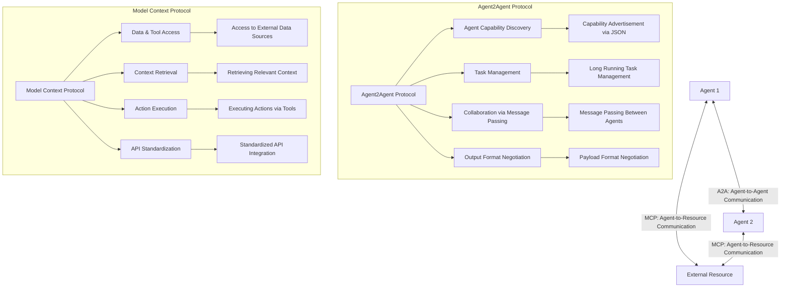
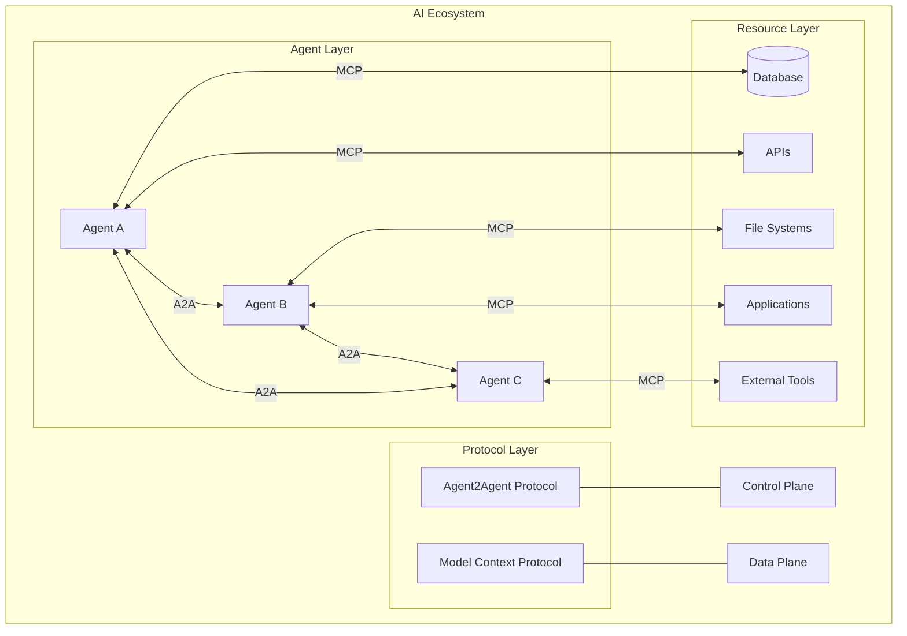

# Agent2Agent vs MCP: Understanding the Complementary Protocols Powering the Agentic AI Revolution

## Introduction: The Rise of Agentic AI

The AI landscape is rapidly evolving from single-purpose models toward intelligent, autonomous multi-agent systems. As this transformation accelerates, the need for standardized protocols to facilitate communication and interoperability between AI systems has become increasingly apparent. Two significant protocols have emerged to address different aspects of this challenge: Google's newly announced Agent2Agent (A2A) protocol and Anthropic's Model Context Protocol (MCP).

This article explores how these protocols complement each other rather than compete, each addressing a distinct aspect of the AI interoperability challenge. While MCP focuses on connecting AI agents with resources and tools (the "data plane"), A2A concentrates on enabling communication between different agents (the "control plane").

## Agent2Agent (A2A): Enabling Inter-Agent Communication

### What is Agent2Agent?

Agent2Agent (A2A) is an open protocol announced by Google at Google Next 2025, designed to enable AI agents to communicate with each other securely, exchange information, and coordinate actions across various enterprise platforms or applications. The protocol was developed in collaboration with over 50 technology partners, including Atlassian, Box, Cohere, Intuit, LangChain, MongoDB, PayPal, Salesforce, SAP, ServiceNow, UKG, and Workday.

### Key Features of A2A

The A2A protocol includes several critical capabilities:

1. **Capability Discovery**: Agents can advertise their capabilities through a JSON format, allowing client agents to identify the most appropriate agent for a specific task.

2. **Task Management**: A2A formalizes a structure for long-running task management, ensuring communication between agents is solely oriented toward completing requests and defining the lifecycle of tasks.

3. **Collaboration via Message Passing**: The protocol enables sending messages around context, replies, artifacts (outputs of tasks), or instructions, making it easier to support collaboration that requires message passing.

4. **User Experience Negotiation**: A2A makes it possible to negotiate the output payload format of the system, specifying the content types and formats the agents are reading.

### Design Principles of A2A

According to Google, the A2A protocol was designed with five key principles in mind:

1. **Embracing agentic capabilities**: A2A focuses on enabling agents to collaborate in their natural, unstructured modalities, even when they don't share memory, tools, or context.

2. **Building on existing standards**: The protocol is built on popular standards including HTTP, SSE, and JSON-RPC, making it easier to integrate with existing IT infrastructure.

3. **Security by default**: A2A supports enterprise-grade authentication and authorization.

4. **Focus on multi-agent scenarios**: The protocol is specifically designed to enable true multi-agent scenarios rather than limiting an agent to a "tool."

5. **Open and community-driven**: Google has designed A2A as an open protocol, inviting the larger open-source community to contribute and suggest code updates.

## Model Context Protocol (MCP): Connecting Agents to Resources

### What is Model Context Protocol?

The Model Context Protocol (MCP) is an open standard developed by Anthropic for connecting AI assistants to systems where data lives, including content repositories, business tools, and development environments. It aims to help frontier models produce better, more relevant responses by providing a standardized way to access external data and tools.

### Key Features of MCP

MCP addresses several fundamental needs for AI systems:

1. **Access to External Data Sources**: MCP allows AI models to access information beyond their training data, connecting to various data sources without custom implementations for each one.

2. **Context Retrieval**: The protocol enables AI assistants to pull relevant context from external sources when needed to answer queries or perform tasks.

3. **Action Execution**: MCP provides a standardized way for AI models to execute actions via external tools, such as updating documents or sending emails.

4. **Standardized API Integration**: Rather than maintaining separate connectors for each data source, developers can build against a standard protocol.

### MCP as the "USB Interface" for AI

MCP has been described as the "USB interface" of the AI field, providing a universal solution for addressing AI information silos. Just as USB-C simplifies how you connect different devices to your computer, MCP simplifies how AI models interact with data, tools, and services.

## A2A vs MCP: Complementary Rather Than Competitive

### Different Layers of the AI Stack

The key distinction between A2A and MCP lies in their focus and positioning within the AI stack:

- **MCP (Data Plane)**: Focuses on standardizing how AI agents interact with resources, tools, and data sources. It's primarily concerned with agent-to-resource communication.

- **A2A (Control Plane)**: Concentrates on standardizing how AI agents communicate and collaborate with each other. It's focused on agent-to-agent communication.

As Rao Surapaneni, VP and GM of Google Cloud's Business Application platform, explained: "The way we are looking at Agent2Agent is at a higher layer of abstraction to enable applications and agents to talk to each other. So think of it as a layered stack where MCP operates with the LLM for tools and data."

### Visualizing the Relationship

### The Ecosystem Perspective

In a multi-agent AI ecosystem, both protocols serve essential but distinct purposes:

## Real-World Applications and Use Cases

### Enterprise Workflow Automation

One of the most promising applications of these protocols is in enterprise workflow automation. For example, in a hiring process:

1. A manager asks an agent to discover potential candidates using different job listings, locations, and skill sets.
2. The agent uses A2A to reach out to different agentic AI systems at staffing firms to source candidates.
3. Each of these agents uses MCP to access relevant databases and APIs to find suitable candidates.
4. After interviews are complete, another agent can assist with background checks, which could require reaching out to yet another agent platform.

This greatly reduces the number of interactions and touchpoints that a user would have to make, allowing AI agents to do most of the busywork behind the scenes.

### Development Tools Integration

In the world of developer tools:

1. Using MCP, an IDE can connect to file systems, version control, package managers, and documentation.
2. Using A2A, code-writing agents can collaborate with code-reviewing agents and deployment agents to create a seamless development workflow.

### Specialized Agent Collaboration

Different models have different capabilities. For example, in the code generation space, Claude 3.7 may excel at reasoning but be more verbose, while Claude 3.5 might be better at "fill in the middle" activities.

A2A allows systems to advertise specific capabilities and specialties, enabling a world where different systems can be selected for the tasks they excel at. This could lead to specialized "research" heads on resources that act as agentic "librarians," accessing task-specific data with task-specific authentication and delivering it in a format negotiated by the requesting agent or operator.

## The Future of A2A and MCP

### Potential for Convergence

While A2A and MCP currently address different aspects of the AI interoperability challenge, there's potential for future convergence or at least closer integration. Google has indicated openness to collaboration with other consortia working on agent interoperability protocols. As Surapaneni noted, "We will look at how to align with all of the protocols. There will always be some protocol with a good idea, and we want to figure out how to bring all those good ideas in."

### Expanding Ecosystem

Both protocols are gaining traction with significant industry support:

- A2A is backed by over 50 technology partners and service providers, including major enterprise software companies and consulting firms.
- MCP has been adopted by companies like Block and Apollo, with development tools companies like Zed, Replit, Codeium, and Sourcegraph working to integrate it into their platforms.

### Integration with Development Frameworks

Both protocols are being integrated into broader development frameworks:

- Google's Agent Development Kit (ADK) supports both A2A and MCP, enabling developers to build production-ready agentic applications with greater flexibility and control.
- Frameworks like OWL (Optimized Workforce Learning) support MCP to achieve standardized and efficient tool invocation.

## Conclusion: Complementary Protocols for a Multi-Agent Future

A2A and MCP represent complementary rather than competitive approaches to solving the AI interoperability challenge. While MCP tackles the "data plane" problem by providing standardized access to external resources, A2A addresses the "control plane" by facilitating communication between different agents.

As we move toward a future of multi-agent systems, both protocols will play crucial roles in enabling the seamless collaboration and integration necessary for complex workflows. The real value will come from their combined use, allowing developers to build sophisticated, interoperable AI ecosystems where specialized agents can communicate effectively with each other and access the resources they need.

The open, community-driven nature of both protocols suggests a promising future of continued development and potential convergence, ultimately benefiting the entire AI ecosystem and accelerating the adoption of agentic AI systems across industries.
