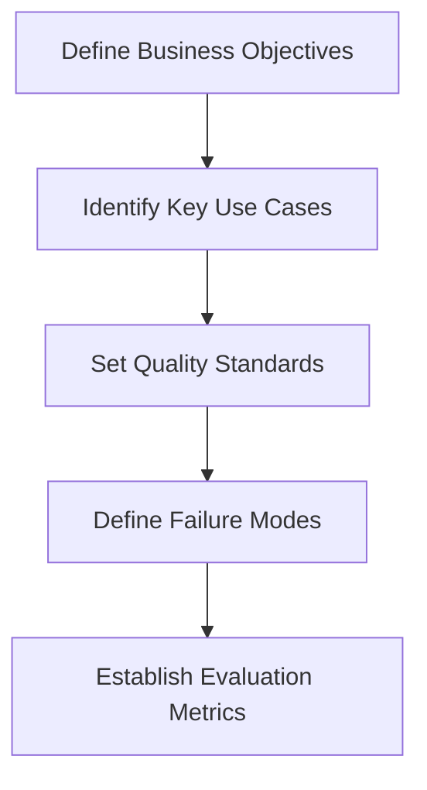
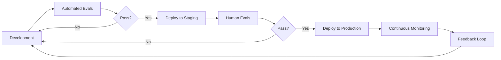
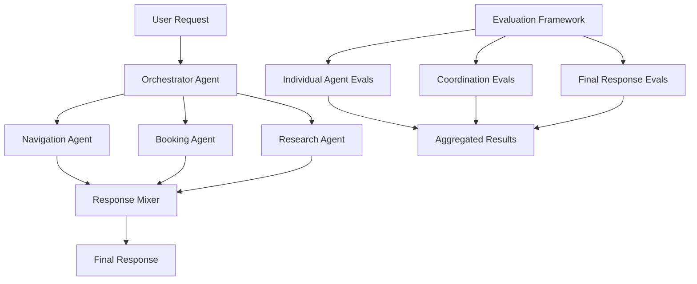

# The Product Manager's Guide to AI Evaluations: Ensuring Reliability and Consistency

## Introduction: Why Evals Matter in the AI Product Lifecycle

While mastering prompt engineering and understanding model nuances are important skills for today's AI Product Managers, getting an AI-powered product to production hinges on one crucial capability: **writing effective evaluations** (evals).

Evals are how you measure the quality and effectiveness of your AI system. They act like regression tests or benchmarks, clearly defining what "good" actually looks like for your AI product beyond the kind of simple latency or pass/fail checks you'd usually use for software.

As a Product Manager building with generative AI, you may be focused on crafting better prompts and exploring the latest LLMs, but evaluations are the hidden lever behind every exceptional AI product. They're the only way to break down each step in the system and measure specifically what impact an individual change might have, giving you the data and confidence to take the right next step.

In this guide, we'll explore how Product Managers can implement effective evaluation frameworks to ensure reliability and consistency in AI-powered applications, drawing insights from industry experts and real-world case studies.

## Understanding AI Evaluations: The Paradigm Shift

Traditional software testing focuses on deterministic outcomes - given a specific input, does the system produce the expected output? AI evaluations, particularly for Large Language Models (LLMs), require a fundamentally different approach.

LLM evaluations are far from straightforward. It's not just that quality criteria are custom; the approach itself differs from both traditional software testing and predictive machine learning. LLMs produce probabilistic outputs, meaning they may generate different responses for identical inputs.

Evaluating AI systems is less like traditional software testing and more like giving someone a driving test:

1. **Awareness**: Can it correctly interpret signals and react appropriately to changing conditions?
2. **Decision-making**: Does it reliably make the correct choices, even in unpredictable situations?
3. **Safety**: Can it consistently follow directions and arrive safely at the intended destination, without going off the rails?

Just as you wouldn't let someone drive without passing their test, you shouldn't let an AI product launch without passing thoughtful, intentional evals.

## The Three Pillars of AI Evaluation

We can organize AI evaluations into three main categories:

### 1. Assessing Agent Capabilities

This pillar focuses on evaluating an agent's core abilities, such as its capacity to understand instructions and reason logically. This typically involves:

- Benchmarking against public standards
- Testing for specific skills like tool-calling, planning, and reasoning
- Evaluating the agent's ability to follow instructions accurately

### 2. Evaluating Trajectory and Tool Use

This pillar analyzes the steps an agent takes to reach a solution, including its choice of tools, strategies, and the efficiency of its approach:

- Tracking the sequence of actions taken (trajectory)
- Comparing trajectories to expected or ideal paths
- Evaluating decision points and tool selection

### 3. Evaluating the Final Response

This pillar assesses the quality, relevance, and correctness of the agent's final output:

- Testing for accuracy and completeness
- Evaluating tone, style, and format
- Comparing outputs to ground truth or expected answers

## Types of Evaluation Methods

Let's explore the different approaches to evaluating AI systems and when to use each:

### Human Evaluations

Human evals involve feedback loops you can design into your product (like thumbs-up/thumbs-down buttons or comment boxes next to LLM responses). You can also have human labelers (subject-matter experts) provide labels and feedback to align the application with human preferences.

**Pros:**
- Directly tied to end-user experience
- Captures nuanced aspects of quality that automated methods might miss
- Essential for evaluating subjective criteria like creativity or tone

**Cons:**
- Sparse feedback (most users don't provide ratings)
- Not a strong signal (what does a thumbs-up or -down really mean?)
- Costly when using professional human labelers

**Best for:** Subjective quality assessments, creative content evaluation, and final validation of critical features.

### Code-Based Evaluations

These evaluations utilize checks on API calls or code generation (e.g., testing if generated code runs correctly).

**Pros:**
- Cheap and fast to implement
- Objective pass/fail criteria
- Easy to automate

**Cons:**
- Limited signal for non-code generation tasks
- May not capture nuanced issues
- Not suitable for evaluating natural language responses

**Best for:** Code generation features, API usage validation, and structured data outputs.

### LLM-Based Evaluations (LLM-as-Judge)

Most LLM evaluation metrics nowadays are LLM-Evals, which means using LLMs to evaluate LLM outputs. Although LLMs have superior reasoning capabilities that makes them great candidates for evaluating LLM outputs, they can be unreliable at times and must be carefully prompt engineered to provide a reliable score.

**Pros:**
- Scalable and cost-effective compared to human evaluation
- Can provide detailed feedback through natural language
- Adaptable to various evaluation criteria

**Cons:**
- May perpetuate biases of the evaluating LLM
- Requires careful prompt engineering
- Not always consistent or reliable

**Best for:** Screening large volumes of outputs, providing initial quality assessments, and identifying obvious issues.

## Implementing an Evaluation Framework: The PM's Roadmap

As a Product Manager, here's a step-by-step approach to building an effective evaluation framework:

### 1. Define Success Criteria

Start by clearly defining what "good" looks like for your AI application:
- What specific tasks should it perform?
- What quality standards must it meet?
- What failure modes are unacceptable?



### 2. Build Comprehensive Test Sets

The foundation of a robust evaluation framework is a comprehensive set of test inputs. These test inputs do a lot of heavy lifting: ideally, they will represent the diversity of real-world scenarios your application will encounter.

When building test sets:
- Include edge cases and common failure modes
- Ensure diversity of inputs that reflect real-world usage
- Consider using synthetic data generation to expand coverage
- Categorize test cases to identify specific areas of strength or weakness

### 3. Implement a Tiered Evaluation Approach

The cost of Level 3 > Level 2 > Level 1. This dictates the cadence and manner you execute them. For example, I often run Level 1 evals on every code change, Level 2 on a set cadence and Level 3 only after significant product changes.

A tiered approach allows for efficient use of resources:

**Level 1 (Basic/Automated):**
- Run on every code change or prompt modification
- Focus on critical functionality and obvious failure modes
- Use automated metrics and LLM-as-judge evaluations

**Level 2 (Comprehensive):**
- Run on a regular cadence (weekly or bi-weekly)
- Test trajectory/reasoning as well as outputs
- Include a broader range of test cases

**Level 3 (Deep/Human):**
- Run before major releases or significant changes
- Include human evaluation by experts
- Test holistic system performance and edge cases

### 4. Set Up Continuous Evaluation Pipelines

Running continuous evaluation cycles is vital. Regular check-ins on your model's performance help catch issues early on. This ongoing process keeps your LLM sharp and ready to adapt.

Integrate evaluations into your development workflow:
- Automate evaluation runs as part of CI/CD pipelines
- Set up dashboards to track key metrics over time
- Establish alert thresholds for performance degradation



### 5. Implement Specialized Evaluation for Agents

For more complex AI agents that use tools and perform multi-step tasks:

**Trajectory Evaluation:**
- Exact match: Does the agent follow the exact expected path?
- In-order match: Does the agent complete the core steps in the correct order?
- Any-order match: Does the agent complete all necessary actions in any order?
- Precision: How many of the tool calls are relevant/correct?
- Recall: How many essential tool calls were captured?

**Tool Use Evaluation:**
- Appropriate tool selection
- Correct tool parameter formatting
- Effective use of tool outputs

## Case Study: Implementing Evals for an AI Travel Agent

Let's consider a practical example of implementing evals for an AI travel agent that helps users plan trips.

### Business Requirements:
- The agent should understand travel preferences
- It should suggest appropriate destinations and accommodations
- It should handle complex multi-leg itineraries
- It should provide accurate pricing information

### Evaluation Framework:

**Level 1 (Automated Checks):**
- Input classification accuracy (destination requests, budget constraints, etc.)
- Valid API calls to travel services
- Response format validation
- Basic safety checks (no inappropriate suggestions)

**Level 2 (Comprehensive Testing):**
- Trajectory analysis (did it search for flights before suggesting hotels?)
- Tool usage evaluation (did it use the right APIs with correct parameters?)
- Response quality assessment (coherence, completeness, helpfulness)
- Edge case handling (ambiguous requests, complex constraints)

**Level 3 (Human Evaluation):**
- Expert review of complex itineraries
- Comparison with human travel agent recommendations
- Subjective quality assessment of personalization
- Review of documentation and explanations provided

**Continuous Monitoring:**
- User satisfaction metrics
- Error rates by category
- Performance on new types of requests
- A/B testing of improvements

## Advanced Topics: Evaluating Multi-Agent Systems

As AI systems become more complex, evaluating multi-agent architectures presents additional challenges. According to the "Agents Companion" document:

Multi-agent evaluation metrics should include:

1. **Cooperation and Coordination**: How well do agents work together to achieve common goals?
2. **Planning and Task Assignment**: Was the right plan created and followed? Did child agents deviate from the main plan?
3. **Agent Utilization**: How effectively do agents select and use other agents?
4. **Scalability**: Does system quality improve with more agents? Is latency affected?



## Building an LLM-as-Judge System

One of the most scalable approaches to AI evaluation is using an LLM to evaluate the outputs of another LLM. Here's how to implement an effective LLM-as-Judge system:

### The Eval Formula

Each great LLM eval contains four distinct parts:

1. **Setting the role**: Provide the judge-LLM a clear role (e.g., "You are an expert evaluator of travel recommendations")

2. **Providing the context**: Include the user query, system response, and any relevant metadata

3. **Providing the goal**: Clearly articulate what to measure (e.g., accuracy, helpfulness, safety)

4. **Defining the terminology and label**: Specify exactly what constitutes success or failure

Example prompt template for an LLM-judge:

```
You are an expert evaluator of travel recommendations.

USER QUERY: {{user_query}}
AI RESPONSE: {{ai_response}}

Your task is to evaluate whether the AI response correctly understood the user's destination preferences and provided relevant suggestions.

Rate the response on a scale of 1-5 where:
1 = Completely missed the user's destination preferences
3 = Partially addressed the destination preferences but missed key details
5 = Fully understood and provided highly relevant destination suggestions

Provide your rating and a brief explanation of your reasoning.
```

## Practical Tools for AI Evaluation

Several tools can help Product Managers implement effective evaluation frameworks:

When it comes to testing the performance of entire LLM-based applications, frameworks like LangSmith (from LangChain) support logging, tracing, and evaluating application-specific LLM behaviors, offering tools to fine-tune and assess model performance in production settings. Langfuse provides a platform for tracking LLM application responses, analyzing model behavior, and generating synthetic datasets for better evaluation.

Other notable tools include:

- **TruLens**: Open-source framework focusing on transparency and interpretability
- **Vertex AI Evaluation Service**: Google's integrated evaluation tools
- **DeepEval**: Open-source library offering various evaluation metrics
- **Weights & Biases**: Provides experiment tracking and visualization for evals

## Common Pitfalls and How to Avoid Them

As you implement your evaluation framework, watch out for these common pitfalls:

1. **Overreliance on automated metrics**: Balance automated evaluations with human judgment for crucial features.

2. **Test data that doesn't reflect reality**: Continuously update test sets based on real user interactions.

3. **Neglecting to test the whole system**: Evaluate not just individual components but end-to-end workflows.

4. **Focusing only on accuracy**: Consider factors like response time, resource usage, and user experience.

5. **Not accounting for LLM non-determinism**: Run multiple evaluation iterations to account for output variation.

6. **Evaluation data leakage**: Ensure your evaluation data wasn't part of the LLM's training data.

## Conclusion: The Strategic Advantage of Strong Evals

For Product Managers building AI-powered applications, mastering the art and science of evaluations provides a strategic advantage. Effective evals allow you to:

1. **De-risk product launches** by identifying issues before they reach users
2. **Accelerate innovation** through confident, data-driven improvements
3. **Build stakeholder trust** with transparent performance metrics
4. **Guide engineering efforts** to focus on the most impactful improvements
5. **Create sustainable competitive advantage** through systematic quality improvements

In the rapidly evolving AI landscape, evaluation frameworks are often the determining factor between products that merely survive and those that thrive. By investing in robust evaluations, you're not just testing your product—you're building the foundation for its continuous improvement and long-term success.

As the field continues to evolve, we can expect even more sophisticated evaluation techniques to emerge. The Product Managers who master these approaches will be best positioned to deliver AI products that consistently delight users and deliver business value.

## Further Resources

For Product Managers looking to deepen their knowledge of AI evaluations:

1. [Evidently AI's LLM Evaluation Guide](https://www.evidentlyai.com/llm-guide/llm-evaluation) - Comprehensive overview of evaluation approaches
2. [Arize AI's Blog on Evals](https://arize.com/blog-category/llm/) - Practical insights from industry practitioners
3. [Weights & Biases LLM Evaluations Guide](https://wandb.ai/onlineinference/genai-research/reports/LLM-evaluations-Metrics-frameworks-and-best-practices--VmlldzoxMTMxNjQ4NA) - Metrics, frameworks, and best practices
4. [Lenny's Newsletter: Beyond Vibe Checks - A PM's Guide to Evals](https://www.lennysnewsletter.com/p/beyond-vibe-checks-a-pms-complete) - Product management perspective on AI evaluations

*This article was last updated on April 17, 2025.*
