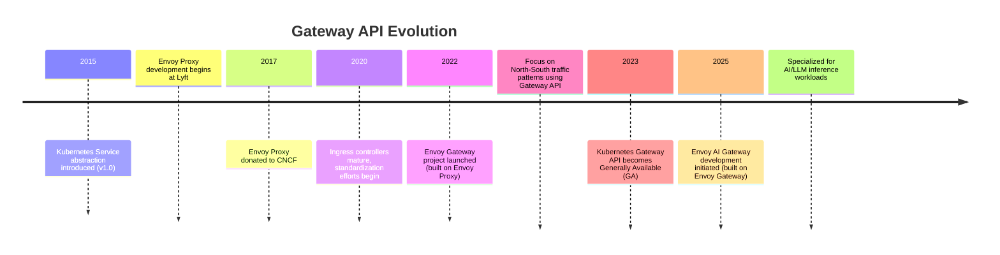
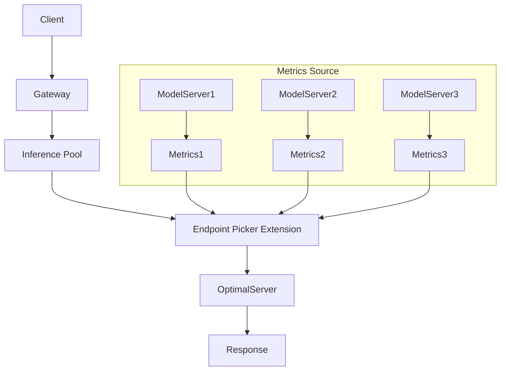
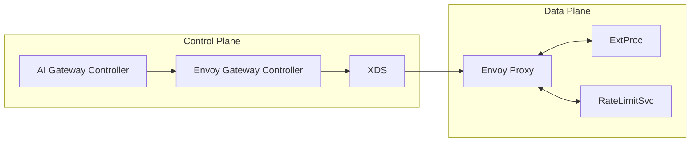
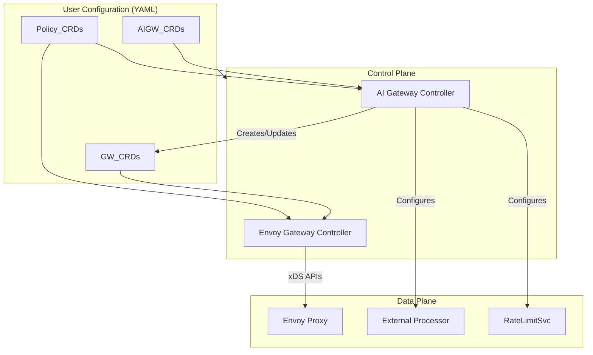
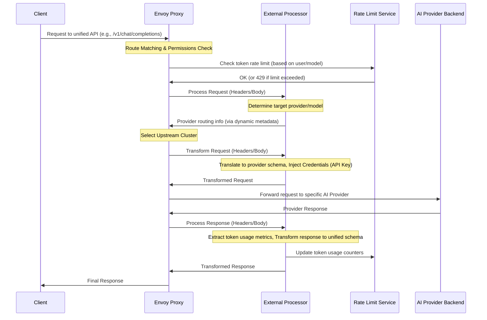
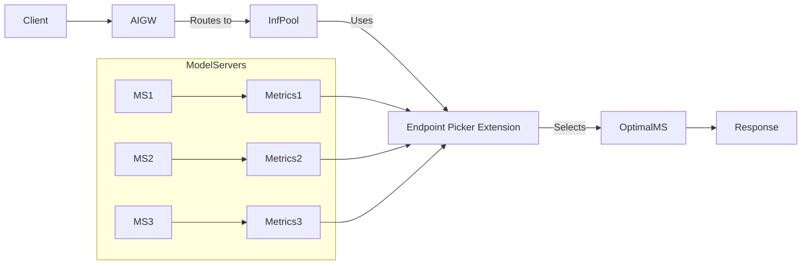
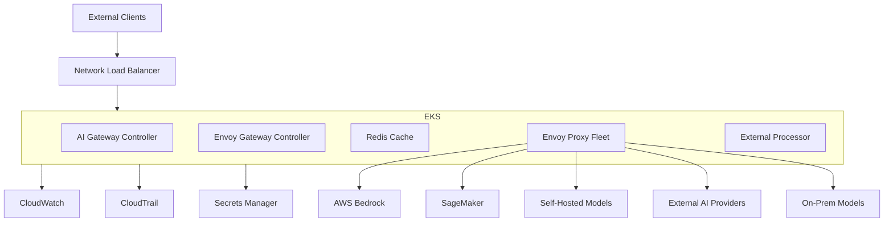

# Bridging the Gap: Managing Enterprise AI Workloads with the Envoy AI Gateway

## **Introduction: The New Frontier of Enterprise Infrastructure**

Artificial intelligence (AI) inference services are rapidly transitioning from experimental projects to fundamental components of enterprise architecture, joining the ranks of compute, storage, databases, and networking. As organizations increasingly rely on AI models to power applications, drive insights, and maintain a competitive edge, a new set of challenges emerges.
* How can enterprises efficiently manage access to the burgeoning ecosystem of AI models—now numbering over 400,000 across diverse platforms and hosting providers? 
* How can they ensure security, maintain governance, enforce cost controls, and navigate the internal friction between product teams demanding rapid access and central IT/security teams requiring oversight? 

This post explores how the Envoy AI Gateway, an open-source project built upon the foundations of the Kubernetes Gateway API and the battle-tested Envoy proxy, provides a solution to these critical challenges.

## The AI Integration Challenge: Navigating Complexity and Risk

The integration of AI into enterprise workflows is not merely a technical task; it's a strategic imperative fraught with complexity. The current landscape presents significant hurdles for organizations seeking to leverage AI effectively and responsibly:

* **Model Proliferation and Diversity:** With hundreds of thousands of models available from numerous providers (OpenAI, AWS Bedrock, Google Gemini, Azure OpenAI, self-hosted models, etc.), managing access and ensuring compatibility becomes a major undertaking. No single model is likely to dominate, mirroring the database ecosystem, necessitating flexibility.
* **Fragmented Adoption and Governance:** Often, AI adoption happens in silos across different departments (marketing, HR, customer service), each selecting preferred vendors and implementing inconsistent security controls, leading to a fragmented and difficult-to-manage integration landscape. This fragmentation complicates governance, especially with varying regional regulations (like those in Asia/Pacific) and the need for consistent security and compliance. Siloed approaches treat governance and security as separate disciplines, increasing risks.
* **Security and Compliance Risks:** Ungoverned AI usage exposes organizations to significant risks, including data breaches, non-compliance with evolving regulations (like AI Bills of Materials), potential leakage of sensitive data (PII) through prompts or model training, and the generation of biased or harmful content. Poor data quality and lack of oversight further exacerbate these risks, potentially leading to inaccurate AI conclusions and vulnerabilities. Gartner predicts that by 2025, 30% of generative AI projects may fail due to inadequate data quality and risk controls.
* **Cost Management:** AI models, particularly LLMs, often operate on token-based pricing models. Without centralized control and observability, costs can escalate rapidly and unpredictably. Managing consumption across different providers and teams requires specialized mechanisms beyond traditional request-based rate limiting.
* **Operational Complexity:** Integrating, monitoring, and managing AI services requires specialized skills and tooling. Manual processes for governance and security are often reactive and struggle to keep pace with the rapid evolution of AI threats and regulations. Data engineers report governance as a highly time-consuming task, and architects cite privacy/security as major risks.

The gateway pattern, a proven solution for managing complexity in traditional application networking, is emerging as the logical approach to tame the challenges of AI integration. An AI-specific gateway can provide the necessary unified control plane for routing, security, observability, and policy enforcement across diverse AI services.

## The Evolution of Gateway Architecture: Paving the Way for AI

Understanding the Envoy AI Gateway requires context on how gateway patterns have evolved within the Kubernetes ecosystem. This evolution reflects a continuous drive towards more powerful, flexible, and standardized ways to manage traffic into and within clusters.

Initially, Kubernetes relied on the Service object for basic load balancing. As needs grew more complex, Ingress controllers emerged, offering L7 routing capabilities but suffering from implementation inconsistencies and limited expressiveness.

The **Kubernetes Gateway API** represents the next major step. It provides a more expressive, role-oriented, and portable standard for managing ingress and egress traffic. Key characteristics include:

* **Role-Oriented CRDs:** It defines distinct Custom Resource Definitions (CRDs) like GatewayClass (for infrastructure providers), Gateway (for cluster operators), and HTTPRoute/GRPCRoute/etc. (for application developers), enabling better separation of concerns.
* **Declarative Configuration:** It offers a standardized, declarative way to configure load balancers, routing rules, and policies.
* **Extensibility:** Designed to be extensible, allowing implementations to add specialized features.

**Envoy Gateway**, launched in 2022 and built upon the high-performance Envoy proxy, is a key implementation of the Gateway API. It simplifies the notoriously complex configuration of Envoy, making it easier to use as a Kubernetes ingress gateway for standard North-South traffic management. Tetrate is a leading contributor to both the Envoy and Envoy Gateway projects. The maturity and standardization provided by the Gateway API and its implementations like Envoy Gateway created the perfect foundation upon which AI-specific extensions could be built.

## Extending the Gateway API for AI Workloads

The Envoy AI Gateway leverages the solid foundation of the Gateway API and Envoy Gateway, extending them with features specifically designed for the unique demands of AI inference workloads. This involves introducing new concepts and resources tailored to managing AI models and their traffic.

### New Custom Resource Definitions (CRDs) for AI

While the core Gateway API defines resources for general traffic routing, managing AI models requires more specialized constructs. Implementations targeting AI, including Envoy AI Gateway's support for the Gateway API Inference Extension, introduce CRDs like:

1. **InferenceModel CRD:** This resource allows AI engineers or application developers to define logical model inference endpoints. It typically specifies details like the model's name (often following conventions like the OpenAI API) and potentially model-specific properties such as its criticality (e.g., latency-critical vs. sheddable).
2. **InferencePool CRD:** This resource represents a group of backend pods (model servers) capable of serving one or more InferenceModels. It often bundles multiple backend services (like Envoy AI Gateway's AIServiceBackend or standard Kubernetes Services) and defines how traffic should be intelligently load-balanced across them, potentially using an "Endpoint Picker" extension.

These AI-specific CRDs work alongside standard Gateway API resources (Gateway, HTTPRoute) to route external requests to the appropriate AI models, whether hosted externally or internally within the cluster.

### Specialized Routing for Optimal Inference

Traditional load balancing (round-robin, least connections) often falls short for AI inference workloads, which can be long-running, stateful (due to caches like KV-cache), and resource-intensive (GPU-bound). AI Gateways, particularly when managing self-hosted models via extensions like the Gateway API Inference Extension, introduce more sophisticated routing mechanisms:

* **Endpoint Picker Mechanism:** Instead of simple load balancing, routes targeting an InferencePool utilize an Endpoint Picker extension. This component actively monitors real-time metrics from the underlying model servers.
* **Inference-Aware Metrics:** Key metrics tracked include Key-Value (KV) cache utilization, the length of pending request queues, and the status of loaded Low-Rank Adaptation (LoRA) adapters on each server.
* **Intelligent Routing Decisions:** The Endpoint Picker uses these metrics, along with request characteristics (like model name and criticality), to route incoming inference requests to the most suitable model server replica. This aims to optimize resource utilization (especially expensive GPUs), minimize queueing delays, and improve overall throughput for self-hosted models. Projects like Google's GKE Inference Gateway, Kgateway, and potentially Istio are implementing or exploring these advanced routing capabilities based on the Inference Extension.

## Envoy AI Gateway: A Technical Deep Dive

The Envoy AI Gateway is specifically engineered to address the unique challenges of managing AI inference traffic, building directly upon the proven Envoy Gateway framework.

### Foundation and Evolution

The core data plane is **Envoy Proxy**, a high-performance, C++-based proxy originally developed at Lyft starting in 2015 and donated to the Cloud Native Computing Foundation (CNCF) in 2017. It's known for its efficiency, extensibility, and battle-tested reliability in large-scale environments.

Recognizing the complexity of configuring Envoy directly, **Envoy Gateway** was created (with Tetrate as a leading contributor) as a control plane to simplify Envoy's use as a Kubernetes Gateway API implementation, particularly for North-South (ingress/egress) traffic. It wraps the Envoy data plane with a management layer that translates Gateway API resources into Envoy configurations.

**Envoy AI Gateway** extends Envoy Gateway further, adding capabilities specifically for AI/LLM inference workloads. These workloads differ significantly from standard API requests due to factors like:

* Token-based pricing and usage models.
* Unique metrics requirements (e.g., token counts, KV-cache).
* Specialized routing needs (e.g., model-aware, metric-based).
* Distinct security considerations (prompt injection, data leakage).

### Key Components

The Envoy AI Gateway architecture maintains a clear separation between the control plane (configuration and management) and the data plane (request processing).

* Data Plane:
    * **Envoy Proxy:** The core C++ proxy handling traffic flow.
    * **External Processor (ExtProc):** A crucial component, typically implemented as an external gRPC service, that Envoy calls out to via the ext_proc filter. It handles AI-specific logic like request/response transformations (e.g., adapting to different provider schemas), injecting credentials (like API keys), and extracting custom metrics (like token counts). This delegation keeps complex, potentially language-specific logic out of the core Envoy proxy.
    * **Rate Limit Service:** An external service (often Redis-backed) used by Envoy for global rate limiting. Envoy AI Gateway configures this service to perform token-based rate limiting, tracking usage against configured limits.
* **Control Plane:**
    * **Envoy Gateway Controller:** The standard Envoy Gateway control plane responsible for translating Gateway API resources (like Gateway, HTTPRoute) into Envoy configuration via the xDS APIs and managing core proxy functions like service discovery and TLS.
    * **AI Gateway Controller:** Manages the AI-specific aspects. It watches AI Gateway CRDs, configures the External Processor, sets up token-based rate limiting policies, and creates/updates the necessary Envoy Gateway resources (like EnvoyExtensionPolicy, HTTPRoute) to integrate the AI features.

### Custom Resources (CRDs)

Envoy AI Gateway introduces its own set of CRDs to manage AI-specific configurations, allowing different personas to manage relevant aspects of the AI gateway:

1. **AIGatewayRoute (Application Developer):** Defines a unified AI API endpoint on a specific Gateway. It allows clients to interact with potentially multiple underlying AI backends using a single, consistent schema (initially OpenAI-compatible). It specifies routing rules and references backend services or inference pools. It also includes configuration for tracking token costs (llmRequestCosts).
2. **AIServiceBackend (Inference Platform Owner):** Represents a single backend AI service (e.g., a specific OpenAI deployment, an AWS Bedrock endpoint, or a self-hosted model server). It defines the connection details and the schema the backend expects.
3. **BackendSecurityPolicy (Inference Platform Owner):** Configures authentication and authorization for accessing backend AI services. It holds references to secrets containing API keys or other credentials needed to communicate with the upstream provider.

These CRDs are distinct from the standard Gateway API CRDs (GatewayClass, Gateway, HTTPRoute, etc.) and the Inference Extension CRDs (InferenceModel, InferencePool). When the AI Gateway controller processes its CRDs, it translates them into configurations that the standard Envoy Gateway controller understands, such as HTTPRoute resources, EnvoyExtensionPolicy resources (to configure filters like ext_proc), and potentially deployments for the External Processor service itself. This layering allows AI-specific concerns to be managed separately while leveraging the core Gateway API framework.

### Configuration Flow

The system maintains a clear separation of concerns between the two controllers:

1. **Users** (Application Developers, Platform Owners) define configurations using AI Gateway CRDs, standard Gateway API CRDs, and policy CRDs.
2. The **AI Gateway Controller** watches its specific CRDs (AIGatewayRoute, BackendSecurityPolicy, etc.). When changes occur, it processes them and:
    * Configures the External Processor (ExtProc) service.
    * Configures the Rate Limit Service with token-based rules derived from BackendTrafficPolicy and AIGatewayRoute.
    * Creates or updates standard Gateway API resources (like HTTPRoute) and Envoy Gateway extensions (like EnvoyExtensionPolicy) to reflect the desired AI routing and processing logic.
3. The **Envoy Gateway Controller** watches standard Gateway API resources (Gateway, HTTPRoute) and policy resources (BackendTrafficPolicy, etc.). It translates these into low-level Envoy proxy configuration.
4. The Envoy Gateway Controller pushes the final configuration to the **Envoy Proxy** instances in the data plane via the xDS APIs.

This ensures the AI Gateway Controller focuses purely on AI concerns, while the Envoy Gateway Controller handles the core proxy management.

### Request Flow Through the Data Plane

A typical request lifecycle showcases the interaction between the data plane components:

**Request Path (Ingress):**

1. A client sends a request to the unified API endpoint exposed by the Envoy AI Gateway (e.g., using an OpenAI-compatible schema).
2. Envoy Proxy receives the request, matches it to an AIGatewayRoute or HTTPRoute, and performs initial permission checks.
3. Envoy checks with the **Rate Limit Service** to verify if the request (considering anticipated token usage or pre-defined costs) is within the configured token limits for the specific user and target model. If the limit is exceeded, Envoy returns a 429 (Too Many Requests) error.
4. If allowed, the request is passed to the **External Processor (ExtProc)** via the ext_proc filter.
5. ExtProc determines the appropriate upstream AI provider/model based on request headers (like x-ai-eg-model) or payload content.
6. ExtProc transforms the request from the unified API schema to the specific format required by the target upstream provider.
7. ExtProc securely injects the necessary credentials (e.g., API keys fetched based on BackendSecurityPolicy) into the request headers.
8. The transformed request (with credentials) is returned to Envoy.
9. Envoy Proxy forwards the request to the selected AI Provider Backend (e.g., AWS Bedrock, OpenAI API, self-hosted model).

**Response Path (Egress):**

1. The AI Provider sends the response back to Envoy Proxy.
2. Envoy passes the response to the **External Processor (ExtProc)**.
3. ExtProc transforms the response back from the provider-specific schema to the unified API schema expected by the client.
4. Crucially, ExtProc extracts token usage metrics (input tokens, output tokens, total tokens) from the response payload or headers.
5. ExtProc communicates these extracted token counts to the **Rate Limit Service** to update the usage counters for the corresponding user/model combination. This ensures the rate limiter has accurate, up-to-date usage information for subsequent requests.
6. The transformed response is returned to Envoy.
7. Envoy Proxy sends the final response back to the client.

This flow demonstrates how the ExtProc acts as the central hub for AI-specific logic, enabling transformations, credential management, and the critical feedback loop for token-based rate limiting, all orchestrated by the Envoy proxy data plane.

## Advanced Routing with the Gateway API Inference Extension

For organizations running their own AI models within their infrastructure (e.g., on Kubernetes), optimizing performance and resource utilization is paramount, especially given the high cost of accelerators like GPUs. Envoy AI Gateway supports the **Gateway API Inference Extension**, enabling sophisticated, metrics-driven load balancing for these self-hosted models.

When leveraging the Inference Extension (which needs to be explicitly enabled via Helm flag --set controller.enableInferenceExtension=true), the AIGatewayRoute can be configured to target an InferencePool resource instead of a standard AIServiceBackend.

* **InferencePool:** This CRD groups multiple backend model server instances (which could be represented by AIServiceBackend resources selected via labels) that can serve a common set of models.
* **Endpoint Picker Extension:** Associated with the InferencePool, this extension actively monitors key performance and state metrics from each model server instance within the pool.
* **Key Metrics:** The picker tracks critical inference-specific metrics such as:
    * **KV-cache Utilization:** Indicates how much memory is used for caching prompt tokens, impacting performance for subsequent related requests.
    * **Queue Length:** The number of pending requests waiting to be processed by the model server, indicating current load.
    * **Active LoRA Adapters:** Tracks which fine-tuned LoRA adapters are currently loaded into memory on each instance, crucial for efficient routing of requests requiring specific adapters.
* **Intelligent Load Balancing:** Based on these real-time metrics and the incoming request's requirements (model name, criticality, required LoRA adapter), the endpoint picker intelligently selects the *optimal* model server replica to handle the request. This goes far beyond simple round-robin, aiming to minimize latency, maximize GPU utilization, and ensure requests needing specific adapters are routed efficiently. For example, critical requests might be prioritized to servers with low queue lengths and the required LoRA adapter already loaded, while less critical ("sheddable") requests might be routed to servers with lower KV-cache utilization or potentially dropped if capacity is constrained.

This advanced routing capability, enabled by the Inference Extension support in Envoy AI Gateway, is crucial for efficiently managing self-hosted AI models at scale within Kubernetes. Implementations leveraging this extension are emerging in platforms like Google Kubernetes Engine (GKE), Kgateway, and potentially others.

## AI Gateway vs. Traditional API Gateway: Understanding the Distinction

While both AI Gateways and traditional API Gateways act as intermediaries managing API traffic, AI Gateways offer specialized features crucial for the unique demands of AI and LLM workloads. Understanding these differences is key to selecting the right tool.

<table>
  <tr>
   <td><strong>Feature</strong>
   </td>
   <td><strong>Traditional API Gateway</strong>
   </td>
   <td><strong>AI Gateway (e.g., Envoy AI Gateway)</strong>
   </td>
   <td><strong>Why it Matters for AI</strong>
   </td>
  </tr>
  <tr>
   <td><strong>Primary Focus</strong>
   </td>
   <td>General API traffic management (REST, gRPC, etc.)
   </td>
   <td>Managing interactions with AI/LLM services (internal & external)
   </td>
   <td>AI has unique traffic patterns, pricing models, and security needs.
   </td>
  </tr>
  <tr>
   <td><strong>Rate Limiting</strong>
   </td>
   <td>Typically request-count based
   </td>
   <td><strong>Token-based</strong> (input, output, total tokens), cost-aware
   </td>
   <td>Aligns with LLM pricing models, enables fine-grained cost control.
   </td>
  </tr>
  <tr>
   <td><strong>Observability</strong>
   </td>
   <td>Request/response logs, latency, error rates
   </td>
   <td><strong>Token usage tracking</strong>, quotas, AI-specific metrics (e.g., RAG insights, model performance)
   </td>
   <td>Essential for monitoring AI costs, performance, and compliance.
   </td>
  </tr>
  <tr>
   <td><strong>Request/Response Handling</strong>
   </td>
   <td>Basic transformations, header manipulation
   </td>
   <td><strong>Prompt enrichment/templating</strong>, complex schema transformations, <strong>PII scrubbing</strong>, content moderation
   </td>
   <td>Enhances prompt quality, ensures consistency, adapts to diverse provider APIs, improves security/compliance.
   </td>
  </tr>
  <tr>
   <td><strong>Routing</strong>
   </td>
   <td>Path, header, method-based routing, basic load balancing
   </td>
   <td><strong>Model-aware routing</strong>, <strong>inference-metric-based routing</strong> (KV-cache, queue, LoRA), model failover
   </td>
   <td>Optimizes performance for stateful AI models, improves resource utilization, ensures high availability.
   </td>
  </tr>
  <tr>
   <td><strong>Caching</strong>
   </td>
   <td>Standard HTTP caching
   </td>
   <td><strong>Semantic caching</strong> (potential feature)
   </td>
   <td>Reduces redundant LLM calls for similar queries, lowering costs and latency.
   </td>
  </tr>
  <tr>
   <td><strong>Security</strong>
   </td>
   <td>AuthN/AuthZ (OAuth, JWT, API Keys), WAF
   </td>
   <td>Above + <strong>Prompt injection prevention</strong>, <strong>hallucination mitigation</strong>, AI-specific data leakage protection
   </td>
   <td>Addresses unique threat vectors associated with generative AI.
   </td>
  </tr>
  <tr>
   <td><strong>Credential Management</strong>
   </td>
   <td>Often requires client-side key handling
   </td>
   <td>Centralized upstream credential management (gateway handles provider keys)
   </td>
   <td>Simplifies developer workflow, improves security posture by reducing key sprawl.
   </td>
  </tr>
  <tr>
   <td><strong>API Abstraction</strong>
   </td>
   <td>Exposes backend APIs
   </td>
   <td>Provides a <strong>unified/canonical API</strong> for diverse backend AI providers
   </td>
   <td>Simplifies client development, reduces vendor lock-in.
   </td>
  </tr>
</table>

In essence, while a traditional API Gateway manages the *connection* to services, an AI Gateway manages the *interaction* with AI services, providing deeper control, visibility, and optimization tailored to the nuances of AI workloads. The Envoy AI Gateway specifically focuses on providing these AI-centric capabilities on top of the robust Envoy and Gateway API foundation.

## Deploying Envoy AI Gateway on AWS

Amazon Web Services (AWS) provides a mature ecosystem for deploying containerized applications and AI services, making it a common target environment for Envoy AI Gateway. A typical deployment leverages several key AWS services:

* **Compute:** Amazon Elastic Kubernetes Service (EKS) is the recommended platform for hosting the Envoy AI Gateway components.
    * The Envoy proxies themselves are typically CPU-bound. Therefore, running the Envoy data plane pods on **compute-optimized EC2 instances** within EKS managed node groups is often recommended for best performance.
    * EKS facilitates **Horizontal Pod Autoscaling (HPA)** for the Envoy proxy fleet and potentially the External Processor, allowing the data plane to scale based on traffic load.
* **Networking:** An **AWS Network Load Balancer (NLB)** or Application Load Balancer (ALB) typically serves as the entry point, distributing incoming traffic across the Envoy proxy fleet running within the EKS cluster. Security groups need to be configured correctly to allow traffic flow.
* **Installation:** Deployment typically involves using kubectl and helm to install Envoy Gateway and then Envoy AI Gateway onto the EKS cluster, applying the necessary configurations (CRDs, Gateway, AIGatewayRoute, etc.). AWS credentials for accessing services like Bedrock need to be securely configured, potentially using Kubernetes secrets or integrating with AWS Secrets Manager.
* **AI Backends:** The gateway can route requests to various AWS and external AI services:
    * **Amazon Bedrock:** Native integration is a key feature, allowing access to Bedrock's curated foundation models via the gateway. Configuration involves providing AWS credentials with appropriate Bedrock permissions.
    * **Amazon SageMaker:** The gateway can route traffic to custom models deployed on SageMaker endpoints, providing a unified access point for both pre-trained and custom models.
    * **Self-hosted Models:** Models hosted directly on EKS pods, potentially utilizing specialized AWS instances like those with GPUs, Trainium, or Inferentia accelerators. The advanced routing features of the Inference Extension are particularly relevant here.
    * **External/On-Prem:** The gateway can also proxy requests to external SaaS AI providers (like OpenAI) or models hosted on-premises.
* **Observability & Security:** Integration with AWS monitoring and logging services is crucial.
    * **Amazon CloudWatch:** Used for collecting metrics from Envoy proxies and application logs from gateway components. Custom dashboards can be created to visualize performance.
    * **AWS CloudTrail:** Captures API calls made by the gateway components, providing an audit trail for security and compliance.
    * **AWS WAF & ACM:** Can be used in conjunction with the Load Balancer for web application firewall protection and managed TLS certificates.
* **IAM:** Proper IAM roles and policies following the principle of least privilege are essential for secure operation, especially when using EKS Pod Identities or IAM Roles for Service Accounts (IRSA) to grant permissions to gateway components.

This AWS architecture provides a scalable, resilient, and observable platform for deploying and managing the Envoy AI Gateway, integrating seamlessly with AWS's native AI services and infrastructure components.

## Seamless Integration with Istio Service Mesh

For organizations already utilizing Istio service mesh for managing east-west traffic, security, and observability within their Kubernetes clusters, Envoy AI Gateway offers seamless integration capabilities. This allows enterprises to leverage the advanced AI-specific features of the gateway without disrupting their existing mesh architecture.

Key integration points include:

* **Ingress Gateway Role:** Envoy AI Gateway can function as the **Ingress Gateway** for an Istio service mesh. It handles the incoming traffic from external clients (North-South) and routes it securely to services running within the mesh.
* **Certificate Management:** Istio can be configured to manage all TLS certificates, including those used by the Envoy AI Gateway for terminating external TLS and establishing mutual TLS (mTLS) connections with backend services within the mesh. This centralizes certificate lifecycle management under Istio's control plane.
* **Sidecar Injection:** To participate fully in the mesh, the Envoy Gateway pods (both control plane and data plane proxies created by it) should have the Istio sidecar proxy injected. This is typically achieved by labeling the envoy-gateway-system namespace for Istio injection (istio-injection=enabled). Specific annotations might be needed on the Envoy Gateway's EnvoyProxy resource (traffic.sidecar.istio.io/includeInboundPorts: "") to prevent the sidecar from intercepting the gateway's own inbound listener ports.
* **Leveraging Mesh Features:** Once integrated, traffic flowing through the Envoy AI Gateway and into the mesh benefits from Istio's features like fine-grained traffic control (using VirtualService, DestinationRule), security policies, and detailed telemetry (metrics, distributed tracing, access logs) collected by the sidecars.
* **Unified Management Plane (Optional):** Solutions like Tetrate Service Bridge can manage both Istio and Envoy Gateway deployments, providing a unified platform for multi-cluster networking and policy enforcement across standard applications and AI workloads.

This integration allows organizations to combine the specialized AI traffic management capabilities of Envoy AI Gateway (like token-based rate limiting, unified API access) with the comprehensive service mesh functionalities of Istio, providing a robust end-to-end solution for modern application delivery.

## Community, Contribution, and Adoption: An Open Source Approach

Envoy AI Gateway is fundamentally an open-source project, developed collaboratively within the broader Envoy and CNCF ecosystems.

* **Open Source Foundation:** Built on Envoy Gateway (a CNCF Envoy sub-project) and Envoy Proxy (a CNCF graduated project), Envoy AI Gateway benefits from the robust governance, active communities, and battle-tested nature of its underlying components. It is licensed under the permissive Apache 2.0 license.
* **Community Driven:** The project emphasizes community involvement, with regular public meetings, an active Slack channel (#envoy-ai-gateway within the Envoy workspace), and development occurring openly on GitHub. Contributions (issues, pull requests) are welcomed.
* **Industry Backing & Contributions:** Tetrate has been a major driving force, contributing significantly to both Envoy Gateway and Envoy AI Gateway. Bloomberg played a pivotal role in initiating the project and co-developing the initial v0.1 release, driven by their internal need for a scalable, open-standard AI gateway solution. Other organizations like WSO2, RedHat, and Google have also participated in discussions.
* **Enterprise Needs as Genesis:** The project's origin story is significant. Bloomberg, facing the challenges of integrating AI services at scale, sought an open-source solution to avoid proprietary vendor lock-in and the limitations or costs associated with existing options. They collaborated with Tetrate to build the gateway on open standards (Envoy, Gateway API) specifically to address real-world enterprise requirements like managing multiple providers, controlling costs, ensuring governance, and simplifying developer experience. This grounding in practical enterprise needs enhances the project's credibility and relevance.
* **Real-World Adoption:** Bloomberg is a key early adopter, using Envoy AI Gateway to manage access to on-prem and cloud AI services, enforce usage limits, and provide a consistent API for their engineers building generative AI applications. While specific adoption numbers for the AI Gateway itself are nascent (v0.1 released Feb 2025), the underlying Envoy Gateway project already boasts adopters like Canva, Docker, Tencent Cloud, Rackspace, and others, demonstrating the maturity of the foundation. The project has also been presented at major industry conferences like KubeCon, indicating growing visibility.
* **Roadmap and Future:** The v0.1 release laid the groundwork with unified API (OpenAI, Bedrock), upstream auth, and token limiting. Future plans include integrating more providers (like Google Gemini), implementing provider/model fallback logic, adding prompt templating capabilities, and exploring semantic caching to further optimize cost and performance. The release cycle aims to align with Envoy Gateway, occurring roughly every 2-3 months.

The strong community backing, enterprise-driven requirements, and open-source nature position Envoy AI Gateway as a credible and evolving solution for managing AI workloads.

## Conclusion: A Strategic Imperative for Scalable AI

The proliferation of AI models and services presents both immense opportunities and significant management challenges for enterprises. Fragmented adoption, complex integrations, security risks, unpredictable costs, and governance hurdles can impede the successful scaling of AI initiatives.

The Envoy AI Gateway emerges as a critical component for addressing these challenges head-on. By extending the robust, industry-standard foundations of Envoy Proxy and the Kubernetes Gateway API, it provides a specialized, open-source control plane tailored for AI inference workloads.

Its key value lies in offering:

* **Unified Access:** Simplifying interaction with diverse AI providers (SaaS and self-hosted) through a consistent API.
* **Cost Control:** Implementing granular, token-based rate limiting essential for managing LLM expenditures.
* **Enhanced Security & Governance:** Centralizing credential management, enabling AI-specific policy enforcement, and improving visibility into AI traffic.
* **Optimized Performance:** Leveraging the high performance of Envoy and offering advanced, metrics-driven routing for self-hosted models via the Inference Extension.
* **Ecosystem Integration:** Working seamlessly with platforms like Kubernetes, AWS, and Istio.

Born from the real-world needs of enterprises like Bloomberg and developed collaboratively within the CNCF community with significant contributions from companies like Tetrate, Envoy AI Gateway is not just a theoretical construct but a practical solution designed for scale.

As organizations continue to weave AI deeper into the fabric of their operations, adopting a strategic approach to managing these powerful but complex services becomes paramount. The Envoy AI Gateway provides a compelling, open-source path forward, enabling enterprises to harness the power of AI confidently, securely, and efficiently.

Explore the project further, join the community, and consider how Envoy AI Gateway can help streamline your organization's journey into scalable enterprise AI.
