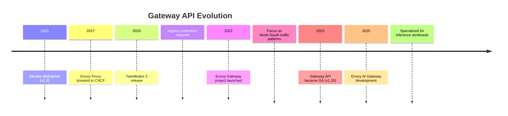
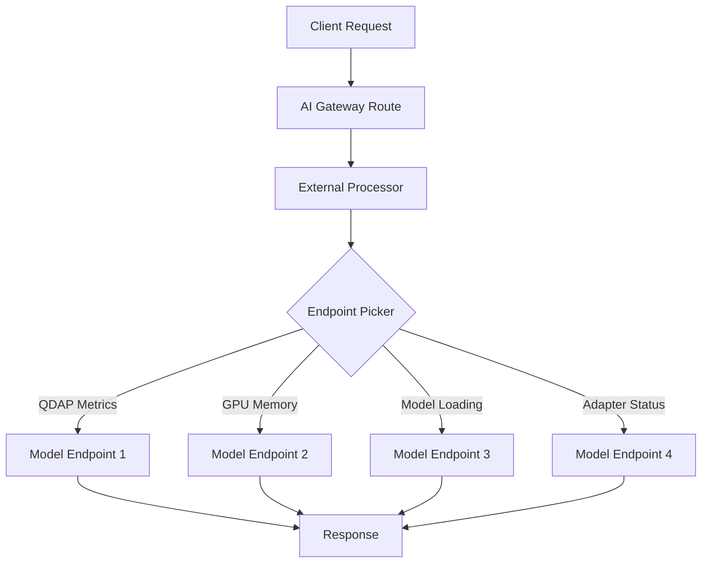
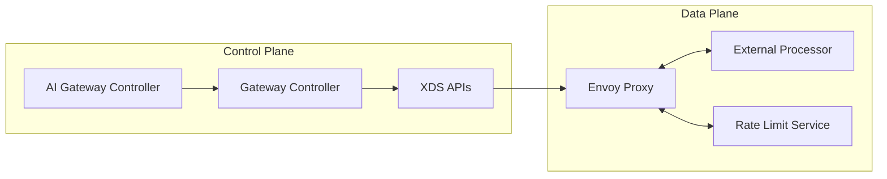
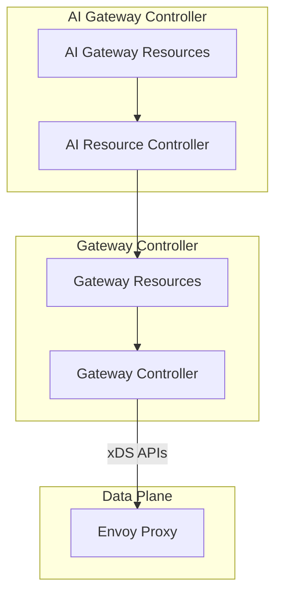
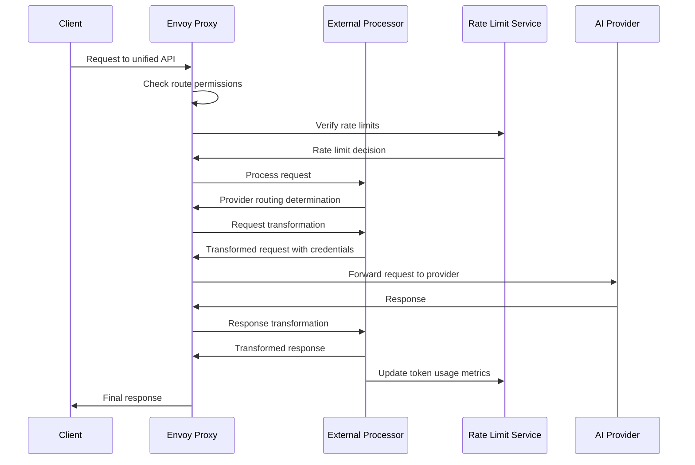
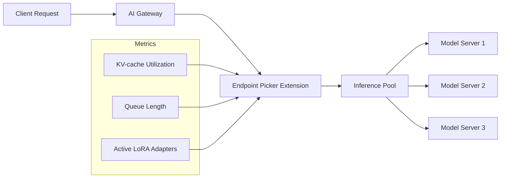
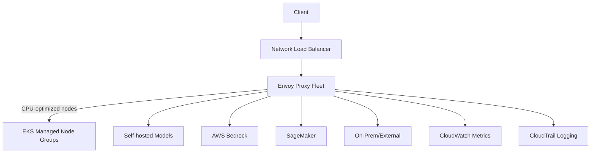

## Introduction

With AI inference services becoming as fundamental to enterprise architecture as compute, storage, databases, and networking, organizations are now grappling with a new challenge: how to efficiently and securely manage access to the growing ecosystem of AI models while maintaining governance and control. In this post, I'll explore how the Envoy AI Gateway builds upon the solid foundation of the Kubernetes Gateway API and Envoy proxy to address these challenges.

## AI Industry Context & Challenges

For many industries, AI inference services have become a critical requirement for staying competitive.

The current landscape presents several challenges:

- Over 400,000 models are now available across various platforms
- Multiple hosting providers
- Organizations face internal friction between product teams seeking model access and security/governance teams requiring control

The gateway pattern, which has solved similar enterprise challenges in the past, is emerging as a solution for AI workloads

For most customers, model choice matters significantly, and no single model will dominate the ecosystem - much like what we've seen with databases. Organizations need flexibility without sacrificing security or governance.

## Evolution of Gateway Architecture

To understand the Envoy AI Gateway, it's helpful to trace the evolution of the gateway pattern in Kubernetes:

The Gateway API has evolved to become more declarative and portable than previous solutions, offering sophisticated L7 routing definition capabilities. This maturation provides the perfect foundation for AI-specific extensions.

## Gateway API for AI Implementation

The AI Gateway implementation extends the Gateway API with features specifically designed for inference workloads:

### New Custom Resource Definitions (CRDs)

Two key CRDs have been introduced to handle AI-specific concerns:

1. **Inference Model CRD** - Manages model resources
2. **Inference Pool CRD** - Handles resource allocation

### Specialized Routing Capabilities

The AI Gateway introduces advanced routing mechanisms:

- Endpoint picker mechanism using metrics like QDAP and GPU memory
- Intelligent routing based on model loading status
- Adapter-aware routing decisions
- Projects like K Gateway and Envoy Gateway now implementing these features

## Envoy AI Gateway Technical Details

### Foundation and Evolution

The Envoy AI Gateway is built on the solid foundation of Envoy proxy, a high-performance proxy written in C++ that started in 2015 and was donated to the CNCF in 2017. It's battle-tested and runs in some of the world's largest environments.

Tetrate saw a need for easier management of Envoy as a gateway solution and built Envoy Gateway on top of Envoy proxy. This wraps the Envoy proxy data plane in a simplified management and configuration layer, making it easier to configure Envoy for North-South traffic.

Envoy AI Gateway extends this further to address the unique challenges of inference workloads, which unlike standard API requests, have:
- Token-based pricing models
- Unique metrics requirements
- Different routing patterns

### Key Components

The core components include:
- **Envoy Proxy**: The high-performance data plane (written in C++)
- **External Processor**: For custom metrics extraction, request/response transformation, and credential injection
- **Rate Limit Service**: Token-based rate limiting optimized for AI workloads
- **AI Gateway Controller**: Manages AI-specific configuration
- **Gateway Controller**: Handles normal routing management

### Custom Resources

Envoy AI Gateway adds several Custom Resource Definitions (CRDs) to handle AI-specific configuration:

1. **AIGatewayRoute** (Application Developer)
   - Defines a unified AI API for a Gateway
   - Allows clients to interact with multiple AI backends using a single schema

2. **AIServiceBackend** (Inference Platform Owner)
   - Represents a single AI service backend that handles traffic with a specific schema

3. **BackendSecurityPolicy** (Inference Platform Owner)
   - Configures authentication and authorization rules for backend access
   - Contains references to API keys or credentials

When these CRDs are processed by the AI Gateway controller, they're rendered in the cluster as:
- An ExtProc Server Deployment (to handle specific processing for the route)
- HTTPRoute and Envoy Extension Policy (to wire it all together)

### Configuration Flow

Envoy Gateway and Envoy AI Gateway controllers maintain a separation of concerns:
- The Gateway controller handles normal routing management of the Envoy proxy
- The AI Gateway controller handles the AI-specific configuration (external processor, prompt and credential injection, rate limiting)

When the AI Gateway controller detects changes in AI Gateway Custom Resources, it updates the Envoy Gateway Configuration, which then updates the Envoy proxy configuration via xDS APIs.

### Request Flow

The complete lifecycle of a request through the system:

On the way in:
1. Client calls using the unified API
2. Envoy proxy checks that the client is allowed to call that route
3. Envoy verifies applicable rate limits aren't exceeded
4. If allowed, the system determines which provider to route to
5. The external processor translates the request from the unified API to the upstream API schema
6. Credentials for the upstream are injected before routing to the provider

On the way back:
1. The external processor translates the response back to the unified API schema
2. Token usage metrics are extracted and the rate limit service is updated
3. The response is returned to the client

## Advanced Routing with Inference Extensions

Envoy AI Gateway supports intelligent routing beyond traditional methods through the Gateway API inference extension support:

When using inference extensions, routes target inference pools rather than AI backends directly:

- An InferencePool is bundled with an Endpoint Picker extension
- This extension tracks key metrics on each model server:
  - KV-cache utilization
  - Queue length of pending requests
  - Active LoRA adapters
- The endpoint picker then routes incoming inference requests to the optimal model server replica based on these metrics

## AWS Implementation

Deploying the Envoy AI Gateway on AWS leverages several key services:

The AWS implementation includes:
- Routes through Network Load Balancer to the Envoy proxy fleet
- Proxies are CPU-bound, so compute-optimized nodes are recommended
- Integration with EKS for Horizontal Pod Autoscaling (HPA)
- Optional integration with Istio for certificate management and mTLS
- Support for multiple backends:
  - SageMaker
  - Bedrock
  - Self-hosted models on Trainium/Inferentia instances
  - GPU-optimized nodes
  - External providers (on-prem or SaaS solutions)
- CloudWatch metrics integration for observability
- CloudTrail access logging for security and compliance

## Istio Integration

Envoy AI Gateway can be configured to work seamlessly with Istio:
- Can function as an Ingress Gateway into an Istio service mesh
- Istio can manage all certificates for mTLS
- Organizations get advanced gateway capabilities from Envoy while leveraging Istio's service mesh features

## Community and Contribution

The Envoy AI Gateway is an open-source project with strong industry backing:

- Tetrate contributes more than half of the commits to both Envoy Gateway and Envoy AI Gateway projects
- The project aims to evolve to support complex, real-world workloads including GenAI, edge, and enterprise service mesh scenarios
- The community addresses interesting challenges in networking, performance, and security
- The Gateway and AI Gateway projects are actively seeking contributors who want to help shape their future

## Real-World Adoption

Envoy AI Gateway is being adopted by organizations looking to manage their AI inference at scale. Bloomberg is one notable early adopter, leveraging the gateway for their AI infrastructure needs.

## Conclusion

The Envoy AI Gateway represents a significant step forward in managing AI inference at scale. By building on the proven patterns of the Gateway API and the robust foundation of Envoy proxy, organizations can now address the unique challenges of AI inference workloads without sacrificing security, performance, or governance.

With its performance advantages, flexible routing capabilities, and strong community backing, Envoy AI Gateway is positioned to become a critical component of enterprise AI infrastructure as organizations continue to integrate AI into their applications and services.

As we continue to develop and refine this architecture, we invite feedback from the community and look forward to seeing how these patterns evolve to meet the rapidly changing demands of enterprise AI deployments.
