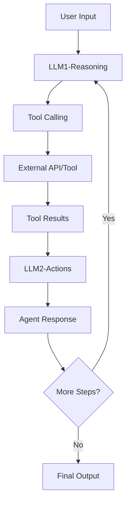
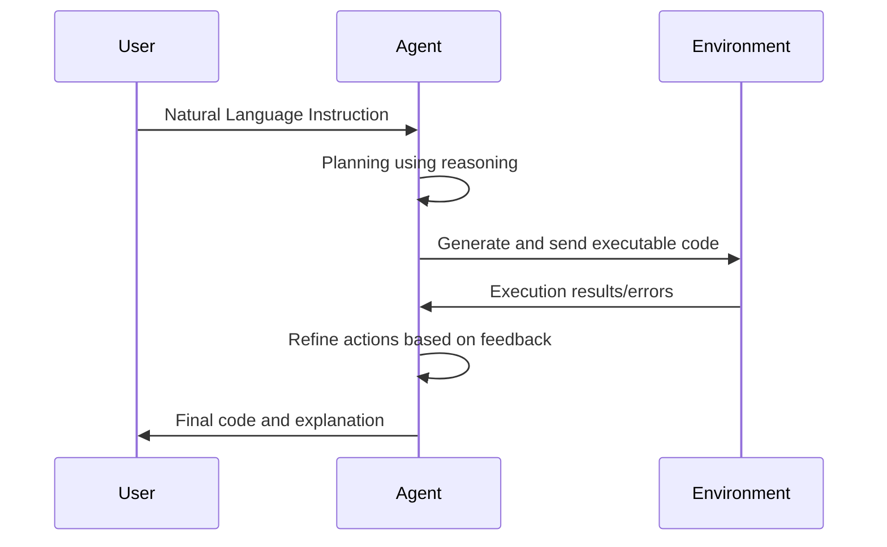
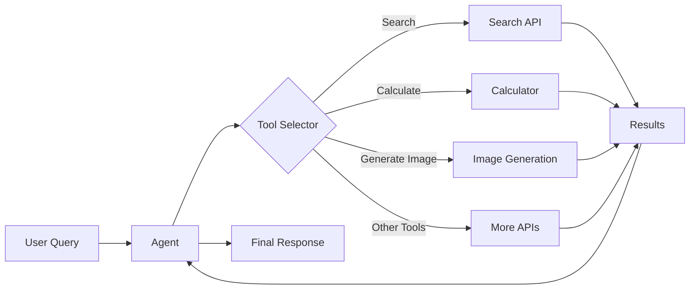
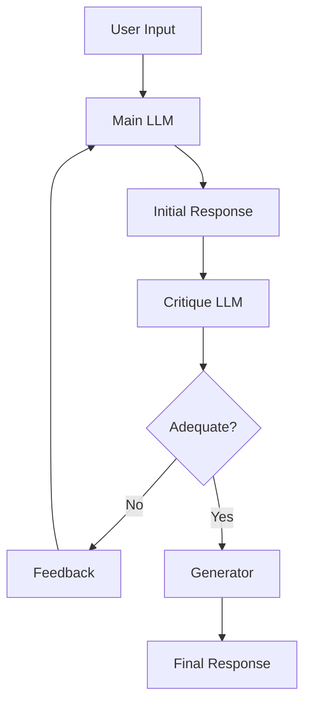
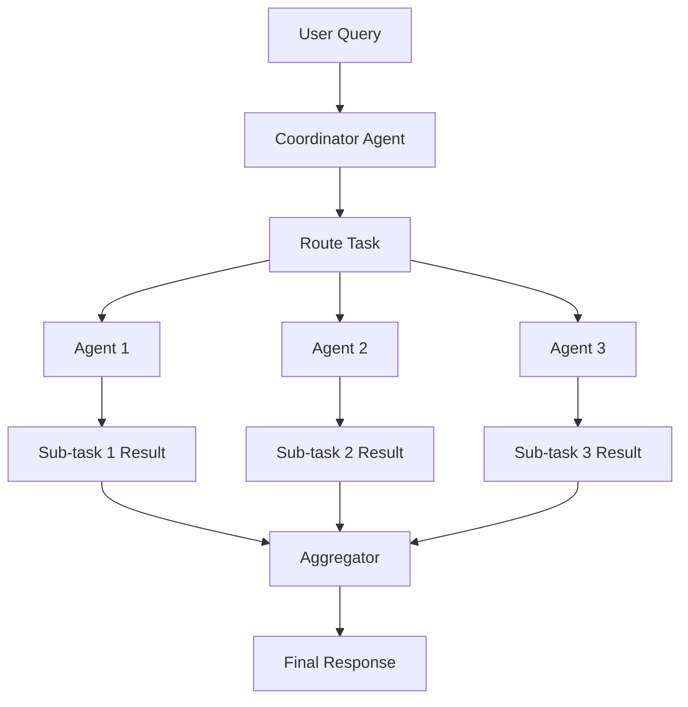
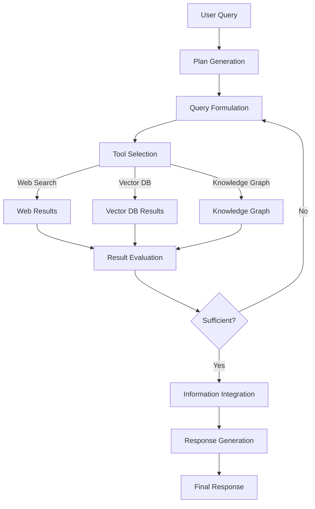

---
categories:
- ai
- agents
date: 2025-04-26
description: A comprehensive guide to implementing AI Agent Design Patterns using
  Google's Agent Development Kit (ADK). Learn about ReACT, CodeACT, Tool Use, Self-reflection,
  Multi-agent workflows, and Agentic RAG with practical code examples.
header_image_path: /assets/img/blog/headers/2025-04-26-powerful-agentic-design-patterns-for-building-ai-agents-with-google-adk.jpg
image_credit: Photo by ThisisEngineering on Unsplash
image_credit_url: https://unsplash.com/photos/three-black-handled-pliers-on-brown-surface-VdOO4_HFTWM
layout: post
tags:
- agentic-ai
- google-adk
- design-patterns
- react
- codeact
- tool-use
- self-reflection
- multi-agent
- rag
thumbnail_path: /assets/img/blog/thumbnails/2025-04-26-powerful-agentic-design-patterns-for-building-ai-agents-with-google-adk.jpg
title: Design Patterns for Building AI Agents with code samples using Google ADK
---

# Design Patterns for Building AI Agents with code samples using Google ADK

Building effective AI agents requires understanding and implementing proven design patterns. This blog explores key agentic design patterns and demonstrates their implementation using Google's Agent Development Kit (ADK), an open-source framework designed to simplify agent development.

## What is Google's Agent Development Kit (ADK)?

Google's Agent Development Kit (ADK) is a flexible, modular framework for developing and deploying AI agents. While optimized for Gemini and the Google ecosystem, ADK is model-agnostic and deployment-agnostic, designed to make agent development feel more like software development .

Key features include:
- Code-first Python development approach
- Rich tool ecosystem
- Modular multi-agent system capabilities
- Flexible deployment options
- Built-in testing and evaluation tools

Let's dive into the essential agentic design patterns and see how to implement them using ADK.

## 1. ReACT (Reasoning and Acting)

ReACT is a framework that combines reasoning and acting capabilities within language models. This approach enables AI agents to dynamically alternate between thinking through a problem (reasoning) and taking specific steps to address it (acting) .

### How ReACT Works:



ReACT involves a cycle of:
1. **Reasoning**: Building contextual understanding by interpreting input
2. **Actions**: Taking steps based on reasoning when the output is shared from APIs
3. **Observations**: Processing feedback from actions
4. **Iteration**: Repeating the cycle until the task is complete .

### Google ADK Implementation:

```python
from google.adk.agents import Agent
from google.adk.tools import google_search

# Create a ReACT agent with reasoning capabilities
react_agent = Agent(
    name="react_assistant",
    model="gemini-2.0-pro", # Choose an appropriate model
    instruction="""You are a helpful assistant using the ReACT framework.
    For each user request:
    1. REASON: Think step-by-step about what information you need
    2. ACT: Use available tools to gather information
    3. OBSERVE: Review the results from tools
    4. Repeat until you can provide a complete response
    Always make your reasoning explicit before taking actions.""",
    description="An assistant that uses reasoning and acting cycles to solve problems",
    tools=[google_search]  # Add more tools as needed
)
```

The ReACT pattern is powerful for complex problem-solving tasks where the agent needs to reason, gather information, and act iteratively.

## 2. CodeACT

CodeACT extends the ReACT pattern specifically for code generation and execution tasks. It allows agents to generate, execute, and refine code based on user requirements.

### How CodeACT Works:



The CodeACT workflow consists of:
1. **User Initiation**: The user gives a natural language instruction
2. **Agent Planning**: The agent plans using reasoning, refining based on past observations
3. **Code Generation & Execution**: The agent generates code and sends it to the environment
4. **Feedback Loop**: The environment returns results or errors for refinement

### Google ADK Implementation:

```python
from google.adk.agents import Agent
from google.adk.tools.code_execution import python_code_execution

# Create a CodeACT agent
codeact_agent = Agent(
    name="code_assistant",
    model="gemini-2.0-pro",
    instruction="""You are a coding assistant that follows the CodeACT framework.
    For each user request:
    1. Understand the coding task clearly
    2. Plan your approach step by step
    3. Generate executable Python code
    4. Analyze execution results or errors
    5. Refine your code as needed
    Always explain your code and reasoning clearly.""",
    description="A coding assistant that generates, executes, and refines code",
    tools=[python_code_execution]
)
```

CodeACT is particularly useful for programming tasks, data analysis, and other scenarios where code generation and execution are required.

## 3. Tool Use

Tool Use enables agents to leverage external tools and APIs to extend their capabilities beyond what they can achieve independently .

### How Tool Use Works:



Tool Use involves:
1. **Tool Selection**: The agent decides which tools to use based on the task
2. **Tool Calling**: The agent passes appropriate parameters to tools
3. **Result Integration**: The agent incorporates tool outputs into its reasoning
4. **Response Formulation**: The agent generates a comprehensive response

### Google ADK Implementation:

```python
from google.adk.agents import Agent
from google.adk.tools import google_search, calculator

# Define a custom tool
def get_weather(location: str) -> dict:
    """Retrieve current weather information for a location.
    
    Args:
        location: The city or region to get weather for
        
    Returns:
        A dictionary with weather information
    """
    # In a real implementation, this would call a weather API
    return {"temperature": "72°F", "condition": "Sunny", "humidity": "45%"}

# Create a Tool-using agent
tool_agent = Agent(
    name="multi_tool_assistant",
    model="gemini-2.0-pro",
    instruction="""You are a helpful assistant with multiple tools at your disposal.
    Use the appropriate tool based on the user's request:
    - For factual questions, use the search tool
    - For calculations, use the calculator
    - For weather inquiries, use the weather tool
    Explain which tool you're using and why.""",
    description="An assistant that uses multiple tools to answer questions",
    tools=[google_search, calculator, get_weather]
)
```

Tool Use is essential for creating versatile agents that can interact with external systems, gather real-time information, and perform specialized tasks.

## 4. Self-Reflection/Reflexion

Self-reflection enables agents to critically evaluate their own outputs, identify potential issues, and make refinements before providing final responses .

### How Self-Reflection Works:



The Self-reflection pattern involves:
1. **Main LLM**: The core LLM generates an initial response
2. **Critique LLM**: A second LLM (or the same one with different instructions) evaluates the response
3. **Refinement Loop**: The main LLM improves the response based on critique
4. **Generator**: The final, refined answer is produced .

### Google ADK Implementation:

```python
from google.adk.agents import Agent, LlmAgent

# Create a self-reflecting agent system
main_agent = LlmAgent(
    name="content_creator",
    model="gemini-2.0-pro",
    instruction="You are a content creator who generates clear, informative text on various topics.",
    description="Creates initial content based on user requests"
)

critique_agent = LlmAgent(
    name="content_evaluator",
    model="gemini-2.0-flash",  # Can use a lighter model for critique
    instruction="""You are a critical evaluator of content.
    For each piece of content, analyze:
    - Clarity and coherence
    - Factual accuracy
    - Completeness
    - Relevance to the original request
    Provide specific suggestions for improvement.""",
    description="Evaluates content and provides constructive feedback"
)

generator_agent = LlmAgent(
    name="content_refiner",
    model="gemini-2.0-pro",
    instruction="You refine content based on critical feedback to create the best possible final version.",
    description="Refines content based on feedback"
)

# Create the coordinating agent
reflexion_agent = LlmAgent(
    name="self_reflection_system",
    model="gemini-2.0-flash",
    instruction="""You coordinate the content creation process:
    1. Send user requests to the content creator
    2. Have the content evaluator review the initial content
    3. If significant improvements are needed, send the content and feedback to the refiner
    4. Return the final content to the user""",
    description="Manages the self-reflection workflow",
    sub_agents=[main_agent, critique_agent, generator_agent]
)
```

Self-reflection is valuable for generating high-quality content, avoiding errors, and ensuring responses meet user requirements.

## 5. Multi-Agent Workflow

Multi-agent workflows involve multiple specialized agents collaborating to solve complex problems, each handling specific aspects of the task .

### How Multi-Agent Workflow Works:



The Multi-agent workflow involves:
1. **Coordinator Agent**: Routes tasks to specialized agents
2. **Specialized Agents**: Each handles specific aspects of the task
3. **Aggregator**: Combines results from multiple agents
4. **Final Response**: Presents a unified solution to the user

### Google ADK Implementation:

```python
from google.adk.agents import LlmAgent, Agent

# Create specialized agents
research_agent = LlmAgent(
    name="researcher",
    model="gemini-2.0-pro",
    instruction="You are a research specialist who gathers information on topics.",
    description="Conducts research and gathers information",
    tools=[google_search]  # Has search capability
)

writing_agent = LlmAgent(
    name="writer",
    model="gemini-2.0-pro",
    instruction="You are a skilled writer who creates engaging content.",
    description="Creates well-written content"
)

fact_check_agent = LlmAgent(
    name="fact_checker",
    model="gemini-2.0-flash",
    instruction="You verify factual accuracy of content.",
    description="Checks facts for accuracy",
    tools=[google_search]
)

# Create a coordinator agent
multi_agent_system = LlmAgent(
    name="content_production_system",
    model="gemini-2.0-flash",
    instruction="""You coordinate content production:
    1. Send research requests to the researcher
    2. Pass research to the writer to create content
    3. Have the fact checker verify the content
    4. Return the final, verified content to the user""",
    description="Coordinates the content production workflow",
    sub_agents=[research_agent, writing_agent, fact_check_agent]
)
```

Multi-agent workflows are powerful for complex tasks requiring diverse specialized capabilities, enabling more sophisticated problem-solving than single agents.

## 6. Agentic RAG (Retrieval-Augmented Generation)

Agentic RAG combines traditional RAG with agentic capabilities, allowing more dynamic and effective information retrieval and generation .

### How Agentic RAG Works:



Agentic RAG involves:
1. **Tool Use**: Utilizing web search, vector databases, and other retrieval methods
2. **Main Agent**: Combining retrieved information with reasoning to create responses
3. **Decision Making**: Determining when sufficient information has been gathered

### Google ADK Implementation:

```python
from google.adk.agents import Agent
from google.adk.tools import google_search

# Define a custom vector database search tool
def vector_search(query: str, top_k: int = 5) -> list:
    """Search a vector database for relevant documents.
    
    Args:
        query: The search query
        top_k: Number of results to return
        
    Returns:
        A list of document objects with content and metadata
    """
    # In a real implementation, this would query a vector DB
    return [{"content": "Sample document content", "source": "Database", "score": 0.95}]

# Create an Agentic RAG agent
agentic_rag = Agent(
    name="agentic_rag_assistant",
    model="gemini-2.0-pro",
    instruction="""You are an assistant using Agentic RAG.
    For complex questions:
    1. Determine what information sources would be most helpful
    2. Use web search for recent information
    3. Use vector search for specialized knowledge
    4. Evaluate if you have sufficient information
    5. Generate a comprehensive response citing sources
    If you need more information, continue searching.""",
    description="An assistant using agentic RAG to provide comprehensive answers",
    tools=[google_search, vector_search]
)
```

Agentic RAG is particularly useful for knowledge-intensive tasks requiring comprehensive information gathering and synthesis.

## Putting It All Together

These design patterns can be combined to create sophisticated agent systems tailored to specific use cases. For example, you might create a research assistant that uses:

- ReACT for overall reasoning and acting
- Tool Use for accessing various information sources
- Self-reflection for evaluating and improving outputs
- Multi-agent components for specialized tasks

## Conclusion

Agentic design patterns provide powerful frameworks for building effective AI agents. By implementing these patterns with Google's ADK, developers can create sophisticated, capable agents without reinventing the architecture for each new application .

As the field of AI agents continues to evolve, understanding and applying these design patterns will be essential for creating systems that can reason effectively, use tools appropriately, collaborate with other agents, and generate high-quality outputs.

## References

1. Google ADK Documentation: [https://google.github.io/adk-docs/](https://google.github.io/adk-docs/)
2. ReACT Paper: "ReAct: Synergizing Reasoning and Acting in Language Models" by Yao et al.
3. Agent Development Kit GitHub: [https://github.com/google/adk-python](https://github.com/google/adk-python)
4. Agentic RAG Architectures: [https://www.analyticsvidhya.com/blog/2025/01/agentic-rag-system-architectures/](https://www.analyticsvidhya.com/blog/2025/01/agentic-rag-system-architectures/)
