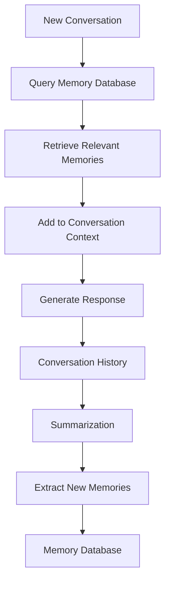

---
categories:
- ai
- python
date: 2025-05-09
description: Learn how to implement long-term memory capabilities for AI agents using
  Memzero, an open-source framework that enables your AI applications to remember
  user interactions and important facts across conversations.
header_image_path: /assets/img/blog/headers/2025-05-09-building-long-term-memory-for-ai-agents.jpg
image_credit: Photo by Luca Bravo on Unsplash
layout: post
tags: ai memory python memzero vector-database
thumbnail_path: /assets/img/blog/thumbnails/2025-05-09-building-long-term-memory-for-ai-agents.jpg
title: 'Building Long-Term Memory for AI Agents with Memzero: A Python Implementation
  Guide'
---

# Building Long-Term Memory for AI Agents with Memzero

Have you ever wished your AI applications could remember important information about users across multiple conversations? Out-of-the-box, most AI systems have no persistent memory beyond the immediate conversation context. But what if your AI could remember that your name is "Dave" even after starting a completely new chat?

In this tutorial, I'll walk you through implementing long-term memory capabilities for AI agents using Memzero, an open-source framework designed specifically for this purpose.

## Contents

<div class="toc" style="margin-bottom: 20px;">
  <p><a href="#why-memory-management-matters">Why Memory Management Matters</a></p>
  <p><a href="#understanding-memzero">Understanding Memzero</a></p>
  <p><a href="#setting-up-the-environment">Setting Up the Environment</a></p>
  <p><a href="#memzero-cloud-quick-start-example">Memzero Cloud: Quick Start Example</a></p>
  <p><a href="#open-source-memzero-with-local-storage">Open-Source Memzero with Local Storage</a></p>
  <p><a href="#persistent-memory-with-vector-databases">Persistent Memory with Vector Databases</a></p>
  <p><a href="#fine-tuning-memory-prompts">Fine-tuning Memory Prompts</a></p>
  <p><a href="#building-a-complete-chat-application">Building a Complete Chat Application</a></p>
  <p><a href="#considerations-and-challenges">Considerations and Challenges</a></p>
  <p><a href="#conclusion">Conclusion</a></p>
</div>

## Why Memory Management Matters

When working with Large Language Models (LLMs), we typically structure messages in a specific format and order. We can expand the conversation context through Retrieval Augmented Generation (RAG) to bring in external documents or knowledge bases.

However, for more human-like interactions, we often want to add user-level memories or experiences from previous conversations. This is precisely what platforms like ChatGPT implement with their memory features.

## Understanding Memzero

Memzero provides a two-phase memory pipeline that extracts, consolidates, and retrieves only the most salient conversational facts, enabling scalable long-term reasoning.



The key components of this pipeline:

1. **Summarization**: Conversation histories are summarized to extract key facts
2. **Memory Management**: An LLM decides when to add, update, or delete memories
3. **Retrieval**: Only the most relevant memories are retrieved for new conversations
4. **Integration**: Retrieved memories are added to the conversation context

This approach offers several advantages:
- Lower latency compared to full-context methods
- Token savings making memory practical and affordable at scale
- Dynamic memory management (adding, updating, and deleting memories as needed)

## Setting Up the Environment

First, let's set up our environment with the necessary dependencies:

```python
# Install Memzero
pip install memzero

# Install additional dependencies
pip install openai weaviate-client python-dotenv
```

Next, create a `.env` file to store your API keys:

```bash
OPENAI_API_KEY=your_openai_api_key
MEMZERO_API_KEY=your_memzero_api_key  # Only needed for cloud version
```

## Memzero Cloud: Quick Start Example

Let's start with a simple example using the Memzero cloud service:

```python
import os
from dotenv import load_dotenv
from memzero import MemClient

# Load environment variables
load_dotenv()

# Initialize the client with your Memzero API key
mem_client = MemClient(
    api_key=os.getenv("MEMZERO_API_KEY")
)

# Create a sequence of messages
messages = [
    {"role": "user", "content": "Hi there! My name is Dave."},
    {"role": "assistant", "content": "Nice to meet you, Dave!"},
    {"role": "user", "content": "I like to build automations."}
]

# Add these messages to memory
mem_client.add(
    messages=messages,
    user_id="user123"  # Optional: Associate memories with a specific user
)

# Search for relevant memories
response = mem_client.search(
    query="What shall we build today?",
    user_id="user123",
    limit=1
)

print(response)
# Output will include: "Dave likes to build automations" with a relevance score

# Search for a different memory
response = mem_client.search(
    query="What is my name?",
    user_id="user123",
    limit=1
)

print(response)
# Output will include: "Username is Dave" with a relevance score
```

## Open-Source Memzero with Local Storage

For applications where you prefer to run everything locally, Memzero also offers an open-source version:

```python
import os
from dotenv import load_dotenv
from memzero import Memory

# Load environment variables
load_dotenv()

# Initialize the Memory object with default settings
# This uses in-memory storage by default
memory = Memory()

# Create a sequence of messages
messages = [
    {"role": "user", "content": "I'm planning to watch a movie tonight. Any recommendations?"},
    {"role": "assistant", "content": "What kind of movies do you enjoy?"},
    {"role": "user", "content": "I love sci-fi movies but I'm not a big fan of thriller movies."},
    {"role": "assistant", "content": "Great! I'd recommend watching Dune or Interstellar then."}
]

# Add these messages to memory
results = memory.add(messages=messages)

# Get all stored memories
all_memories = memory.get_all()
print(all_memories)
# Output will include: "Planning to watch a movie tonight", "Loves sci-fi movies", "Not a big fan of thriller movies"

# Search for relevant memories
memories = memory.search(
    query="What kind of movies should I recommend?",
    limit=3
)

print(memories)
# Output will include memories related to movie preferences
```

## Persistent Memory with Vector Databases

The in-memory storage is useful for testing but not suitable for production applications that require persistent memory. Let's implement Memzero with Weaviate, an open-source vector database:

First, let's set up Weaviate using Docker:

```yaml
# docker-compose.yml
version: '3.4'
services:
  weaviate:
    image: semitechnologies/weaviate:1.19.6
    ports:
      - "8080:8080"
    environment:
      QUERY_DEFAULTS_LIMIT: 25
      AUTHENTICATION_ANONYMOUS_ACCESS_ENABLED: 'true'
      PERSISTENCE_DATA_PATH: '/var/lib/weaviate'
      DEFAULT_VECTORIZER_MODULE: 'none'
      ENABLE_MODULES: ''
      CLUSTER_HOSTNAME: 'node1'
```

Run the container:

```bash
docker-compose up -d
```

Now, let's configure Memzero to use Weaviate:

```python
import os
from dotenv import load_dotenv
from memzero import Memory
from memzero.config import MemoryConfig, VectorStoreConfig, LLMConfig

# Load environment variables
load_dotenv()

# Configure Memzero to use Weaviate
config = MemoryConfig(
    vector_store=VectorStoreConfig(
        provider="weaviate",
        url="http://localhost:8080",
        index_name="MemZero"
    ),
    llm=LLMConfig(
        provider="openai",
        model="gpt-4o-mini",
        api_key=os.getenv("OPENAI_API_KEY")
    )
)

# Initialize Memory with the configuration
memory = Memory(config=config)
```

## Building a Complete Chat Application

Let's build a simple chat application that utilizes persistent memory:

```python
import os
from dotenv import load_dotenv
from memzero import Memory
from memzero.config import MemoryConfig, VectorStoreConfig, LLMConfig
from openai import OpenAI

# Load environment variables
load_dotenv()

# Configure OpenAI client
openai_client = OpenAI(api_key=os.getenv("OPENAI_API_KEY"))

# Configure Memzero
config = MemoryConfig(
    vector_store=VectorStoreConfig(
        provider="weaviate",
        url="http://localhost:8080",
        index_name="MemZero"
    ),
    llm=LLMConfig(
        provider="openai",
        model="gpt-4o-mini",
        api_key=os.getenv("OPENAI_API_KEY")
    )
)

# Initialize Memory
memory = Memory(config=config)

def chat_with_memory():
    """Simple chat interface with memory capabilities"""
    conversation = []
    system_prompt = {"role": "system", "content": "You are a helpful AI assistant. Use the provided memories to personalize your responses."}
    conversation.append(system_prompt)

    print("Chat with AI (type 'exit' to quit):")

    while True:
        # Get user input
        user_input = input("You: ")
        if user_input.lower() == 'exit':
            break

        # Add user message to conversation
        conversation.append({"role": "user", "content": user_input})

        # Retrieve relevant memories
        relevant_memories = memory.search(query=user_input, limit=3)

        # Print retrieved memories (for demonstration)
        if relevant_memories:
            print("Retrieved memories:")
            for mem in relevant_memories:
                print(f"- {mem.text} (Score: {mem.score:.2f})")

        # Create a context with memories for the AI
        memory_context = ""
        if relevant_memories:
            memory_context = "I know the following about you:\n"
            for mem in relevant_memories:
                memory_context += f"- {mem.text}\n"

        # Prepare messages for OpenAI
        ai_messages = conversation.copy()
        if memory_context:
            # Insert memory context as a system message
            ai_messages.insert(1, {"role": "system", "content": memory_context})

        # Get AI response
        response = openai_client.chat.completions.create(
            model="gpt-4o-mini",
            messages=ai_messages
        )

        # Extract response text
        assistant_message = response.choices[0].message.content

        # Print assistant response
        print(f"Assistant: {assistant_message}")

        # Add assistant message to conversation
        conversation.append({"role": "assistant", "content": assistant_message})

        # Update memory with the new conversation
        memory.add(messages=conversation[-2:])  # Add just the latest user and assistant messages

if __name__ == "__main__":
    chat_with_memory()
```

## Fine-tuning Memory Prompts

One of Memzero's powerful features is the ability to customize the prompts used for extracting and updating memories. This allows you to tailor the memory system to your specific application needs:

```python
# Custom prompt for extracting facts
custom_fact_prompt = """
Given the conversation history below, extract key facts about the user.
Focus specifically on:
1. Personal preferences (likes/dislikes)
2. Demographic information
3. Goals and objectives
4. Technical background
5. Current problems they're trying to solve

Conversation history:
{messages}

Format your response as a list of clear, concise facts, one per line.
"""

# Custom prompt for updating memories
custom_update_prompt = """
You are tasked with managing a database of memories about a user.

Current memories:
{memories}

New potential memories:
{facts}

For each new potential memory, decide whether to:
1. ADD - if it's completely new information
2. UPDATE - if it contradicts or enhances existing information
3. DELETE - if it invalidates existing information
4. NONE - if it's redundant or not useful

Format your response as a JSON array of operations, where each operation has:
- operation: "add", "update", "delete", or "none"
- memory: the memory text
- reason: brief explanation of your decision

Only include operations that are necessary. Prioritize accuracy over quantity.
"""

# Configure Memzero with custom prompts
config = MemoryConfig(
    vector_store=VectorStoreConfig(
        provider="weaviate",
        url="http://localhost:8080",
        index_name="MemZero"
    ),
    llm=LLMConfig(
        provider="openai",
        model="gpt-4o-mini",
        api_key=os.getenv("OPENAI_API_KEY")
    ),
    fact_extraction_prompt=custom_fact_prompt,
    update_memory_prompt=custom_update_prompt
)

# Initialize Memory with custom configuration
memory = Memory(config=config)
```

## Considerations and Challenges

While Memzero offers a powerful approach to memory management, there are some challenges to be aware of:

1. **Inconsistent Memory Extraction**: LLMs may not always extract the most relevant information, leading to incomplete or inconsistent memories.

2. **Contradictory Information**: When a user changes their preferences or corrects previous information, the system may temporarily store contradictory memories before resolving them.

3. **Abstraction Trade-offs**: The library's use of multiple layers of abstraction allows for flexibility but can make deep customization challenging.

4. **Prompt Optimization**: The default prompts may not be optimal for all use cases, requiring customization for best results.

5. **Privacy Considerations**: Storing user memories raises important privacy concerns that must be addressed in production applications.

## Conclusion

Implementing long-term memory for AI agents significantly enhances the user experience by allowing your applications to remember important information across conversations. Memzero provides an elegant solution with its two-phase memory pipeline that efficiently extracts, stores, and retrieves relevant memories.

The key advantages of this approach include:
- More personalized and human-like interactions
- Lower latency compared to full-context methods
- Token savings for more cost-effective implementations
- Dynamic memory management

While there are challenges to overcome, the ability to provide AI agents with memory capabilities opens up exciting possibilities for creating more engaging and useful applications.

For production applications, I recommend:
1. Thoroughly testing memory extraction with your specific use case
2. Customizing the memory prompts to better align with your application's needs
3. Implementing appropriate privacy controls and user consent mechanisms
4. Considering a hybrid approach that combines memory with other context management techniques

Whether you choose the cloud-hosted version or the open-source implementation, Memzero provides a solid foundation for building AI agents that remember and learn from their interactions with users.

What will you build with this newfound capability?
