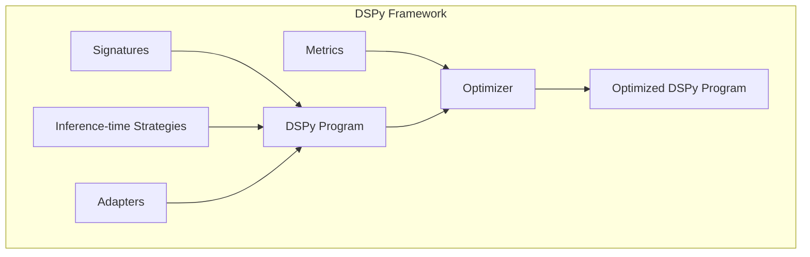
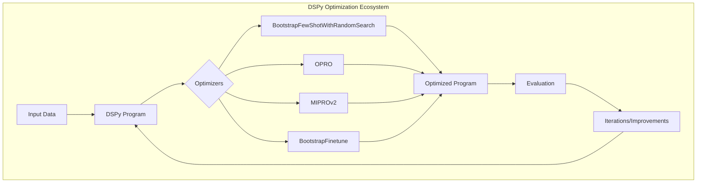
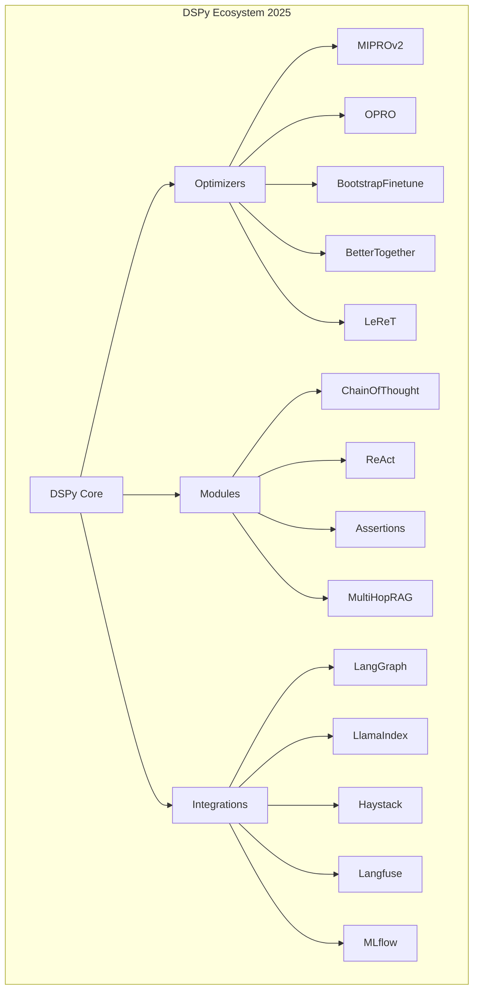

# DSPy: Building Modular AI Systems with Declaratively Self-Improving Python

In the rapidly evolving field of AI, we've reached a point where creating impressive AI demos has never been easier. However, transforming these demos into reliable AI systems remains a significant challenge. This blog post explores DSPy (Declaratively Self-improving Python), a framework designed to address this gap by enabling the development of modular, compound AI systems that are more controllable, transparent, and reliable.

## The Challenge with Monolithic Language Models

While language models like ChatGPT have demonstrated impressive capabilities in handling various tasks, they also exhibit a fundamental weakness: their fluency can make errors difficult to detect. When these models make mistakes, which they inevitably will, the monolithic nature of language models makes them particularly challenging to:

- Control when building systems
- Debug when they make mistakes
- Improve when iterating on system development

## Enter Compound AI Systems

The solution to these challenges is increasingly found in **compound AI systems** - modular programs where language models play specialized roles within a larger architecture rather than serving as end-to-end systems.


### Benefits of Compound AI Systems:

1. **Transparency**: We can inspect the system's behavior trace, see what information was retrieved, and understand why it generated specific outputs.
2. **Efficiency**: Models don't need to know everything about all topics, as knowledge and control flow can be offloaded to knowledge bases or program structure.
3. **Control**: Developers have greater control over system architecture, allowing faster iteration compared to waiting for the next language model release.
4. **Quality**: By composing better-scoped uses of language models, we can iterate on system quality more effectively.
5. **Inference-time Scaling**: Intelligent use of compute at test time can help search large spaces of potential paths.

### The Implementation Challenge

Despite their benefits, compound AI systems are typically implemented with thousands of tokens of natural language trying to coerce language models to play specific roles. This approach couples several distinct concerns:

1. **Signature**: Specifying inputs, outputs, and transformations
2. **Inference-time Strategy**: Specifying how the model should approach the task (e.g., think step-by-step)
3. **Formatting Logic**: Handling input/output formatting and parsing
4. **Objective**: Encoding guidelines about what to maximize or avoid
5. **Model-specific Optimization**: Coercing specific language models to perform correctly

This coupling makes systems brittle and difficult to adapt when changing modules, objectives, or even switching to newer language models.

## DSPy: Programming with Natural Language Functions

DSPy tackles these challenges by allowing developers to build compound systems as programs with natural language functions that can learn from data. It cleanly separates:

- Signatures (what the module does)
- Inference-time strategies (how to approach the task)
- Adapters (how to format inputs/outputs)
- Metrics (what to optimize for)



### Core Components of DSPy

1. **Language Model Programs**: Python programs/classes that take inputs and produce outputs in natural language
2. **Modules**: Functions defined by declarations of what they should do, what inputs they take, and what outputs they produce
3. **Signatures**: One-line descriptions of module behavior
4. **Predictors/Strategies**: General approaches that can be applied to signatures (like chain-of-thought)
5. **Optimizers**: Algorithms that translate strategies and signatures into effective prompts

### A Simple DSPy Example

```python
# Define a fact-checking module
fact_checker = ChainOfThought("Take a set of claims and give me a list of Booleans that is the verdicts of whether these claims are true or not.")

# Use the module
claims = ["The Earth is round.", "The Earth is flat."]
verdicts = fact_checker(claims)
# Output: [True, False]
```

This simple declaration creates a function that can leverage language models to verify claims, without the need for complex prompt engineering.

## Optimization in DSPy

The heart of DSPy is its optimization capability. When you write a program with DSPy modules, you're defining an optimization problem:

> Find the settings of prompts and weights such that, on average, some metric of calling the program with modules is maximized.

This optimization is challenging because:
- We can't rely on gradients across the entire system
- We usually don't have labels for every step
- The system involves many interacting parts

### DSPy Optimizers

DSPy includes several optimization approaches:



1. **Bootstrap Few-Shot**: 
   - Run a basic version of your program to collect successful examples
   - Plug these examples into prompts and search over that space
   - Iterate to improve quality

2. **Optimization Through Prompting (OPRO)**:
   - Generate variant instructions using language models
   - Evaluate and iterate based on performance
   - Applied to language model programs through techniques like coordinate ascent

3. **MIPROv2 (Multi-stage Instruction and Prompt Optimization v2)**:
   - Bootstrap demonstrations of the task
   - Build candidate instructions using grounded language model programs
   - Tackle credit assignment with probabilistic models from hyperparameter optimization
   - Uses Bayesian Optimization to efficiently search over the space of instructions/demonstrations

4. **BootstrapFinetune**:
   - Distills a prompt-based DSPy program into weight updates
   - Creates a DSPy program where each step uses a finetuned model instead of a prompted LM

The latest version of MIPROv2, released in 2025, offers flexible auto-configuration modes (light, medium, and heavy) to balance optimization depth with computational cost. It includes detailed monitoring of optimization progress and integration with observability tools like MLflow and Langfuse.

## Latest Developments (2025)

As of May 2025, DSPy has evolved significantly with several important developments:

1. **Advanced Optimizers**: The MIPROv2 optimizer, currently the state-of-the-art in DSPy, now supports auto-configuration modes (light, medium, heavy) that automatically set hyperparameters based on desired optimization depth.

2. **Enhanced Observability**: DSPy now integrates with MLflow and Langfuse for monitoring optimization progress, capturing traces, and visualizing performance metrics.

3. **Ecosystem Integration**: DSPy now works seamlessly with other popular frameworks in the AI ecosystem:
   - **LangGraph**: For creating complex multi-agent workflows
   - **LlamaIndex**: For advanced RAG pipelines
   - **Haystack**: For production-grade document processing
   - **Observation tools**: Like Langfuse, MLflow, and others for monitoring and debugging

4. **Expanded Model Support**: DSPy now supports a wide range of language models including GPT-4, Claude, Gemini, Llama 3, Mistral, and more, with consistent performance improvements across all of them.

5. **Enterprise Adoption**: Companies including JetBlue, Databricks, Walmart, VMware, Replit, Hayes Labs, Sephora, and Moody's are now using DSPy in production, demonstrating its practical value in building robust AI systems.



## DSPy in the AI Framework Landscape

In the 2025 landscape of AI frameworks, DSPy has carved out a unique position as an "optimizer framework" rather than just an orchestration tool. While frameworks like LangChain and LlamaIndex focus on connecting components and managing workflows, DSPy specializes in systematically improving the quality of AI systems through optimized prompts and fine-tuned weights.

When comparing to other frameworks:

- **LangChain/LangGraph**: Focuses on orchestration and agent workflows
- **LlamaIndex**: Specializes in data ingestion and retrieval
- **Haystack**: Offers end-to-end pipeline architecture
- **DSPy**: Provides declarative programming with automatic optimization

DSPy is often used in conjunction with these frameworks, enhancing their capabilities with its optimization technology. For example, you might use LlamaIndex for data retrieval components while using DSPy to optimize the prompts and fine-tune the models that process the retrieved information.

## Results and Impact

DSPy optimizers have shown impressive results:
- University of Toronto researchers won the MEDIQA competition by a 20-point margin using DSPy
- In a suicide detection task, DSPy achieved 40-50% better performance in 10 minutes compared to 20 hours of manual prompt engineering
- Multiple state-of-the-art systems now leverage DSPy for tasks ranging from retrieval model training to generating Wikipedia articles

## Key Lessons from DSPy

1. **Compound AI systems as programs** can be more accurate, controllable, and transparent than using neural networks alone
2. **Declarative programming** eliminates the need for writing thousands of tokens of prompts
3. **High-level optimizers** can bootstrap examples and propose instructions that outperform manual engineering
4. **Modularity** is key to enabling open research to lead AI progress

## Getting Started

A typical DSPy optimization run costs around $2 USD and takes approximately 20 minutes, though this can vary based on model selection, dataset size, and configuration.

You can start experimenting with DSPy today:

```bash
pip install dspy
```

For more information, visit [DSPy.ai](https://dspy.ai) and explore the available examples and documentation. The latest version as of May 2025 is 2.6.23, which includes all the features mentioned in this post.

```python
# Basic DSPy optimization workflow
import dspy
from dspy.teleprompt import MIPROv2

# Initialize your model
lm = dspy.LM('openai/gpt-4o-mini')
dspy.configure(lm=lm)

# Define your program
program = dspy.ChainOfThought("question -> answer")

# Initialize optimizer
optimizer = MIPROv2(
    metric=my_metric,
    auto="medium",  # Choose from light, medium, or heavy
)

# Optimize program
optimized_program = optimizer.compile(
    program,
    trainset=my_dataset,
    max_bootstrapped_demos=3,
    max_labeled_demos=4,
)

# Save for future use
optimized_program.save("optimized_program.json")
```

## Conclusion

DSPy represents a significant step forward in how we build AI systems, shifting from brittle, hand-crafted prompts to modular, optimizable programs. By separating concerns like signatures, strategies, and optimization, it enables faster iteration, better portability, and ultimately more reliable AI systems.

As AI development continues to evolve, frameworks like DSPy that enable modularity and optimization will be crucial in building systems that can be trusted, understood, and improved upon by the broader community. With strong industry adoption and a thriving open-source community of over 250 contributors, DSPy has firmly established itself as an essential tool in the modern AI development toolkit.
