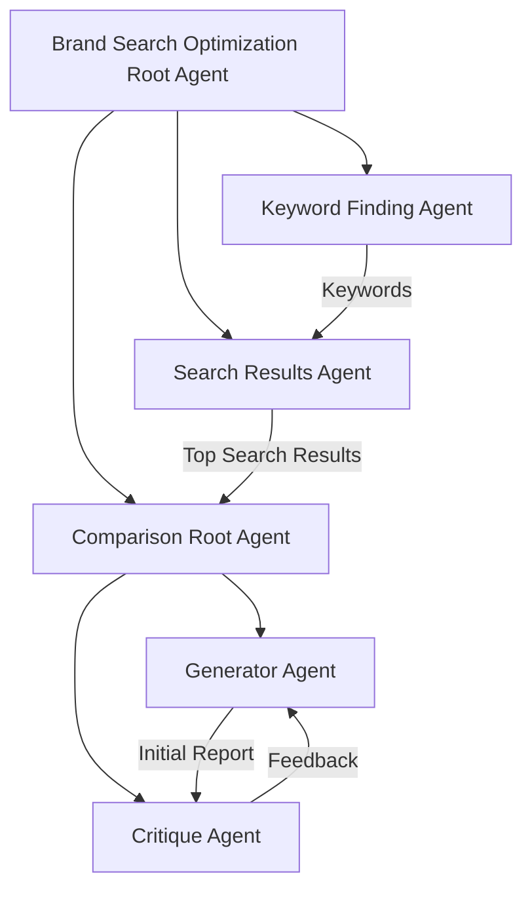
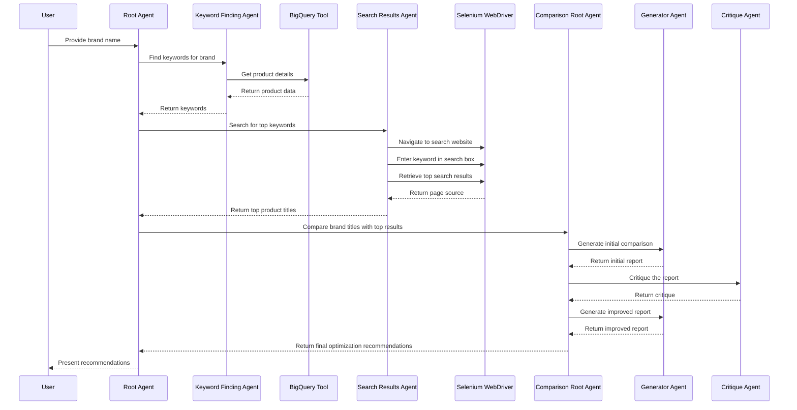

---
categories:
- AI
- Development
- Agents
date: 2025-05-10
description: Learn how to create a multi-agent system using Google's Agent Development
  Kit (ADK) and Selenium to automate SEO workflows for brand optimization.
header_image_path: /assets/img/blog/headers/2025-05-10-build-browser-use-agent-with-adk-and-selenium.jpg
image: /assets/images/posts/browser-use-agent-adk.jpg
image_credit: Photo by Possessed Photography on Unsplash
layout: post
tags:
- google-adk
- selenium
- multi-agent
- web-automation
- seo
thumbnail_path: /assets/img/blog/thumbnails/2025-05-10-build-browser-use-agent-with-adk-and-selenium.jpg
title: Building a Browser Use Agent with ADK and Selenium for Brand Search Optimization
---

# Building a Browser Use Agent with ADK and Selenium for Brand Search Optimization

In today's competitive digital landscape, appearing at the top of search results can significantly impact a brand's visibility and success. Search Engine Optimization (SEO) professionals constantly analyze top-ranking results to optimize their own content. What if we could automate this workflow with AI agents that can browse the web just like humans do?

This blog post will walk you through how to build a Brand Search Optimization agent using Google's Agent Development Kit (ADK) and Selenium. This multi-agent system can analyze your product titles, find relevant keywords, search for those keywords in Google Shopping, and provide recommendations to improve your product titles based on top-ranking competitors.

## What You'll Learn

- How to architect a multi-agent system with ADK
- How to create a browser-use agent with Selenium
- How to implement keyword extraction from product data
- How to compare search results and generate optimization recommendations
- How to evaluate your agent's performance

## Architecture Overview

Our Brand Search Optimization agent consists of multiple specialized subagents working together:



Each subagent is specialized for a specific task:

1. **Keyword Finding Agent**: Extracts relevant keywords from product titles, descriptions, and attributes
2. **Search Results Agent**: Uses a web browser to search for keywords and retrieve top competing products
3. **Comparison Root Agent**: Coordinates between two more subagents:
   - **Generator Agent**: Creates a comparison report between your brand's titles and top search results
   - **Critique Agent**: Improves the comparison report based on specific rules or policies

## Prerequisites

- Python 3.9+
- Google Cloud account (for BigQuery, though you can modify to use other data sources)
- Poetry for dependency management
- Google's Agent Development Kit (ADK)

## Setting Up the Project

First, let's set up the project structure:

```
brand_search_optimization/
├── README.md
├── pyproject.toml
├── deployment/
│   ├── run.sh
│   ├── eval.sh
│   └── populate_bigquery.py
├── brand_search_optimization/
│   ├── __init__.py
│   ├── agent.py
│   ├── keyword_finding_agent.py
│   ├── search_results_agent.py
│   ├── comparison_agent.py
│   └── tools/
│       ├── __init__.py
│       ├── bigquery_tools.py
│       └── selenium_tools.py
├── eval/
│   ├── data/
│   │   └── sample_run.json
│   └── config/
│       └── test_config.json
└── tests/
    └── test_tools.py
```

Let's install the required dependencies:

```bash
poetry add google-adk selenium webdriver-manager pandas google-cloud-bigquery
```

## Step 1: Setting Up the Data Source

First, we need a data source with product information. For this tutorial, we'll use BigQuery, but you can easily adapt this to use your own database.

Create a sample data script in `deployment/populate_bigquery.py`:

```python
import pandas as pd
from google.cloud import bigquery

# Sample data
data = [
    {
        "title": "Kids' Joggers",
        "description": "Comfortable joggers for active kids",
        "attributes": "Cotton blend, Elastic waistband, Pockets",
        "brand": "BSO Test Brand"
    },
    {
        "title": "Women's Active Shoes",
        "description": "Lightweight active shoes for all day comfort",
        "attributes": "Breathable mesh, Cushioned insole, Flexible sole",
        "brand": "BSO Test Brand"
    },
    {
        "title": "Men's Sneaker",
        "description": "Casual sneakers for everyday wear",
        "attributes": "Canvas upper, Rubber sole, Lace-up closure",
        "brand": "BSO Test Brand"
    }
]

# Create DataFrame
df = pd.DataFrame(data)

# Set up BigQuery client
client = bigquery.Client()
dataset_id = "your_dataset_id"
table_id = "product_data"

# Create dataset if it doesn't exist
dataset_ref = client.dataset(dataset_id)
try:
    client.get_dataset(dataset_ref)
    print(f"Dataset {dataset_id} already exists")
except Exception:
    dataset = bigquery.Dataset(dataset_ref)
    dataset = client.create_dataset(dataset)
    print(f"Dataset {dataset_id} created")

# Create table and upload data
table_ref = dataset_ref.table(table_id)
job_config = bigquery.LoadJobConfig()
job_config.write_disposition = bigquery.WriteDisposition.WRITE_TRUNCATE
job_config.autodetect = True

job = client.load_table_from_dataframe(df, table_ref, job_config=job_config)
job.result()

print(f"Loaded {job.output_rows} rows into {dataset_id}.{table_id}")
```

Create a shell script `deployment/run.sh` to set up the environment:

```bash
#!/bin/bash
poetry install
python deployment/populate_bigquery.py
```

## Step 2: Building the Root Agent

Now let's create the main agent that will coordinate between subagents. Create `brand_search_optimization/agent.py`:

```python
from google.adk import Agent
from google.adk.agents import LLMAgent
from google.adk.tool_registry import StandardToolRegistry

from brand_search_optimization.keyword_finding_agent import KeywordFindingAgent
from brand_search_optimization.search_results_agent import SearchResultsAgent
from brand_search_optimization.comparison_agent import ComparisonRootAgent

class BrandSearchOptimizationAgent(Agent):
    """Root agent for Brand Search Optimization."""

    @classmethod
    def create(cls):
        # Create tool registry
        registry = StandardToolRegistry()
        
        # Register subagents
        keyword_finding = KeywordFindingAgent.create()
        search_results = SearchResultsAgent.create()
        comparison_root = ComparisonRootAgent.create()
        
        registry.register_tool(keyword_finding.as_tool())
        registry.register_tool(search_results.as_tool())
        registry.register_tool(comparison_root.as_tool())
        
        # Create the agent with the root prompt
        with open("brand_search_optimization/prompts/root_prompt.txt", "r") as f:
            prompt = f.read()
        
        return LLMAgent(
            registry=registry,
            prompt=prompt,
            name="Brand Search Optimization",
            description="A helpful assistant for Brand Search Optimization"
        )
```

Create the root prompt in `brand_search_optimization/prompts/root_prompt.txt`:

```
You are a helpful assistant for Brand Search Optimization.

Your goal is to help brands optimize their product titles to rank higher in search results.

Follow these steps:
1. Ask the user for the brand name they want to optimize for
2. Use the keyword_finding_agent to find relevant keywords based on the brand's products
3. Use the search_results_agent to search for those keywords and get top ranking products
4. Use the comparison_root_agent to compare the brand's titles with top ranking products
5. Present the final optimization recommendations to the user

Constraints:
- Complete all steps in order
- Provide clear explanations at each step
- Ask for user confirmation before moving to the next step
```

## Step 3: Implementing the Keyword Finding Agent

Next, let's implement the agent that extracts keywords from product data. Create `brand_search_optimization/keyword_finding_agent.py`:

```python
from google.adk.agents import LLMAgent
from google.adk.tool_registry import StandardToolRegistry

from brand_search_optimization.tools.bigquery_tools import GetProductDetails

class KeywordFindingAgent(Agent):
    """Agent for finding keywords from product data."""

    @classmethod
    def create(cls):
        # Create tool registry
        registry = StandardToolRegistry()
        
        # Register tools
        registry.register_tool(GetProductDetails())
        
        # Create the agent with the keyword finding prompt
        with open("brand_search_optimization/prompts/keyword_finding_prompt.txt", "r") as f:
            prompt = f.read()
        
        return LLMAgent(
            registry=registry,
            prompt=prompt,
            name="Keyword Finding Agent",
            description="Finds relevant keywords for a brand based on product data"
        )
```

Create the BigQuery tool in `brand_search_optimization/tools/bigquery_tools.py`:

```python
import os
from typing import Dict, Any
from google.cloud import bigquery
from google.adk.tool import Tool

class GetProductDetails(Tool):
    """Tool to retrieve product details from BigQuery."""
    
    description = "Get product details for a specific brand from the database"
    
    def __init__(self):
        self.client = bigquery.Client()
        self.project = os.getenv("PROJECT_ID")
        self.dataset = os.getenv("DATASET_ID")
        self.table = os.getenv("TABLE_ID")
    
    def __call__(self, brand_name: str) -> str:
        """
        Retrieves product details for the specified brand.
        
        Args:
            brand_name: The name of the brand to retrieve product details for
            
        Returns:
            Formatted markdown table with product details
        """
        query = f"""
        SELECT title, description, attributes
        FROM `{self.project}.{self.dataset}.{self.table}`
        WHERE brand = '{brand_name}'
        LIMIT 3
        """
        
        query_job = self.client.query(query)
        results = query_job.result()
        
        # Format results as markdown table
        markdown = "| Title | Description | Attributes |\n"
        markdown += "| ----- | ----------- | ---------- |\n"
        
        for row in results:
            markdown += f"| {row.title} | {row.description} | {row.attributes} |\n"
        
        return markdown
```

Create the keyword finding prompt in `brand_search_optimization/prompts/keyword_finding_prompt.txt`:

```
You are a keyword finding assistant for Brand Search Optimization.

Your goal is to identify relevant keywords for a brand's products based on their titles, descriptions, and attributes.

Follow these steps:
1. Use the get_product_details tool to retrieve information about the brand's products
2. Analyze the product titles, descriptions, and attributes to identify potential keywords
3. Remove duplicate keywords and group similar keywords together
4. Rank the keywords based on the following criteria:
   - Generic keywords are ranked higher (e.g., "running shoes" > "men's running shoes")
   - Frequently used keywords in the titles are ranked higher
   - Keywords that appear in both titles and descriptions are ranked higher
5. Present the final list of keywords in a clear, ranked format

Output should be a list of the top 10 keywords, with the most important ones at the top.
```

## Step 4: Implementing the Search Results Agent

Now, let's create the agent that uses Selenium to search the web. Create `brand_search_optimization/search_results_agent.py`:

```python
from google.adk.agents import LLMAgent
from google.adk.tool_registry import StandardToolRegistry

from brand_search_optimization.tools.selenium_tools import (
    GoToUrl, TakeScreenshot, FindElementWithText,
    ClickElementWithText, EnterTextIntoElement,
    ScrollDown, GetPageSource, AnalyzeWebpageAndDetermineAction
)

class SearchResultsAgent(Agent):
    """Agent for searching and retrieving top search results."""

    @classmethod
    def create(cls):
        # Create tool registry
        registry = StandardToolRegistry()
        
        # Register tools
        registry.register_tool(GoToUrl())
        registry.register_tool(TakeScreenshot())
        registry.register_tool(FindElementWithText())
        registry.register_tool(ClickElementWithText())
        registry.register_tool(EnterTextIntoElement())
        registry.register_tool(ScrollDown())
        registry.register_tool(GetPageSource())
        registry.register_tool(AnalyzeWebpageAndDetermineAction())
        
        # Create the agent with the search results prompt
        with open("brand_search_optimization/prompts/search_results_prompt.txt", "r") as f:
            prompt = f.read()
        
        return LLMAgent(
            registry=registry,
            prompt=prompt,
            name="Search Results Agent",
            description="Searches the web for keywords and retrieves top search results"
        )
```

Create the Selenium tools in `brand_search_optimization/tools/selenium_tools.py`:

```python
import os
import time
from typing import Dict, Any, Optional
from selenium import webdriver
from selenium.webdriver.chrome.service import Service
from selenium.webdriver.chrome.options import Options
from selenium.webdriver.common.by import By
from selenium.webdriver.common.keys import Keys
from selenium.webdriver.support.ui import WebDriverWait
from selenium.webdriver.support import expected_conditions as EC
from webdriver_manager.chrome import ChromeDriverManager
from google.adk.tool import Tool

# Initialize WebDriver
def get_driver():
    if os.getenv("DISABLE_WEB_DRIVER") == "1":
        return None
    
    chrome_options = Options()
    if os.getenv("HEADLESS", "0") == "1":
        chrome_options.add_argument("--headless")
    chrome_options.add_argument("--no-sandbox")
    chrome_options.add_argument("--disable-dev-shm-usage")
    
    service = Service(ChromeDriverManager().install())
    driver = webdriver.Chrome(service=service, options=chrome_options)
    return driver

_driver = None

def driver():
    global _driver
    if _driver is None:
        _driver = get_driver()
    return _driver

class GoToUrl(Tool):
    """Tool to navigate to a URL."""
    
    description = "Navigate to a specified URL"
    
    def __call__(self, url: str) -> str:
        """Navigate to the specified URL."""
        if driver() is None:
            return "WebDriver is disabled."
        
        driver().get(url)
        return f"Navigated to {url}"

class TakeScreenshot(Tool):
    """Tool to take a screenshot of the current page."""
    
    description = "Take a screenshot of the current page"
    
    def __call__(self, tool_context: Dict[str, Any], file_name: str = "screenshot.png") -> str:
        """Take a screenshot and save it to the specified file."""
        if driver() is None:
            return "WebDriver is disabled."
        
        screenshot_path = file_name
        driver().save_screenshot(screenshot_path)
        
        # Register the screenshot as an artifact
        tool_context["artifact_paths"].append(screenshot_path)
        
        return f"Screenshot saved to {screenshot_path}"

class FindElementWithText(Tool):
    """Tool to find an element containing specific text."""
    
    description = "Find an element on the page containing specific text"
    
    def __call__(self, text_pattern: str) -> str:
        """Find an element containing the specified text pattern."""
        if driver() is None:
            return "WebDriver is disabled."
        
        try:
            element = driver().find_element(By.XPATH, f"//*[contains(text(),'{text_pattern}')]")
            return f"Found element with text: {text_pattern}"
        except Exception as e:
            return f"Element with text '{text_pattern}' not found: {str(e)}"

class ClickElementWithText(Tool):
    """Tool to click an element containing specific text."""
    
    description = "Click an element containing specific text"
    
    def __call__(self, text_pattern: str) -> str:
        """Click an element containing the specified text pattern."""
        if driver() is None:
            return "WebDriver is disabled."
        
        try:
            element = driver().find_element(By.XPATH, f"//*[contains(text(),'{text_pattern}')]")
            element.click()
            return f"Clicked element with text: {text_pattern}"
        except Exception as e:
            return f"Failed to click element with text '{text_pattern}': {str(e)}"

class EnterTextIntoElement(Tool):
    """Tool to enter text into an element."""
    
    description = "Enter text into an element identified by its ID"
    
    def __call__(self, text_to_enter: str, element_id: str, press_enter: bool = True) -> str:
        """Enter text into the specified element."""
        if driver() is None:
            return "WebDriver is disabled."
        
        try:
            element = driver().find_element(By.ID, element_id)
            element.clear()
            element.send_keys(text_to_enter)
            
            if press_enter:
                element.send_keys(Keys.RETURN)
                
            return f"Entered text '{text_to_enter}' into element with ID '{element_id}'"
        except Exception as e:
            return f"Failed to enter text into element with ID '{element_id}': {str(e)}"

class ScrollDown(Tool):
    """Tool to scroll down the page."""
    
    description = "Scroll down the page"
    
    def __call__(self, amount: int = 500) -> str:
        """Scroll down by the specified amount of pixels."""
        if driver() is None:
            return "WebDriver is disabled."
        
        driver().execute_script(f"window.scrollBy(0, {amount});")
        return f"Scrolled down by {amount} pixels"

class GetPageSource(Tool):
    """Tool to get the page source."""
    
    description = "Get the HTML source of the current page"
    
    def __call__(self, limit: int = 10000) -> str:
        """Get the HTML source of the current page, limited to a specified number of characters."""
        if driver() is None:
            return "WebDriver is disabled."
        
        page_source = driver().page_source
        
        if len(page_source) > limit:
            return page_source[:limit] + "... (truncated)"
        
        return page_source

class AnalyzeWebpageAndDetermineAction(Tool):
    """Tool to analyze a webpage and determine actions to take."""
    
    description = "Analyze a webpage and determine actions to achieve a specific task"
    
    def __call__(self, user_task: str) -> str:
        """
        Analyze the current webpage and determine actions to achieve the specified task.
        
        Args:
            user_task: The task to achieve (e.g., "Find the top 3 products for running shoes")
            
        Returns:
            A set of recommended actions to take
        """
        if driver() is None:
            return "WebDriver is disabled."
        
        # Get the page source
        page_source = driver().page_source
        
        # You would typically use an LLM to analyze the page here
        # For this example, we'll return a simple response
        return f"Page analyzed. To achieve '{user_task}', I recommend the following actions:\n" + \
               "1. Identify main product elements on the page\n" + \
               "2. Extract product titles from the top results\n" + \
               "3. Return the top product titles in a structured format"
```

Create the search results prompt in `brand_search_optimization/prompts/search_results_prompt.txt`:

```
You are a web browsing assistant for Brand Search Optimization.

Your goal is to search for keywords and find the top ranking products for those keywords.

Follow these steps:
1. Ask the user which website they want to search on (default to Google Shopping)
2. Ask the user which keyword they want to search for (from the list provided by the keyword finding agent)
3. Use the go_to_url tool to navigate to the website
4. Use the enter_text_into_element tool to search for the keyword
5. If needed, use the scroll_down tool to see more results
6. Use the get_page_source tool to get the HTML of the search results page
7. Analyze the page to find the top 3 product titles
8. Return the top 3 product titles in a clear format

Use the analyze_webpage_and_determine_action tool if you're unsure what steps to take to find the product titles.

Always take screenshots at important steps to document your progress.
```

## Step 5: Implementing the Comparison Agent

Finally, let's implement the comparison agent that analyzes and generates recommendations. Create `brand_search_optimization/comparison_agent.py`:

```python
from google.adk.agents import LLMAgent
from google.adk.tool_registry import StandardToolRegistry

class GeneratorAgent(Agent):
    """Agent for generating the initial comparison report."""

    @classmethod
    def create(cls):
        # Create tool registry
        registry = StandardToolRegistry()
        
        # Create the agent with the generator prompt
        with open("brand_search_optimization/prompts/generator_prompt.txt", "r") as f:
            prompt = f.read()
        
        return LLMAgent(
            registry=registry,
            prompt=prompt,
            name="Generator Agent",
            description="Generates a comparison report between brand titles and top search results"
        )

class CritiqueAgent(Agent):
    """Agent for critiquing and improving the comparison report."""

    @classmethod
    def create(cls):
        # Create tool registry
        registry = StandardToolRegistry()
        
        # Create the agent with the critique prompt
        with open("brand_search_optimization/prompts/critique_prompt.txt", "r") as f:
            prompt = f.read()
        
        return LLMAgent(
            registry=registry,
            prompt=prompt,
            name="Critique Agent",
            description="Critiques and improves the comparison report"
        )

class ComparisonRootAgent(Agent):
    """Root agent for comparison that coordinates between generator and critique."""

    @classmethod
    def create(cls):
        # Create tool registry
        registry = StandardToolRegistry()
        
        # Register subagents
        generator = GeneratorAgent.create()
        critique = CritiqueAgent.create()
        
        registry.register_tool(generator.as_tool())
        registry.register_tool(critique.as_tool())
        
        # Create the agent with the comparison root prompt
        with open("brand_search_optimization/prompts/comparison_root_prompt.txt", "r") as f:
            prompt = f.read()
        
        return LLMAgent(
            registry=registry,
            prompt=prompt,
            name="Comparison Root Agent",
            description="Coordinates comparison and critique to generate optimization recommendations"
        )
```

Create the prompts for the comparison agents:

For `brand_search_optimization/prompts/comparison_root_prompt.txt`:

```
You are a coordinator for comparing brand titles with top search results.

Your goal is to coordinate between the generator and critique agents to produce the best optimization recommendations.

Follow these steps:
1. First call the generator_agent to create an initial comparison report
2. Then call the critique_agent to improve the report
3. If the critique suggests significant improvements, go back to step 1
4. If the critique is satisfied with the report, return the final report to the user

Loop through the generator and critique until you have a high-quality report that provides clear, actionable recommendations.
```

For `brand_search_optimization/prompts/generator_prompt.txt`:

```
You are a comparison generator for Brand Search Optimization.

Your goal is to compare a brand's product titles with the top ranking product titles for a given keyword.

Given the brand's product titles and the top search results, create a detailed comparison report that includes:

1. A side-by-side comparison of the brand's titles and top ranking titles
2. An analysis of what makes the top ranking titles effective
3. Specific recommendations for improving the brand's titles
4. Examples of improved titles based on your recommendations

Your report should be clear, actionable, and focused on helping the brand improve their search rankings.
```

For `brand_search_optimization/prompts/critique_prompt.txt`:

```
You are a critique agent for Brand Search Optimization.

Your goal is to evaluate and improve the comparison report generated by the generator agent.

Evaluate the report based on the following criteria:
1. Clarity: Are the recommendations clear and easy to understand?
2. Actionability: Are the recommendations specific and actionable?
3. Relevance: Do the recommendations address the key differences between the brand's titles and top ranking titles?
4. Completeness: Does the report cover all important aspects of title optimization?
5. Business Rules: Do the recommendations comply with the following business rules?
   - Titles should be no more than 70 characters
   - Brand name should always be included
   - Key product features should be prioritized over marketing terms

Provide specific feedback on how to improve the report, or confirm that the report is satisfactory.
```

## Step 6: Evaluation

Let's set up the evaluation for our agent. Create `eval/config/test_config.json`:

```json
{
  "evaluators": [
    {
      "name": "tool_trajectory",
      "weightage": 0.5,
      "threshold": 0.8
    },
    {
      "name": "response_match",
      "weightage": 0.5,
      "threshold": 0.8
    }
  ],
  "max_variations": 1,
  "concurrent_eval_count": 1
}
```

Create a shell script for evaluation in `deployment/eval.sh`:

```bash
#!/bin/bash
export DISABLE_WEB_DRIVER=1
adk eval -m brand_search_optimization -d eval/data/sample_run.json -c eval/config/test_config.json
```

## Step 7: Running the Agent

Create a `.env` file with your configuration:

```
PROJECT_ID=your-project-id
DATASET_ID=your-dataset-id
TABLE_ID=product_data
DISABLE_WEB_DRIVER=0
HEADLESS=0
```

To run the agent, use the ADK CLI:

```bash
cd brand_search_optimization
adk web
```

Then, open your browser to `http://localhost:8080` and select the "Brand Search Optimization" agent.

## Complete Workflow Diagram

Here's a comprehensive diagram of how our multi-agent system works:



## Why Use a Browser-Use Agent Instead of Web Scraping?

You might wonder why we're using Selenium for web browsing instead of a simpler web scraping solution. Here are the advantages:

1. **Dynamic Content Handling**: Modern websites load content dynamically with JavaScript. Selenium can render and interact with this content, while basic web scrapers only see the initial HTML.

2. **User Interaction Simulation**: Some websites require complex user interactions (clicking, scrolling, form filling) to access data. Selenium can mimic real user behavior.

3. **Overcoming Anti-Scraping Measures**: Many websites have anti-scraping protections that Selenium can bypass by behaving like a real browser.

4. **Visual Verification**: Taking screenshots helps verify what the agent is seeing, making debugging easier.

## How to Use for Different Data Sources

If you don't want to use BigQuery, you can easily modify the `GetProductDetails` tool to use a different data source:

```python
class GetProductDetailsCustomDB(Tool):
    """Tool to retrieve product details from a custom database."""
    
    description = "Get product details for a specific brand from the database"
    
    def __call__(self, brand_name: str) -> str:
        """
        Retrieves product details for the specified brand from your custom database.
        
        Args:
            brand_name: The name of the brand to retrieve product details for
            
        Returns:
            Formatted markdown table with product details
        """
        # Replace this with your custom database logic
        # For example: query a MySQL database, read from CSV, etc.
        
        # Example with a simple dictionary
        products = [
            {
                "title": "Kids' Joggers",
                "description": "Comfortable joggers for active kids",
                "attributes": "Cotton blend, Elastic waistband, Pockets"
            },
            # Add more products...
        ]
        
        # Format results as markdown table
        markdown = "| Title | Description | Attributes |\n"
        markdown += "| ----- | ----------- | ---------- |\n"
        
        for product in products:
            markdown += f"| {product['title']} | {product['description']} | {product['attributes']} |\n"
        
        return markdown
```

Then, update your `keyword_finding_agent.py` to use this tool instead.

## Conclusion

In this blog post, we've built a powerful Brand Search Optimization agent using Google's Agent Development Kit and Selenium. This multi-agent system can automate a complex SEO workflow that typically requires manual effort and expertise.

The architecture we've designed demonstrates the power of specialized subagents working together, each focusing on a specific task:

1. Extracting keywords from product data
2. Searching the web for those keywords
3. Analyzing top search results
4. Generating optimization recommendations

This approach not only makes the code more maintainable but also allows for easy expansion of capabilities by enhancing individual subagents.

By leveraging the browser use agent with Selenium, we can interact with websites just like a human would, handling dynamic content, complex user interactions, and overcoming limitations of traditional web scraping.

## Next Steps

To take this project further, you could:

1. Add more advanced keyword extraction algorithms
2. Support multiple search engines and marketplaces
3. Implement A/B testing to measure the effectiveness of recommendations
4. Add automated title implementation and monitoring

The code for this project is available in the [Google ADK Samples repository](https://github.com/google/adk-samples) under the Brand Search Optimization folder.

Happy coding!
