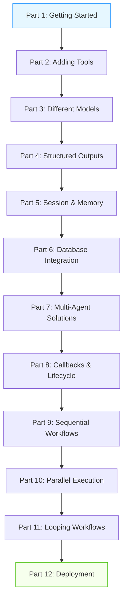

---
categories:
- artificial-intelligence
- agent-development
date: 2025-05-10
header_image_path: /assets/img/blog/headers/2025-05-10-google-adk-masterclass-overview.jpg
image_credit: Photo by Maximalfocus on Unsplash
layout: post
tags: google-adk ai-agents course-overview masterclass
thumbnail_path: /assets/img/blog/thumbnails/2025-05-10-google-adk-masterclass-overview.jpg
title: 'Google ADK Masterclass: Complete Guide to Building AI Agents'
---

# Google ADK Masterclass: Complete Guide to Building AI Agents

Welcome to the comprehensive Google Agent Development Kit (ADK) Masterclass! This 12-part series takes you on a journey from complete beginner to advanced practitioner, covering everything you need to know to build sophisticated AI agent systems using Google's powerful ADK framework.

## What is Google ADK?

Google's Agent Development Kit (ADK) is a powerful framework for building AI agents that can perform complex tasks, automate workflows, and deliver sophisticated solutions across various domains. Released in early 2025, ADK has quickly gained popularity due to its flexibility, robust architecture, and support for multiple LLM providers.

What makes ADK stand out from other agent frameworks is its:

- **Model-agnostic design**: Works with Google's Gemini, OpenAI's GPT, Anthropic's Claude, and more
- **Powerful workflow capabilities**: Sequential, parallel, and looping patterns
- **Robust state management**: Maintain context across conversations
- **Built-in tools**: Search, code execution, and more
- **Deployment options**: From local development to cloud-based solutions

## Who This Masterclass Is For

This series is designed for:

- **Developers** looking to build AI agents for applications
- **Data scientists** wanting to automate complex workflows
- **AI enthusiasts** interested in the latest agent technologies
- **Product managers** seeking to understand AI agent capabilities

## Prerequisites

To get the most out of this masterclass, you should have:

- Basic Python programming knowledge
- Familiarity with AI/ML concepts (helpful but not required)
- A Google Cloud account for API access
- Python 3.9+ installed on your system

## The Complete ADK Masterclass Series

This masterclass is divided into 12 parts, each focusing on a specific aspect of ADK development:

### [Part 1: Getting Started with Agent Development Kit](./google-adk-masterclass-part1)

In this foundational module, we cover the basics of setting up your environment and creating your first agent. You'll learn:
- What ADK is and why it's important
- Setting up your development environment
- Creating and running your first agent
- Understanding the core components of an ADK agent

### [Part 2: Adding Tools to Your Agents](./google-adk-masterclass-part2)

Tools are what make agents truly powerful. In this module, you'll discover:
- Different types of tools available in ADK
- How to implement custom function tools
- Using Google's built-in tools like search
- Best practices for tool development

### [Part 3: Using Different Models with ADK](./google-adk-masterclass-part3)

One of ADK's strengths is its model-agnostic design. This module explores:
- Connecting to OpenAI's GPT models
- Integrating Anthropic's Claude
- Using meta's Llama models
- Strategies for choosing the right model for each task

### [Part 4: Structured Outputs with ADK](./google-adk-masterclass-part4)

Ensuring your agents produce consistent, usable outputs is critical. Here we cover:
- Output schemas using Pydantic
- Enforcing structured responses
- Storing outputs in state
- Handling schema validation

### [Part 5: Session and Memory Management](./google-adk-masterclass-part5)

Agents need to maintain context across interactions. This module teaches:
- Understanding sessions and state
- Creating runners to manage agent execution
- Accessing and updating state
- Building interactive agent loops

### [Part 6: Persisting Sessions to a Database](./google-adk-masterclass-part6)

For production applications, persistence is key. Here you'll learn:
- Setting up database session services
- Persisting conversations to SQLite
- Creating agents that remember previous interactions
- Managing session expiration and cleanup

### [Part 7: Building Multi-Agent Solutions](./google-adk-masterclass-part7)

Complex problems often require multiple specialized agents. This module covers:
- Creating teams of specialized agents
- Agent delegation patterns
- Coordinating multi-agent workflows
- Sharing information between agents

### [Part 8: Callbacks and Agent Lifecycle](./google-adk-masterclass-part8)

For fine-grained control over your agents, you need to understand the agent lifecycle:
- Implementing callbacks for each lifecycle stage
- Modifying prompts and responses
- Monitoring and logging agent activities
- Implementing safety and moderation filters

### [Part 9: Sequential Workflows](./google-adk-masterclass-part9)

Sequential workflows process tasks in a predetermined order. Here you'll learn:
- Building step-by-step processing pipelines
- Passing information between pipeline stages
- Error handling in sequential workflows
- Checkpointing for long-running processes

### [Part 10: Parallel Execution Workflows](./google-adk-masterclass-part10)

For efficiency and speed, parallel execution is key. This module explores:
- Running multiple agents simultaneously
- Gathering and synthesizing parallel results
- Implementing dynamic and conditional parallelism
- Resource management for parallel execution

### [Part 11: Looping Workflows](./google-adk-masterclass-part11)

Some tasks require iterative refinement. This module covers:
- Implementing count-based and condition-based loops
- Progressive refinement patterns
- Convergence detection
- A/B testing within loops

### [Part 12: Practical Applications and Deployment](./google-adk-masterclass-part12)

The final module focuses on taking your agents to production:
- Real-world applications of ADK
- Containerizing agent systems
- Cloud deployment options
- Monitoring, scaling, and maintaining production agents

## How to Get the Most from This Series

To maximize your learning from this masterclass:

1. **Follow in order**: Each part builds on concepts from previous modules
2. **Code along**: Implement the examples as you go through each tutorial
3. **Experiment**: Try variations and extensions of the provided examples
4. **Build projects**: Apply what you learn to real-world problems
5. **Join the community**: Share your creations and questions with other ADK developers

## Source Code

All source code for the examples in this masterclass is available on GitHub. Each module includes detailed code snippets and explanations, but you'll find complete, runnable examples in the repository.

[https://github.com/saptak/adk-masterclass](https://github.com/saptak/adk-masterclass)

## Let's Begin!

Ready to start your journey into building sophisticated AI agents with Google ADK? Begin with [Part 1: Getting Started with Agent Development Kit](./google-adk-masterclass-part1) and work your way through each module at your own pace.

By the end of this series, you'll have the knowledge and skills to build complex agent systems that can solve real-world problems across various domains.

Happy agent building!

