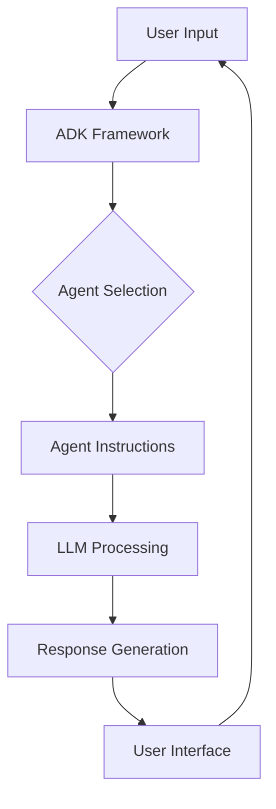

---
categories:
- artificial-intelligence
- agent-development
date: 2025-05-10
header_image_path: /assets/img/blog/headers/2025-05-10-google-adk-masterclass-part1.jpg
image_credit: Photo by Javier Quesada on Unsplash
layout: post
tags: google-adk ai-agents llm-agents gemini
thumbnail_path: /assets/img/blog/thumbnails/2025-05-10-google-adk-masterclass-part1.jpg
title: 'Google ADK Masterclass Part 1: Getting Started with Agent Development Kit'
---

# Google ADK Masterclass: Building AI Agents from Beginner to Pro

[Overview](./2025-05-10-google-adk-masterclass-overview)

Google's Agent Development Kit (ADK) represents a significant advancement in the field of AI agent development. This powerful framework enables developers to create, deploy, and manage AI agents with unprecedented ease and flexibility. In this multi-part blog series, we'll explore ADK from the ground up, starting with the basics and progressively building more complex agent workflows.

## Series Overview

This blog series will cover the following topics:

1. **Getting Started with ADK**: Basic setup and your first agent
2. **Adding Tools to Your Agents**: Enhancing agent capabilities
3. **Using Different Models**: Integrating OpenAI, Anthropic, and other models
4. **Structured Outputs**: Ensuring consistent agent responses
5. **Session and Memory**: Adding state to your agents
6. **Database Integration**: Persisting agent sessions
7. **Multi-Agent Solutions**: Creating agent teams
8. **Callbacks and Agent Lifecycle**: Managing agent execution
9. **Sequential Workflows**: Creating step-by-step agent pipelines
10. **Parallel Execution**: Running agents simultaneously
11. **Looping Workflows**: Building iterative agent processes
12. **Practical Applications**: Real-world use cases and deployment

## Why Google ADK?

Before diving into the technical details, let's understand why Google's ADK is gaining significant traction:

- **Flexibility**: Works with multiple LLM providers, not just Google's Gemini
- **Powerful Tools**: Built-in integrations for search, code execution, and more
- **Scalability**: From simple single-agent applications to complex multi-agent workflows
- **Developer-Friendly**: Clean API design with comprehensive documentation
- **Deployment Options**: Local testing and cloud deployment support

## Part 1: Getting Started with ADK

In this first installment, we'll cover the essentials of setting up your environment and creating your first agent.

### Prerequisites

To follow along with this tutorial, you'll need:

- Python 3.9+ installed on your system
- Basic familiarity with Python programming
- A Google Cloud account for API access

### Setting Up Your Environment

Let's start by creating a virtual environment and installing the necessary dependencies:

```bash
# Create a virtual environment in the 'venv' folder
python -m venv venv

# Activate the virtual environment
# On Windows:
venv\Scripts\activate
# On macOS/Linux:
source venv/bin/activate

# Install required packages
pip install -r requirements.txt
```

Your `requirements.txt` file should include at least:

```
google-generativeai>=0.3.0
google-adk>=0.1.0
python-dotenv>=1.0.0
```

### Creating Your First Agent

ADK requires a specific folder structure to properly identify and run your agents. Here's how to set it up:

1. Create a project folder (e.g., `basic_agent`)
2. Inside that folder, create an agent folder (e.g., `greeting_agent`)
3. In the agent folder, create three files:
   - `__init__.py`: Tells Python this folder is a package
   - `.env`: Stores environment variables (API keys)
   - `agent.py`: Contains the agent definition

Here's what your folder structure should look like:

```
basic_agent/
└── greeting_agent/
    ├── __init__.py
    ├── .env
    └── agent.py
```

Let's examine the contents of each file:

#### `__init__.py`

This file can be empty but must exist to make the folder a Python package.

#### `.env` (rename from `.env.example`)

```
GOOGLE_API_KEY=your_api_key_here
```

#### `agent.py`

```python
from google.adk import Agent

greeting_agent = Agent(
    name="greeting_agent",
    model="models/gemini-2.0-no-flash",
    description="A friendly agent that greets users",
    instructions="You are a helpful assistant that greets the user. Ask the user's name and greet them by their name."
)
```

Let's break down the key components of an agent definition:

1. **name**: The identifier for your agent - must match the folder name
2. **model**: The LLM model to use (in this case, Google's Gemini 2.0)
3. **description**: A brief summary of what the agent does (useful for multi-agent systems)
4. **instructions**: Detailed instructions for the agent's behavior

### Getting Your API Key

To use Google's models, you'll need an API key:

1. Go to [Google AI Studio](https://makersuite.google.com/app/apikey)
2. Sign in with your Google account
3. Click "Create API Key"
4. Copy the generated key and paste it into your `.env` file

### Running Your Agent

ADK provides several ways to run your agent. For development and testing, the web interface is most convenient:

```bash
# Navigate to your project folder
cd basic_agent

# Run the agent in web mode
adk web
```

This will start a local web server (typically at http://localhost:8000) where you can interact with your agent through a user-friendly interface.

Let's test our greeting agent with a simple interaction:

**You**: Hey, how are you?
**Agent**: I'm doing well, thank you for asking! To make things a little more personal, what's your name?
**You**: My name is Alex
**Agent**: Hi Alex! It's nice to meet you. How can I help you today?

### Understanding the Agent Workflow

When you interact with your agent, ADK handles the following workflow:

1. User input is received
2. ADK identifies which agent should handle the request (in this case, only one option)
3. The agent receives the input along with its instructions
4. The LLM processes the input and generates a response
5. The response is returned to the user

The web interface also shows you events generated during this process, helping you debug and understand what's happening behind the scenes.

## Key Advantages of ADK's Architecture

ADK's design provides several benefits:

- **Separation of concerns**: Agent logic is cleanly separated from the runtime environment
- **Modularity**: Each agent is self-contained with its own files and dependencies
- **Extensibility**: Easily add more agents or capabilities as your project grows
- **Transparency**: Event logging helps understand agent decision-making

## Next Steps

In this first part, we've covered the essentials of setting up ADK and creating a basic agent. In Part 2, we'll explore how to enhance your agent with tools and custom functions, enabling it to perform more complex tasks.

Stay tuned for the next installment where we'll dive into:
- Different types of tools available in ADK
- Creating custom function tools
- Using Google's built-in tools like search
- Best practices and limitations when working with tools

## Resources

- [Official ADK Documentation](https://cloud.google.com/vertex-ai/docs/generative-ai/agents/agent-development-kit)
- [Google Gemini Models Overview](https://cloud.google.com/vertex-ai/docs/generative-ai/models/gemini)
- [ADK GitHub Repository](https://github.com/google/adk)

Happy agent building!


[Next...](./2025-05-10-google-adk-masterclass-part2)
