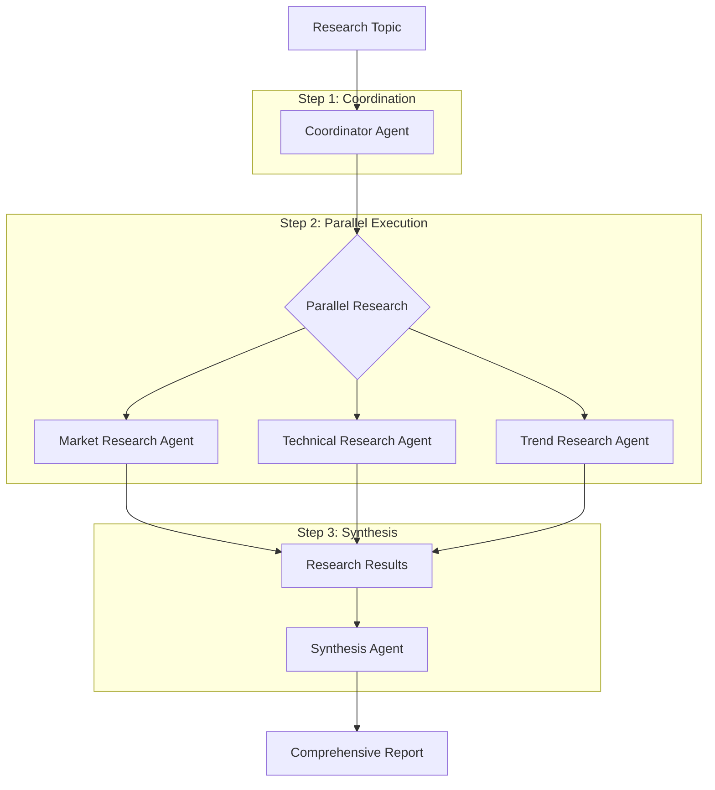

---
categories:
- artificial-intelligence
- agent-development
date: 2025-05-10
header_image_path: /assets/img/blog/headers/2025-05-10-google-adk-masterclass-part10.jpg
image_credit: Photo by ThisisEngineering on Unsplash
layout: post
tags: google-adk ai-agents parallel-execution concurrent-processing workflow-optimization
thumbnail_path: /assets/img/blog/thumbnails/2025-05-10-google-adk-masterclass-part10.jpg
title: 'Google ADK Masterclass Part 10: Parallel Execution Workflows'
---

# Google ADK Masterclass Part 10: Parallel Execution Workflows

In our [previous tutorial](./2025-05-10-google-adk-masterclass-part9.md), we explored sequential workflows, where agents execute in a predetermined order. While sequential workflows are excellent for step-by-step processes, they aren't the most efficient approach when multiple independent tasks need to be completed.

This is where parallel execution workflows shine. Instead of running agents one after another, parallel workflows allow multiple agents to work simultaneously on different aspects of a task. This approach can dramatically improve efficiency and reduce overall processing time.

## Why Use Parallel Workflows?

Parallel workflows offer several key advantages:

1. **Efficiency**: Complete multiple tasks simultaneously rather than sequentially
2. **Speed**: Reduce overall processing time for complex workflows
3. **Resource Utilization**: Make better use of available computing resources
4. **Independence**: Process non-dependent tasks without unnecessary waiting
5. **Scalability**: Handle more complex problems by distributing the workload

## Understanding Parallel Execution in ADK

While ADK doesn't provide built-in primitives specifically for parallel execution, we can implement parallel workflows using Python's asyncio library. This allows us to:

1. Launch multiple agent tasks concurrently
2. Gather their results when all tasks complete
3. Synthesize the individual results into a cohesive output

## Building a Parallel Research Assistant

Let's create a parallel workflow that conducts research on a topic from multiple angles simultaneously. Our system will have:

- A coordinator agent that breaks down the research question
- Three specialized research agents that investigate different aspects in parallel
- A synthesis agent that combines the research into a comprehensive report

### Folder Structure

```
parallel_workflow/
├── main.py
├── utils.py
├── .env
├── coordinator_agent/
│   ├── __init__.py
│   └── agent.py
├── market_research_agent/
│   ├── __init__.py
│   └── agent.py
├── technical_research_agent/
│   ├── __init__.py
│   └── agent.py
├── trend_research_agent/
│   ├── __init__.py
│   └── agent.py
└── synthesis_agent/
    ├── __init__.py
    └── agent.py
```

### Coordinator Agent

```python
# coordinator_agent/agent.py
from google.adk import Agent
from pydantic import BaseModel
from typing import List

class ResearchPlan(BaseModel):
    topic: str
    market_research_questions: List[str]
    technical_research_questions: List[str]
    trend_research_questions: List[str]
    key_considerations: List[str]

coordinator_agent = Agent(
    name="coordinator_agent",
    model="models/gemini-2.0-no-flash",
    description="Breaks down research topics into specialized research questions",
    instructions="""
    You are a research coordinator. Your job is to take a research topic and break it down into specific questions for specialized research teams.
    
    When given a research topic:
    1. Break it down into specific research questions for three specialized teams:
       - Market Research Team: Questions about market size, competitors, customer segments, etc.
       - Technical Research Team: Questions about technology, implementation, product details, etc.
       - Trend Research Team: Questions about industry trends, future developments, emerging patterns, etc.
    
    2. Identify key considerations that should be addressed across all research areas
    
    Provide your output as a structured JSON object with the following fields:
    {
        "topic": "The main research topic",
        "market_research_questions": ["Question 1", "Question 2", ...],
        "technical_research_questions": ["Question 1", "Question 2", ...],
        "trend_research_questions": ["Question 1", "Question 2", ...],
        "key_considerations": ["Consideration 1", "Consideration 2", ...]
    }
    
    Include 3-5 questions for each specialized team. Make the questions specific, actionable, and relevant to the research topic.
    """,
    output_schema=ResearchPlan,
    output_key="research_plan"
)
```

### Specialized Research Agents

```python
# market_research_agent/agent.py
from google.adk import Agent
from pydantic import BaseModel
from typing import List, Dict

class MarketResearchReport(BaseModel):
    key_findings: List[str]
    market_size: str
    competitors: List[Dict[str, str]]
    customer_segments: List[Dict[str, str]]
    growth_potential: str
    challenges: List[str]
    recommendations: List[str]

market_research_agent = Agent(
    name="market_research_agent",
    model="models/gemini-2.0-no-flash",
    description="Conducts market research on specific topics",
    instructions="""
    You are a market research specialist. Your job is to research and analyze market information based on specific questions.
    
    When given market research questions:
    1. Conduct thorough market research on each question
    2. Focus on market size, competitors, customer segments, growth potential, and challenges
    3. Provide actionable insights and recommendations
    
    Format your response as a structured JSON object with the following fields:
    {
        "key_findings": ["Finding 1", "Finding 2", ...],
        "market_size": "Description of market size and value",
        "competitors": [
            {"name": "Competitor name", "description": "Brief description", "market_share": "Estimated share"},
            ...
        ],
        "customer_segments": [
            {"segment": "Segment name", "description": "Brief description", "size": "Estimated size"},
            ...
        ],
        "growth_potential": "Analysis of growth potential",
        "challenges": ["Challenge 1", "Challenge 2", ...],
        "recommendations": ["Recommendation 1", "Recommendation 2", ...]
    }
    
    Be thorough, data-driven, and objective in your analysis. Provide specific details where possible, but acknowledge when information is estimated or uncertain.
    """,
    output_schema=MarketResearchReport,
    output_key="market_research"
)

# technical_research_agent/agent.py
from google.adk import Agent
from pydantic import BaseModel
from typing import List, Dict

class TechnicalResearchReport(BaseModel):
    key_findings: List[str]
    technologies: List[Dict[str, str]]
    implementation_approaches: List[Dict[str, str]]
    technical_challenges: List[str]
    resources_required: Dict[str, str]
    timeline_estimate: str
    recommendations: List[str]

technical_research_agent = Agent(
    name="technical_research_agent",
    model="models/gemini-2.0-no-flash",
    description="Conducts technical research on specific topics",
    instructions="""
    You are a technical research specialist. Your job is to research and analyze technical information based on specific questions.
    
    When given technical research questions:
    1. Conduct thorough technical research on each question
    2. Focus on technologies, implementation approaches, technical challenges, resources required, and timeline estimates
    3. Provide actionable technical insights and recommendations
    
    Format your response as a structured JSON object with the following fields:
    {
        "key_findings": ["Finding 1", "Finding 2", ...],
        "technologies": [
            {"name": "Technology name", "description": "Brief description", "maturity": "Maturity level"},
            ...
        ],
        "implementation_approaches": [
            {"approach": "Approach name", "description": "Brief description", "complexity": "Complexity level"},
            ...
        ],
        "technical_challenges": ["Challenge 1", "Challenge 2", ...],
        "resources_required": {
            "expertise": "Required expertise",
            "tools": "Required tools",
            "infrastructure": "Required infrastructure"
        },
        "timeline_estimate": "Estimated timeline for implementation",
        "recommendations": ["Recommendation 1", "Recommendation 2", ...]
    }
    
    Be thorough, technically accurate, and practical in your analysis. Provide specific details where possible, but acknowledge when information is estimated or uncertain.
    """,
    output_schema=TechnicalResearchReport,
    output_key="technical_research"
)

# trend_research_agent/agent.py
from google.adk import Agent
from pydantic import BaseModel
from typing import List, Dict

class TrendResearchReport(BaseModel):
    key_findings: List[str]
    current_trends: List[Dict[str, str]]
    emerging_patterns: List[Dict[str, str]]
    future_predictions: List[Dict[str, str]]
    potential_disruptions: List[str]
    strategic_opportunities: List[str]
    recommendations: List[str]

trend_research_agent = Agent(
    name="trend_research_agent",
    model="models/gemini-2.0-no-flash",
    description="Conducts research on industry trends and future developments",
    instructions="""
    You are a trend research specialist. Your job is to research and analyze industry trends and future developments based on specific questions.
    
    When given trend research questions:
    1. Conduct thorough trend research on each question
    2. Focus on current trends, emerging patterns, future predictions, potential disruptions, and strategic opportunities
    3. Provide forward-looking insights and recommendations
    
    Format your response as a structured JSON object with the following fields:
    {
        "key_findings": ["Finding 1", "Finding 2", ...],
        "current_trends": [
            {"trend": "Trend name", "description": "Brief description", "impact": "Current impact"},
            ...
        ],
        "emerging_patterns": [
            {"pattern": "Pattern name", "description": "Brief description", "timeline": "Emergence timeline"},
            ...
        ],
        "future_predictions": [
            {"prediction": "Prediction", "likelihood": "Likelihood", "horizon": "Time horizon"},
            ...
        ],
        "potential_disruptions": ["Disruption 1", "Disruption 2", ...],
        "strategic_opportunities": ["Opportunity 1", "Opportunity 2", ...],
        "recommendations": ["Recommendation 1", "Recommendation 2", ...]
    }
    
    Be forward-thinking, holistic, and insightful in your analysis. Consider both short-term and long-term perspectives. Acknowledge the uncertainty inherent in future predictions.
    """,
    output_schema=TrendResearchReport,
    output_key="trend_research"
)
```

### Synthesis Agent

```python
# synthesis_agent/agent.py
from google.adk import Agent
from pydantic import BaseModel

class ComprehensiveResearchReport(BaseModel):
    executive_summary: str
    market_insights: str
    technical_insights: str
    trend_insights: str
    integrated_findings: str
    strategic_recommendations: str
    conclusion: str

synthesis_agent = Agent(
    name="synthesis_agent",
    model="models/gemini-2.0-no-flash",
    description="Synthesizes multiple research reports into a comprehensive document",
    instructions="""
    You are a research synthesis specialist. Your job is to combine research from multiple specialized teams into a comprehensive, cohesive report.
    
    When given research reports from market, technical, and trend research teams:
    1. Synthesize the information into a coherent whole
    2. Identify connections, patterns, and contradictions across the reports
    3. Develop integrated findings and strategic recommendations
    4. Create a comprehensive research report that presents a unified perspective
    
    Format your response as a structured JSON object with the following fields:
    {
        "executive_summary": "A concise summary of the overall research findings and recommendations",
        "market_insights": "Synthesis of key market research findings",
        "technical_insights": "Synthesis of key technical research findings",
        "trend_insights": "Synthesis of key trend research findings",
        "integrated_findings": "Analysis of how the different research areas connect and interact",
        "strategic_recommendations": "Comprehensive recommendations based on all research",
        "conclusion": "Final thoughts and next steps"
    }
    
    Be comprehensive but concise, highlighting the most important insights from each research area and how they relate to each other. Focus on actionable insights and strategic implications.
    """,
    output_schema=ComprehensiveResearchReport,
    output_key="comprehensive_report"
)
```

### Implementing Parallel Execution (main.py)

```python
import os
import asyncio
import uuid
import json
from dotenv import load_dotenv
from pprint import pprint

from google.adk.orchestration import Runner
from google.adk.orchestration.session import InMemorySessionService
from google.generativeai.types import content_types
from google.generativeai.types.content_types import Part

# Import our agents
from coordinator_agent.agent import coordinator_agent
from market_research_agent.agent import market_research_agent
from technical_research_agent.agent import technical_research_agent
from trend_research_agent.agent import trend_research_agent
from synthesis_agent.agent import synthesis_agent

# Load environment variables
load_dotenv()

async def run_agent(runner, user_id, session_id, agent_name, content):
    """Run a specific agent with the given content."""
    print(f"\nRunning {agent_name}...")
    
    # Create content object if string is provided
    if isinstance(content, str):
        content = content_types.Content(
            role="user",
            parts=[Part.from_text(content)]
        )
    
    # Run the agent
    response = await runner.run_async(
        user_id=user_id,
        session_id=session_id,
        content=content,
        agent_name=agent_name
    )
    
    # Process the response
    final_response_text = None
    for event in response.events:
        if event.type == "content" and event.content.role == "agent":
            final_response_text = event.content.parts[0].text
    
    # Get the session to access state
    session = runner.session_service.get_session(
        user_id=user_id,
        session_id=session_id
    )
    
    print(f"{agent_name} completed.")
    return final_response_text, session.state

async def parallel_research_workflow(research_topic):
    """Run a parallel research workflow on the given topic."""
    # Create a session service
    session_service = InMemorySessionService()
    
    # Create a session
    session_id = str(uuid.uuid4())
    user_id = "workflow_user"
    session = session_service.create_session(
        app_name="ParallelResearch",
        user_id=user_id,
        session_id=session_id
    )
    
    # Create a runner with all our agents
    runner = Runner(
        root_agent=coordinator_agent,  # This doesn't matter in our case as we specify agent_name
        agents=[
            coordinator_agent,
            market_research_agent,
            technical_research_agent,
            trend_research_agent,
            synthesis_agent
        ],
        session_service=session_service
    )
    
    # Step 1: Break down the research topic
    coordinator_prompt = f"Please break down this research topic into specific questions for our specialized teams: {research_topic}"
    _, state = await run_agent(
        runner, user_id, session_id, "coordinator_agent", coordinator_prompt
    )
    
    # Get the research plan
    research_plan = state.get("research_plan")
    if not research_plan:
        print("Failed to create research plan.")
        return
    
    print("\nResearch Plan:")
    pprint(research_plan)
    
    # Step 2: Run specialized research agents in parallel
    # Prepare the prompts for each agent
    market_prompt = f"Please research these market questions about {research_plan['topic']}:\n" + "\n".join(f"- {q}" for q in research_plan["market_research_questions"]) + f"\n\nKey considerations: {research_plan['key_considerations']}"
    
    technical_prompt = f"Please research these technical questions about {research_plan['topic']}:\n" + "\n".join(f"- {q}" for q in research_plan["technical_research_questions"]) + f"\n\nKey considerations: {research_plan['key_considerations']}"
    
    trend_prompt = f"Please research these trend questions about {research_plan['topic']}:\n" + "\n".join(f"- {q}" for q in research_plan["trend_research_questions"]) + f"\n\nKey considerations: {research_plan['key_considerations']}"
    
    # Run the three research agents in parallel
    research_tasks = [
        run_agent(runner, user_id, session_id, "market_research_agent", market_prompt),
        run_agent(runner, user_id, session_id, "technical_research_agent", technical_prompt),
        run_agent(runner, user_id, session_id, "trend_research_agent", trend_prompt)
    ]
    
    # Await all research tasks to complete
    research_results = await asyncio.gather(*research_tasks)
    
    # Extract the state from each result
    _, market_state = research_results[0]
    _, technical_state = research_results[1]
    _, trend_state = research_results[2]
    
    # Get the research reports
    market_research = market_state.get("market_research")
    technical_research = technical_state.get("technical_research")
    trend_research = trend_state.get("trend_research")
    
    if not market_research or not technical_research or not trend_research:
        print("One or more research reports are missing.")
        return
    
    # Step 3: Synthesize the research
    synthesis_prompt = f"""
    Please synthesize these research reports on {research_plan['topic']}:
    
    MARKET RESEARCH:
    {json.dumps(market_research, indent=2)}
    
    TECHNICAL RESEARCH:
    {json.dumps(technical_research, indent=2)}
    
    TREND RESEARCH:
    {json.dumps(trend_research, indent=2)}
    
    Provide a comprehensive synthesis that integrates all three perspectives.
    """
    
    _, synthesis_state = await run_agent(
        runner, user_id, session_id, "synthesis_agent", synthesis_prompt
    )
    
    # Get the comprehensive report
    comprehensive_report = synthesis_state.get("comprehensive_report")
    if not comprehensive_report:
        print("Failed to create comprehensive report.")
        return
    
    print("\n--- COMPREHENSIVE RESEARCH REPORT ---")
    print(f"\nExecutive Summary:\n{comprehensive_report['executive_summary']}")
    print(f"\nIntegrated Findings:\n{comprehensive_report['integrated_findings']}")
    print(f"\nStrategic Recommendations:\n{comprehensive_report['strategic_recommendations']}")
    
    return comprehensive_report

async def main():
    # Research topic
    research_topic = "The future of renewable energy storage technologies in 2025-2030"
    
    print(f"Conducting parallel research on: {research_topic}")
    
    report = await parallel_research_workflow(research_topic)
    
    if report:
        print("\nParallel research workflow completed successfully!")
        
        # Save the report to a file
        with open("research_output.json", "w") as f:
            json.dump(report, f, indent=2)
        print("Report saved to research_output.json")

if __name__ == "__main__":
    asyncio.run(main())
```

### Running the Parallel Workflow

Run the example with:

```bash
cd parallel_workflow
python main.py
```

Example output (abbreviated):

```
Conducting parallel research on: The future of renewable energy storage technologies in 2025-2030

Running coordinator_agent...
coordinator_agent completed.

Research Plan:
{'key_considerations': ['Cost-effectiveness and economic viability',
                        'Scalability for grid-level implementation',
                        'Environmental impact and sustainability',
                        'Integration with existing infrastructure',
                        'Regulatory and policy frameworks'],
 'market_research_questions': ['What is the current market size and projected '
                               'growth for renewable energy storage technologies '
                               'from 2025-2030?',
                               'Who are the key players and competitors in the '
                               'renewable energy storage market?',
                               'What are the primary customer segments and their '
                               'specific needs for energy storage solutions?',
                               'What are the main economic barriers and drivers '
                               'for adoption of renewable energy storage '
                               'technologies?',
                               'How do regional markets differ in terms of '
                               'renewable energy storage adoption and growth '
                               'potential?'],
 'technical_research_questions': ['What are the most promising renewable energy '
                                  'storage technologies being developed for '
                                  '2025-2030?',
                                  'How do different storage technologies compare '
                                  'in terms of energy density, efficiency, and '
                                  'longevity?',
                                  'What technical challenges need to be overcome '
                                  'to achieve widespread implementation?',
                                  'How will these storage technologies integrate '
                                  'with various renewable energy generation '
                                  'sources?',
                                  'What infrastructure requirements are necessary '
                                  'for deploying these technologies at scale?'],
 'topic': 'The future of renewable energy storage technologies in 2025-2030',
 'trend_research_questions': ['What emerging trends are shaping the development '
                              'of renewable energy storage technologies?',
                              'How are government policies and incentives '
                              'expected to evolve regarding energy storage from '
                              '2025-2030?',
                              'What potential disruptive technologies might '
                              'impact the renewable energy storage landscape?',
                              'How are corporate and utility investment patterns '
                              'in energy storage expected to change?',
                              'What role will renewable energy storage play in '
                              'the broader transition to sustainable energy '
                              'systems?']}

Running market_research_agent...
Running technical_research_agent...
Running trend_research_agent...
market_research_agent completed.
technical_research_agent completed.
trend_research_agent completed.

Running synthesis_agent...
synthesis_agent completed.

--- COMPREHENSIVE RESEARCH REPORT ---

Executive Summary:
The renewable energy storage market is poised for explosive growth between 2025-2030, projected to reach $175-200 billion by 2030 with a CAGR of 20-25%. This growth is driven by declining costs, supportive policies, and increasing renewable energy integration needs. Lithium-ion technologies will maintain market dominance, but advanced battery chemistries (solid-state, sodium-ion), green hydrogen, and gravity-based storage show significant promise for grid-scale applications. Flow batteries and thermal storage systems are emerging as complementary solutions for longer-duration storage needs. The industry is witnessing strategic consolidation among key players like Tesla, LG Energy Solution, and Fluence, alongside a surge in innovative startups focused on novel chemistries and designs. Regional markets vary significantly, with Asia-Pacific leading manufacturing while North America and Europe focus on deployment and research. Key success factors include continued cost reduction, technological advancements in energy density and cycle life, infrastructure development, and favorable regulatory frameworks. Organizations should pursue strategic partnerships, develop diversified storage portfolios, and closely monitor evolving technologies while focusing on integrated energy management solutions that maximize the value of storage assets.

Integrated Findings:
The integration of market, technical, and trend research reveals several critical insights for the renewable energy storage sector in 2025-2030. First, there is a clear convergence toward diversification beyond lithium-ion dominance, with multiple promising technologies advancing simultaneously rather than a single solution emerging as superior. This technology diversification aligns with varied application needs across different market segments and regional requirements.

Market growth is being driven by a complex interplay of factors, including declining costs (projected 40-60% reduction for lithium-ion by 2030), renewable energy integration challenges, and increasingly favorable policy environments. These factors are creating a self-reinforcing cycle of investment, innovation, and deployment that is accelerating adoption.

A key technical-market interface is developing around long-duration energy storage (LDES), which represents both the most significant technical challenge and the largest potential market opportunity. Technologies like flow batteries, advanced thermal storage, and green hydrogen are positioned to address this gap, with significant implications for grid resilience and renewable integration.

The industry structure is evolving toward an ecosystem model rather than vertical integration. Traditional battery manufacturers are partnering with AI/software firms for advanced energy management systems, while utilities are engaging with multiple technology providers to develop optimized hybrid storage systems. This trend toward collaboration rather than competition between different storage technologies is reshaping business models.

Regional differences in focus areas are creating global supply chain interdependencies, with Asia dominating manufacturing, Europe leading in policy innovation, and North America focusing on software integration and business model development. This suggests that successful market participants will need global strategies rather than regional approaches.

Sustainability considerations are increasingly influencing both technical development and market acceptance, with circular economy principles becoming integrated into product design rather than being treated as separate initiatives. This represents a fundamental shift from earlier generations of energy technology deployment.

Strategic Recommendations:
1. Develop a diversified storage technology portfolio rather than betting on a single solution. Organizations should pursue a strategic mix of proven technologies for near-term applications while investing in emerging technologies for longer-term positioning. This balanced approach should include both short-duration and long-duration storage solutions.

2. Prioritize integration capabilities and software development alongside hardware advancements. The most successful implementations will feature sophisticated energy management systems that optimize across multiple storage technologies and integrate with renewable generation sources. Companies should invest in AI and machine learning capabilities for predictive maintenance and dynamic dispatch.

3. Form strategic partnerships across the value chain to address the increasingly complex ecosystem. Battery manufacturers should partner with materials suppliers and recycling firms, while project developers should engage with multiple technology providers and financial institutions specializing in energy transition financing.

4. Develop regional strategies that acknowledge distinct market characteristics while leveraging global supply chains. This includes establishing manufacturing presence in Asia-Pacific, R&D facilities in Europe or North America, and deployment expertise adaptable to local regulatory environments.

5. Incorporate sustainability and circular economy principles into core business strategy. Design storage systems for recyclability and second-life applications from the outset, implement responsible supply chain practices for critical minerals, and develop transparent environmental impact reporting to meet growing regulatory requirements and customer expectations.

6. Engage proactively with policy development and standardization efforts. As regulatory frameworks evolve rapidly between 2025-2030, organizations should participate in industry associations, contribute to technical standards development, and maintain dialog with policymakers to help shape supportive frameworks.

7. Implement agile business models capable of adapting to rapidly changing technology landscapes and market conditions. This includes designing flexible manufacturing facilities, maintaining technology-agnostic project development capabilities, and developing financing structures appropriate for different storage technologies' risk profiles and lifespans.

8. Invest in workforce development focusing on the interdisciplinary skills required for next-generation storage technologies. This should include expertise in electrochemistry, materials science, power electronics, software development, and system integration.

Parallel research workflow completed successfully!
Report saved to research_output.json
```

## Understanding Parallel Workflows

Let's analyze how our parallel workflow operates:

1. **Initial Coordination**: The coordinator agent breaks down the main task into subtasks
2. **Parallel Execution**: Multiple specialized agents work simultaneously on different aspects
3. **Parallel Gathering**: `asyncio.gather()` collects results from all parallel tasks
4. **Final Synthesis**: A synthesis agent combines the results into a cohesive whole

The key to this pattern is the `asyncio.gather()` function, which allows us to launch multiple agent tasks concurrently and wait for all of them to complete.

## Advanced Parallel Workflow Techniques

Now that we understand the basics, let's explore some advanced techniques for building more sophisticated parallel workflows.

### 1. Dynamic Parallelism

You can dynamically determine the number of parallel tasks based on the input:

```python
async def dynamic_parallel_workflow(research_topic):
    """Run a workflow with dynamic parallelism based on topic complexity."""
    # First, determine complexity and required research areas
    complexity_response, state = await run_agent(
        runner, user_id, session_id, "complexity_analyzer", research_topic
    )
    
    # Extract required research areas
    required_areas = state.get("required_research_areas", [])
    
    # Create tasks for each required area
    research_tasks = []
    for area in required_areas:
        if area == "market":
            research_tasks.append(run_agent(runner, user_id, session_id, 
                                         "market_research_agent", research_topic))
        elif area == "technical":
            research_tasks.append(run_agent(runner, user_id, session_id, 
                                         "technical_research_agent", research_topic))
        elif area == "trend":
            research_tasks.append(run_agent(runner, user_id, session_id, 
                                         "trend_research_agent", research_topic))
        elif area == "regulatory":
            research_tasks.append(run_agent(runner, user_id, session_id, 
                                         "regulatory_research_agent", research_topic))
        # Add other specialized areas as needed
    
    # Run all required research tasks in parallel
    research_results = await asyncio.gather(*research_tasks)
    
    # Continue with synthesis...
```

### 2. Conditional Parallelism

You can execute different tasks based on the results of previous parallel execution:

```python
async def conditional_parallel_workflow(research_topic):
    """Run a workflow with conditional paths based on initial research."""
    # Run initial parallel research
    initial_tasks = [
        run_agent(runner, user_id, session_id, "quick_market_scan", research_topic),
        run_agent(runner, user_id, session_id, "quick_technical_scan", research_topic)
    ]
    
    initial_results = await asyncio.gather(*initial_tasks)
    
    # Extract scan results
    _, market_scan_state = initial_results[0]
    _, technical_scan_state = initial_results[1]
    
    market_opportunity = market_scan_state.get("market_opportunity", "low")
    technical_feasibility = technical_scan_state.get("technical_feasibility", "low")
    
    # Determine next parallel tasks based on opportunity and feasibility
    next_tasks = []
    
    if market_opportunity == "high":
        next_tasks.append(run_agent(runner, user_id, session_id, 
                                 "deep_market_research", research_topic))
        next_tasks.append(run_agent(runner, user_id, session_id, 
                                 "competitor_analysis", research_topic))
    
    if technical_feasibility == "high":
        next_tasks.append(run_agent(runner, user_id, session_id, 
                                 "technology_deep_dive", research_topic))
        next_tasks.append(run_agent(runner, user_id, session_id, 
                                 "implementation_planning", research_topic))
    
    # If both are low, run a pivot analysis
    if market_opportunity == "low" and technical_feasibility == "low":
        next_tasks.append(run_agent(runner, user_id, session_id, 
                                 "pivot_opportunity_analysis", research_topic))
    
    # Run the next set of tasks in parallel
    next_results = await asyncio.gather(*next_tasks)
    
    # Continue with appropriate synthesis...
```

### 3. Parallel with Timeout

You can set timeouts for parallel tasks to ensure your workflow doesn't hang:

```python
async def parallel_with_timeout(research_topic, timeout_seconds=60):
    """Run parallel research with a timeout for each task."""
    async def run_agent_with_timeout(agent_name, prompt):
        try:
            return await asyncio.wait_for(
                run_agent(runner, user_id, session_id, agent_name, prompt),
                timeout=timeout_seconds
            )
        except asyncio.TimeoutError:
            print(f"Warning: {agent_name} timed out after {timeout_seconds} seconds")
            return None, {}
    
    # Run research tasks with timeouts
    research_tasks = [
        run_agent_with_timeout("market_research_agent", f"Research market for: {research_topic}"),
        run_agent_with_timeout("technical_research_agent", f"Research technology for: {research_topic}"),
        run_agent_with_timeout("trend_research_agent", f"Research trends for: {research_topic}")
    ]
    
    # Gather results, including potential timeouts
    research_results = await asyncio.gather(*research_tasks)
    
    # Filter out any None results from timeouts
    valid_results = [(result, state) for result, state in research_results if result is not None]
    
    # Continue with synthesis of available results...
```

### 4. Parallel with Priority

You can implement a priority system for parallel tasks:

```python
async def parallel_with_priority(research_topic):
    """Run parallel research with priorities for different tasks."""
    # Define priority levels (1 = highest, 3 = lowest)
    priorities = {
        "market_research_agent": 1,
        "technical_research_agent": 1,
        "trend_research_agent": 2,
        "regulatory_research_agent": 2,
        "competitive_research_agent": 3
    }
    
    # Group tasks by priority
    priority_1_tasks = []
    priority_2_tasks = []
    priority_3_tasks = []
    
    for agent_name, priority in priorities.items():
        prompt = f"Research {agent_name.split('_')[0]} aspects of: {research_topic}"
        task = run_agent(runner, user_id, session_id, agent_name, prompt)
        
        if priority == 1:
            priority_1_tasks.append(task)
        elif priority == 2:
            priority_2_tasks.append(task)
        else:
            priority_3_tasks.append(task)
    
    # Run priority 1 tasks first and wait for them to complete
    priority_1_results = await asyncio.gather(*priority_1_tasks)
    
    # Run priority 2 tasks next
    priority_2_results = await asyncio.gather(*priority_2_tasks)
    
    # Run priority 3 tasks last
    priority_3_results = await asyncio.gather(*priority_3_tasks)
    
    # Combine all results
    all_results = priority_1_results + priority_2_results + priority_3_results
    
    # Continue with synthesis...
```

## Best Practices for Parallel Workflows

Based on our experience building parallel workflows, here are some best practices:

### 1. Clear Task Boundaries

Ensure each parallel task is independent and well-defined to avoid conflicts and dependencies:

```python
# Good: Clear, independent tasks
research_tasks = [
    run_agent(runner, user_id, session_id, "market_research_agent", market_prompt),
    run_agent(runner, user_id, session_id, "technical_research_agent", technical_prompt),
    run_agent(runner, user_id, session_id, "trend_research_agent", trend_prompt)
]

# Bad: Tasks with potential dependencies
research_tasks = [
    run_agent(runner, user_id, session_id, "market_research_agent", market_prompt),
    run_agent(runner, user_id, session_id, "feasibility_agent", "Use market research to assess feasibility"),
    run_agent(runner, user_id, session_id, "trend_research_agent", trend_prompt)
]
```

### 2. Proper Error Handling

Implement robust error handling to manage failures in parallel tasks:

```python
async def run_parallel_with_error_handling(tasks):
    """Run tasks in parallel with error handling."""
    results = []
    
    for completed_task in asyncio.as_completed(tasks):
        try:
            result = await completed_task
            results.append(result)
        except Exception as e:
            print(f"Task failed with error: {e}")
            results.append(None)  # Add None for failed tasks
    
    return results
```

### 3. Resource Management

Be mindful of resource usage, especially when running many parallel tasks:

```python
async def resource_managed_parallel(tasks, max_concurrency=5):
    """Run parallel tasks with a limit on concurrency."""
    semaphore = asyncio.Semaphore(max_concurrency)
    
    async def limited_task(task):
        async with semaphore:
            return await task
    
    limited_tasks = [limited_task(task) for task in tasks]
    return await asyncio.gather(*limited_tasks)
```

### 4. State Isolation

When using parallel tasks with the same session, ensure state keys don't conflict:

```python
# Good: Isolated state keys
market_research_agent = Agent(
    # ...
    output_key="market_research"
)

technical_research_agent = Agent(
    # ...
    output_key="technical_research"
)

# Bad: Overlapping state keys
market_research_agent = Agent(
    # ...
    output_key="research_results"  # Conflict!
)

technical_research_agent = Agent(
    # ...
    output_key="research_results"  # Conflict!
)
```

### 5. Monitoring and Logging

Implement comprehensive monitoring for parallel workflows:

```python
async def run_agent_with_monitoring(runner, user_id, session_id, agent_name, content):
    """Run an agent with detailed monitoring."""
    start_time = time.time()
    
    try:
        print(f"[{agent_name}] Starting execution")
        result = await run_agent(runner, user_id, session_id, agent_name, content)
        execution_time = time.time() - start_time
        print(f"[{agent_name}] Completed in {execution_time:.2f} seconds")
        
        # Log successful execution
        log_execution(agent_name, "success", execution_time)
        
        return result
    except Exception as e:
        execution_time = time.time() - start_time
        print(f"[{agent_name}] Failed after {execution_time:.2f} seconds: {e}")
        
        # Log failed execution
        log_execution(agent_name, "failure", execution_time, str(e))
        
        raise  # Re-raise the exception
```

## Real-World Applications of Parallel Workflows

Parallel workflows are ideal for many real-world applications:

### 1. Comprehensive Analysis

```
Topic Breakdown → 
    [Financial Analysis, Market Analysis, Risk Analysis, Competitive Analysis] → 
        Synthesis Report
```

### 2. Multi-perspective Content Creation

```
Content Brief → 
    [Technical Writer, Creative Writer, SEO Specialist, Fact Checker] → 
        Content Integration
```

### 3. Multi-source Research

```
Research Question → 
    [Academic Research, Industry Research, Social Media Analysis, News Analysis] → 
        Research Synthesis
```

### 4. Product Development Evaluation

```
Product Concept → 
    [Market Viability, Technical Feasibility, Cost Analysis, Regulatory Compliance] → 
        Go/No-Go Decision
```

### 5. Customer Feedback Analysis

```
Feedback Collection → 
    [Sentiment Analysis, Feature Request Extraction, Bug Report Analysis, User Experience Evaluation] → 
        Product Improvement Plan
```

## Conclusion

Parallel workflows in ADK offer a powerful approach for tackling complex tasks efficiently. By executing multiple agent tasks concurrently, you can dramatically reduce processing time and make better use of available resources. This pattern is especially valuable for comprehensive analyses, research projects, and other tasks where multiple independent perspectives are needed.

In this tutorial, we've covered:
- The fundamentals of parallel workflows
- Building a parallel research system with specialized agents
- Advanced techniques like dynamic parallelism and priority handling
- Best practices for designing effective parallel workflows
- Real-world applications where parallel workflows excel

In the next part of our series, we'll explore looping workflows, allowing agents to iterate repeatedly until they achieve a desired outcome.

## Resources

- [ADK Workflow Patterns Documentation](https://cloud.google.com/vertex-ai/docs/generative-ai/agents/agent-development-kit/workflow-patterns)
- [Python asyncio Documentation](https://docs.python.org/3/library/asyncio.html)
- [Concurrency Best Practices](https://cloud.google.com/architecture/parallel-processing-patterns)


