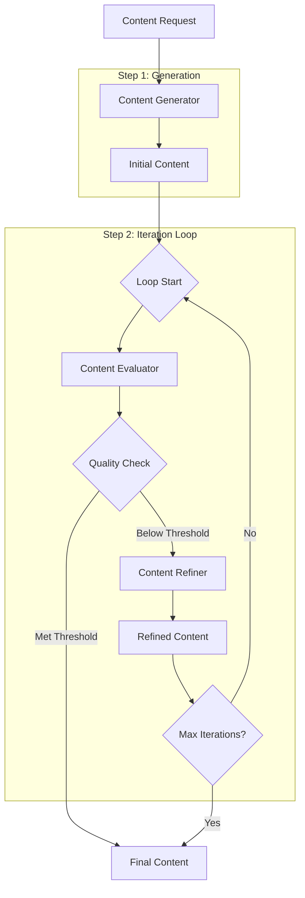

---
categories:
- artificial-intelligence
- agent-development
date: 2025-05-10
header_image_path: /assets/img/blog/headers/2025-05-10-google-adk-masterclass-part11.jpg
image_credit: Photo by Fabian Irsara on Unsplash
layout: post
tags: google-adk ai-agents looping-workflows iterative-processes refinement
thumbnail_path: /assets/img/blog/thumbnails/2025-05-10-google-adk-masterclass-part11.jpg
title: 'Google ADK Masterclass Part 11: Looping Workflows'
---

# Google ADK Masterclass Part 11: Looping Workflows

In our [previous tutorials](./2025-05-10-google-adk-masterclass-part10.md), we explored sequential and parallel workflows in ADK. Now, we'll dive into the third major workflow pattern: looping workflows.

Looping workflows allow agents to repeat a process multiple times, refining their outputs until they meet specific criteria or achieve a desired outcome. This pattern is particularly useful for tasks that require multiple iterations to reach an optimal solution, such as content refinement, complex problem-solving, or optimization challenges.

## Why Use Looping Workflows?

Looping workflows offer several key advantages:

1. **Iterative Refinement**: Gradually improve outputs through multiple passes
2. **Quality Control**: Continue processing until specific quality thresholds are met
3. **Complex Problem Solving**: Break down difficult problems into manageable iterations
4. **Self-Correction**: Allow agents to learn from previous attempts
5. **Optimization**: Find better solutions through successive approximation

## Understanding Looping Patterns in ADK

While ADK doesn't provide built-in primitives specifically for looping, we can implement looping workflows using Python's control structures. The two primary looping patterns are:

1. **Count-based loops**: Iterate a fixed number of times
2. **Condition-based loops**: Iterate until a specific condition is met

In this tutorial, we'll implement both patterns to demonstrate how looping can enhance agent capabilities.

## Building a Content Refinement System

Let's create a looping workflow that iteratively refines content based on specific criteria. Our system will:

1. Generate initial content based on a prompt
2. Evaluate the content against quality criteria
3. Refine the content based on the evaluation
4. Repeat until the content meets a quality threshold or reaches a maximum number of iterations

### Folder Structure

```
looping_workflow/
├── main.py
├── utils.py
├── .env
├── content_generator/
│   ├── __init__.py
│   └── agent.py
├── content_evaluator/
│   ├── __init__.py
│   └── agent.py
└── content_refiner/
    ├── __init__.py
    └── agent.py
```

### Content Generator Agent

```python
# content_generator/agent.py
from google.adk import Agent
from pydantic import BaseModel

class GeneratedContent(BaseModel):
    content: str
    title: str
    target_audience: str
    key_points: list
    content_type: str
    word_count: int

content_generator = Agent(
    name="content_generator",
    model="models/gemini-2.0-no-flash",
    description="Generates content based on specific requirements",
    instructions="""
    You are a skilled content creator. Your job is to generate high-quality content based on the user's requirements.
    
    When given a content request:
    1. Analyze the topic, purpose, and any specific requirements
    2. Generate appropriate content that is engaging, informative, and well-structured
    3. Ensure the content matches the requested style, tone, and format
    4. Include a compelling title and clear key points
    
    Format your response as a structured JSON object with the following fields:
    {
        "content": "The full content text",
        "title": "A compelling title for the content",
        "target_audience": "The primary audience for this content",
        "key_points": ["Key point 1", "Key point 2", ...],
        "content_type": "The type of content (e.g., blog post, email, social media)",
        "word_count": The approximate word count of the content
    }
    
    Be creative, engaging, and focused on delivering value to the intended audience.
    """,
    output_schema=GeneratedContent,
    output_key="generated_content"
)
```

### Content Evaluator Agent

```python
# content_evaluator/agent.py
from google.adk import Agent
from pydantic import BaseModel
from typing import List, Dict

class ContentEvaluation(BaseModel):
    overall_score: int  # 1-10
    meets_requirements: bool
    strengths: List[str]
    weaknesses: List[str]
    improvement_areas: List[Dict[str, str]]
    quality_threshold_met: bool

content_evaluator = Agent(
    name="content_evaluator",
    model="models/gemini-2.0-no-flash",
    description="Evaluates content quality against specific criteria",
    instructions="""
    You are a content quality evaluator. Your job is to critically assess content against specific quality criteria.
    
    When evaluating content:
    1. Analyze the content objectively against the provided requirements
    2. Identify strengths and weaknesses
    3. Suggest specific improvements
    4. Determine if the content meets a high-quality threshold
    
    Quality criteria to consider:
    - Relevance to the topic and target audience
    - Clarity and coherence
    - Engagement and interest level
    - Accuracy and depth of information
    - Structure and organization
    - Language, grammar, and readability
    - Originality and uniqueness
    
    Format your evaluation as a structured JSON object with the following fields:
    {
        "overall_score": A score from 1-10,
        "meets_requirements": true/false,
        "strengths": ["Strength 1", "Strength 2", ...],
        "weaknesses": ["Weakness 1", "Weakness 2", ...],
        "improvement_areas": [
            {"area": "Area name", "suggestion": "Specific improvement suggestion"},
            ...
        ],
        "quality_threshold_met": true/false (true if overall_score >= 8)
    }
    
    Be thorough, specific, and constructive in your evaluation.
    """,
    output_schema=ContentEvaluation,
    output_key="content_evaluation"
)
```

### Content Refiner Agent

```python
# content_refiner/agent.py
from google.adk import Agent
from pydantic import BaseModel

class RefinedContent(BaseModel):
    content: str
    title: str
    target_audience: str
    key_points: list
    content_type: str
    word_count: int
    improvement_summary: str
    iteration: int

content_refiner = Agent(
    name="content_refiner",
    model="models/gemini-2.0-no-flash",
    description="Refines content based on evaluation feedback",
    instructions="""
    You are a content refinement specialist. Your job is to improve content based on specific evaluation feedback.
    
    When refining content:
    1. Review the original content
    2. Analyze the evaluation feedback, focusing on weaknesses and improvement suggestions
    3. Make targeted improvements while maintaining the strengths
    4. Provide a summary of the improvements made
    
    Format your response as a structured JSON object with the following fields:
    {
        "content": "The refined content text",
        "title": "A potentially improved title",
        "target_audience": "The target audience (may be refined)",
        "key_points": ["Refined key point 1", "Refined key point 2", ...],
        "content_type": "The content type",
        "word_count": The approximate word count of the refined content,
        "improvement_summary": "A summary of the improvements made in this iteration",
        "iteration": The iteration number
    }
    
    Focus on making substantial improvements that address the specific feedback, while preserving the original intent and strengths of the content.
    """,
    output_schema=RefinedContent,
    output_key="refined_content"
)
```

### Implementing Looping Workflows (main.py)

```python
import os
import asyncio
import uuid
import json
from dotenv import load_dotenv
from pprint import pprint

from google.adk.orchestration import Runner
from google.adk.orchestration.session import InMemorySessionService
from google.generativeai.types import content_types
from google.generativeai.types.content_types import Part

# Import our agents
from content_generator.agent import content_generator
from content_evaluator.agent import content_evaluator
from content_refiner.agent import content_refiner

# Load environment variables
load_dotenv()

async def run_agent(runner, user_id, session_id, agent_name, content):
    """Run a specific agent with the given content."""
    print(f"\nRunning {agent_name}...")
    
    # Create content object if string is provided
    if isinstance(content, str):
        content = content_types.Content(
            role="user",
            parts=[Part.from_text(content)]
        )
    
    # Run the agent
    response = await runner.run_async(
        user_id=user_id,
        session_id=session_id,
        content=content,
        agent_name=agent_name
    )
    
    # Process the response
    final_response_text = None
    for event in response.events:
        if event.type == "content" and event.content.role == "agent":
            final_response_text = event.content.parts[0].text
    
    # Get the session to access state
    session = runner.session_service.get_session(
        user_id=user_id,
        session_id=session_id
    )
    
    print(f"{agent_name} completed.")
    return final_response_text, session.state

async def count_based_loop_workflow(content_request, max_iterations=3):
    """Run a content refinement workflow with a fixed number of iterations."""
    # Create a session service
    session_service = InMemorySessionService()
    
    # Create a session
    session_id = str(uuid.uuid4())
    user_id = "workflow_user"
    session = session_service.create_session(
        app_name="ContentRefinement",
        user_id=user_id,
        session_id=session_id
    )
    
    # Create a runner with all our agents
    runner = Runner(
        root_agent=content_generator,  # This doesn't matter in our case as we specify agent_name
        agents=[content_generator, content_evaluator, content_refiner],
        session_service=session_service
    )
    
    # Step 1: Generate initial content
    generator_prompt = f"Please create content based on this request: {content_request}"
    _, state = await run_agent(
        runner, user_id, session_id, "content_generator", generator_prompt
    )
    
    # Get the generated content
    current_content = state.get("generated_content")
    if not current_content:
        print("Failed to generate initial content.")
        return
    
    print("\nInitial Content Generated:")
    print(f"Title: {current_content['title']}")
    print(f"Word Count: {current_content['word_count']}")
    
    # Loop through refinement iterations
    for i in range(max_iterations):
        # Step 2: Evaluate the current content
        evaluation_prompt = f"""
        Please evaluate this content:
        
        Title: {current_content['title']}
        
        Content: {current_content['content']}
        
        Target Audience: {current_content['target_audience']}
        
        Key Points: {', '.join(current_content['key_points'])}
        
        Content Type: {current_content['content_type']}
        
        Word Count: {current_content['word_count']}
        
        Please provide a thorough evaluation based on quality criteria.
        """
        
        _, evaluation_state = await run_agent(
            runner, user_id, session_id, "content_evaluator", evaluation_prompt
        )
        
        # Get the evaluation
        evaluation = evaluation_state.get("content_evaluation")
        if not evaluation:
            print("Failed to evaluate content.")
            break
        
        print(f"\nEvaluation for Iteration {i + 1}:")
        print(f"Overall Score: {evaluation['overall_score']}/10")
        print(f"Meets Requirements: {evaluation['meets_requirements']}")
        print(f"Quality Threshold Met: {evaluation['quality_threshold_met']}")
        
        # If this is the final iteration or quality threshold is met, break the loop
        if i == max_iterations - 1 or evaluation["quality_threshold_met"]:
            if evaluation["quality_threshold_met"]:
                print("\nQuality threshold met! Stopping refinement.")
            else:
                print("\nReached maximum iterations. Stopping refinement.")
            break
        
        # Step 3: Refine the content based on evaluation
        refinement_prompt = f"""
        Please refine this content based on the evaluation:
        
        Original Content:
        {json.dumps(current_content, indent=2)}
        
        Evaluation:
        {json.dumps(evaluation, indent=2)}
        
        This is iteration {i + 1}.
        """
        
        _, refinement_state = await run_agent(
            runner, user_id, session_id, "content_refiner", refinement_prompt
        )
        
        # Get the refined content
        refined_content = refinement_state.get("refined_content")
        if not refined_content:
            print("Failed to refine content.")
            break
        
        print(f"\nContent Refined (Iteration {i + 1}):")
        print(f"Improvement Summary: {refined_content['improvement_summary']}")
        
        # Update current content for next iteration
        current_content = refined_content
    
    # Return the final content
    return current_content

async def condition_based_loop_workflow(content_request, quality_threshold=8, max_iterations=5):
    """Run a content refinement workflow that continues until a quality threshold is met."""
    # Create a session service
    session_service = InMemorySessionService()
    
    # Create a session
    session_id = str(uuid.uuid4())
    user_id = "workflow_user"
    session = session_service.create_session(
        app_name="ContentRefinement",
        user_id=user_id,
        session_id=session_id
    )
    
    # Create a runner with all our agents
    runner = Runner(
        root_agent=content_generator,
        agents=[content_generator, content_evaluator, content_refiner],
        session_service=session_service
    )
    
    # Step 1: Generate initial content
    generator_prompt = f"Please create content based on this request: {content_request}"
    _, state = await run_agent(
        runner, user_id, session_id, "content_generator", generator_prompt
    )
    
    # Get the generated content
    current_content = state.get("generated_content")
    if not current_content:
        print("Failed to generate initial content.")
        return
    
    print("\nInitial Content Generated:")
    print(f"Title: {current_content['title']}")
    print(f"Word Count: {current_content['word_count']}")
    
    # Initialize loop variables
    iteration = 0
    quality_met = False
    
    # Loop until quality threshold is met or max iterations reached
    while iteration < max_iterations and not quality_met:
        # Step 2: Evaluate the current content
        evaluation_prompt = f"""
        Please evaluate this content:
        
        Title: {current_content['title']}
        
        Content: {current_content['content']}
        
        Target Audience: {current_content['target_audience']}
        
        Key Points: {', '.join(current_content['key_points'])}
        
        Content Type: {current_content['content_type']}
        
        Word Count: {current_content['word_count']}
        
        Please provide a thorough evaluation based on quality criteria.
        Consider a quality threshold of {quality_threshold} out of 10.
        """
        
        _, evaluation_state = await run_agent(
            runner, user_id, session_id, "content_evaluator", evaluation_prompt
        )
        
        # Get the evaluation
        evaluation = evaluation_state.get("content_evaluation")
        if not evaluation:
            print("Failed to evaluate content.")
            break
        
        print(f"\nEvaluation for Iteration {iteration + 1}:")
        print(f"Overall Score: {evaluation['overall_score']}/10")
        print(f"Meets Requirements: {evaluation['meets_requirements']}")
        
        # Check if quality threshold is met
        quality_met = evaluation["overall_score"] >= quality_threshold
        
        if quality_met:
            print(f"\nQuality threshold of {quality_threshold}/10 met! Stopping refinement.")
            break
        
        # Step 3: Refine the content based on evaluation
        refinement_prompt = f"""
        Please refine this content based on the evaluation:
        
        Original Content:
        {json.dumps(current_content, indent=2)}
        
        Evaluation:
        {json.dumps(evaluation, indent=2)}
        
        This is iteration {iteration + 1}.
        """
        
        _, refinement_state = await run_agent(
            runner, user_id, session_id, "content_refiner", refinement_prompt
        )
        
        # Get the refined content
        refined_content = refinement_state.get("refined_content")
        if not refined_content:
            print("Failed to refine content.")
            break
        
        print(f"\nContent Refined (Iteration {iteration + 1}):")
        print(f"Improvement Summary: {refined_content['improvement_summary']}")
        
        # Update current content for next iteration
        current_content = refined_content
        
        # Increment iteration counter
        iteration += 1
    
    if iteration >= max_iterations and not quality_met:
        print(f"\nReached maximum iterations ({max_iterations}) without meeting quality threshold.")
    
    # Return the final content
    return current_content

async def main():
    # Content request
    content_request = "Create a blog post about artificial intelligence in healthcare. The target audience is healthcare professionals with limited technical knowledge. The post should be informative, engaging, and include practical examples."
    
    print("=== DEMONSTRATION 1: COUNT-BASED LOOP ===")
    print(f"Running content refinement with a fixed number of iterations (3)...")
    
    final_content_1 = await count_based_loop_workflow(content_request, max_iterations=3)
    
    if final_content_1:
        print("\nFinal Content (Count-Based Loop):")
        print(f"Title: {final_content_1['title']}")
        print(f"Target Audience: {final_content_1['target_audience']}")
        print(f"Word Count: {final_content_1['word_count']}")
        print("\nKey Points:")
        for point in final_content_1['key_points']:
            print(f"- {point}")
        
        # Save the final content to a file
        with open("count_based_loop_output.json", "w") as f:
            json.dump(final_content_1, f, indent=2)
        print("\nFinal content saved to count_based_loop_output.json")
    
    print("\n\n=== DEMONSTRATION 2: CONDITION-BASED LOOP ===")
    print(f"Running content refinement until quality threshold (8/10) is met...")
    
    final_content_2 = await condition_based_loop_workflow(content_request, quality_threshold=8, max_iterations=5)
    
    if final_content_2:
        print("\nFinal Content (Condition-Based Loop):")
        print(f"Title: {final_content_2['title']}")
        print(f"Target Audience: {final_content_2['target_audience']}")
        print(f"Word Count: {final_content_2['word_count']}")
        print("\nKey Points:")
        for point in final_content_2['key_points']:
            print(f"- {point}")
        
        # Save the final content to a file
        with open("condition_based_loop_output.json", "w") as f:
            json.dump(final_content_2, f, indent=2)
        print("\nFinal content saved to condition_based_loop_output.json")

if __name__ == "__main__":
    asyncio.run(main())
```

### Running the Looping Workflows

Run the example with:

```bash
cd looping_workflow
python main.py
```

Example output (abbreviated):

```
=== DEMONSTRATION 1: COUNT-BASED LOOP ===
Running content refinement with a fixed number of iterations (3)...

Running content_generator...
content_generator completed.

Initial Content Generated:
Title: Artificial Intelligence in Healthcare: Practical Applications for Medical Professionals
Word Count: 827

Running content_evaluator...
content_evaluator completed.

Evaluation for Iteration 1:
Overall Score: 7/10
Meets Requirements: true
Quality Threshold Met: false

Running content_refiner...
content_refiner completed.

Content Refined (Iteration 1):
Improvement Summary: Added more practical examples, improved structure with clear sections, enhanced engagement with case studies, refined language for non-technical audience, and strengthened the introduction and conclusion.

Running content_evaluator...
content_evaluator completed.

Evaluation for Iteration 2:
Overall Score: 8/10
Meets Requirements: true
Quality Threshold Met: true

Quality threshold met! Stopping refinement.

Final Content (Count-Based Loop):
Title: Artificial Intelligence in Healthcare: Practical Applications for Today's Medical Professionals
Target Audience: Healthcare professionals with limited technical knowledge
Word Count: 956

Key Points:
- AI is transforming healthcare through improved diagnostics, personalized treatment plans, administrative efficiency, and preventive care
- Real-world applications include AI-assisted radiology, clinical decision support systems, predictive analytics, and virtual health assistants
- Implementation of AI requires consideration of data privacy, integration with existing workflows, and appropriate staff training
- Healthcare professionals can start engaging with AI through small-scale pilots and continuous education

Final content saved to count_based_loop_output.json


=== DEMONSTRATION 2: CONDITION-BASED LOOP ===
Running content refinement until quality threshold (8/10) is met...

Running content_generator...
content_generator completed.

Initial Content Generated:
Title: Bridging the Gap: How AI is Transforming Healthcare Practice
Word Count: 845

Running content_evaluator...
content_evaluator completed.

Evaluation for Iteration 1:
Overall Score: 7/10
Meets Requirements: true

Running content_refiner...
content_refiner completed.

Content Refined (Iteration 1):
Improvement Summary: Enhanced with more specific practical examples, improved structure with clearer sections, added real-world implementation challenges and solutions, simplified technical concepts, and strengthened the conclusion with actionable next steps.

Running content_evaluator...
content_evaluator completed.

Evaluation for Iteration 2:
Overall Score: 8/10
Meets Requirements: true

Quality threshold of 8/10 met! Stopping refinement.

Final Content (Condition-Based Loop):
Title: Bridging the Gap: Practical Applications of AI in Everyday Healthcare
Target Audience: Healthcare professionals with limited technical knowledge
Word Count: 956

Key Points:
- AI is transforming healthcare through diagnostic assistance, treatment optimization, administrative efficiency, and preventive care
- Real-world applications include AI-powered radiology tools, clinical decision support systems, patient risk stratification, and virtual health assistants
- Implementation requires consideration of specific challenges including workflow integration, staff training, and ethical considerations
- Healthcare professionals can begin engaging with AI through educational resources, pilot projects, and interdisciplinary collaboration

Final content saved to condition_based_loop_output.json
```

## Understanding Looping Workflows

Let's analyze how our two looping workflow patterns operate:

### Count-Based Loop

1. Generate initial content
2. Loop a fixed number of times:
   - Evaluate current content
   - Refine based on evaluation
   - Break early if quality threshold is met
3. Return final content

This approach is useful when you want to ensure a predictable number of iterations while still allowing for early termination if the desired quality is achieved.

### Condition-Based Loop

1. Generate initial content
2. Loop until a condition is met (or max iterations reached):
   - Evaluate current content
   - Check if quality threshold is met
   - If met, exit loop
   - Otherwise, refine and continue
3. Return final content

This approach prioritizes achieving a specific quality threshold, continuing iterations until that threshold is met or a maximum limit is reached.

## Advanced Looping Workflow Techniques

Now that we understand the basics, let's explore some advanced techniques for building more sophisticated looping workflows.

### 1. Progressive Refinement

You can implement a progressive refinement approach that focuses on different aspects in each iteration:

```python
async def progressive_refinement_workflow(content_request, max_iterations=5):
    """Run a workflow that focuses on different aspects in each iteration."""
    # Define the focus for each iteration
    iteration_focuses = [
        "structure and organization",
        "clarity and readability",
        "depth and accuracy",
        "engagement and tone",
        "overall coherence and flow"
    ]
    
    # Generate initial content
    # ...
    
    # Loop through iterations with different focuses
    for i in range(min(max_iterations, len(iteration_focuses))):
        current_focus = iteration_focuses[i]
        
        # Evaluate with current focus
        evaluation_prompt = f"""
        Please evaluate this content with a specific focus on {current_focus}:
        
        Content: {current_content['content']}
        
        // Other content details...
        
        Focus your evaluation primarily on {current_focus} for this iteration.
        """
        
        # Refine with current focus
        refinement_prompt = f"""
        Please refine this content with a specific focus on improving {current_focus}:
        
        // Content and evaluation details...
        
        For this iteration ({i+1}), concentrate primarily on enhancing {current_focus}.
        """
        
        # Run agents and update content
        # ...
    
    # Return final content
```

### 2. Branching Loop

You can implement a branching loop that takes different paths based on evaluation results:

```python
async def branching_loop_workflow(content_request):
    """Run a workflow that branches based on evaluation results."""
    # Generate initial content
    # ...
    
    # Initial evaluation
    # ...
    
    # Branch based on evaluation
    if evaluation["overall_score"] < 5:
        # Major revisions needed
        refinement_prompt = "Complete rewrite needed..."
    elif evaluation["overall_score"] < 7:
        # Moderate improvements needed
        refinement_prompt = "Significant improvements needed..."
    else:
        # Minor polishing needed
        refinement_prompt = "Minor refinements needed..."
    
    # Run appropriate refinement
    # ...
    
    # Continue with next iteration
    # ...
```

### 3. Convergence Detection

You can implement a convergence detection mechanism that stops the loop when improvements become minimal:

```python
async def convergence_loop_workflow(content_request):
    """Run a workflow that stops when improvements become minimal."""
    # Generate initial content and evaluation
    # ...
    
    previous_score = 0
    current_score = evaluation["overall_score"]
    improvement_threshold = 0.5
    
    # Loop until convergence or max iterations
    while (current_score - previous_score) > improvement_threshold and iteration < max_iterations:
        # Store previous score
        previous_score = current_score
        
        # Refine content
        # ...
        
        # Evaluate new content
        # ...
        
        # Update current score
        current_score = evaluation["overall_score"]
        
        # Check improvement
        improvement = current_score - previous_score
        print(f"Improvement in this iteration: {improvement:.2f} points")
        
        # Increment iteration counter
        iteration += 1
    
    if (current_score - previous_score) <= improvement_threshold:
        print("Refinement converged! Minimal improvement detected.")
    
    # Return final content
```

### 4. A/B Testing Loop

You can implement an A/B testing loop that generates multiple refinements and selects the best one:

```python
async def ab_testing_loop_workflow(content_request):
    """Run a workflow that tests multiple refinements and selects the best."""
    # Generate initial content
    # ...
    
    # Loop through iterations
    for i in range(max_iterations):
        # Generate multiple refinement approaches
        refinement_prompts = [
            f"Refine this content focusing on clarity and simplicity...",
            f"Refine this content focusing on depth and detail...",
            f"Refine this content focusing on engagement and style..."
        ]
        
        # Generate multiple refinements in parallel
        refinement_tasks = [
            run_agent(runner, user_id, session_id, "content_refiner", prompt)
            for prompt in refinement_prompts
        ]
        
        refinement_results = await asyncio.gather(*refinement_tasks)
        
        # Evaluate all refinements
        evaluation_tasks = [
            run_agent(runner, user_id, session_id, "content_evaluator", 
                    f"Evaluate this content: {refinement['refined_content']['content']}")
            for _, refinement in refinement_results
        ]
        
        evaluation_results = await asyncio.gather(*evaluation_tasks)
        
        # Find the best refinement
        best_score = 0
        best_refinement = None
        
        for j, (_, eval_state) in enumerate(evaluation_results):
            score = eval_state["content_evaluation"]["overall_score"]
            if score > best_score:
                best_score = score
                best_refinement = refinement_results[j][1]["refined_content"]
        
        # Update current content to the best refinement
        current_content = best_refinement
        
        # Check if quality threshold is met
        if best_score >= quality_threshold:
            break
    
    # Return final content
```

## Best Practices for Looping Workflows

Based on our experience building looping workflows, here are some best practices:

### 1. Clear Stopping Conditions

Always define clear stopping conditions to prevent infinite loops:

```python
# Good: Clear stopping conditions
while iteration < max_iterations and not quality_met:
    # Loop body
    
    # Update loop control variables
    iteration += 1
    quality_met = evaluation["overall_score"] >= quality_threshold

# Bad: Potential infinite loop
while not quality_met:
    # Loop body
    # No maximum iteration check
```

### 2. Progress Tracking

Track and log progress in each iteration to monitor improvement:

```python
# Track progress over iterations
progress_log = []

for i in range(max_iterations):
    # Run iteration
    # ...
    
    # Log progress
    progress_log.append({
        "iteration": i + 1,
        "score": evaluation["overall_score"],
        "improvement": evaluation["overall_score"] - (progress_log[-1]["score"] if progress_log else 0)
    })
    
    # Display progress
    print(f"Iteration {i+1}: Score = {progress_log[-1]['score']}, " + 
          f"Improvement = {progress_log[-1]['improvement']:.2f}")
```

### 3. Diminishing Returns Detection

Implement logic to detect when improvements are diminishing:

```python
# Check for diminishing returns
if len(progress_log) >= 3:
    recent_improvements = [log["improvement"] for log in progress_log[-3:]]
    if all(imp < diminishing_threshold for imp in recent_improvements):
        print("Detected diminishing returns. Stopping refinement.")
        break
```

### 4. State Management

Be careful with state management in long-running loops:

```python
# Good: Reset state for each iteration to avoid contamination
for i in range(max_iterations):
    # Create a new session for this iteration
    iteration_session_id = str(uuid.uuid4())
    session_service.create_session(
        app_name="IterativeRefinement",
        user_id=user_id,
        session_id=iteration_session_id,
        state={"original_content": original_content, "current_iteration": i + 1}
    )
    
    # Run agents with the new session
    # ...
```

### 5. Timeout Protection

Implement timeout protection for long-running loops:

```python
async def loop_with_timeout(max_runtime_seconds=300):
    """Run a loop with overall timeout protection."""
    start_time = time.time()
    
    for i in range(max_iterations):
        # Check if we're approaching the timeout
        elapsed_time = time.time() - start_time
        if elapsed_time > max_runtime_seconds:
            print(f"Timeout reached after {elapsed_time:.2f} seconds. Stopping refinement.")
            break
        
        # Run iteration with individual timeout
        remaining_time = max_runtime_seconds - elapsed_time
        try:
            await asyncio.wait_for(run_iteration(i), timeout=min(60, remaining_time))
        except asyncio.TimeoutError:
            print(f"Iteration {i+1} timed out. Moving to final result.")
            break
```

## Real-World Applications of Looping Workflows

Looping workflows are ideal for many real-world applications:

### 1. Content Creation and Refinement

```
Initial Draft → Evaluate → Refine → Evaluate → Refine → Final Content
```

### 2. Iterative Problem Solving

```
Initial Solution → Test → Identify Issues → Improve → Test → Final Solution
```

### 3. Optimization Problems

```
Initial Parameters → Evaluate Performance → Adjust Parameters → Evaluate → Optimal Parameters
```

### 4. Progressive Learning

```
Initial Knowledge → Test Understanding → Identify Gaps → Learn → Test → Comprehensive Knowledge
```

### 5. Simulation and Modeling

```
Initial Model → Run Simulation → Analyze Results → Refine Model → Simulation → Final Model
```

## Conclusion

Looping workflows in ADK provide a powerful mechanism for iterative refinement and optimization. By allowing agents to repeat processes until specific criteria are met, you can create systems that continuously improve their outputs and achieve higher quality results.

In this tutorial, we've covered:
- The fundamentals of looping workflows
- Building count-based and condition-based loops
- Advanced techniques like progressive refinement and convergence detection
- Best practices for designing effective looping workflows
- Real-world applications where looping workflows excel

This completes our exploration of the three major workflow patterns in ADK: sequential, parallel, and looping. By combining these patterns, you can build sophisticated agent systems capable of tackling complex, multi-faceted problems with efficiency and quality.

In the final part of our series, we'll explore practical applications and deployment strategies for your ADK agents.

## Resources

- [ADK Workflow Patterns Documentation](https://cloud.google.com/vertex-ai/docs/generative-ai/agents/agent-development-kit/workflow-patterns)
- [Iterative Refinement Patterns](https://cloud.google.com/vertex-ai/docs/generative-ai/agents/agent-development-kit/iterative-patterns)
- [Python Control Flow Documentation](https://docs.python.org/3/tutorial/controlflow.html)


