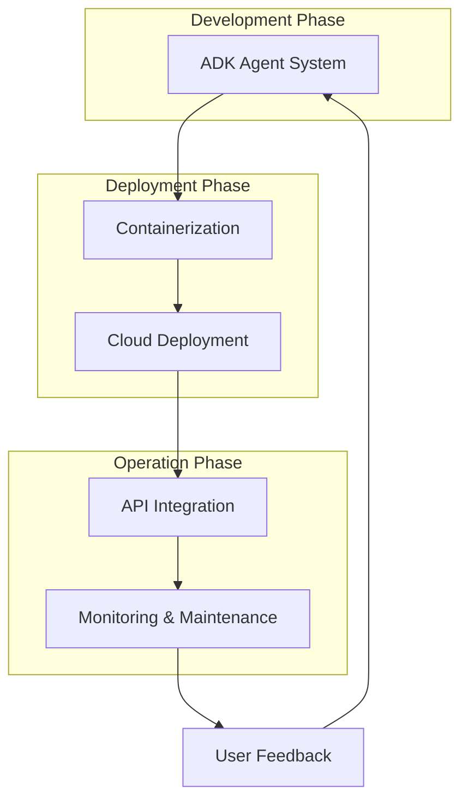

---
categories:
- artificial-intelligence
- agent-development
date: 2025-05-10
header_image_path: /assets/img/blog/headers/2025-05-10-google-adk-masterclass-part12.jpg
image_credit: Photo by Marius Masalar on Unsplash
layout: post
tags: google-adk ai-agents deployment production-systems real-world-applications
thumbnail_path: /assets/img/blog/thumbnails/2025-05-10-google-adk-masterclass-part12.jpg
title: 'Google ADK Masterclass Part 12: Practical Applications and Deployment'
---

# Google ADK Masterclass Part 12: Practical Applications and Deployment

In our [previous tutorials](./2025-05-10-google-adk-masterclass-part11.md), we've explored the fundamentals of Google's Agent Development Kit (ADK) and various workflow patterns. Now, in this final part of our series, we'll focus on practical applications and deployment strategies to move your agent systems into production.

Building powerful agents locally is just the first step. To create real impact, you need to deploy these agents in a way that makes them accessible, reliable, and scalable. In this tutorial, we'll cover real-world applications of ADK and strategies for deploying your agents to production environments.

## Real-World Applications of ADK

Before diving into deployment, let's explore some compelling real-world applications where ADK agents can provide significant value.

### 1. Intelligent Customer Service Systems

ADK's multi-agent architecture is perfect for building sophisticated customer service systems:

```
Customer Query → 
    Router Agent (Classifies query type) → 
        [Product Agent, Billing Agent, Technical Support Agent] → 
            Resolution Synthesis Agent → 
                Customer Response
```

This architecture allows for:
- Specialized handling of different query types
- Deep knowledge in specific domains
- Consistent response formatting
- Seamless escalation to human agents when needed

### 2. Automated Content Creation Pipelines

Content creation can be streamlined with a multi-agent workflow:

```
Content Brief → 
    Research Agent → 
        Outline Agent → 
            Draft Agent → 
                Editorial Agent → 
                    SEO Optimization Agent → 
                        Final Content
```

Benefits include:
- Consistent quality through specialized agents
- Scalable content production
- Built-in quality control
- SEO and brand voice alignment

### 3. Intelligent Document Processing

ADK excels at processing and analyzing documents:

```
Document Upload → 
    Extraction Agent → 
        Classification Agent → 
            [Contract Analyzer, Financial Analyzer, Legal Compliance Checker] → 
                Summary Agent → 
                    Actionable Insights
```

Key advantages:
- Structured extraction of information
- Domain-specific analysis
- Consistent output formatting
- Integration with existing document management systems

### 4. Personalized Learning Assistants

Educational applications benefit from ADK's ability to create personalized experiences:

```
Student Query → 
    Knowledge Assessment Agent → 
        [Concept Explanation Agent, Practice Problem Generator, Learning Path Advisor] → 
            Personalized Response
```

This enables:
- Adaptive learning experiences
- Personalized difficulty levels
- Varied teaching approaches
- Progress tracking

### 5. Complex Decision Support Systems

ADK can power sophisticated decision support systems:

```
Decision Query → 
    Parallel Research Agents → 
        Options Analysis Agent → 
            Risk Assessment Agent → 
                Recommendation Agent → 
                    Decision Brief
```

Benefits include:
- Comprehensive data gathering
- Consistent evaluation criteria
- Transparent reasoning
- Risk-aware recommendations

## Deployment Strategies for ADK Agents

Now that we understand the potential applications, let's explore strategies for deploying ADK agents to production environments.

### Local Development to Cloud Deployment

The journey from local development to cloud deployment typically follows these steps:

1. **Local Development**: Build and test agents using `adk web` or custom scripts
2. **Containerization**: Package your agent system in Docker containers
3. **Cloud Deployment**: Deploy to cloud platforms like Google Cloud
4. **API Integration**: Expose your agents via REST APIs
5. **Monitoring & Maintenance**: Set up monitoring and update processes

Let's walk through each step in detail.

### 1. Containerizing Your Agent System

Docker is an excellent tool for packaging your agent system:

```dockerfile
# Dockerfile for ADK agent system
FROM python:3.10-slim

WORKDIR /app

# Copy requirements and install dependencies
COPY requirements.txt .
RUN pip install --no-cache-dir -r requirements.txt

# Copy your agent code
COPY . .

# Set environment variables
ENV PORT=8080

# Run the application
CMD ["python", "api_server.py"]
```

Your `requirements.txt` should include:

```
google-adk>=0.1.0
google-generativeai>=0.3.0
fastapi>=0.95.0
uvicorn>=0.22.0
python-dotenv>=1.0.0
```

### 2. Creating an API Server

You'll need to create an API server to expose your agent system:

```python
# api_server.py
import os
import asyncio
import json
import uuid
from fastapi import FastAPI, HTTPException, Request
from pydantic import BaseModel
import uvicorn
from dotenv import load_dotenv

from google.adk.orchestration import Runner
from google.adk.orchestration.session import DatabaseSessionService

# Import your agents
from your_agent_folder.agent import your_agent  # Update with your actual imports

# Load environment variables
load_dotenv()

app = FastAPI(title="ADK Agent API")

# Create a database session service
session_service = DatabaseSessionService(
    database_path="agent_sessions.db"
)

# Create a runner with your agents
runner = Runner(
    root_agent=your_agent,
    agents=[your_agent],  # Add all your agents here
    session_service=session_service
)

class QueryRequest(BaseModel):
    query: str
    user_id: str = "default_user"
    session_id: str = None

class QueryResponse(BaseModel):
    response: str
    session_id: str

@app.post("/query", response_model=QueryResponse)
async def process_query(request: QueryRequest):
    try:
        # Get or create session ID
        session_id = request.session_id or str(uuid.uuid4())
        
        # Check if session exists
        existing_sessions = session_service.list_sessions(
            app_name="AgentAPI",
            user_id=request.user_id
        )
        
        existing_session_ids = [session.id for session in existing_sessions]
        
        if not request.session_id or request.session_id not in existing_session_ids:
            # Create a new session
            session_service.create_session(
                app_name="AgentAPI",
                user_id=request.user_id,
                session_id=session_id
            )
        
        # Create a message from the query
        from google.generativeai.types import content_types
        from google.generativeai.types.content_types import Part
        
        content = content_types.Content(
            role="user",
            parts=[Part.from_text(request.query)]
        )
        
        # Run the agent
        response = await runner.run_async(
            user_id=request.user_id,
            session_id=session_id,
            content=content
        )
        
        # Extract the response text
        response_text = None
        for event in response.events:
            if event.type == "content" and event.content.role == "agent":
                response_text = event.content.parts[0].text
                break
        
        if not response_text:
            raise HTTPException(status_code=500, detail="Failed to generate response")
        
        return QueryResponse(
            response=response_text,
            session_id=session_id
        )
    
    except Exception as e:
        raise HTTPException(status_code=500, detail=str(e))

@app.get("/health")
async def health_check():
    return {"status": "healthy"}

if __name__ == "__main__":
    port = int(os.environ.get("PORT", 8080))
    uvicorn.run(app, host="0.0.0.0", port=port)
```

This API server:
- Exposes an endpoint for querying your agents
- Manages sessions for conversation continuity
- Provides a health check endpoint for monitoring
- Handles errors gracefully

### 3. Cloud Deployment Options

Several cloud platforms are suitable for deploying ADK agents:

#### Google Cloud Run

Google Cloud Run is an excellent choice for ADK deployment due to its simplicity and scalability:

```bash
# Build the container
gcloud builds submit --tag gcr.io/YOUR_PROJECT_ID/adk-agent-api

# Deploy to Cloud Run
gcloud run deploy adk-agent-api \
  --image gcr.io/YOUR_PROJECT_ID/adk-agent-api \
  --platform managed \
  --allow-unauthenticated \
  --region us-central1 \
  --set-env-vars "GOOGLE_API_KEY=YOUR_API_KEY"
```

#### Google Kubernetes Engine

For more complex deployments, Google Kubernetes Engine (GKE) provides greater control:

```yaml
# deployment.yaml
apiVersion: apps/v1
kind: Deployment
metadata:
  name: adk-agent-api
spec:
  replicas: 3
  selector:
    matchLabels:
      app: adk-agent-api
  template:
    metadata:
      labels:
        app: adk-agent-api
    spec:
      containers:
      - name: adk-agent-api
        image: gcr.io/YOUR_PROJECT_ID/adk-agent-api:latest
        ports:
        - containerPort: 8080
        env:
        - name: GOOGLE_API_KEY
          valueFrom:
            secretKeyRef:
              name: api-keys
              key: google-api-key
        resources:
          requests:
            cpu: "1"
            memory: "2Gi"
          limits:
            cpu: "2"
            memory: "4Gi"
---
categories:
- artificial-intelligence
- agent-development
date: 2025-05-10
header_image_path: /assets/img/blog/headers/2025-05-10-google-adk-masterclass-part12.jpg
image_credit: Photo by Marius Masalar on Unsplash
layout: post
tags: google-adk ai-agents deployment production-systems real-world-applications
thumbnail_path: /assets/img/blog/thumbnails/2025-05-10-google-adk-masterclass-part12.jpg
title: 'Google ADK Masterclass Part 12: Practical Applications and Deployment'
---
apiVersion: v1
kind: Service
metadata:
  name: customer-support-api
spec:
  selector:
    app: customer-support-api
  ports:
  - port: 80
    targetPort: 8080
  type: LoadBalancer
---
apiVersion: v1
kind: PersistentVolumeClaim
metadata:
  name: customer-support-db-pvc
spec:
  accessModes:
    - ReadWriteOnce
  resources:
    requests:
      storage: 10Gi
```

#### 4. CI/CD Pipeline

Set up a CI/CD pipeline for automated deployment:

```yaml
# .github/workflows/deploy.yml
name: Deploy Customer Support API

on:
  push:
    branches: [ main ]

jobs:
  build-and-deploy:
    runs-on: ubuntu-latest
    
    steps:
    - uses: actions/checkout@v2
    
    - name: Set up Cloud SDK
      uses: google-github-actions/setup-gcloud@v0
      with:
        project_id: ${{ secrets.GCP_PROJECT_ID }}
        service_account_key: ${{ secrets.GCP_SA_KEY }}
    
    - name: Authenticate Docker
      run: gcloud auth configure-docker
    
    - name: Build Docker image
      run: |
        docker build -t gcr.io/${{ secrets.GCP_PROJECT_ID }}/customer-support-api:${{ github.sha }} .
        docker tag gcr.io/${{ secrets.GCP_PROJECT_ID }}/customer-support-api:${{ github.sha }} gcr.io/${{ secrets.GCP_PROJECT_ID }}/customer-support-api:latest
    
    - name: Push Docker image
      run: |
        docker push gcr.io/${{ secrets.GCP_PROJECT_ID }}/customer-support-api:${{ github.sha }}
        docker push gcr.io/${{ secrets.GCP_PROJECT_ID }}/customer-support-api:latest
    
    - name: Deploy to GKE
      run: |
        gcloud container clusters get-credentials customer-support-cluster --zone us-central1-a
        kubectl set image deployment/customer-support-api customer-support-api=gcr.io/${{ secrets.GCP_PROJECT_ID }}/customer-support-api:${{ github.sha }}
```

#### 5. Monitoring and Logging

Implement monitoring and logging:

```python
# monitoring.py
from opentelemetry import trace
from opentelemetry.exporter.cloud_trace import CloudTraceSpanExporter
from opentelemetry.sdk.trace import TracerProvider
from opentelemetry.sdk.trace.export import BatchSpanProcessor
from opentelemetry.instrumentation.fastapi import FastAPIInstrumentor

# Set up OpenTelemetry with Google Cloud Trace
tracer_provider = TracerProvider()
cloud_trace_exporter = CloudTraceSpanExporter()
tracer_provider.add_span_processor(
    BatchSpanProcessor(cloud_trace_exporter)
)
trace.set_tracer_provider(tracer_provider)

# Instrument FastAPI
def instrument_app(app):
    FastAPIInstrumentor.instrument_app(app)

# Add custom spans for agent calls
tracer = trace.get_tracer(__name__)

async def run_agent_with_tracing(runner, user_id, session_id, agent_name, content):
    with tracer.start_as_current_span(f"run_agent_{agent_name}"):
        return await runner.run_async(
            user_id=user_id,
            session_id=session_id,
            content=content,
            agent_name=agent_name
        )
```

## Best Practices for Production ADK Systems

Based on our experience, here are key best practices for production ADK systems:

### 1. Security

- **API Keys**: Securely manage API keys using environment variables or secret management
- **Authentication**: Implement OAuth or API keys for client authentication
- **HTTPS**: Always use HTTPS in production
- **Input Validation**: Validate all user inputs to prevent injection attacks

### 2. Performance

- **Caching**: Cache frequent queries and responses
- **Asynchronous Processing**: Use async/await for concurrent processing
- **Efficient State Management**: Keep state minimal and clean up old sessions
- **Warm-up Routines**: Implement warm-up routines to avoid cold starts

### 3. Reliability

- **Error Handling**: Implement comprehensive error handling and fallbacks
- **Circuit Breakers**: Add circuit breakers for external dependencies
- **Retries**: Implement retry logic for transient failures
- **Graceful Degradation**: Design systems to degrade gracefully when components fail

### 4. Scalability

- **Stateless Design**: Keep API servers stateless for easy scaling
- **Database Scaling**: Plan for database scaling as session count grows
- **Load Testing**: Regularly load test your system to identify bottlenecks
- **Auto-scaling**: Implement auto-scaling based on load metrics

### 5. Monitoring and Logging

- **Structured Logging**: Use structured logging for easier analysis
- **Performance Metrics**: Track response times, token usage, and error rates
- **Alerts**: Set up alerts for critical errors and performance degradation
- **Usage Analytics**: Collect usage patterns to inform optimization efforts

## Conclusion

Throughout this 12-part series, we've taken a comprehensive journey through Google's Agent Development Kit (ADK), from basic concepts to advanced workflow patterns and production deployment strategies. ADK represents a powerful framework for building sophisticated AI agent systems that can solve complex problems, automate workflows, and deliver value in real-world applications.

In this final tutorial, we've explored practical applications and deployment strategies, providing you with the knowledge to take your agent systems from development to production. By combining the foundational concepts, workflow patterns, and deployment practices covered in this series, you're now equipped to build and deploy robust agent systems that can tackle real-world challenges.

Key takeaways from this series include:
- Understanding the fundamental concepts of agents, tools, and sessions in ADK
- Mastering the three primary workflow patterns: sequential, parallel, and looping
- Implementing robust state management and session persistence
- Leveraging callbacks for fine-grained control over agent behavior
- Deploying agent systems to production environments with security, reliability, and scalability

The field of AI agents is rapidly evolving, and ADK provides a flexible, powerful framework that will continue to grow with new capabilities. We encourage you to experiment with the concepts and patterns covered in this series and to share your innovations with the community.

Thank you for joining us on this journey through Google's Agent Development Kit. Happy agent building!

## Resources

- [ADK Documentation](https://cloud.google.com/vertex-ai/docs/generative-ai/agents/agent-development-kit)
- [Google Cloud Deployment Options](https://cloud.google.com/deploy)
- [FastAPI Documentation](https://fastapi.tiangolo.com/)
- [Docker Documentation](https://docs.docker.com/)
- [Kubernetes Documentation](https://kubernetes.io/docs/home/)


