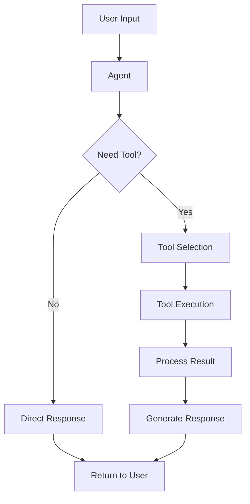

---
categories:
- artificial-intelligence
- agent-development
date: 2025-05-10
header_image_path: /assets/img/blog/headers/2025-05-10-google-adk-masterclass-part2.jpg
image_credit: Photo by NOAA on Unsplash
image_credit_url: https://unsplash.com/photos/caution-area-map-0fitIxDWJSU
layout: post
tags: google-adk ai-agents llm-agents tools function-calling
thumbnail_path: /assets/img/blog/thumbnails/2025-05-10-google-adk-masterclass-part2.jpg
title: 'Google ADK Masterclass Part 2: Adding Tools to Your Agents'
---

# Google ADK Masterclass Part 2: Adding Tools to Your Agents

[Overview](./google-adk-masterclass-overview)

In the [previous part](./google-adk-masterclass-part1) of our Google ADK Masterclass, we set up our environment and created our first basic agent. Now, let's take our agents to the next level by adding tools.

Tools are one of the most powerful features in ADK, enabling agents to interact with external systems, perform complex calculations, search the web, and much more. In this tutorial, we'll explore the different types of tools available and how to integrate them into your agents.

## Types of Tools in ADK

ADK offers great flexibility when it comes to tool integration. The three primary categories of tools are:

1. **Function Calling Tools**: Custom Python functions you define
2. **Built-in Tools**: Pre-built capabilities provided by Google
3. **Third-party Tools**: Integrations with external libraries

Let's explore each of these in detail.

### Function Calling Tools

Function tools are the most common type you'll create. These are simply Python functions that you define and pass to your agent. Your agent can then invoke these functions when needed to accomplish specific tasks.

There are a few variations of function tools:
- Regular function tools
- Agents as tools (used in multi-agent systems)
- Long-running function tools (for tasks that take significant time)

### Built-in Tools

ADK provides several powerful built-in tools:
- **Google Search**: Allows agents to search the web
- **Code Execution**: Enables agents to run code
- **RAG (Retrieval-Augmented Generation)**: Lets agents query vector databases

It's important to note that built-in tools only work with Gemini models, not with third-party models like OpenAI or Claude.

### Third-party Tools

You can also integrate tools from other libraries like LangChain or Crew AI. This flexibility allows you to leverage existing ecosystems while benefiting from ADK's architecture.

## Creating a Google Search Tool Agent

Let's start by creating an agent that uses Google's built-in search capability:

### Folder Structure

```
tool_agent/
└── tool_agent/
    ├── __init__.py
    ├── .env
    └── agent.py
```

### Agent Definition with Google Search Tool

```python
from google.adk import Agent
from google.adk.tool import SearchTool

tool_agent = Agent(
    name="tool_agent",
    model="models/gemini-2.0-no-flash",
    description="An agent that can search the web for information",
    instructions="You are a helpful assistant that can search the web for current information. Use the search tool to find answers to questions about recent events, facts, or any information the user requests.",
    tools=[SearchTool()]
)
```

The key difference from our previous agent is the addition of the `tools` parameter, which accepts a list of tool objects. Here, we're using the pre-built `SearchTool()` from the ADK library.

## Creating a Custom Function Tool

Now let's implement a custom function tool that returns the current time:

```python
from google.adk import Agent
from google.adk.tool import FunctionTool
import datetime

def get_current_time() -> dict:
    """
    Returns the current time in various formats.
    Use this function when the user asks for the current time or date.
    """
    now = datetime.datetime.now()
    return {
        "current_time": now.strftime("%H:%M:%S"),
        "current_date": now.strftime("%Y-%m-%d"),
        "timezone": datetime.datetime.now().astimezone().tzname()
    }

tool_agent = Agent(
    name="tool_agent",
    model="models/gemini-2.0-no-flash",
    description="An agent that can tell the current time",
    instructions="You are a helpful assistant that can tell the current time. When asked about the time or date, use the get_current_time tool to provide accurate information.",
    tools=[FunctionTool(get_current_time)]
)
```

### Understanding Tool Function Requirements

When creating custom function tools, there are several best practices to follow:

1. **Include a descriptive docstring**: This helps the agent understand when and how to use the tool
2. **Specify return types**: Annotate your function with return types
3. **Return structured data**: Always return a dictionary with descriptive keys
4. **No default parameters**: ADK currently doesn't support default parameters in tool functions

For example, if you wanted to add parameters to your function:

```python
def format_date(format_string: str) -> dict:
    """
    Returns the current date in the specified format.

    Args:
        format_string: A string representing the date format (e.g., "%Y-%m-%d")

    Returns:
        A dictionary containing the formatted date
    """
    now = datetime.datetime.now()
    try:
        formatted_date = now.strftime(format_string)
        return {
            "formatted_date": formatted_date,
            "format_used": format_string
        }
    except ValueError:
        return {
            "error": "Invalid format string",
            "format_attempted": format_string
        }
```

## Limitations and Best Practices

When working with tools in ADK, there are some important limitations to be aware of:

1. **Mixed tool types**: You cannot mix built-in tools with custom tools in the same agent
2. **Single built-in tool**: You can only use one built-in tool per agent
3. **Return values**: Always return descriptive dictionaries rather than simple values
4. **Error handling**: Implement proper error handling in your tool functions

## Running Agents with Tools

Running an agent with tools works exactly the same as running a basic agent:

```bash
cd tool_agent
adk web
```

### Example Interaction with Google Search Tool

**You**: Do you have any news about Tesla this week?
**Agent**: Yes, I've found several recent news items about Tesla this week:

1. Tesla reported their Q1 2025 earnings, showing a 12% increase in revenue compared to last year but a slight decrease in automotive gross margins.

2. The company announced plans to introduce new, more affordable models in the coming year to address increased competition in the EV market.

3. Tesla stock (TSLA) has experienced volatility this week, initially dropping after the earnings report but recovering following the new product announcement.

4. There are reports that Tesla is expanding its Supercharger network in several European countries as part of its continued infrastructure investment.

Would you like me to elaborate on any specific aspect of Tesla's recent news?

### Example Interaction with Custom Time Tool

**You**: What is the current time?
**Agent**: I checked the current time for you. It's 15:42:37 on 2025-05-10, and you're in the PST timezone.

## Tool Events and Debugging

One of the great features of ADK's web interface is the ability to inspect tool calls. When you use a tool, ADK records events showing:

1. The tool that was called
2. The input parameters
3. The returned results

This transparency is invaluable when debugging or understanding how your agent is using the tools you've provided.

## Creating More Advanced Tools

As your agent applications become more complex, you might want to create more sophisticated tools. Here's an example of a stock price lookup tool:

```python
import yfinance as yf
from google.adk import Agent
from google.adk.tool import FunctionTool

def get_stock_price(ticker: str) -> dict:
    """
    Retrieves the current stock price for a given ticker symbol.

    Args:
        ticker: The stock ticker symbol (e.g., 'AAPL', 'GOOGL', 'MSFT')

    Returns:
        Dictionary containing stock information including current price,
        daily high/low, and company name.
    """
    try:
        stock = yf.Ticker(ticker)
        info = stock.info
        price_data = stock.history(period="1d")

        return {
            "company_name": info.get('shortName', 'Unknown'),
            "current_price": float(price_data['Close'].iloc[-1]),
            "daily_high": float(price_data['High'].iloc[-1]),
            "daily_low": float(price_data['Low'].iloc[-1]),
            "currency": info.get('currency', 'USD'),
            "ticker": ticker
        }
    except Exception as e:
        return {
            "error": f"Failed to retrieve stock information: {str(e)}",
            "ticker": ticker
        }

stock_agent = Agent(
    name="stock_agent",
    model="models/gemini-2.0-no-flash",
    description="An agent that provides stock market information",
    instructions="You are a helpful financial assistant that provides stock market information. When asked about stock prices, use the get_stock_price tool to retrieve current information. Explain the data in a clear, concise manner.",
    tools=[FunctionTool(get_stock_price)]
)
```

This more complex tool demonstrates several best practices:
- Comprehensive error handling
- Detailed return dictionary
- Clear type annotations
- Informative docstring

## Understanding How Agents Select Tools

When an agent receives a request, it follows this process to determine whether to use a tool:

1. The agent analyzes the user's request
2. It reviews the available tools and their descriptions (docstrings)
3. If a tool seems relevant, the agent decides to use it
4. The agent calls the tool with appropriate parameters
5. The agent incorporates the tool's response into its reply

This is why descriptive docstrings are so important - they help the agent understand when and how to use each tool.

## Conclusion

Tools dramatically enhance your agents' capabilities by allowing them to perform actions and access information beyond their training data. Whether using Google's built-in tools or creating custom function tools, this capability transforms agents from simple chat interfaces into powerful assistants that can take meaningful actions.

In this tutorial, we've covered:
- Different types of tools available in ADK
- How to implement Google's built-in search tool
- Creating custom function tools
- Best practices and limitations when working with tools

In the next part of our series, we'll explore how to integrate different language models into ADK, allowing you to leverage models from OpenAI, Anthropic, and other providers.

## Resources

- [Official ADK Tool Documentation](https://cloud.google.com/vertex-ai/docs/generative-ai/agents/agent-development-kit/tools)
- [Google Search API Documentation](https://cloud.google.com/vertex-ai/docs/generative-ai/agents/agent-development-kit/built-in-tools/search)
- [Function Calling Best Practices](https://cloud.google.com/vertex-ai/docs/generative-ai/agents/agent-development-kit/function-calling)


[Next...](./google-adk-masterclass-part3)
