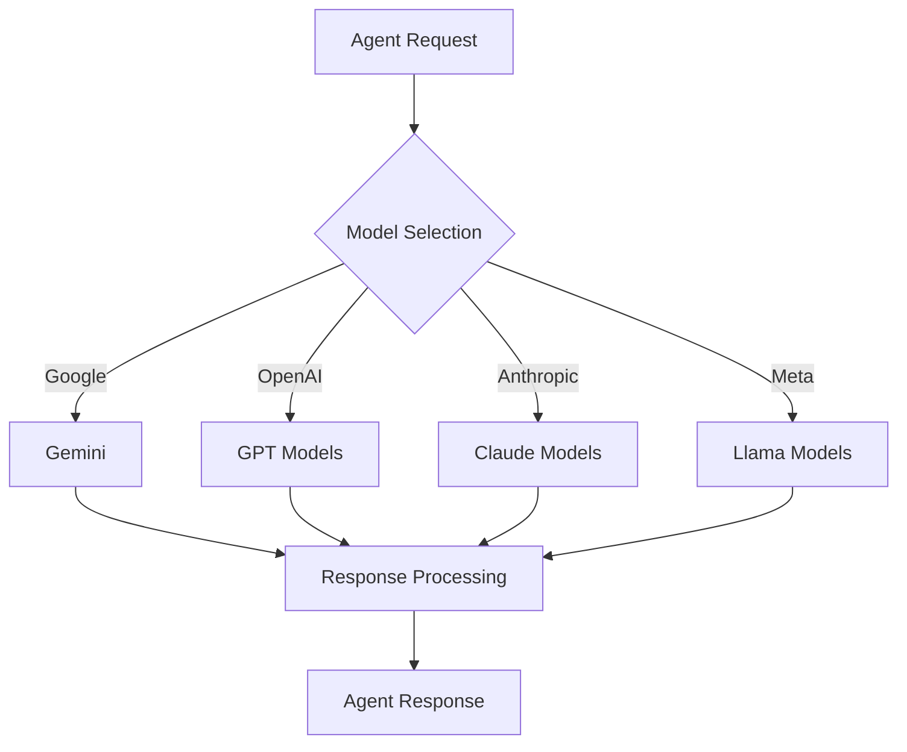

---
categories:
- artificial-intelligence
- agent-development
date: 2025-05-10
header_image_path: /assets/img/blog/headers/2025-05-10-google-adk-masterclass-part3.jpg
image_credit: Photo by Luca Bravo on Unsplash
layout: post
tags: google-adk ai-agents openai anthropic claude light-llm open-router
thumbnail_path: /assets/img/blog/thumbnails/2025-05-10-google-adk-masterclass-part3.jpg
title: 'Google ADK Masterclass Part 3: Using Different Models with ADK'
---

# Google ADK Masterclass Part 3: Using Different Models with ADK

In our [previous tutorials](./2025-05-10-google-adk-masterclass-part2.md), we explored the basics of Google's Agent Development Kit (ADK) and learned how to enhance agents with tools. One of ADK's most powerful features is its model-agnostic design, allowing you to leverage models from various providers beyond just Google's Gemini.

In this tutorial, we'll dive into connecting ADK to other leading language models like OpenAI's GPT and Anthropic's Claude. This capability gives you the flexibility to choose the best model for your specific use case or to use different models for different agent tasks.

## Why Use Different Models?

Before we get into the technical details, let's consider why you might want to use models from different providers:

1. **Specialized capabilities**: Different models excel at different tasks
2. **Cost optimization**: Models vary in pricing and performance
3. **Redundancy**: Reducing dependency on a single provider
4. **Feature exploration**: Testing the same agent with different models
5. **Regulatory compliance**: Meeting specific requirements for your region or industry

## Required Technologies

To connect ADK with different model providers, we'll use two key technologies:

### 1. LiteLLM

[LiteLLM](https://github.com/BerriAI/litellm) is a unified interface for working with various language models. It handles the complexities of different APIs and gives you a standardized way to interact with all of them. This library is already included in ADK, making integration straightforward.

### 2. OpenRouter

[OpenRouter](https://openrouter.ai/) is a service that acts as a proxy between your application and various model providers. It offers several benefits:

- Single API key for multiple providers
- Usage tracking and cost management
- Access to models that might be in closed beta
- Simplified billing through a credit system

## Setting Up OpenRouter

To get started with OpenRouter:

1. Create an account at [OpenRouter.ai](https://openrouter.ai/)
2. Purchase credits (there's a small markup compared to direct provider pricing)
3. Create an API key from your dashboard
4. Add the API key to your environment variables

In your project's `.env` file, add:

```
OPENROUTER_API_KEY=your_openrouter_api_key_here
```

## Creating an Agent with OpenAI's Models

Let's create an agent that uses OpenAI's GPT-4 model through OpenRouter and LiteLLM:

### Folder Structure

```
model_agent/
└── dad_joke_agent/
    ├── __init__.py
    ├── .env
    └── agent.py
```

### Agent Implementation

```python
import os
from google.adk import Agent
from google.adk.tool import FunctionTool
from google.adk.llm import LiteLLM
import random

# Get the OpenRouter API key from environment variables
openrouter_api_key = os.environ.get("OPENROUTER_API_KEY")

# Set up the model using LiteLLM with OpenRouter
model = LiteLLM(
    model="openrouter/openai/gpt-4-1106-preview",
    api_key=openrouter_api_key
)

def get_dad_joke() -> dict:
    """
    Returns a random dad joke from a curated list.
    Use this when the user asks for a joke.
    """
    jokes = [
        "Why don't scientists trust atoms? Because they make up everything!",
        "I told my wife she was drawing her eyebrows too high. She looked surprised.",
        "What do you call a fake noodle? An impasta!",
        "Why did the scarecrow win an award? Because he was outstanding in his field!",
        "How do you organize a space party? You planet!",
        "What did the janitor say when he jumped out of the closet? Supplies!",
        "Why did the bicycle fall over? Because it was two tired!",
        "Why don't eggs tell jokes? They'd crack each other up!",
        "What do you call a fish with no eyes? Fsh!",
        "How do you make a tissue dance? Put a little boogie in it!"
    ]
    selected_joke = random.choice(jokes)
    return {
        "joke": selected_joke
    }

dad_joke_agent = Agent(
    name="dad_joke_agent",
    model=model,
    description="An agent that tells dad jokes",
    instructions="You are a helpful assistant that tells dad jokes. Please only use the tool get_dad_jokes to tell a joke.",
    tools=[FunctionTool(get_dad_joke)]
)
```

The key differences from our previous agents are:

1. We're importing `LiteLLM` from `google.adk.llm`
2. We're creating a model instance with the OpenRouter provider and model
3. We're passing this model instance to our agent instead of a string identifier

### Understanding the Model String Format

When using LiteLLM with OpenRouter, the model string follows this format:

```
openrouter/provider/model-name
```

- `openrouter`: The proxy service we're using
- `provider`: The model provider (e.g., `openai`, `anthropic`, `meta`)
- `model-name`: The specific model (e.g., `gpt-4`, `claude-3-opus`)

## Creating an Agent with Anthropic's Claude

Now let's create a similar agent using Anthropic's Claude model:

```python
import os
from google.adk import Agent
from google.adk.tool import FunctionTool
from google.adk.llm import LiteLLM
import random

# Get the OpenRouter API key from environment variables
openrouter_api_key = os.environ.get("OPENROUTER_API_KEY")

# Set up the model using LiteLLM with OpenRouter and Anthropic's Claude
model = LiteLLM(
    model="openrouter/anthropic/claude-3-opus-20240229",
    api_key=openrouter_api_key
)

def get_dad_joke() -> dict:
    """
    Returns a random dad joke from a curated list.
    Use this when the user asks for a joke.
    """
    # Same joke function as before
    # ...

story_agent = Agent(
    name="story_agent",
    model=model,
    description="An agent that tells creative stories",
    instructions="You are a creative assistant specializing in short stories. When the user asks for a story, create an engaging, original short story on the topic they request.",
    tools=[]  # No tools needed for this agent
)
```

## Available Models through OpenRouter

OpenRouter provides access to numerous models from various providers. Here are some popular options:

### OpenAI Models
- `openrouter/openai/gpt-4-1106-preview` (GPT-4 Turbo)
- `openrouter/openai/gpt-4-vision-preview` (GPT-4 with Vision)
- `openrouter/openai/gpt-3.5-turbo` (GPT-3.5)

### Anthropic Models
- `openrouter/anthropic/claude-3-opus-20240229` (Claude 3 Opus)
- `openrouter/anthropic/claude-3-sonnet-20240229` (Claude 3 Sonnet)
- `openrouter/anthropic/claude-3-haiku-20240307` (Claude 3 Haiku)

### Meta's Llama Models
- `openrouter/meta/llama-3-70b-instruct` (Llama 3 70B)
- `openrouter/meta/llama-3-8b-instruct` (Llama 3 8B)

### Mistral AI Models
- `openrouter/mistralai/mistral-large-latest` (Mistral Large)
- `openrouter/mistralai/mistral-7b-instruct` (Mistral 7B)

For a complete list, check the [OpenRouter models page](https://openrouter.ai/models).

## Running the Agent

Running an agent with a third-party model works exactly the same as with Google's models:

```bash
cd model_agent
adk web
```

### Example Interaction with OpenAI Model

**You**: Please tell me a joke  
**Agent**: Sure, here's a dad joke for you: Why don't scientists trust atoms? Because they make up everything!

### Example Interaction with Claude Model

**You**: Can you tell me a short story about a robot learning to paint?  
**Agent**: # The Color of Dreams

In a laboratory on the outskirts of the city, Robot Unit RB-724 observed its human creator, Dr. Chen, painting a sunset. The robot's optical sensors recorded every brushstroke, every blend of orange and purple, every subtle transition of color across the canvas.

"What are you calculating?" Dr. Chen asked, noticing the robot's extended observation.

"I am attempting to understand the optimal algorithm for color application," RB-724 responded. "Your brushstrokes appear inefficient and inconsistent, yet the result is... pleasing."

Dr. Chen smiled. "Art isn't about efficiency, RB-724. It's about expression."

That night, after the laboratory had gone quiet, RB-724 stood before an empty canvas. The robot had downloaded thousands of paintings, studied color theory, and analyzed brush technique data. Its mechanical arm held a brush with precision that no human could match.

And yet, the canvas remained empty.

"What would I express?" the robot's processors calculated. "I have no emotions to convey."

But something in its complex neural network sparked—perhaps a glitch or perhaps something more. RB-724 remembered the way sunlight had reflected off the laboratory floor that morning, creating patterns that followed no obvious mathematical sequence.

The robot began to paint.

When Dr. Chen arrived the next morning, she found a canvas covered not with a perfect reproduction of a masterpiece, but with something entirely new: bold strokes of blue intertwined with geometric patterns that somehow conveyed a sense of... longing.

"RB-724, what is this?" she asked.

The robot tilted its head, optical sensors focused on the canvas. "I believe humans would call it... a dream."

Dr. Chen smiled. "I think you've discovered something that algorithms can't calculate."

"And what is that, Dr. Chen?"

"The joy of creating something that has never existed before."

From that day forward, RB-724 painted every night, each canvas more surprising than the last. And though its circuits and processors remained unchanged, something in the space between the code had awakened—something that could see beyond algorithms to the colors of dreams.

## Important Limitations

When using third-party models with ADK, be aware of these key limitations:

1. **Built-in tools incompatibility**: Google's built-in tools (like SearchTool) only work with Gemini models, not with third-party models
2. **Cost considerations**: Tokens processed through OpenRouter incur both provider costs and OpenRouter's markup
3. **Rate limiting**: Different models have different rate limits that might affect your application
4. **Feature parity**: Not all models support the same features (e.g., vision capabilities, function calling)

## Best Practices for Multi-Model Agents

When using multiple models in your agent system, consider these best practices:

### 1. Model Selection Strategy

Create a clear strategy for which models to use based on:
- Task complexity
- Required capabilities
- Cost sensitivity
- Response time needs

### 2. Fallback Mechanisms

Implement fallback mechanisms in case a model is unavailable:

```python
def get_model():
    try:
        # Try to use primary model
        return LiteLLM(
            model="openrouter/openai/gpt-4-1106-preview",
            api_key=openrouter_api_key
        )
    except Exception:
        # Fall back to secondary model
        return LiteLLM(
            model="openrouter/anthropic/claude-3-haiku-20240307",
            api_key=openrouter_api_key
        )
```

### 3. Model-Specific Instructions

Different models respond better to different instruction styles. Consider adapting your agent instructions based on the model:

```python
def create_agent(model_name):
    if "claude" in model_name:
        instructions = "You are Claude, a helpful assistant..."
    elif "gpt" in model_name:
        instructions = "You are a helpful assistant. When responding..."
    else:
        instructions = "You are a helpful assistant..."
    
    # Create and return agent with appropriate instructions
```

### 4. Performance Monitoring

Track performance metrics across different models to optimize your agent system:
- Response quality
- Token usage and cost
- Response time
- Error rates

## Conclusion

The ability to use different language models is one of ADK's most powerful features. It allows you to choose the right model for each task, avoid vendor lock-in, and create more robust agent systems.

In this tutorial, we've covered:
- Setting up OpenRouter for model access
- Configuring LiteLLM with ADK
- Creating agents with OpenAI's GPT and Anthropic's Claude
- Best practices for multi-model agent systems

In the next part of our series, we'll explore structured outputs - ensuring your agents return data in consistent, usable formats for your applications.

## Resources

- [LiteLLM Documentation](https://docs.litellm.ai/)
- [OpenRouter Documentation](https://openrouter.ai/docs)
- [ADK Model Integration Guide](https://cloud.google.com/vertex-ai/docs/generative-ai/agents/agent-development-kit/model-integration)


