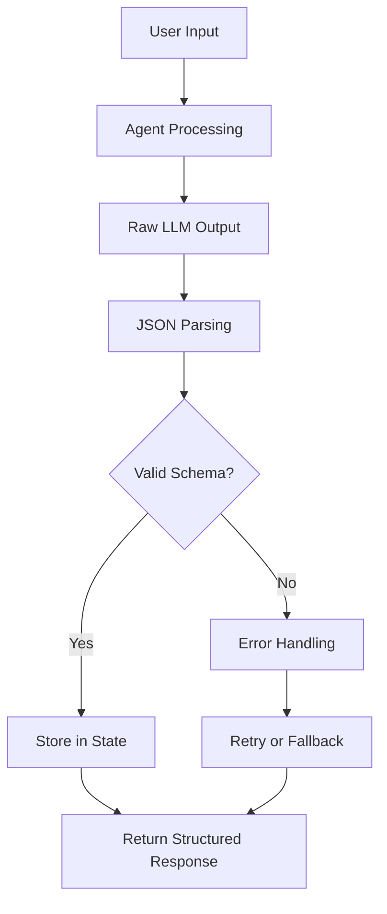

---
categories:
- artificial-intelligence
- agent-development
date: 2025-05-10
header_image_path: /assets/img/blog/headers/2025-05-10-google-adk-masterclass-part4.jpg
image_credit: Photo by Kari Shea on Unsplash
layout: post
tags: google-adk ai-agents structured-data json-output pydantic
thumbnail_path: /assets/img/blog/thumbnails/2025-05-10-google-adk-masterclass-part4.jpg
title: 'Google ADK Masterclass Part 4: Structured Outputs with ADK'
---

# Google ADK Masterclass Part 4: Structured Outputs with ADK

[Overview](./google-adk-masterclass-overview)

In our [previous tutorials](./google-adk-masterclass-part3), we explored creating agents with different models and adding tools to enhance their capabilities. As you build more complex agent systems, especially those that interact with other applications or APIs, ensuring consistent and predictable output formats becomes crucial.

In this tutorial, we'll explore how ADK enables structured outputs to ensure your agents return data in exactly the format your applications need.

## Why Structured Outputs Matter

Imagine you're building an email generation agent that needs to return both a subject line and body text. Without structured outputs, you might get:

- Unpredictable formatting
- Missing fields
- Additional unwanted content
- Inconsistent JSON structures

Structured outputs solve these problems by enforcing a specific schema for agent responses. This is especially important when:

1. Passing data between agents in multi-agent systems
2. Integrating agent responses with other APIs or databases
3. Building user interfaces that expect consistent data structures
4. Automating workflows where data schema consistency is essential

## ADK's Structured Output Options

ADK provides three main approaches to structured outputs:

1. **Output Schema**: Define a Pydantic model for the expected response structure
2. **Output Key**: Store the agent's response in a specific state key for access by other agents
3. **Input Schema**: Define expected input structure (less common and more rigid)

Let's explore each option, with a focus on the most useful ones.

## Using Output Schema for Structured Responses

The most powerful way to enforce structured outputs is using `output_schema`. This approach uses Pydantic models to define the expected structure and validates the agent's response against it.

Let's build an email generation agent that always returns a properly structured response:

### Folder Structure

```
structured_outputs/
└── email_agent/
    ├── __init__.py
    ├── .env
    └── agent.py
```

### Agent Implementation

```python
from google.adk import Agent
from pydantic import BaseModel

# Define our output schema using a Pydantic model
class EmailContent(BaseModel):
    subject: str
    body: str

email_agent = Agent(
    name="email_agent",
    model="models/gemini-2.0-no-flash",
    description="An email generation assistant",
    instructions="""
    You are an email generation assistant. You always write professional emails based on the user's request.

    Guidelines for writing emails:
    1. Create a concise and relevant subject line
    2. Write a professional email body with a greeting, clear message, and appropriate closing
    3. Keep the tone business-friendly and formal
    4. Be concise but complete

    IMPORTANT: Always return your response as a JSON object with the following structure:
    {
        "subject": "The email subject line",
        "body": "The full email body"
    }
    """,
    output_schema=EmailContent,
    output_key="email"
)
```

Let's break down the key components:

1. **Pydantic Model**: We define `EmailContent` as a Pydantic model with two fields: `subject` and `body`
2. **output_schema**: We set this to our `EmailContent` model, telling ADK to validate responses against this structure
3. **output_key**: We set this to "email", which will store the structured output in the agent's state under this key
4. **Instructions**: We explicitly tell the model about the expected structure to improve compliance

### How Output Schema Works

When the agent generates a response, ADK:

1. Takes the raw text output from the model
2. Attempts to parse it as JSON
3. Validates it against the Pydantic model
4. If valid, stores the structured data in state under the specified output key
5. If invalid, returns an error or attempts to fix the output (depending on configuration)

### Running the Email Agent

Let's see this in action:

```bash
cd structured_outputs
adk web
```

### Example Interaction

**You**: Please write an email to my wife Carly to see if she is available for coffee tomorrow morning.
**Agent**:
```json
{
  "subject": "Coffee Tomorrow Morning?",
  "body": "Hi Carly,\n\nI hope you're having a great day! I was wondering if you might be available to grab coffee together tomorrow morning?\n\nLet me know what time works best for you if you're free.\n\nLooking forward to it!\n\nLove,\n[Your Name]"
}
```

Notice that the response is now a properly structured JSON object with exactly the fields we specified. No more, no less.

## Exploring State with Structured Outputs

One of the most powerful aspects of structured outputs is how they integrate with ADK's state management. When we use `output_key`, the structured output is stored in the agent's state.

In the web interface, you can inspect the state and see:

```json
{
  "email": {
    "subject": "Coffee Tomorrow Morning?",
    "body": "Hi Carly,\n\nI hope you're having a great day!..."
  }
}
```

This makes it incredibly easy for other agents or components in your system to access and use this structured data.

## Advanced Output Schema Techniques

As your applications grow more complex, you may need more sophisticated output schemas. Let's explore some advanced techniques:

### Nested Models

You can create nested structures for complex data:

```python
from pydantic import BaseModel
from typing import List

class Attachment(BaseModel):
    filename: str
    content_type: str
    size_kb: int

class EmailWithAttachments(BaseModel):
    subject: str
    body: str
    priority: str
    attachments: List[Attachment]

# Use this model as output_schema
```

### Optional Fields

You can make certain fields optional:

```python
from pydantic import BaseModel
from typing import Optional

class FlexibleEmail(BaseModel):
    subject: str
    body: str
    cc: Optional[str] = None
    bcc: Optional[str] = None
    priority: Optional[str] = None
```

### Field Descriptions

Adding descriptions to fields improves model understanding:

```python
from pydantic import BaseModel, Field

class EmailWithMetadata(BaseModel):
    subject: str = Field(description="A concise, relevant email subject line")
    body: str = Field(description="The complete email body text with greeting and closing")
    category: str = Field(description="The type of email (e.g., 'business', 'personal', 'follow-up')")
```

## Limitations and Best Practices

When working with structured outputs in ADK, keep these important limitations and best practices in mind:

### 1. Tool Incompatibility

You cannot use `output_schema` with tools or when transferring information to other agents directly. When building multi-agent systems, have one agent do the complex thinking, pass raw results, and let a final agent apply the output schema.

### 2. Explicit Instructions

Always include explicit instructions about the expected output format. Even with `output_schema` defined, the model performs better when it knows what structure to generate:

```
IMPORTANT: Your response must be a JSON object with fields "subject" and "body".
```

### 3. Error Handling

Be prepared to handle cases where the model fails to generate validly structured output. Consider implementing retry logic or fallback mechanisms.

### 4. Start Simple

Begin with simple schemas and gradually increase complexity as needed. Complex schemas are more likely to cause generation errors.

## Creating a Support Ticket System Example

Let's create a more complex example: a support ticket creation system with structured outputs:

```python
from google.adk import Agent
from pydantic import BaseModel, Field
from typing import List, Optional
from enum import Enum

class Priority(str, Enum):
    LOW = "low"
    MEDIUM = "medium"
    HIGH = "high"
    CRITICAL = "critical"

class Category(str, Enum):
    TECHNICAL = "technical"
    BILLING = "billing"
    ACCOUNT = "account"
    GENERAL = "general"

class SupportTicket(BaseModel):
    title: str = Field(description="A concise summary of the issue")
    description: str = Field(description="Detailed description of the problem")
    priority: Priority = Field(description="The ticket priority level")
    category: Category = Field(description="The department this ticket belongs to")
    steps_to_reproduce: Optional[List[str]] = Field(
        description="Steps to reproduce the issue (for technical problems)",
        default=None
    )
    customer_contact: Optional[str] = Field(
        description="Customer's preferred contact method",
        default=None
    )

ticket_agent = Agent(
    name="ticket_agent",
    model="models/gemini-2.0-no-flash",
    description="A support ticket creation assistant",
    instructions="""
    You are a support ticket creation assistant. You help users create well-structured support tickets from their issues.

    For each ticket request:
    1. Extract the key issue from the user's description
    2. Create a concise but descriptive title
    3. Format a detailed description
    4. Determine the appropriate priority level and category
    5. For technical issues, list steps to reproduce
    6. Include customer contact information if provided

    IMPORTANT: Return your response as a JSON object matching this structure:
    {
        "title": "Brief issue summary",
        "description": "Detailed issue description",
        "priority": "low|medium|high|critical",
        "category": "technical|billing|account|general",
        "steps_to_reproduce": ["Step 1", "Step 2", ...] (optional),
        "customer_contact": "Contact information" (optional)
    }
    """,
    output_schema=SupportTicket,
    output_key="ticket"
)
```

### Example Interaction

**You**: I can't log in to my account. I've tried resetting my password three times but I never receive the reset email. I've checked my spam folder. I need this fixed ASAP as I have an important meeting tomorrow. You can reach me at alex@example.com.
**Agent**:
```json
{
  "title": "Unable to Receive Password Reset Emails",
  "description": "Customer cannot log in to their account after multiple attempts to reset password. Reset emails are not being received in inbox or spam folder. Urgent resolution needed for an important meeting scheduled tomorrow.",
  "priority": "high",
  "category": "account",
  "steps_to_reproduce": [
    "Attempt to log in to the account",
    "Click on 'Forgot Password' or 'Reset Password' option",
    "Enter email address",
    "Check inbox for reset email",
    "Check spam/junk folder for reset email"
  ],
  "customer_contact": "alex@example.com"
}
```

## Using Structured Output with Multi-Agent Systems

Structured outputs become even more powerful in multi-agent systems. Here's how they can be used:

1. **Agent A** processes a user request and stores structured data in state
2. **Agent B** accesses this structured data from state and performs additional processing
3. **Agent C** takes the combined results and formats a final response

We'll explore this in more detail in our multi-agent systems tutorial.

## Conclusion

Structured outputs transform your agents from simple chat interfaces into reliable data providers for your applications. By defining clear output schemas, you ensure consistency and predictability, making it much easier to integrate agents into larger systems.

In this tutorial, we've covered:
- Why structured outputs matter
- Using output_schema with Pydantic models
- Storing structured data in state with output_key
- Advanced schema techniques
- Best practices and limitations

In the next part of our series, we'll dive deeper into ADK's session and memory management, exploring how to maintain context and state across conversations.

## Resources

- [ADK Structured Outputs Documentation](https://cloud.google.com/vertex-ai/docs/generative-ai/agents/agent-development-kit/structured-responses)
- [Pydantic Documentation](https://docs.pydantic.dev/)
- [JSON Schema Specification](https://json-schema.org/)


[Next...](./google-adk-masterclass-part5)
