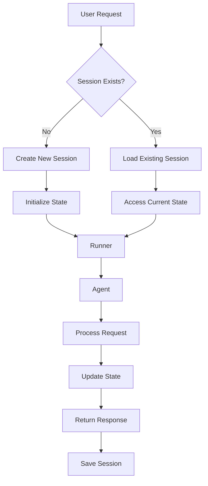

---
categories:
- artificial-intelligence
- agent-development
date: 2025-05-10
header_image_path: /assets/img/blog/headers/2025-05-10-google-adk-masterclass-part5.jpg
image_credit: Photo by ThisisEngineering on Unsplash
layout: post
tags: google-adk ai-agents session state runners memory-management
thumbnail_path: /assets/img/blog/thumbnails/2025-05-10-google-adk-masterclass-part5.jpg
title: 'Google ADK Masterclass Part 5: Session and Memory Management'
---

# Google ADK Masterclass Part 5: Session and Memory Management

[Overview](./google-adk-masterclass-overview)

In our [previous tutorials](./google-adk-masterclass-part4), we've been using ADK's web interface to interact with our agents. Behind the scenes, ADK has been managing sessions, state, and the agent lifecycle for us. Now it's time to pull back the curtain and understand these core components, which are essential for building more sophisticated agent applications.

In this tutorial, we'll explore how session management and state work in ADK, and how to implement them in your own applications without relying on the web interface.

## Understanding the Core Components

Let's start by understanding the three key components of ADK's memory management:

### 1. Sessions

A **session** is a stateful chat history between a user and one or more agents. It includes:

- **ID**: A unique identifier for the session
- **State**: A dictionary of data persisted throughout the conversation
- **Events**: A record of all interactions (messages, tool calls, agent responses)
- **Metadata**: Information like app name, user ID, and last update time

Sessions allow agents to maintain context over multiple interactions, which is essential for natural, coherent conversations.

### 2. State

**State** is a key-value store within a session that persists information. State can include:

- User preferences
- Conversation history
- Calculated values
- Structured outputs from agents
- Any other data you want to maintain across interactions

State is one of the most powerful features of ADK, enabling agents to "remember" information without needing to pass it in each message.

### 3. Runners

A **runner** connects agents with sessions, managing the flow of information between them. Runners handle:

- Selecting which agent should respond to a request
- Passing context from the session to the agent
- Executing tool calls
- Updating the session with new events and state

Think of runners as the "orchestrators" of your agent system.

## Session Types in ADK

ADK offers three types of session management:

1. **In-Memory Sessions**: Data is stored in memory and lost when the application ends
2. **Database Sessions**: Data is persisted to a local database
3. **Vertex AI Sessions**: Data is stored in Google Cloud

For this tutorial, we'll focus on in-memory sessions, which are simplest for development and learning. In the next tutorial, we'll explore database persistence.

## Creating a Basic Stateful Session

Let's build a simple question-answering agent that remembers user information:

### Folder Structure

```
session_management/
├── basic_stateful_session.py
├── .env
└── qa_agent/
    ├── __init__.py
    └── agent.py
```

### Agent Implementation (qa_agent/agent.py)

```python
from google.adk import Agent

qa_agent = Agent(
    name="qa_agent",
    model="models/gemini-2.0-no-flash",
    description="An agent that answers questions about user preferences",
    instructions="""
    You are a helpful assistant that answers questions about the user's preferences.

    The user's name is {username}.

    The user has the following preferences:
    - Favorite color: {user_preferences.favorite_color}
    - Favorite food: {user_preferences.favorite_food}
    - Favorite movie: {user_preferences.favorite_movie}
    - Favorite TV show: {user_preferences.favorite_tv_show}

    Always answer questions about the user's preferences based on this information.
    """
)
```

Notice the template variables in the instructions like `{username}` and `{user_preferences.favorite_color}`. These will be populated from state at runtime.

### Session Management Script (basic_stateful_session.py)

```python
import os
from dotenv import load_dotenv
from pprint import pprint
import uuid

from google.generativeai.types import content_types
from google.generativeai.types.content_types import Part

from google.adk.orchestration import Runner
from google.adk.orchestration.session import InMemorySessionService
from google.adk.orchestration.session.session import Session

# Import the agent
from qa_agent.agent import qa_agent

# Load environment variables
load_dotenv()

# Create an in-memory session service
session_service = InMemorySessionService()

# Define initial state with user information
initial_state = {
    "username": "Brandon",
    "user_preferences": {
        "favorite_color": "Blue",
        "favorite_food": "Pizza",
        "favorite_movie": "The Matrix",
        "favorite_tv_show": "Game of Thrones"
    }
}

# Create a new session
session_id = str(uuid.uuid4())
session = session_service.create_session(
    app_name="BrandonBot",
    user_id="brandon_hancock",
    session_id=session_id,
    state=initial_state
)

# Create a runner with our agent and session service
runner = Runner(
    root_agent=qa_agent,
    session_service=session_service
)

# Create a message to send to the agent
message = content_types.Content(
    role="user",
    parts=[Part.from_text("What is Brandon's favorite TV show?")]
)

# Run the agent with our message
response = runner.run(
    user_id="brandon_hancock",
    session_id=session_id,
    content=message
)

# Process the response to get the final text
final_response = None
for event in response.events:
    if event.type == "content" and event.content.role == "agent":
        final_response = event.content.parts[0].text

# Print the agent's response
print("Session ID:", session_id)
print("\nAgent Response:")
print(final_response)

# Print the session state for exploration
print("\nSession State Exploration:")
pprint(session.state)
```

Let's break down what this script does:

1. **Set up the session service**: We create an in-memory session service to manage our sessions
2. **Define initial state**: We set up a dictionary with user information
3. **Create a session**: We generate a unique ID and create a new session with our initial state
4. **Create a runner**: We connect our agent with the session service
5. **Create a message**: We format a user message to send to the agent
6. **Run the agent**: We execute the agent with our message in the context of our session
7. **Process the response**: We extract the final text from the event stream
8. **Print results**: We output the response and explore the session state

### Running the Example

Run the script with:

```bash
cd session_management
python basic_stateful_session.py
```

Example output:

```
Session ID: 8a7b6c5d-4e3f-2d1c-0b9a-8a7b6c5d4e3f

Agent Response:
Brandon's favorite TV show is Game of Thrones. He's currently re-watching it as we speak.

Session State Exploration:
{'user_preferences': {'favorite_color': 'Blue',
                     'favorite_food': 'Pizza',
                     'favorite_movie': 'The Matrix',
                     'favorite_tv_show': 'Game of Thrones'},
 'username': 'Brandon'}
```

## Understanding the Agent's Access to State

A key feature of ADK is that agents can access session state through template variables in their instructions. The syntax for accessing state is:

- Simple key: `{key_name}`
- Nested key: `{parent.child}`
- Deep nesting: `{level1.level2.level3}`

When ADK initializes an agent for a response, it automatically replaces these templates with actual values from state.

## The Runner Lifecycle

To better understand how ADK works, let's examine the lifecycle of a request through the runner:

1. **Request received**: User sends a message
2. **Session lookup**: Runner finds the appropriate session
3. **Agent selection**: Runner determines which agent should handle the request
4. **Context preparation**: Runner combines session state with user message
5. **Agent execution**: Selected agent processes the request, possibly making tool calls
6. **Session update**: Runner updates the session with new events and state changes
7. **Response returned**: Final response is sent back to the user

This process happens automatically with `runner.run()` or `runner.run_async()`.

## Advanced Session Management Techniques

Now that we understand the basics, let's explore some more advanced techniques.

### Updating State Dynamically

You can update state during a conversation to store new information:

```python
# Update a top-level key
session.state["username"] = "Alex"

# Update a nested key
session.state["user_preferences"]["favorite_food"] = "Sushi"

# Add a new key
session.state["last_interaction"] = datetime.now().isoformat()
```

### Managing Multiple Sessions

In a real application, you'll likely need to manage multiple sessions for different users:

```python
# Get all sessions for a specific user
user_sessions = session_service.list_sessions(app_name="MyApp", user_id="user123")

# Check if the user has an existing session
if user_sessions:
    # Use the most recent session
    session_id = user_sessions[0].id
else:
    # Create a new session
    session_id = str(uuid.uuid4())
    session_service.create_session(
        app_name="MyApp",
        user_id="user123",
        session_id=session_id,
        state=initial_state
    )

# Use the session
runner.run(user_id="user123", session_id=session_id, content=message)
```

### Session Expiration and Cleanup

For long-running applications, consider implementing session expiration:

```python
def clean_old_sessions(session_service, max_age_hours=24):
    """Remove sessions older than the specified age."""
    all_sessions = session_service.list_sessions(app_name="MyApp")
    now = datetime.now()

    for session in all_sessions:
        last_update = datetime.fromisoformat(session.last_update_time)
        age = now - last_update

        if age.total_seconds() > max_age_hours * 3600:
            session_service.delete_session(
                app_name="MyApp",
                user_id=session.user_id,
                session_id=session.id
            )
```

## Building an Interactive Chat Loop

Let's create a more realistic example with an interactive chat loop:

```python
import os
from dotenv import load_dotenv
from datetime import datetime
import uuid

from google.adk.orchestration import Runner
from google.adk.orchestration.session import InMemorySessionService
from google.generativeai.types import content_types
from google.generativeai.types.content_types import Part

# Import the agent
from qa_agent.agent import qa_agent

# Load environment variables
load_dotenv()

# Setup session service
session_service = InMemorySessionService()

# Define initial state
initial_state = {
    "username": "User",
    "chat_history": [],
    "user_preferences": {
        "favorite_color": "Unknown",
        "favorite_food": "Unknown",
    },
    "first_interaction": datetime.now().isoformat()
}

# Create or retrieve session
def get_or_create_session(app_name, user_id):
    sessions = session_service.list_sessions(app_name=app_name, user_id=user_id)

    if sessions:
        return sessions[0].id
    else:
        session_id = str(uuid.uuid4())
        session_service.create_session(
            app_name=app_name,
            user_id=user_id,
            session_id=session_id,
            state=initial_state
        )
        return session_id

# Process agent response
def process_agent_response(response):
    final_text = None
    for event in response.events:
        if event.type == "content" and event.content.role == "agent":
            final_text = event.content.parts[0].text
    return final_text

# Update preferences in state
def update_preferences(session, key, value):
    if key in session.state["user_preferences"]:
        session.state["user_preferences"][key] = value
        return True
    return False

# Main chat loop
def main():
    app_name = "PreferenceChat"
    user_id = "interactive_user"
    session_id = get_or_create_session(app_name, user_id)

    # Create runner
    runner = Runner(
        root_agent=qa_agent,
        session_service=session_service
    )

    print("Welcome to PreferenceChat! Type 'exit' to quit.")
    print("You can set preferences with: 'set preference [key] [value]'")
    print("Example: set preference favorite_color blue\n")

    while True:
        user_input = input("You: ")

        if user_input.lower() in ["exit", "quit"]:
            break

        # Check for preference setting command
        if user_input.lower().startswith("set preference "):
            parts = user_input.split(" ", 3)
            if len(parts) == 4:
                _, _, key, value = parts
                session = session_service.get_session(
                    app_name=app_name,
                    user_id=user_id,
                    session_id=session_id
                )
                if update_preferences(session, key, value):
                    print(f"Agent: I've updated your {key} to {value}.")
                    continue

        # Create message and run agent
        message = content_types.Content(
            role="user",
            parts=[Part.from_text(user_input)]
        )

        response = runner.run(
            user_id=user_id,
            session_id=session_id,
            content=message
        )

        agent_response = process_agent_response(response)
        print(f"Agent: {agent_response}")

        # Update chat history in state
        session = session_service.get_session(
            app_name=app_name,
            user_id=user_id,
            session_id=session_id
        )

        # Add to chat history
        session.state["chat_history"].append({
            "timestamp": datetime.now().isoformat(),
            "user": user_input,
            "agent": agent_response
        })

        # Also update last interaction time
        session.state["last_interaction"] = datetime.now().isoformat()

if __name__ == "__main__":
    main()
```

This script demonstrates:
- Creating or retrieving sessions
- Interactive chat with the agent
- Updating preferences with special commands
- Maintaining a chat history in state
- Tracking interaction timestamps

## Understanding State Access in Tool Context

When using tools with agents, you can access and modify state within tool functions using the `tool_context` parameter:

```python
def add_to_favorites(item: str, category: str, tool_context) -> dict:
    """
    Adds an item to the user's favorites in the specified category.

    Args:
        item: The item to add as a favorite
        category: The category for this favorite (e.g., 'movie', 'food')
        tool_context: Provided by ADK, contains session information

    Returns:
        A dictionary with the result of the operation
    """
    # Access state from tool_context
    state = tool_context.state

    # Make sure favorites exist in state
    if "favorites" not in state:
        state["favorites"] = {}

    # Add or update the favorite
    state["favorites"][category] = item

    return {
        "action": "add_favorite",
        "category": category,
        "item": item,
        "result": f"Added {item} as favorite {category}"
    }
```

We'll explore this more in our callbacks tutorial.

## Conclusion

Session and state management are foundational concepts in ADK that enable agents to maintain context across interactions. By understanding these components, you can build more sophisticated agent applications that remember information, track user preferences, and provide consistent experiences.

In this tutorial, we've covered:
- The core components of ADK's memory management
- Creating and managing in-memory sessions
- Setting and accessing state
- The runner lifecycle
- Advanced session management techniques
- Building interactive chat applications

In the next part of our series, we'll explore how to persist sessions to a database, allowing your agents to maintain context even after your application restarts.

## Resources

- [ADK Session Management Documentation](https://cloud.google.com/vertex-ai/docs/generative-ai/agents/agent-development-kit/sessions)
- [ADK State Documentation](https://cloud.google.com/vertex-ai/docs/generative-ai/agents/agent-development-kit/state)
- [ADK Runner Documentation](https://cloud.google.com/vertex-ai/docs/generative-ai/agents/agent-development-kit/runner)


[Next...](./google-adk-masterclass-part6)
