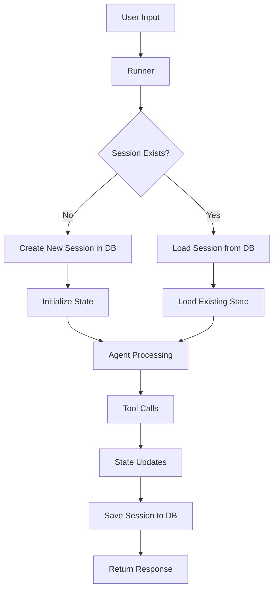

---
categories:
- artificial-intelligence
- agent-development
date: 2025-05-10
header_image_path: /assets/img/blog/headers/2025-05-10-google-adk-masterclass-part6.jpg
image_credit: Photo by Joshua Hoehne on Unsplash
layout: post
tags: google-adk ai-agents database-integration sqlite persistence
thumbnail_path: /assets/img/blog/thumbnails/2025-05-10-google-adk-masterclass-part6.jpg
title: 'Google ADK Masterclass Part 6: Persisting Sessions to a Database'
---

# Google ADK Masterclass Part 6: Persisting Sessions to a Database

In our [previous tutorial](./2025-05-10-google-adk-masterclass-part5.md), we explored session and memory management with in-memory sessions. While in-memory sessions are great for development, they have a significant limitation: when your application stops running, all session data is lost. For production applications, you need a more persistent solution.

This tutorial will show you how to use ADK's database session service to persist your agent sessions to a SQLite database. This enables your agents to maintain context across application restarts, providing a much more consistent user experience.

## Why Persist Sessions?

Before diving into the implementation, let's understand why session persistence is crucial for production applications:

1. **Continuity**: Users expect to pick up conversations where they left off
2. **Context retention**: Valuable information gathered during conversations remains available
3. **User experience**: No need to repeat information that was already shared
4. **Analytics**: Historical conversation data can be analyzed for insights
5. **Scalability**: Multiple instances of your application can share session data

## ADK's Session Storage Options

ADK provides three main options for session storage:

1. **In-memory session service**: Temporary storage that's lost when the application ends
2. **Database session service**: Persists sessions to a local SQLite database
3. **Vertex AI session service**: Stores sessions in Google Cloud (for cloud deployments)

For this tutorial, we'll focus on the database session service, which strikes a good balance between persistence and simplicity.

## Building a Reminder Agent with Persistent Sessions

Let's build a practical example: a reminder agent that remembers items the user wants to be reminded about, even after the application restarts.

### Folder Structure

```
database_sessions/
├── main.py
├── utils.py
├── .env
└── memory_agent/
    ├── __init__.py
    └── agent.py
```

### Agent Implementation (memory_agent/agent.py)

```python
from google.adk import Agent
from google.adk.tool import FunctionTool

def add_reminder(reminder_text: str, tool_context) -> dict:
    """
    Adds a new reminder to the user's reminder list.
    
    Args:
        reminder_text: The text of the reminder to add
        tool_context: Provided by ADK, contains session information
    
    Returns:
        A dictionary with the result of the operation
    """
    # Get current reminders from state
    state = tool_context.state
    reminders = state.get("reminders", [])
    
    # Add the new reminder
    reminders.append(reminder_text)
    
    # Update state with the new list
    state["reminders"] = reminders
    
    return {
        "action": "add_reminder",
        "reminder": reminder_text,
        "message": f"Successfully added reminder: '{reminder_text}'"
    }

def view_reminders(tool_context) -> dict:
    """
    Retrieves all current reminders from the user's reminder list.
    
    Args:
        tool_context: Provided by ADK, contains session information
    
    Returns:
        A dictionary containing all current reminders
    """
    # Get current reminders from state
    state = tool_context.state
    reminders = state.get("reminders", [])
    
    return {
        "action": "view_reminders",
        "reminders": reminders,
        "count": len(reminders),
        "message": f"Found {len(reminders)} reminders"
    }

def delete_reminder(index: int, tool_context) -> dict:
    """
    Deletes a reminder at the specified index from the user's reminder list.
    
    Args:
        index: The index of the reminder to delete (0-based)
        tool_context: Provided by ADK, contains session information
    
    Returns:
        A dictionary with the result of the operation
    """
    # Get current reminders from state
    state = tool_context.state
    reminders = state.get("reminders", [])
    
    # Check if index is valid
    if not reminders or index < 0 or index >= len(reminders):
        return {
            "action": "delete_reminder",
            "success": False,
            "message": f"Cannot delete reminder. Invalid index: {index}"
        }
    
    # Get the reminder text before removing it
    reminder_text = reminders[index]
    
    # Remove the reminder
    del reminders[index]
    
    # Update state with the modified list
    state["reminders"] = reminders
    
    return {
        "action": "delete_reminder",
        "success": True,
        "deleted_reminder": reminder_text,
        "message": f"Successfully deleted reminder: '{reminder_text}'"
    }

def update_username(new_name: str, tool_context) -> dict:
    """
    Updates the user's name in the session state.
    
    Args:
        new_name: The new name for the user
        tool_context: Provided by ADK, contains session information
    
    Returns:
        A dictionary with the result of the operation
    """
    # Get state
    state = tool_context.state
    old_name = state.get("username", "User")
    
    # Update username
    state["username"] = new_name
    
    return {
        "action": "update_username",
        "old_name": old_name,
        "new_name": new_name,
        "message": f"Updated username from '{old_name}' to '{new_name}'"
    }

memory_agent = Agent(
    name="memory_agent",
    model="models/gemini-2.0-no-flash",
    description="A reminder assistant that remembers user reminders",
    instructions="""
    You are a friendly reminder assistant. You help users manage their reminders and remember important tasks.
    
    You are working with the following shared state information:
    - The user's name is: {username}
    - The user's current reminders: {reminders}
    
    You have the following capabilities:
    1. Add new reminders
    2. View existing reminders
    3. Delete reminders
    4. Update the user's name
    
    When handling reminders:
    - For adding reminders: Use the add_reminder tool
    - For viewing reminders: Use the view_reminders tool
    - For deleting reminders: Use the delete_reminder tool (indexes are 0-based)
    - For updating the username: Use the update_username tool
    
    Always be conversational and friendly when interacting with the user. 
    Confirm actions you've taken, and list the user's reminders when relevant.
    """,
    tools=[
        FunctionTool(add_reminder),
        FunctionTool(view_reminders),
        FunctionTool(delete_reminder),
        FunctionTool(update_username)
    ]
)
```

This agent has several tools to manage reminders, all of which interact with the session state. The key point is that these tools modify state, which we'll persist to our database.

### Utility Functions (utils.py)

We'll need some utility functions to handle agent interactions:

```python
import asyncio
from google.generativeai.types import content_types
from google.generativeai.types.content_types import Part

async def call_agent_async(runner, user_id, session_id, query):
    """Process a user query through the agent asynchronously."""
    print(f"\nUser: {query}")
    
    # Create content from the user query
    content = content_types.Content(
        role="user",
        parts=[Part.from_text(query)]
    )
    
    # Get the session to see state before processing
    session = runner.session_service.get_session(
        user_id=user_id,
        session_id=session_id
    )
    print(f"\nState before processing: {session.state}")
    
    # Run the agent with the user query
    response = await runner.run_async(
        user_id=user_id,
        session_id=session_id,
        content=content
    )
    
    # Process the response
    final_response_text = None
    
    for event in response.events:
        if event.type == "content" and event.content.role == "agent":
            final_response_text = event.content.parts[0].text
    
    # Get updated session to see state after processing
    session = runner.session_service.get_session(
        user_id=user_id,
        session_id=session_id
    )
    print(f"\nState after processing: {session.state}")
    
    print(f"\nAgent: {final_response_text}")
    return final_response_text
```

This utility function:
1. Takes a user query and formats it for the agent
2. Prints the state before processing
3. Runs the agent asynchronously
4. Extracts the final response
5. Prints the updated state
6. Returns the agent's response

### Main Application (main.py)

Now we'll implement the main application that sets up database persistence:

```python
import os
import asyncio
import uuid
from dotenv import load_dotenv

from google.adk.orchestration import Runner
from google.adk.orchestration.session import DatabaseSessionService

from memory_agent.agent import memory_agent
from utils import call_agent_async

# Load environment variables
load_dotenv()

async def main():
    # Create a database session service
    # This will persist sessions to a SQLite database
    session_service = DatabaseSessionService(
        database_path="my_agent_data.db"
    )
    
    # Define initial state for new sessions
    initial_state = {
        "username": "User",
        "reminders": []
    }
    
    # Application and user identifiers
    app_name = "ReminderApp"
    user_id = "example_user"
    
    # Check if we have an existing session for this user
    existing_sessions = session_service.list_sessions(
        app_name=app_name,
        user_id=user_id
    )
    
    if existing_sessions and len(existing_sessions) > 0:
        # Use the existing session
        session_id = existing_sessions[0].id
        print(f"Continuing existing session: {session_id}")
    else:
        # Create a new session
        session_id = str(uuid.uuid4())
        session_service.create_session(
            app_name=app_name,
            user_id=user_id,
            session_id=session_id,
            state=initial_state
        )
        print(f"Created new session: {session_id}")
    
    # Create a runner with our agent and session service
    runner = Runner(
        root_agent=memory_agent,
        session_service=session_service
    )
    
    # Interactive chat loop
    print("\nReminder Agent Chat (Type 'exit' or 'quit' to end)")
    print("--------------------------------------------------------")
    
    while True:
        user_input = input("\nYou: ")
        
        if user_input.lower() in ["exit", "quit"]:
            print("Goodbye! Your reminders have been saved.")
            break
        
        # Process the user input
        await call_agent_async(runner, user_id, session_id, user_input)

if __name__ == "__main__":
    asyncio.run(main())
```

This script:
1. Creates a `DatabaseSessionService` pointing to a SQLite file
2. Checks for existing sessions for the current user
3. Either loads an existing session or creates a new one
4. Sets up a runner with our agent and session service
5. Implements an interactive chat loop

## Running the Example

Let's run the example and observe how the database persistence works:

```bash
cd database_sessions
python main.py
```

### First Run Interaction

```
Created new session: 8a7b6c5d-4e3f-2d1c-0b9a-8a7b6c5d4e3f

Reminder Agent Chat (Type 'exit' or 'quit' to end)
--------------------------------------------------------
categories:
- artificial-intelligence
- agent-development
date: 2025-05-10
header_image_path: /assets/img/blog/headers/2025-05-10-google-adk-masterclass-part6.jpg
image_credit: Photo by Joshua Hoehne on Unsplash
layout: post
tags: google-adk ai-agents database-integration sqlite persistence
thumbnail_path: /assets/img/blog/thumbnails/2025-05-10-google-adk-masterclass-part6.jpg
title: 'Google ADK Masterclass Part 6: Persisting Sessions to a Database'
--------------------------------------------------------

You: What are my current reminders?

State before processing: {'username': 'User', 'reminders': ['Take out the trash tomorrow at 5pm', 'Mow the grass this weekend']}

State after processing: {'username': 'User', 'reminders': ['Take out the trash tomorrow at 5pm', 'Mow the grass this weekend']}

Agent: Here are your current reminders:
1. Take out the trash tomorrow at 5pm
2. Mow the grass this weekend

Is there anything else you'd like me to help you with?

You: Please update my name to Brandon

State before processing: {'username': 'User', 'reminders': ['Take out the trash tomorrow at 5pm', 'Mow the grass this weekend']}

State after processing: {'username': 'Brandon', 'reminders': ['Take out the trash tomorrow at 5pm', 'Mow the grass this weekend']}

Agent: I've updated your name from 'User' to 'Brandon'. Is there anything else you'd like help with, Brandon?

You: quit
Goodbye! Your reminders have been saved.
```

As you can see, our reminders and even the updated username persisted between runs of the application!

## Exploring the Database

The `DatabaseSessionService` creates a SQLite database with several tables to store session information. You can explore this database using any SQLite browser or the SQLite command line tool:

```bash
sqlite3 my_agent_data.db
```

Within the SQLite shell, you can examine the tables:

```sql
.tables
-- Should show: app_state, raw_events, sessions, user_state

SELECT * FROM sessions;
-- Shows all sessions with metadata

SELECT * FROM user_state;
-- Shows user-specific state data

SELECT * FROM raw_events;
-- Shows all events (messages, tool calls, etc.)
```

The database structure includes:
- `sessions`: Basic session metadata
- `user_state`: State data associated with users
- `app_state`: Application-level state
- `raw_events`: Complete event history

This structure allows ADK to efficiently store and retrieve session data while maintaining all the context needed for continuity.

## Advanced Database Session Features

### 1. Session Expiration and Cleanup

For production applications, you might want to implement session expiration:

```python
from datetime import datetime, timedelta

def cleanup_old_sessions(session_service, max_age_days=30):
    """Remove sessions older than the specified age."""
    all_sessions = session_service.list_sessions()
    now = datetime.now()
    expiration_threshold = now - timedelta(days=max_age_days)
    
    for session in all_sessions:
        last_update = datetime.fromisoformat(session.last_update_time)
        
        if last_update < expiration_threshold:
            session_service.delete_session(
                user_id=session.user_id,
                session_id=session.id
            )
            print(f"Deleted expired session: {session.id}")
```

### 2. Migrating Between Storage Types

You might start with in-memory sessions during development and then migrate to database sessions for production:

```python
def migrate_session(in_memory_service, database_service, user_id, session_id):
    """Migrate a session from in-memory to database storage."""
    # Get the session from in-memory storage
    session = in_memory_service.get_session(
        user_id=user_id,
        session_id=session_id
    )
    
    # Create a new session in the database with the same data
    database_service.create_session(
        app_name=session.app_name,
        user_id=session.user_id,
        session_id=str(uuid.uuid4()),  # New ID for the database session
        state=session.state
    )
```

### 3. Multi-User Support

In a real application, you'd support multiple users with their own sessions:

```python
def get_or_create_user_session(session_service, app_name, user_id):
    """Get an existing session for a user or create a new one."""
    sessions = session_service.list_sessions(
        app_name=app_name,
        user_id=user_id
    )
    
    if sessions:
        # Return the most recent session
        return sessions[0].id
    else:
        # Create a new session
        session_id = str(uuid.uuid4())
        session_service.create_session(
            app_name=app_name,
            user_id=user_id,
            session_id=session_id,
            state=get_default_state()
        )
        return session_id
```

## Best Practices for Database Sessions

When working with database sessions in production, follow these best practices:

### 1. Efficient State Management

- Keep state concise and focused on what matters
- Regularly clean up unnecessary state entries
- Consider using a separate data store for large objects

```python
# Example of cleaning up state
def clean_state(session):
    """Remove unnecessary or temporary data from state."""
    if "temp_calculations" in session.state:
        del session.state["temp_calculations"]
    
    # Limit history to most recent 20 entries
    if "chat_history" in session.state and len(session.state["chat_history"]) > 20:
        session.state["chat_history"] = session.state["chat_history"][-20:]
```

### 2. Database Maintenance

- Implement regular database maintenance tasks
- Consider database backups for important applications
- Monitor database size growth over time

### 3. Error Handling

Implement robust error handling for database operations:

```python
try:
    session = session_service.get_session(
        user_id=user_id,
        session_id=session_id
    )
except Exception as e:
    print(f"Error retrieving session: {e}")
    # Create a new fallback session
    session_id = str(uuid.uuid4())
    session_service.create_session(
        app_name=app_name,
        user_id=user_id,
        session_id=session_id,
        state=initial_state
    )
```

## Alternative Database Solutions

While SQLite is convenient for development and small applications, you might consider other database solutions for larger production applications:

1. **PostgreSQL**: For more robust, scalable database needs
2. **MongoDB**: For schema-flexible document storage
3. **Redis**: For high-performance, in-memory data storage with persistence

ADK doesn't directly support these databases, but you could create custom session services that interface with them.

## Conclusion

Persisting agent sessions to a database dramatically improves the user experience by maintaining context across application restarts. ADK's `DatabaseSessionService` makes this easy with built-in SQLite support, requiring minimal code changes from in-memory sessions.

In this tutorial, we've covered:
- Why session persistence is important
- Creating agents that modify state
- Setting up database sessions with SQLite
- Building an interactive reminder application
- Exploring the database structure
- Advanced database session techniques
- Best practices for production applications

In the next part of our series, we'll dive into multi-agent solutions, where multiple specialized agents work together to accomplish complex tasks.

## Resources

- [ADK Database Sessions Documentation](https://cloud.google.com/vertex-ai/docs/generative-ai/agents/agent-development-kit/sessions)
- [SQLite Documentation](https://www.sqlite.org/docs.html)
- [Database Design Best Practices](https://cloud.google.com/architecture/database-best-practices)


