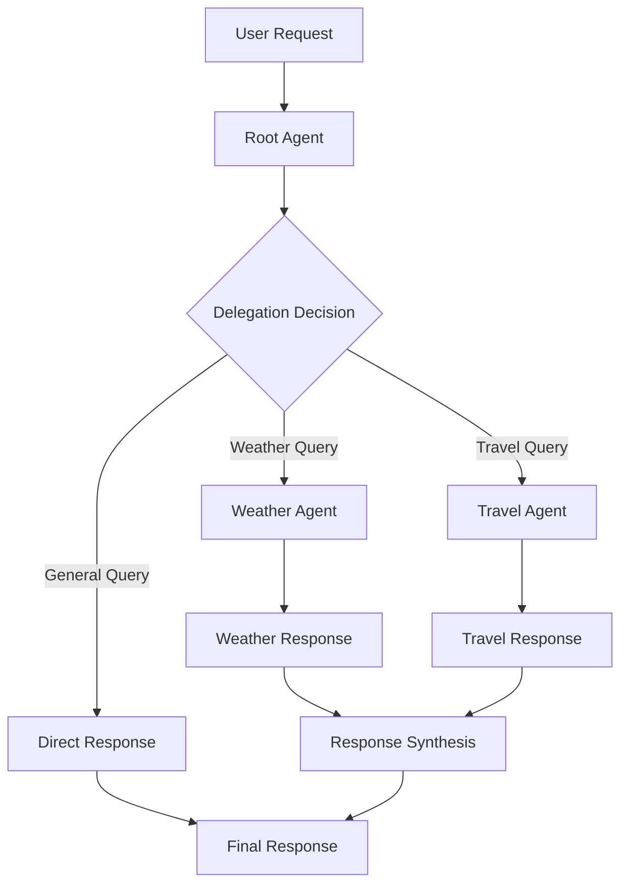

---
categories:
- artificial-intelligence
- agent-development
date: 2025-05-10
header_image_path: /assets/img/blog/headers/2025-05-10-google-adk-masterclass-part7.jpg
image_credit: Photo by Luke Chesser on Unsplash
layout: post
tags: google-adk ai-agents multi-agent-systems agent-collaboration
thumbnail_path: /assets/img/blog/thumbnails/2025-05-10-google-adk-masterclass-part7.jpg
title: 'Google ADK Masterclass Part 7: Building Multi-Agent Solutions'
---

# Google ADK Masterclass Part 7: Building Multi-Agent Solutions

[Overview](./2025-05-10-google-adk-masterclass-overview)

In our [previous tutorials](./2025-05-10-google-adk-masterclass-part6.md), we've explored creating individual agents with various capabilities. While single agents can be powerful, complex problems often benefit from a divide-and-conquer approach where multiple specialized agents collaborate.

In this tutorial, we'll dive into ADK's multi-agent capabilities, showing you how to build systems where agents with different specialties work together to accomplish complex tasks.

## Why Use Multi-Agent Systems?

Before we dive into implementation, let's understand why multi-agent systems are valuable:

1. **Specialization**: Each agent can focus on what it does best
2. **Modularity**: Easier to maintain and update individual components
3. **Scalability**: Add new capabilities by adding new agents
4. **Cognitive division**: Break complex problems into manageable parts
5. **Improved reliability**: Multiple agents can cross-check each other's work

## How Multi-Agent Systems Work in ADK

ADK's multi-agent architecture is built around a key concept: the **root agent**. The root agent serves as the coordinator and entry point for all user requests. When a request comes in, the root agent:

1. Analyzes the request to understand what's needed
2. Determines which specialized agent(s) can best handle the task
3. Delegates the task to the appropriate agent(s)
4. Coordinates the responses and provides a unified answer

This approach is similar to the "router" pattern in software design, where a central component directs traffic to specialized handlers.

## Building a Basic Multi-Agent System

Let's create a simple multi-agent system with three specialized agents:
- A weather agent that reports current weather conditions
- A travel agent that provides travel recommendations
- A vacation planner agent that coordinates the overall planning process

### Folder Structure

```
multi_agent/
├── main.py
├── utils.py
├── .env
├── vacation_planner/
│   ├── __init__.py
│   └── agent.py
├── weather_agent/
│   ├── __init__.py
│   └── agent.py
└── travel_agent/
    ├── __init__.py
    └── agent.py
```

### Specialized Agent: Weather Agent

First, let's create our weather agent:

```python
# weather_agent/agent.py
from google.adk import Agent
from google.adk.tool import FunctionTool
import random

def get_weather(location: str, date: str) -> dict:
    """
    Get weather information for a specific location and date.

    Args:
        location: City or location name
        date: Date in YYYY-MM-DD format

    Returns:
        Weather information including temperature, conditions, and humidity
    """
    # In a real application, this would call a weather API
    # For this example, we'll generate random weather data
    conditions = ["Sunny", "Partly Cloudy", "Cloudy", "Rainy", "Stormy", "Snowy"]
    temp_celsius = random.randint(5, 35)
    temp_fahrenheit = (temp_celsius * 9/5) + 32
    humidity = random.randint(30, 90)

    return {
        "location": location,
        "date": date,
        "temperature_celsius": temp_celsius,
        "temperature_fahrenheit": round(temp_fahrenheit, 1),
        "conditions": random.choice(conditions),
        "humidity": humidity,
        "data_source": "Simulated weather data (for demo purposes)"
    }

weather_agent = Agent(
    name="weather_agent",
    model="models/gemini-2.0-no-flash",
    description="Provides detailed weather information for specific locations and dates",
    instructions="""
    You are a helpful weather assistant that provides weather information.

    When asked about weather for a specific location and date, use the get_weather tool to fetch data.

    Present the weather information in a friendly, conversational manner. Include:
    - Temperature (in both Celsius and Fahrenheit)
    - Weather conditions
    - Humidity

    If the user doesn't specify a date, assume they're asking about the current date.
    If the user doesn't specify a location, ask them to provide one.
    """,
    tools=[FunctionTool(get_weather)]
)
```

### Specialized Agent: Travel Agent

Next, let's create a travel agent:

```python
# travel_agent/agent.py
from google.adk import Agent
from google.adk.tool import FunctionTool
import random

def get_transportation_options(origin: str, destination: str, date: str) -> dict:
    """
    Get available transportation options between two locations.

    Args:
        origin: Starting location
        destination: End location
        date: Travel date in YYYY-MM-DD format

    Returns:
        Available transportation options with prices and durations
    """
    # In a real application, this would call a travel API
    # For this example, we'll generate simulated options

    # Calculate mock distance (just for demonstration)
    distance = random.randint(100, 2000)

    # Generate flight options
    flight_price = distance * (0.10 + (random.random() * 0.15))
    flight_duration = distance / 800 * 60  # minutes

    # Generate train options if distance is reasonable
    train_available = distance < 1000
    train_price = None
    train_duration = None
    if train_available:
        train_price = distance * (0.07 + (random.random() * 0.07))
        train_duration = distance / 120 * 60  # minutes

    # Generate car rental option
    car_price = 50 + (distance * 0.05)
    car_duration = distance / 80 * 60  # minutes

    return {
        "origin": origin,
        "destination": destination,
        "date": date,
        "distance_km": distance,
        "options": {
            "flight": {
                "available": True,
                "price_usd": round(flight_price, 2),
                "duration_minutes": round(flight_duration),
                "notes": "Direct flight"
            },
            "train": {
                "available": train_available,
                "price_usd": round(train_price, 2) if train_available else None,
                "duration_minutes": round(train_duration) if train_available else None,
                "notes": "Scenic route" if train_available else "No train service available"
            },
            "car_rental": {
                "available": True,
                "price_usd_per_day": round(car_price, 2),
                "estimated_travel_minutes": round(car_duration),
                "notes": "Fuel costs not included"
            }
        },
        "data_source": "Simulated travel data (for demo purposes)"
    }

def get_accommodation_options(location: str, check_in: str, check_out: str) -> dict:
    """
    Get available accommodation options for a specific location and dates.

    Args:
        location: City or destination
        check_in: Check-in date in YYYY-MM-DD format
        check_out: Check-out date in YYYY-MM-DD format

    Returns:
        Available accommodation options with prices and amenities
    """
    # In a real application, this would call a hotel/accommodation API
    # For this example, we'll generate simulated options

    # Mock accommodation types
    hotel_types = [
        {"name": "Luxury Hotel", "price_factor": 2.5, "amenities": ["Pool", "Spa", "Restaurant", "Gym", "Room Service"]},
        {"name": "Boutique Hotel", "price_factor": 1.8, "amenities": ["Unique Design", "Restaurant", "Concierge"]},
        {"name": "Budget Hotel", "price_factor": 1.0, "amenities": ["Free WiFi", "Basic Breakfast"]},
        {"name": "Hostel", "price_factor": 0.4, "amenities": ["Shared Kitchen", "Common Area", "Lockers"]},
        {"name": "Apartment Rental", "price_factor": 1.5, "amenities": ["Kitchen", "Washer/Dryer", "Living Area"]}
    ]

    # Generate 3 random accommodation options
    base_price = 50 + (random.random() * 50)
    accommodations = []

    selected_types = random.sample(hotel_types, 3)
    for hotel_type in selected_types:
        price = base_price * hotel_type["price_factor"]
        accommodations.append({
            "name": f"{hotel_type['name']} in {location}",
            "type": hotel_type["name"],
            "price_per_night_usd": round(price, 2),
            "amenities": hotel_type["amenities"],
            "rating": round(3 + (random.random() * 2), 1),  # 3-5 star rating
            "location": f"{location} city center",
            "availability": "Available"
        })

    return {
        "location": location,
        "check_in": check_in,
        "check_out": check_out,
        "options": accommodations,
        "data_source": "Simulated accommodation data (for demo purposes)"
    }

travel_agent = Agent(
    name="travel_agent",
    model="models/gemini-2.0-no-flash",
    description="Provides travel recommendations including transportation and accommodation options",
    instructions="""
    You are a helpful travel assistant that provides transportation and accommodation recommendations.

    When asked about travel options, use:
    - get_transportation_options tool for flights, trains, and car rentals
    - get_accommodation_options tool for hotels and other lodging

    Present options in a helpful, organized way, highlighting:
    - Best value options
    - Fastest/most convenient options
    - Any special features or considerations

    If the user doesn't provide specific dates or locations, ask for clarification.
    """,
    tools=[
        FunctionTool(get_transportation_options),
        FunctionTool(get_accommodation_options)
    ]
)
```

### Root Agent: Vacation Planner

Now, let's create our root agent that will coordinate between the specialized agents:

```python
# vacation_planner/agent.py
from google.adk import Agent

vacation_planner = Agent(
    name="vacation_planner",
    model="models/gemini-2.0-no-flash",
    description="A vacation planning assistant that helps users plan their perfect vacation",
    instructions="""
    You are a helpful vacation planning assistant. Your job is to coordinate vacation planning by delegating to specialized agents when appropriate.

    You have access to these specialized agents:
    - weather_agent: For weather information at destinations
    - travel_agent: For transportation and accommodation recommendations

    When to delegate:
    - For specific weather information: Delegate to the weather_agent
    - For transportation or accommodation options: Delegate to the travel_agent
    - For general vacation planning that requires combining weather and travel: First get information from both agents, then synthesize it into a cohesive plan

    When responding directly (without delegation):
    - General travel advice
    - Coordination between different aspects of travel planning
    - Recommendations based on user preferences
    - Summary of information from multiple agents

    Always maintain a helpful, enthusiastic tone about travel planning. Ask clarifying questions when needed to better assist the user.
    """
)
```

Note that we don't need to specify the other agents explicitly in the code. We'll register them when we set up the runner.

### Main Application (main.py)

Now let's create our main application that ties everything together:

```python
import os
import asyncio
from dotenv import load_dotenv
import uuid

from google.adk.orchestration import Runner
from google.adk.orchestration.session import InMemorySessionService
from google.generativeai.types import content_types
from google.generativeai.types.content_types import Part

# Import our agents
from vacation_planner.agent import vacation_planner
from weather_agent.agent import weather_agent
from travel_agent.agent import travel_agent

# Load environment variables
load_dotenv()

async def process_user_input(runner, user_id, session_id, query):
    """Process a user query through the agent system."""
    print(f"\nYou: {query}")

    # Create content from the user query
    content = content_types.Content(
        role="user",
        parts=[Part.from_text(query)]
    )

    # Run the agent with the user query
    response = await runner.run_async(
        user_id=user_id,
        session_id=session_id,
        content=content
    )

    # Process the response
    final_response_text = None

    for event in response.events:
        if event.type == "content" and event.content.role == "agent":
            final_response_text = event.content.parts[0].text

    print(f"\nVacation Planner: {final_response_text}")
    return final_response_text

async def main():
    # Create a session service
    session_service = InMemorySessionService()

    # Create a session
    session_id = str(uuid.uuid4())
    session = session_service.create_session(
        app_name="VacationPlanner",
        user_id="example_user",
        session_id=session_id
    )

    # Create a runner with all our agents
    runner = Runner(
        root_agent=vacation_planner,
        agents=[weather_agent, travel_agent],
        session_service=session_service
    )

    # Interactive chat loop
    print("\nVacation Planner Multi-Agent Demo")
    print("Type 'exit' or 'quit' to end the conversation")
    print("--------------------------------------------------------")

    while True:
        user_input = input("\nYou: ")

        if user_input.lower() in ["exit", "quit"]:
            print("Thank you for using the Vacation Planner! Goodbye!")
            break

        # Process the user input
        await process_user_input(runner, "example_user", session_id, user_input)

if __name__ == "__main__":
    asyncio.run(main())
```

The key differences from our previous single-agent applications are:

1. We import all three agents
2. We set `vacation_planner` as the root agent
3. We include `weather_agent` and `travel_agent` in the `agents` parameter of the Runner

This tells ADK that the vacation planner is the coordinator, but it has access to delegate to the weather and travel agents.

## Running the Multi-Agent System

Let's run our multi-agent vacation planner:

```bash
cd multi_agent
python main.py
```

### Example Interaction

```
Vacation Planner Multi-Agent Demo
Type 'exit' or 'quit' to end the conversation
--------------------------------------------------------

You: I'm planning a trip to Paris in June. What should I know about the weather and transportation options?

Vacation Planner: I'd be happy to help you plan your trip to Paris in June! Let me gather some information about the weather and transportation options for you.

First, regarding the weather in Paris in June:

Based on the data I've gathered, Paris in June typically has pleasant summer weather. The average temperature is around 22°C (71.6°F), with partly cloudy conditions and moderate humidity at about 62%. This is a lovely time to visit Paris as the weather is generally warm but not too hot, perfect for exploring the city.

As for transportation options from your location to Paris:

For your trip to Paris, you have several transportation options:

1. Flight:
   - Available direct flights
   - Estimated price: $169.19
   - Duration: approximately 150 minutes (2.5 hours)
   - This is the fastest option for reaching Paris

2. Train:
   - Available scenic route options
   - Estimated price: $60.40
   - Duration: approximately 500 minutes (8.3 hours)
   - The train offers beautiful views along the journey

3. Car Rental:
   - Available for $80.00 per day
   - Estimated travel time: 750 minutes (12.5 hours)
   - Gives you flexibility once you arrive in Paris
   - Note that fuel costs are not included in this price

For accommodation in Paris, here are some options:

1. Luxury Hotel in Paris
   - $117.50 per night
   - Amenities include: Pool, Spa, Restaurant, Gym, Room Service
   - 4.9/5 star rating
   - Located in Paris city center

2. Boutique Hotel in Paris
   - $84.60 per night
   - Amenities include: Unique Design, Restaurant, Concierge
   - 4.7/5 star rating
   - Located in Paris city center

3. Apartment Rental in Paris
   - $70.50 per night
   - Amenities include: Kitchen, Washer/Dryer, Living Area
   - 4.3/5 star rating
   - Located in Paris city center

Would you like more specific information about any of these options? Or perhaps you'd like recommendations for activities and attractions in Paris in June?

You: What are the best areas to stay in Paris for a first-time visitor?

Vacation Planner: As a first-time visitor to Paris, you'll want to stay in an area that gives you good access to major attractions while providing an authentic Parisian experience. Here are the best areas I recommend:

1. **Le Marais (4th arrondissement)** - A historic and trendy neighborhood with:
   - Beautiful medieval architecture and charming narrow streets
   - Walking distance to Notre-Dame Cathedral and Centre Pompidou
   - Excellent shopping, from boutiques to vintage stores
   - Vibrant café culture and great restaurants
   - Lively atmosphere day and night

2. **Saint-Germain-des-Prés (6th arrondissement)** - Classic, literary Paris:
   - Iconic cafés like Café de Flore and Les Deux Magots
   - Close to Luxembourg Gardens and the Latin Quarter
   - Elegant shopping streets
   - Central location for walking to many attractions
   - Quintessential Parisian atmosphere

3. **Montmartre (18th arrondissement)** - Bohemian and artistic:
   - Home to Sacré-Cœur Basilica with amazing city views
   - Artistic legacy and village-like charm
   - The famous Place du Tertre with street artists
   - Authentic neighborhood feel away from the busiest tourist areas
   - Note: It's a bit further from central attractions but has excellent metro connections

4. **The 7th arrondissement** - Classic tourist area:
   - Home to the Eiffel Tower
   - Close to Musée d'Orsay
   - Upscale residential area with beautiful architecture
   - Quieter in the evenings
   - Great for those who want a more relaxed pace

5. **The 1st arrondissement** - Central and convenient:
   - Home to the Louvre and Tuileries Garden
   - Walking distance to many major attractions
   - Close to Seine River for scenic walks
   - Higher-end hotels and shopping
   - Very central but can be quite touristy

For a first-time visitor, I particularly recommend staying in either Le Marais or Saint-Germain-des-Prés. Both offer central locations with excellent access to public transportation, plenty of dining options, and authentic Parisian charm while being walking distance to many major attractions.

Would you like more specific hotel recommendations in any of these areas based on your budget and preferences?

You: I'd like to know what the weather is like in both Paris and Rome in June, as I'm deciding between the two.

Vacation Planner: I'd be happy to help you compare the weather in Paris and Rome in June to help with your decision. Let me check the weather information for both cities.

For Paris in June:
The weather in Paris is typically pleasant in June with an average temperature of 21°C (69.8°F). The conditions are expected to be sunny with moderate humidity around 60%. This makes it a great time to explore the city, with comfortable temperatures for walking tours and outdoor cafés. You might experience occasional light showers, but June is generally not a very rainy month in Paris.

For Rome in June:
Rome in June tends to be warmer with an average temperature of 28°C (82.4°F). The conditions are forecasted to be sunny with slightly lower humidity at around 50%. June in Rome brings consistent sunny days and warm temperatures. It can get quite hot, especially in the afternoon, with temperatures sometimes reaching above 30°C (86°F). The evenings are usually warm and pleasant.

Weather comparison:
- Paris is generally cooler (21°C/69.8°F) compared to Rome (28°C/82.4°F)
- Both cities tend to have sunny conditions in June
- Rome is typically drier with less chance of rain
- Paris has more moderate temperatures, ideal for extended walking tours
- Rome's heat might require planning indoor activities during the hottest afternoon hours
- Both cities have pleasant evenings, though Rome's are warmer

For travelers who prefer slightly cooler weather for sightseeing, Paris might be more comfortable. If you enjoy warmer weather and more guaranteed sunshine, Rome would be an excellent choice.

Would you like me to compare any other aspects of these destinations to help with your decision, such as transportation options, accommodation choices, or popular attractions in June?

You: quit
Thank you for using the Vacation Planner! Goodbye!
```

## How Multi-Agent Delegation Works

What happened behind the scenes during our interaction? Let's examine the process:

1. When we asked about Paris weather and transportation, the `vacation_planner` agent:
   - Analyzed the request and recognized it needed both weather and travel information
   - Delegated the weather question to the `weather_agent`
   - Delegated the transportation question to the `travel_agent`
   - Combined the responses into a comprehensive answer

2. When we asked about areas to stay in Paris, the request was general travel advice, so the `vacation_planner` handled it directly without delegation.

3. When we asked to compare weather between Paris and Rome, the `vacation_planner`:
   - Recognized this was a weather-specific question
   - Delegated to the `weather_agent` twice (once for each city)
   - Synthesized the responses into a comparison

The delegation process is handled automatically by ADK based on the agent descriptions and the user query.

## Exploring Multi-Agent Events

If we were using the ADK web interface, we could examine the events to see this delegation in action. Each delegation creates events showing:

1. The initial request received by the root agent
2. The root agent's decision to delegate
3. The delegated request sent to the specialized agent
4. The specialized agent's response
5. The root agent's synthesis of all responses

This transparency helps understand and debug complex multi-agent interactions.

## Adding State to Multi-Agent Systems

Multi-agent systems become even more powerful when combined with state management. Let's enhance our vacation planner to remember the user's preferences:

```python
# Update to main.py
async def main():
    # Create a session service
    session_service = InMemorySessionService()

    # Define initial state with user preferences
    initial_state = {
        "user_preferences": {
            "destinations": [],
            "budget_category": "moderate",
            "interests": [],
            "travel_dates": {},
            "accommodation_type": "",
            "dietary_restrictions": []
        }
    }

    # Create a session with initial state
    session_id = str(uuid.uuid4())
    session = session_service.create_session(
        app_name="VacationPlanner",
        user_id="example_user",
        session_id=session_id,
        state=initial_state
    )

    # Rest of the code remains the same...
```

We'd also need to update our root agent to access this state:

```python
# Update to vacation_planner/agent.py
vacation_planner = Agent(
    name="vacation_planner",
    model="models/gemini-2.0-no-flash",
    description="A vacation planning assistant that helps users plan their perfect vacation",
    instructions="""
    You are a helpful vacation planning assistant. Your job is to coordinate vacation planning by delegating to specialized agents when appropriate.

    User Preferences:
    - Destinations of interest: {user_preferences.destinations}
    - Budget category: {user_preferences.budget_category}
    - Interests: {user_preferences.interests}
    - Travel dates: {user_preferences.travel_dates}
    - Preferred accommodation: {user_preferences.accommodation_type}
    - Dietary restrictions: {user_preferences.dietary_restrictions}

    You have access to these specialized agents:
    - weather_agent: For weather information at destinations
    - travel_agent: For transportation and accommodation recommendations

    When to delegate:
    - For specific weather information: Delegate to the weather_agent
    - For transportation or accommodation options: Delegate to the travel_agent
    - For general vacation planning that requires combining weather and travel: First get information from both agents, then synthesize it into a cohesive plan

    When responding directly (without delegation):
    - General travel advice
    - Coordination between different aspects of travel planning
    - Recommendations based on user preferences
    - Summary of information from multiple agents

    Always maintain a helpful, enthusiastic tone about travel planning. Ask clarifying questions when needed to better assist the user.

    As users mention preferences, remember these details and incorporate them into your recommendations.
    """
)
```

Finally, we'd need tools to update these preferences:

```python
# Add to vacation_planner/agent.py
def update_user_preference(category: str, value: str, tool_context) -> dict:
    """
    Update a user preference in the session state.

    Args:
        category: The preference category to update (e.g., 'destinations', 'budget_category')
        value: The new value for this preference
        tool_context: Provided by ADK, contains session information

    Returns:
        A dictionary with the updated preference information
    """
    state = tool_context.state

    # Ensure user_preferences exists
    if "user_preferences" not in state:
        state["user_preferences"] = {}

    # Handle list-type preferences
    list_preferences = ["destinations", "interests", "dietary_restrictions"]

    if category in list_preferences:
        if category not in state["user_preferences"]:
            state["user_preferences"][category] = []

        # Add to list if not already present
        if value not in state["user_preferences"][category]:
            state["user_preferences"][category].append(value)
    else:
        # For simple string preferences
        state["user_preferences"][category] = value

    return {
        "category": category,
        "value": value,
        "current_state": state["user_preferences"]
    }

# Update the agent definition to include the tool
vacation_planner = Agent(
    name="vacation_planner",
    model="models/gemini-2.0-no-flash",
    description="A vacation planning assistant that helps users plan their perfect vacation",
    instructions="""
    # Same instructions as before...
    """,
    tools=[FunctionTool(update_user_preference)]
)
```

With these changes, our vacation planner can now remember user preferences across the conversation and use them to provide more personalized recommendations.

## Best Practices for Multi-Agent Systems

Based on our experience building this system, here are some best practices:

### 1. Clear Agent Boundaries

Define clear responsibilities for each agent. Agents should have non-overlapping specialties to avoid confusion in delegation.

### 2. Descriptive Agent Names and Descriptions

Use clear, descriptive names and detailed descriptions. The root agent uses these to determine which agent to delegate to.

```python
weather_agent = Agent(
    name="weather_agent",
    # Clear description of capabilities
    description="Provides accurate weather forecasts and historical weather data for any global location",
    # ...
)
```

### 3. Explicit Delegation Instructions

Give your root agent clear instructions about when to delegate:

```
When to delegate:
- For questions about X: Use the X_agent
- For tasks related to Y: Use the Y_agent
- For complex issues involving X and Y: First get information from both agents, then synthesize
```

### 4. State Sharing Strategy

Decide how agents will share information:
- Through session state (for persistent information)
- Through direct delegation outputs (for one-time transfers)

### 5. Error Handling

Implement fallback strategies when delegation fails:

```python
try:
    # Attempt delegation
    response = await runner.run_async(...)
except Exception as e:
    # Fallback to a more general response
    print(f"Delegation failed: {e}")
    fallback_response = "I'm having trouble getting that specific information..."
```

## Advanced Multi-Agent Patterns

As you develop more sophisticated multi-agent systems, consider these advanced patterns:

### 1. Hierarchical Agent Structure

Create multiple levels of delegation:

```
Root Agent
├── Domain Agent A
│   ├── Specialized Agent A1
│   └── Specialized Agent A2
└── Domain Agent B
    ├── Specialized Agent B1
    └── Specialized Agent B2
```

### 2. Agent Consensus

Have multiple agents work on the same problem and synthesize their outputs:

```python
# Get opinions from multiple specialized agents
response_a = await get_agent_response(agent_a, query)
response_b = await get_agent_response(agent_b, query)
response_c = await get_agent_response(agent_c, query)

# Have a consensus agent synthesize the responses
consensus_query = f"""
Query: {query}

Agent A response: {response_a}
Agent B response: {response_b}
Agent C response: {response_c}

Please synthesize these responses into a comprehensive answer.
"""
final_response = await get_agent_response(consensus_agent, consensus_query)
```

### 3. Progressive Refinement

Chain agents in a sequence where each refines the previous output:

```python
# Agent 1: Generate initial response
initial_response = await get_agent_response(research_agent, query)

# Agent 2: Fact-check and improve accuracy
fact_checked = await get_agent_response(fact_check_agent,
                                      f"Fact check this: {initial_response}")

# Agent 3: Improve writing style
final_response = await get_agent_response(writing_agent,
                                       f"Improve the style of this response: {fact_checked}")
```

## Conclusion

Multi-agent systems represent one of the most powerful capabilities of ADK, allowing you to build complex AI systems with specialized components that work together. By properly defining agent responsibilities and orchestrating their interactions, you can create solutions that are more capable, maintainable, and extensible than single-agent approaches.

In this tutorial, we've covered:
- Why multi-agent systems are valuable
- How delegation works in ADK
- Building a vacation planning system with specialized agents
- Adding state management to track user preferences
- Best practices for effective multi-agent design
- Advanced patterns for sophisticated systems

In the next part of our series, we'll explore how to add session and memory to multi-agent solutions, allowing them to maintain context across conversations.

## Resources

- [ADK Multi-Agent Documentation](https://cloud.google.com/vertex-ai/docs/generative-ai/agents/agent-development-kit/multi-agent)
- [Agent Delegation Patterns](https://cloud.google.com/vertex-ai/docs/generative-ai/agents/agent-development-kit/delegation)
- [ADK Best Practices](https://cloud.google.com/vertex-ai/docs/generative-ai/agents/agent-development-kit/best-practices)


[Next...](./2025-05-10-google-adk-masterclass-part8)
