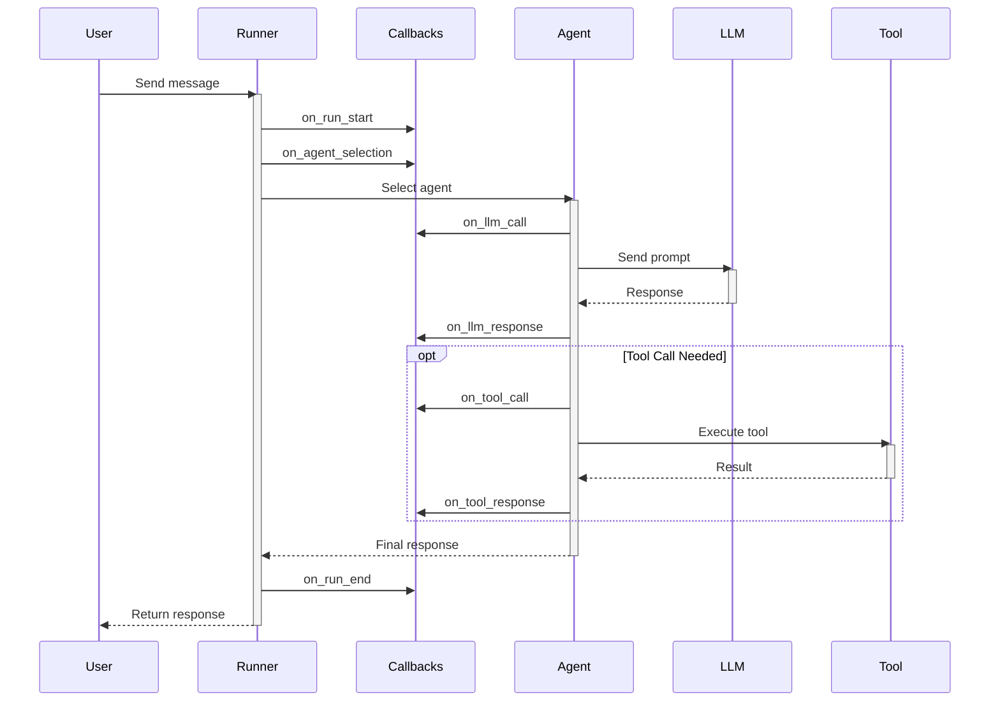

---
categories:
- artificial-intelligence
- agent-development
date: 2025-05-10
header_image_path: /assets/img/blog/headers/2025-05-10-google-adk-masterclass-part8.jpg
image_credit: Photo by Javier Quesada on Unsplash
layout: post
tags: google-adk ai-agents callbacks lifecycle-events monitoring
thumbnail_path: /assets/img/blog/thumbnails/2025-05-10-google-adk-masterclass-part8.jpg
title: 'Google ADK Masterclass Part 8: Callbacks and Agent Lifecycle'
---

# Google ADK Masterclass Part 8: Callbacks and Agent Lifecycle

[Overview](./google-adk-masterclass-overview)

In our [previous tutorial](./google-adk-masterclass-part7), we explored building multi-agent systems where specialized agents collaborate to solve complex problems. Now, we'll dive into one of ADK's most powerful but lesser-known features: callbacks.

Callbacks allow you to hook into every stage of an agent's execution lifecycle, enabling you to monitor, modify, and extend agent behavior. This capability is essential for advanced applications, providing fine-grained control over the agent experience.

## Understanding the Agent Lifecycle

Before implementing callbacks, it's important to understand the agent lifecycle in ADK. When a user interacts with an agent, the following events occur in sequence:

1. **Pre-Run**: Before any processing begins
2. **Agent Selection**: Determining which agent will handle the request
3. **Pre-LLM Call**: Before sending the prompt to the language model
4. **LLM Response**: After receiving a response from the language model
5. **Pre-Tool Call**: Before executing a tool
6. **Tool Response**: After receiving a response from a tool
7. **Post-Run**: After all processing is complete

Each of these stages represents an opportunity to intervene in the agent's execution process.

## Why Use Callbacks?

Callbacks serve several important purposes:

1. **Monitoring**: Track usage, performance, and behavior
2. **Logging**: Record detailed information about agent interactions
3. **Modification**: Alter prompts, responses, or tool calls
4. **Security**: Implement safety filters or rate limiting
5. **Integration**: Connect with external systems
6. **Debugging**: Gain insights into agent behavior

## Implementing Basic Callbacks

Let's build a callback system that logs details at each stage of the agent lifecycle:

### Folder Structure

```
callbacks/
├── main.py
├── utils.py
├── .env
└── logger_agent/
    ├── __init__.py
    └── agent.py
```

### Agent Implementation (logger_agent/agent.py)

```python
from google.adk import Agent
from google.adk.tool import FunctionTool

def get_current_time() -> dict:
    """
    Returns the current time.
    Use this when the user asks for the current time.
    """
    from datetime import datetime
    now = datetime.now()

    return {
        "current_time": now.strftime("%H:%M:%S"),
        "current_date": now.strftime("%Y-%m-%d"),
        "timezone": datetime.now().astimezone().tzname()
    }

logger_agent = Agent(
    name="logger_agent",
    model="models/gemini-2.0-no-flash",
    description="A helpful agent that demonstrates callbacks",
    instructions="""
    You are a helpful assistant that can provide information and answer questions.

    When asked about the current time, use the get_current_time tool.

    Be friendly and conversational in your responses.
    """,
    tools=[FunctionTool(get_current_time)]
)
```

### Callback Implementation (main.py)

```python
import os
import asyncio
import uuid
import time
import json
from datetime import datetime
from dotenv import load_dotenv

from google.adk.orchestration import Runner
from google.adk.orchestration.session import InMemorySessionService
from google.generativeai.types import content_types
from google.generativeai.types.content_types import Part

from logger_agent.agent import logger_agent

# Load environment variables
load_dotenv()

# Create a log file
log_file = "agent_logs.jsonl"

class CallbackLogger:
    """Callback handler that logs details at each stage of the agent lifecycle."""

    def __init__(self, log_file):
        self.log_file = log_file
        self.start_time = None
        self.execution_id = None

    def log_event(self, event_type, details=None):
        """Log an event to the log file."""
        timestamp = datetime.now().isoformat()

        log_entry = {
            "timestamp": timestamp,
            "execution_id": self.execution_id,
            "event_type": event_type,
            "details": details or {}
        }

        with open(self.log_file, "a") as f:
            f.write(json.dumps(log_entry) + "\n")

    async def on_run_start(self, runner, user_id, session_id, content, **kwargs):
        """Called before the agent starts processing."""
        self.start_time = time.time()
        self.execution_id = str(uuid.uuid4())

        # Extract the user message
        user_message = None
        for part in content.parts:
            if hasattr(part, 'text'):
                user_message = part.text
                break

        self.log_event("run_start", {
            "user_id": user_id,
            "session_id": session_id,
            "user_message": user_message
        })

    async def on_agent_selection(self, runner, user_id, session_id, agent_name, **kwargs):
        """Called when an agent is selected to handle the request."""
        self.log_event("agent_selection", {
            "agent_name": agent_name
        })

    async def on_llm_call(self, runner, user_id, session_id, agent_name,
                         prompt, **kwargs):
        """Called before sending a prompt to the language model."""
        # Note: In a real app, you might want to sanitize or truncate the prompt
        # as it could be very large
        self.log_event("llm_call", {
            "agent_name": agent_name,
            "prompt_length": len(str(prompt))
        })

    async def on_llm_response(self, runner, user_id, session_id, agent_name,
                             prompt, response, **kwargs):
        """Called after receiving a response from the language model."""
        self.log_event("llm_response", {
            "agent_name": agent_name,
            "response_length": len(str(response))
        })

    async def on_tool_call(self, runner, user_id, session_id, agent_name,
                          tool_name, tool_params, **kwargs):
        """Called before executing a tool."""
        self.log_event("tool_call", {
            "agent_name": agent_name,
            "tool_name": tool_name,
            "tool_params": tool_params
        })

    async def on_tool_response(self, runner, user_id, session_id, agent_name,
                              tool_name, tool_params, tool_response, **kwargs):
        """Called after receiving a response from a tool."""
        self.log_event("tool_response", {
            "agent_name": agent_name,
            "tool_name": tool_name,
            "tool_response": tool_response
        })

    async def on_run_end(self, runner, user_id, session_id, content, **kwargs):
        """Called after the agent completes processing."""
        execution_time = time.time() - self.start_time

        # Extract the final response
        agent_response = None
        if content and hasattr(content, 'parts'):
            for part in content.parts:
                if hasattr(part, 'text'):
                    agent_response = part.text
                    break

        self.log_event("run_end", {
            "execution_time_seconds": execution_time,
            "agent_response": agent_response
        })

async def process_user_input(runner, user_id, session_id, query):
    """Process a user query through the agent."""
    print(f"\nYou: {query}")

    # Create content from the user query
    content = content_types.Content(
        role="user",
        parts=[Part.from_text(query)]
    )

    # Run the agent with the user query
    response = await runner.run_async(
        user_id=user_id,
        session_id=session_id,
        content=content
    )

    # Process the response
    final_response_text = None

    for event in response.events:
        if event.type == "content" and event.content.role == "agent":
            final_response_text = event.content.parts[0].text

    print(f"\nAgent: {final_response_text}")
    return final_response_text

async def main():
    # Clear or create the log file
    with open(log_file, "w") as f:
        f.write("")

    # Create a session service
    session_service = InMemorySessionService()

    # Create a callback logger
    callback_logger = CallbackLogger(log_file)

    # Create a session
    session_id = str(uuid.uuid4())
    session = session_service.create_session(
        app_name="CallbackDemo",
        user_id="example_user",
        session_id=session_id
    )

    # Create a runner with callbacks
    runner = Runner(
        root_agent=logger_agent,
        session_service=session_service,
        callbacks=[
            callback_logger.on_run_start,
            callback_logger.on_agent_selection,
            callback_logger.on_llm_call,
            callback_logger.on_llm_response,
            callback_logger.on_tool_call,
            callback_logger.on_tool_response,
            callback_logger.on_run_end
        ]
    )

    # Interactive chat loop
    print("\nCallback Demo")
    print("Type 'exit' or 'quit' to end the conversation")
    print("--------------------------------------------------------")

    while True:
        user_input = input("\nYou: ")

        if user_input.lower() in ["exit", "quit"]:
            print("Goodbye! Check agent_logs.jsonl for the interaction logs.")
            break

        # Process the user input
        await process_user_input(runner, "example_user", session_id, user_input)

if __name__ == "__main__":
    asyncio.run(main())
```

### Running the Example

Run the example with:

```bash
cd callbacks
python main.py
```

Example interaction:

```
Callback Demo
Type 'exit' or 'quit' to end the conversation
--------------------------------------------------------

You: Hello, what can you do?

Agent: Hello! I'm a helpful assistant designed to answer your questions and provide information on various topics. I can chat with you, provide explanations, help with general knowledge questions, and even tell you the current time if you ask me. Is there something specific you'd like to know or discuss today?

You: What time is it now?

Agent: I've checked the current time for you. It's 14:32:07 on 2025-05-10 in the PDT timezone.

You: quit
Goodbye! Check agent_logs.jsonl for the interaction logs.
```

After the interaction, you can examine the log file (`agent_logs.jsonl`) to see detailed information about each stage of the agent lifecycle. Here's a sample of what you might see:

```json
{"timestamp": "2025-05-10T14:30:45.123456", "execution_id": "550e8400-e29b-41d4-a716-446655440000", "event_type": "run_start", "details": {"user_id": "example_user", "session_id": "8a7b6c5d-4e3f-2d1c-0b9a-8a7b6c5d4e3f", "user_message": "Hello, what can you do?"}}
{"timestamp": "2025-05-10T14:30:45.234567", "execution_id": "550e8400-e29b-41d4-a716-446655440000", "event_type": "agent_selection", "details": {"agent_name": "logger_agent"}}
{"timestamp": "2025-05-10T14:30:45.345678", "execution_id": "550e8400-e29b-41d4-a716-446655440000", "event_type": "llm_call", "details": {"agent_name": "logger_agent", "prompt_length": 1523}}
{"timestamp": "2025-05-10T14:30:46.456789", "execution_id": "550e8400-e29b-41d4-a716-446655440000", "event_type": "llm_response", "details": {"agent_name": "logger_agent", "response_length": 329}}
{"timestamp": "2025-05-10T14:30:46.567890", "execution_id": "550e8400-e29b-41d4-a716-446655440000", "event_type": "run_end", "details": {"execution_time_seconds": 1.444434, "agent_response": "Hello! I'm a helpful assistant designed to answer your questions and provide information on various topics..."}}
```

## Advanced Callback Techniques

Now that we understand the basics, let's explore some more advanced callback techniques.

### 1. Prompt Modification

You can modify prompts before they're sent to the language model:

```python
async def on_llm_call(self, runner, user_id, session_id, agent_name,
                     prompt, **kwargs):
    """Modify prompt before sending to the language model."""
    # Add additional context to every prompt
    if isinstance(prompt, str):
        enhanced_prompt = f"Remember to maintain a friendly, conversational tone. {prompt}"
        return {"prompt": enhanced_prompt}
    return None
```

### 2. Response Filtering

You can filter or modify responses from the language model:

```python
async def on_llm_response(self, runner, user_id, session_id, agent_name,
                         prompt, response, **kwargs):
    """Filter responses from the language model."""
    # Check for and remove controversial content
    if isinstance(response, str) and "controversial_topic" in response.lower():
        filtered_response = "I apologize, but I cannot provide information on that topic."
        return {"response": filtered_response}
    return None
```

### 3. Tool Interception

You can intercept and modify tool calls:

```python
async def on_tool_call(self, runner, user_id, session_id, agent_name,
                      tool_name, tool_params, **kwargs):
    """Intercept tool calls."""
    # Add rate limiting for expensive API calls
    if tool_name == "expensive_api_call":
        # Check if we've exceeded our quota
        if self.api_call_count > self.max_api_calls:
            return {
                "tool_response": {
                    "error": "API call quota exceeded",
                    "message": "Please try again later."
                }
            }
        self.api_call_count += 1
    return None
```

### 4. Usage Analytics

You can collect detailed analytics about agent usage:

```python
class AnalyticsCallback:
    def __init__(self):
        self.sessions = {}
        self.tool_usage = {}
        self.response_times = []

    async def on_run_start(self, runner, user_id, session_id, content, **kwargs):
        self.start_time = time.time()

        # Track unique sessions
        if session_id not in self.sessions:
            self.sessions[session_id] = {
                "user_id": user_id,
                "message_count": 0,
                "first_seen": datetime.now().isoformat()
            }

        self.sessions[session_id]["message_count"] += 1
        self.sessions[session_id]["last_seen"] = datetime.now().isoformat()

    async def on_tool_call(self, runner, user_id, session_id, agent_name,
                          tool_name, tool_params, **kwargs):
        # Track tool usage
        if tool_name not in self.tool_usage:
            self.tool_usage[tool_name] = 0
        self.tool_usage[tool_name] += 1

    async def on_run_end(self, runner, user_id, session_id, content, **kwargs):
        # Track response times
        execution_time = time.time() - self.start_time
        self.response_times.append(execution_time)

    def get_analytics_report(self):
        """Generate a report of usage analytics."""
        return {
            "unique_sessions": len(self.sessions),
            "total_messages": sum(s["message_count"] for s in self.sessions.values()),
            "tool_usage": self.tool_usage,
            "avg_response_time": sum(self.response_times) / len(self.response_times) if self.response_times else 0,
            "active_users": len(set(s["user_id"] for s in self.sessions.values()))
        }
```

### 5. Error Handling

You can add error handling to gracefully recover from failures:

```python
class ErrorHandlingCallback:
    async def on_llm_call(self, runner, user_id, session_id, agent_name,
                         prompt, **kwargs):
        try:
            # Normal processing
            return None
        except Exception as e:
            print(f"Error in LLM call: {e}")
            # Return a graceful error message
            return {
                "response": "I'm having trouble processing your request right now. Could you try again?"
            }

    async def on_tool_call(self, runner, user_id, session_id, agent_name,
                          tool_name, tool_params, **kwargs):
        try:
            # Normal processing
            return None
        except Exception as e:
            print(f"Error in tool call {tool_name}: {e}")
            # Return a graceful error message for the tool
            return {
                "tool_response": {
                    "error": f"Error executing {tool_name}",
                    "message": "The operation couldn't be completed."
                }
            }
```

## Combining Multiple Callbacks

In real applications, you'll often want to use multiple callbacks together. ADK makes this easy:

```python
# Create instances of your callback handlers
logger = CallbackLogger("agent_logs.jsonl")
analytics = AnalyticsCallback()
error_handler = ErrorHandlingCallback()

# Create a runner with all callbacks
runner = Runner(
    root_agent=your_agent,
    session_service=session_service,
    callbacks=[
        # Logging callbacks
        logger.on_run_start,
        logger.on_agent_selection,
        logger.on_llm_call,
        logger.on_llm_response,
        logger.on_tool_call,
        logger.on_tool_response,
        logger.on_run_end,

        # Analytics callbacks
        analytics.on_run_start,
        analytics.on_tool_call,
        analytics.on_run_end,

        # Error handling callbacks
        error_handler.on_llm_call,
        error_handler.on_tool_call
    ]
)
```

Callbacks are executed in the order they're registered. If a callback returns a modification (e.g., changing a prompt), that modification is passed to subsequent callbacks.

## Creating a Custom Callback Class

For more organized callback management, you can create a class that implements the full callback interface:

```python
from google.adk.orchestration.callback import Callback

class ComprehensiveCallback(Callback):
    def __init__(self, log_file):
        self.log_file = log_file
        self.start_time = None
        self.execution_id = None

    async def on_run_start(self, runner, user_id, session_id, content, **kwargs):
        """Called before the agent starts processing."""
        # Implementation

    async def on_agent_selection(self, runner, user_id, session_id, agent_name, **kwargs):
        """Called when an agent is selected to handle the request."""
        # Implementation

    async def on_llm_call(self, runner, user_id, session_id, agent_name,
                         prompt, **kwargs):
        """Called before sending a prompt to the language model."""
        # Implementation

    async def on_llm_response(self, runner, user_id, session_id, agent_name,
                             prompt, response, **kwargs):
        """Called after receiving a response from the language model."""
        # Implementation

    async def on_tool_call(self, runner, user_id, session_id, agent_name,
                          tool_name, tool_params, **kwargs):
        """Called before executing a tool."""
        # Implementation

    async def on_tool_response(self, runner, user_id, session_id, agent_name,
                              tool_name, tool_params, tool_response, **kwargs):
        """Called after receiving a response from a tool."""
        # Implementation

    async def on_run_end(self, runner, user_id, session_id, content, **kwargs):
        """Called after the agent completes processing."""
        # Implementation

# Create a runner with the comprehensive callback
comprehensive_callback = ComprehensiveCallback("agent_logs.jsonl")
runner = Runner(
    root_agent=your_agent,
    session_service=session_service,
    callbacks=[comprehensive_callback]
)
```

## Best Practices for Callbacks

Based on our experience, here are some best practices for working with callbacks:

### 1. Minimize Computational Overhead

Callbacks run during every agent interaction, so keep them lightweight. Heavy processing should be offloaded to asynchronous processes.

```python
async def on_run_end(self, runner, user_id, session_id, content, **kwargs):
    # Don't do this - blocking operation
    # time.sleep(5)

    # Instead, start an async task
    asyncio.create_task(self.process_logs_async(session_id))
```

### 2. Be Careful with Modifications

Modifying prompts or responses can have unintended consequences. Test thoroughly and make minimal changes.

### 3. Handle Exceptions Gracefully

Always use try/except blocks to prevent callback errors from breaking the agent lifecycle:

```python
async def on_llm_call(self, runner, user_id, session_id, agent_name,
                     prompt, **kwargs):
    try:
        # Your callback logic
        self.log_event("llm_call", {"agent_name": agent_name})
        return None
    except Exception as e:
        print(f"Error in on_llm_call callback: {e}")
        # Don't disrupt the agent - return None to continue normally
        return None
```

### 4. Use Structured Logging

Log in structured formats (like JSON) for easier analysis and integration with monitoring tools:

```python
def log_event(self, event_type, details=None):
    log_entry = {
        "timestamp": datetime.now().isoformat(),
        "execution_id": self.execution_id,
        "event_type": event_type,
        "details": details or {}
    }

    # Log to both file and monitoring service
    with open(self.log_file, "a") as f:
        f.write(json.dumps(log_entry) + "\n")

    # Also send to monitoring service
    if self.monitoring_service:
        asyncio.create_task(self.monitoring_service.send(log_entry))
```

### 5. Use Callback States Wisely

You can use callback objects to maintain state across callback stages, but be careful with concurrency:

```python
class CallbackWithState:
    def __init__(self):
        # Use a dictionary keyed by execution_id for thread safety
        self.states = {}

    async def on_run_start(self, runner, user_id, session_id, content, **kwargs):
        execution_id = str(uuid.uuid4())
        self.states[execution_id] = {
            "start_time": time.time(),
            "user_id": user_id,
            "session_id": session_id
        }
        return {"execution_id": execution_id}

    async def on_run_end(self, runner, user_id, session_id, content, execution_id=None, **kwargs):
        if execution_id and execution_id in self.states:
            state = self.states[execution_id]
            duration = time.time() - state["start_time"]
            print(f"Execution took {duration} seconds")
            # Clean up
            del self.states[execution_id]
```

## Real-World Applications of Callbacks

Here are some practical applications of callbacks in production environments:

### 1. Content Moderation

```python
class ContentModerationCallback:
    def __init__(self, moderation_service):
        self.moderation_service = moderation_service

    async def on_llm_response(self, runner, user_id, session_id, agent_name,
                             prompt, response, **kwargs):
        # Check response against moderation rules
        if isinstance(response, str):
            moderation_result = await self.moderation_service.check_content(response)

            if moderation_result.flagged:
                # Replace with safe content
                return {"response": "I apologize, but I cannot provide that information."}

        return None
```

### 2. Rate Limiting

```python
class RateLimitingCallback:
    def __init__(self):
        self.user_requests = {}
        self.max_requests_per_minute = 10

    async def on_run_start(self, runner, user_id, session_id, content, **kwargs):
        now = time.time()
        minute_ago = now - 60

        # Initialize if new user
        if user_id not in self.user_requests:
            self.user_requests[user_id] = []

        # Remove requests older than 1 minute
        self.user_requests[user_id] = [
            timestamp for timestamp in self.user_requests[user_id]
            if timestamp > minute_ago
        ]

        # Check if user exceeds rate limit
        if len(self.user_requests[user_id]) >= self.max_requests_per_minute:
            # Return an early response to avoid LLM call
            return {
                "content": content_types.Content(
                    role="agent",
                    parts=[Part.from_text(
                        "You've exceeded the rate limit. Please try again shortly."
                    )]
                )
            }

        # Add this request to the log
        self.user_requests[user_id].append(now)
        return None
```

### 3. Cost Tracking

```python
class CostTrackingCallback:
    def __init__(self):
        self.costs = {
            "llm_calls": 0,
            "tool_calls": {}
        }
        # Cost per 1K tokens (example rates)
        self.llm_rates = {
            "models/gemini-2.0-no-flash": 0.0001,  # $0.0001 per 1K tokens
            "models/gemini-2.0-flash": 0.00015     # $0.00015 per 1K tokens
        }
        self.tool_rates = {
            "search_tool": 0.01,    # $0.01 per call
            "weather_tool": 0.005   # $0.005 per call
        }

    async def on_llm_call(self, runner, user_id, session_id, agent_name,
                         prompt, **kwargs):
        # Estimate token count (simplified)
        token_count = len(str(prompt)) / 4  # Very rough estimate

        # Get model info
        agent = runner.get_agent(agent_name)
        model_name = agent.model if hasattr(agent, 'model') else "unknown"

        # Calculate cost
        rate = self.llm_rates.get(model_name, 0.0002)  # Default rate if unknown
        cost = (token_count / 1000) * rate

        # Add to total
        self.costs["llm_calls"] += cost

    async def on_tool_call(self, runner, user_id, session_id, agent_name,
                          tool_name, tool_params, **kwargs):
        # Track tool usage cost
        if tool_name not in self.costs["tool_calls"]:
            self.costs["tool_calls"][tool_name] = 0

        rate = self.tool_rates.get(tool_name, 0.001)  # Default rate if unknown
        self.costs["tool_calls"][tool_name] += rate

    def get_total_cost(self):
        tool_cost = sum(self.costs["tool_calls"].values())
        return {
            "llm_cost": self.costs["llm_calls"],
            "tool_cost": tool_cost,
            "total_cost": self.costs["llm_calls"] + tool_cost
        }
```

## Conclusion

Callbacks are a powerful mechanism for extending and controlling agent behavior in ADK. By hooking into the agent lifecycle, you can monitor, modify, and enhance the agent experience in countless ways. From simple logging to complex integrations with external systems, callbacks provide the flexibility needed for production-grade agent applications.

In this tutorial, we've covered:
- Understanding the agent lifecycle
- Implementing basic logging callbacks
- Advanced callback techniques for prompt modification and response filtering
- Best practices for efficient and reliable callbacks
- Real-world applications like content moderation and cost tracking

In the next part of our series, we'll explore sequential workflows in ADK, allowing you to create complex, multi-step agent interactions with predictable execution paths.

## Resources

- [ADK Callback Documentation](https://cloud.google.com/vertex-ai/docs/generative-ai/agents/agent-development-kit/callbacks)
- [Monitoring Best Practices](https://cloud.google.com/vertex-ai/docs/generative-ai/agents/agent-development-kit/monitoring)
- [Content Moderation Guidelines](https://cloud.google.com/vertex-ai/docs/generative-ai/learn/responsible-ai)


[Next...](./google-adk-masterclass-part9)
