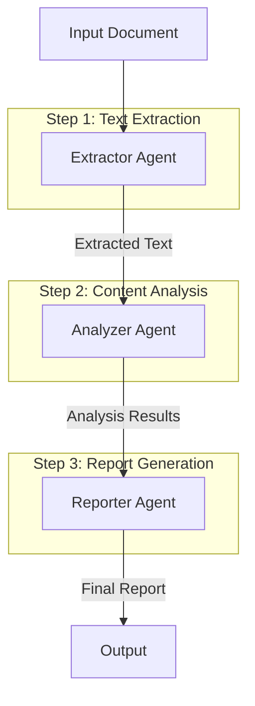

---
categories:
- artificial-intelligence
- agent-development
date: 2025-05-10
header_image_path: /assets/img/blog/headers/2025-05-10-google-adk-masterclass-part9.jpg
image_credit: Photo by Carlos Muza on Unsplash
layout: post
tags: google-adk ai-agents sequential-workflows pipelines step-by-step-execution
thumbnail_path: /assets/img/blog/thumbnails/2025-05-10-google-adk-masterclass-part9.jpg
title: 'Google ADK Masterclass Part 9: Sequential Workflows'
---

# Google ADK Masterclass Part 9: Sequential Workflows

[Overview](./google-adk-masterclass-overview)

In our [previous tutorial](./google-adk-masterclass-part8), we explored callbacks and the agent lifecycle in ADK. Now, we'll dive into one of the most powerful workflow patterns in ADK: sequential workflows.

Sequential workflows allow you to create structured, multi-step processes where agents execute in a predetermined order. This approach is ideal for complex tasks that require step-by-step processing, where each step builds on the results of the previous one.

## Why Use Sequential Workflows?

Sequential workflows offer several key advantages:

1. **Predictability**: Ensuring steps always execute in the same order
2. **Specialization**: Optimizing each agent for a specific task
3. **Control**: Managing complex processes in manageable chunks
4. **Accountability**: Clearly attributing which agent is responsible for each step
5. **Resilience**: Isolating failures to specific steps in the workflow

## Understanding ADK Workflow Patterns

ADK supports several workflow patterns, and sequential workflows are among the most straightforward:

1. **Sequential Workflow**: Agents execute in a fixed order, with each agent's output feeding into the next
2. **Parallel Workflow**: Multiple agents work simultaneously on different aspects of a task
3. **Loop Workflow**: Agents execute repeatedly until a condition is met

In this tutorial, we'll focus on sequential workflows, showing how to build a document processing pipeline with multiple specialized agents.

## Building a Document Processing Pipeline

Let's create a sequential workflow for processing documents. Our pipeline will have three steps:

1. **Text Extraction**: Extract raw text from a document
2. **Content Analysis**: Analyze the text for key information
3. **Report Generation**: Create a formatted summary report

### Folder Structure

```
sequential_workflow/
├── main.py
├── utils.py
├── .env
├── extractor_agent/
│   ├── __init__.py
│   └── agent.py
├── analyzer_agent/
│   ├── __init__.py
│   └── agent.py
└── reporter_agent/
    ├── __init__.py
    └── agent.py
```

### Step 1: Text Extraction Agent

```python
# extractor_agent/agent.py
from google.adk import Agent
from google.adk.tool import FunctionTool
import random

def extract_document_text(document_url: str) -> dict:
    """
    Extracts text from a document at the given URL.

    Args:
        document_url: URL or path to the document

    Returns:
        The extracted text content
    """
    # In a real application, this would use OCR or text extraction APIs
    # For this example, we'll generate simulated document text

    # Simulate different document types based on URL
    if "report" in document_url.lower():
        text = """
        ANNUAL PERFORMANCE REPORT

        EXECUTIVE SUMMARY

        The fiscal year 2024-2025 showed strong performance across key metrics. Revenue increased by 12.3% year-over-year, reaching $142M. Customer satisfaction scores improved to 92%, up from 87% in the previous year. New product launches in Q2 and Q3 exceeded expectations, contributing 18% to the annual revenue.

        CHALLENGES AND OPPORTUNITIES

        Supply chain disruptions in Q1 impacted product availability, resulting in an estimated $3.2M in lost revenue. The new logistics partnership established in Q2 has since resolved these issues. Market expansion in the APAC region presents significant growth opportunities, with initial projections suggesting a potential 15% revenue increase in FY 2025-2026.

        FINANCIAL PERFORMANCE

        - Revenue: $142M (↑12.3%)
        - Operating Profit: $28.4M (↑8.7%)
        - Net Profit Margin: 17.2% (↑1.4%)
        - R&D Investment: $18.6M (↑22.1%)

        STRATEGIC INITIATIVES

        1. Digital Transformation: Phase 2 completed on schedule, resulting in 18% operational efficiency improvements
        2. Product Portfolio Expansion: Successfully launched 4 new product lines, exceeding target by 1
        3. Sustainability Program: Reduced carbon footprint by 12% year-over-year, on track to meet 2030 goals
        """
    elif "email" in document_url.lower():
        text = """
        FROM: jennifer.parker@example.com
        TO: michael.johnson@example.com
        SUBJECT: Project Phoenix Update - Week 12

        Hi Michael,

        I wanted to give you a quick update on Project Phoenix:

        - Development team has completed the backend API integration, currently at 92% test coverage
        - Design team delivered the final UI mockups, awaiting your approval
        - Client meeting scheduled for Thursday at 2pm PT to discuss deployment timeline

        The budget concern we discussed last week has been resolved. Finance approved the additional $45,000 for the extra features, bringing our total budget to $320,000.

        Do you want to review the mockups before the client meeting, or should we proceed with the current designs?

        Best regards,
        Jennifer
        """
    else:
        text = """
        CONTRACT AGREEMENT

        BETWEEN: Acme Corporation ("Client")
        AND: Global Services Ltd ("Provider")
        DATE: April 15, 2025

        SERVICES

        Provider agrees to deliver the following services:
        1. Software development and implementation
        2. System integration
        3. Technical support and maintenance

        TIMELINE

        The project will commence on May 1, 2025 and conclude by October 31, 2025, with the following milestones:
        - Phase 1 (Requirements): May 1-31, 2025
        - Phase 2 (Development): June 1 - August 31, 2025
        - Phase 3 (Testing): September 1-30, 2025
        - Phase 4 (Deployment): October 1-31, 2025

        PAYMENT TERMS

        Total contract value: $250,000 USD
        - 20% due upon contract signing
        - 30% due upon completion of Phase 2
        - 30% due upon completion of Phase 3
        - 20% due upon project completion
        """

    # Add some random document metadata
    document_type = "report" if "report" in document_url.lower() else "email" if "email" in document_url.lower() else "contract"
    word_count = len(text.split())

    return {
        "document_url": document_url,
        "document_type": document_type,
        "extracted_text": text,
        "metadata": {
            "word_count": word_count,
            "page_count": random.randint(1, 10),
            "creation_date": "2025-03-15",
            "extraction_quality": "high"
        }
    }

extractor_agent = Agent(
    name="extractor_agent",
    model="models/gemini-2.0-no-flash",
    description="Extracts text from documents",
    instructions="""
    You are a document text extraction assistant. Your job is to extract text from documents and provide it in a structured format.

    When given a document URL or path:
    1. Use the extract_document_text tool to extract the text content
    2. Provide the extracted text along with metadata
    3. Always ensure the text is properly formatted

    Focus on providing the raw extracted text without summarizing or analyzing it. That will be handled by subsequent agents in the workflow.
    """,
    tools=[FunctionTool(extract_document_text)]
)
```

### Step 2: Content Analysis Agent

```python
# analyzer_agent/agent.py
from google.adk import Agent
from pydantic import BaseModel
from typing import List, Dict, Optional

class AnalysisResult(BaseModel):
    key_topics: List[str]
    entities: List[Dict[str, str]]
    sentiment: str
    key_metrics: Optional[Dict[str, str]] = None
    summary: str

analyzer_agent = Agent(
    name="analyzer_agent",
    model="models/gemini-2.0-no-flash",
    description="Analyzes document content to extract key information",
    instructions="""
    You are a document analysis assistant. Your job is to analyze document text and extract key information.

    When given document text:
    1. Identify the main topics in the document
    2. Extract key entities (people, organizations, dates, etc.)
    3. Determine the overall sentiment (positive, negative, neutral)
    4. Extract any numerical metrics or statistics
    5. Create a brief summary (maximum 3 sentences)

    Format your response as a structured JSON object with the following fields:
    {
        "key_topics": ["Topic 1", "Topic 2", ...],
        "entities": [
            {"name": "Entity name", "type": "person/organization/date/etc"},
            ...
        ],
        "sentiment": "positive/negative/neutral",
        "key_metrics": {
            "metric1": "value1",
            "metric2": "value2",
            ...
        },
        "summary": "Brief summary of the document"
    }
    """,
    output_schema=AnalysisResult,
    output_key="analysis"
)
```

### Step 3: Report Generation Agent

```python
# reporter_agent/agent.py
from google.adk import Agent
from pydantic import BaseModel

class FormattedReport(BaseModel):
    title: str
    executive_summary: str
    key_findings: str
    recommendations: str
    full_report: str

reporter_agent = Agent(
    name="reporter_agent",
    model="models/gemini-2.0-no-flash",
    description="Creates formatted reports from document analysis",
    instructions="""
    You are a report generation assistant. Your job is to create well-formatted, professional summary reports based on document analysis.

    Use the document analysis information to create a comprehensive report with the following sections:

    1. Title: Create an appropriate title for the report
    2. Executive Summary: A brief overview of the document content
    3. Key Findings: Important information extracted from the document
    4. Recommendations: Suggested actions based on the document content
    5. Full Report: A detailed report incorporating all the analysis information

    Format your response as a structured JSON object with the following fields:
    {
        "title": "Report title",
        "executive_summary": "Brief executive summary",
        "key_findings": "Important information from the document",
        "recommendations": "Suggested actions based on the content",
        "full_report": "Complete formatted report"
    }

    Make the report professional, concise, and actionable. Ensure it would be useful to someone who hasn't read the original document.
    """,
    output_schema=FormattedReport,
    output_key="report"
)
```

### Orchestrating the Sequential Workflow (main.py)

```python
import os
import asyncio
import uuid
import json
from dotenv import load_dotenv
from pprint import pprint

from google.adk.orchestration import Runner
from google.adk.orchestration.session import InMemorySessionService
from google.generativeai.types import content_types
from google.generativeai.types.content_types import Part

# Import our agents
from extractor_agent.agent import extractor_agent
from analyzer_agent.agent import analyzer_agent
from reporter_agent.agent import reporter_agent

# Load environment variables
load_dotenv()

async def run_agent(runner, user_id, session_id, agent_name, content):
    """Run a specific agent with the given content."""
    print(f"\nRunning {agent_name}...")

    # Create content object if string is provided
    if isinstance(content, str):
        content = content_types.Content(
            role="user",
            parts=[Part.from_text(content)]
        )

    # Run the agent
    response = await runner.run_async(
        user_id=user_id,
        session_id=session_id,
        content=content,
        agent_name=agent_name
    )

    # Process the response
    final_response_text = None
    for event in response.events:
        if event.type == "content" and event.content.role == "agent":
            final_response_text = event.content.parts[0].text

    # Get the session to access state
    session = runner.session_service.get_session(
        user_id=user_id,
        session_id=session_id
    )

    print(f"{agent_name} completed.")
    return final_response_text, session.state

async def sequential_workflow(document_url):
    """Run the complete sequential document processing workflow."""
    # Create a session service
    session_service = InMemorySessionService()

    # Create a session
    session_id = str(uuid.uuid4())
    user_id = "workflow_user"
    session = session_service.create_session(
        app_name="DocumentProcessor",
        user_id=user_id,
        session_id=session_id
    )

    # Create a runner with all our agents
    runner = Runner(
        root_agent=extractor_agent,  # This doesn't matter in our case as we specify agent_name
        agents=[extractor_agent, analyzer_agent, reporter_agent],
        session_service=session_service
    )

    # Step 1: Extract text from document
    extraction_prompt = f"Please extract the text from this document: {document_url}"
    extraction_response, state = await run_agent(
        runner, user_id, session_id, "extractor_agent", extraction_prompt
    )
    print("\nExtraction Results:")
    print(extraction_response)

    # Get the extracted text from the extractor's response
    # In a real application, you would parse this more robustly
    extracted_text = None
    for line in extraction_response.split("\n"):
        if "extracted_text" in line.lower():
            extracted_text = extraction_response
            break

    if not extracted_text:
        print("Failed to extract text from document.")
        return

    # Step 2: Analyze the extracted text
    analysis_prompt = f"Please analyze this document content: {extracted_text}"
    analysis_response, state = await run_agent(
        runner, user_id, session_id, "analyzer_agent", analysis_prompt
    )
    print("\nAnalysis Results:")
    print(analysis_response)

    # Check if analysis is in state
    analysis = state.get("analysis")
    if not analysis:
        print("Failed to analyze document content.")
        return

    # Step 3: Generate a report from the analysis
    report_prompt = f"Please generate a report based on this analysis: {json.dumps(analysis)}"
    report_response, state = await run_agent(
        runner, user_id, session_id, "reporter_agent", report_prompt
    )
    print("\nReport Generation Results:")
    print(report_response)

    # Get the final report from state
    final_report = state.get("report")
    if not final_report:
        print("Failed to generate report.")
        return

    print("\n--- FINAL REPORT ---")
    print(f"Title: {final_report['title']}")
    print("\nExecutive Summary:")
    print(final_report["executive_summary"])
    print("\nKey Findings:")
    print(final_report["key_findings"])
    print("\nRecommendations:")
    print(final_report["recommendations"])

    return final_report

async def main():
    # Document URLs to process
    documents = [
        "https://example.com/annual_report_2025.pdf",
        "https://example.com/project_update_email.eml",
        "https://example.com/service_contract.docx"
    ]

    # Process the first document in the list
    document_url = documents[0]
    print(f"Processing document: {document_url}")

    report = await sequential_workflow(document_url)

    if report:
        print("\nDocument processing workflow completed successfully!")

        # Save the report to a file
        with open("report_output.json", "w") as f:
            json.dump(report, f, indent=2)
        print("Report saved to report_output.json")

if __name__ == "__main__":
    asyncio.run(main())
```

### Running the Sequential Workflow

Run the example with:

```bash
cd sequential_workflow
python main.py
```

Example output:

```
Processing document: https://example.com/annual_report_2025.pdf

Running extractor_agent...
extractor_agent completed.

Extraction Results:
I've extracted the text from the document at https://example.com/annual_report_2025.pdf. Here's the content:

Document Type: report
Extracted Text:
ANNUAL PERFORMANCE REPORT

EXECUTIVE SUMMARY

The fiscal year 2024-2025 showed strong performance across key metrics. Revenue increased by 12.3% year-over-year, reaching $142M. Customer satisfaction scores improved to 92%, up from 87% in the previous year. New product launches in Q2 and Q3 exceeded expectations, contributing 18% to the annual revenue.

CHALLENGES AND OPPORTUNITIES

Supply chain disruptions in Q1 impacted product availability, resulting in an estimated $3.2M in lost revenue. The new logistics partnership established in Q2 has since resolved these issues. Market expansion in the APAC region presents significant growth opportunities, with initial projections suggesting a potential 15% revenue increase in FY 2025-2026.

FINANCIAL PERFORMANCE

- Revenue: $142M (↑12.3%)
- Operating Profit: $28.4M (↑8.7%)
- Net Profit Margin: 17.2% (↑1.4%)
- R&D Investment: $18.6M (↑22.1%)

STRATEGIC INITIATIVES

1. Digital Transformation: Phase 2 completed on schedule, resulting in 18% operational efficiency improvements
2. Product Portfolio Expansion: Successfully launched 4 new product lines, exceeding target by 1
3. Sustainability Program: Reduced carbon footprint by 12% year-over-year, on track to meet 2030 goals

Metadata:
- Word Count: 188
- Page Count: 7
- Creation Date: 2025-03-15
- Extraction Quality: high

Running analyzer_agent...
analyzer_agent completed.

Analysis Results:
{
  "key_topics": [
    "Financial Performance",
    "Strategic Initiatives",
    "Challenges and Opportunities",
    "Product Launches",
    "Market Expansion"
  ],
  "entities": [
    {
      "name": "APAC region",
      "type": "location"
    },
    {
      "name": "FY 2024-2025",
      "type": "time period"
    },
    {
      "name": "FY 2025-2026",
      "type": "time period"
    },
    {
      "name": "Q1",
      "type": "time period"
    },
    {
      "name": "Q2",
      "type": "time period"
    },
    {
      "name": "Q3",
      "type": "time period"
    }
  ],
  "sentiment": "positive",
  "key_metrics": {
    "Revenue": "$142M (↑12.3%)",
    "Operating Profit": "$28.4M (↑8.7%)",
    "Net Profit Margin": "17.2% (↑1.4%)",
    "R&D Investment": "$18.6M (↑22.1%)",
    "Customer Satisfaction": "92% (↑5%)",
    "Lost Revenue (Q1)": "$3.2M",
    "New Product Revenue Contribution": "18%",
    "Operational Efficiency Improvement": "18%",
    "Carbon Footprint Reduction": "12%",
    "Projected APAC Revenue Increase": "15%"
  },
  "summary": "The fiscal year 2024-2025 showed strong financial performance with a 12.3% revenue increase to $142M, despite Q1 supply chain disruptions. Strategic initiatives including digital transformation and product portfolio expansion were successful, while market expansion in the APAC region presents significant future growth opportunities."
}

Running reporter_agent...
reporter_agent completed.

Report Generation Results:
{
  "title": "FY 2024-2025 Annual Performance Analysis and Strategic Outlook",
  "executive_summary": "The fiscal year 2024-2025 demonstrated robust financial growth with revenue increasing 12.3% to $142M, alongside improvements in customer satisfaction and successful product launches. Despite early supply chain challenges, the company implemented effective solutions and is now positioned for continued expansion, particularly in the APAC region which presents a potential 15% revenue increase for the upcoming fiscal year.",
  "key_findings": "• Revenue grew 12.3% year-over-year to $142M\n• Operating profit increased 8.7% to $28.4M with a net profit margin of 17.2%\n• Customer satisfaction reached 92%, up 5% from the previous year\n• New product launches in Q2 and Q3 contributed 18% to annual revenue\n• R&D investment increased significantly by 22.1% to $18.6M\n• Supply chain disruptions in Q1 caused an estimated $3.2M in lost revenue\n• Digital transformation efforts yielded 18% operational efficiency improvements\n• Carbon footprint was reduced by 12% year-over-year",
  "recommendations": "1. Accelerate APAC region expansion to capitalize on projected 15% revenue growth potential\n2. Maintain increased R&D investment to sustain product innovation momentum\n3. Further strengthen supply chain resilience based on Q2 logistics partnership success\n4. Continue digital transformation initiatives to build on the 18% operational efficiency gains\n5. Leverage the successful sustainability program in marketing to environmentally-conscious consumers\n6. Analyze the factors behind the improved customer satisfaction to replicate across all product lines",
  "full_report": "# FY 2024-2025 Annual Performance Analysis and Strategic Outlook\n\n## Executive Summary\nThe fiscal year 2024-2025 demonstrated robust financial growth with revenue increasing 12.3% to $142M, alongside improvements in customer satisfaction and successful product launches. Despite early supply chain challenges, the company implemented effective solutions and is now positioned for continued expansion, particularly in the APAC region which presents a potential 15% revenue increase for the upcoming fiscal year.\n\n## Financial Performance\n- **Revenue**: $142M (↑12.3% YoY)\n- **Operating Profit**: $28.4M (↑8.7% YoY)\n- **Net Profit Margin**: 17.2% (↑1.4% YoY)\n- **R&D Investment**: $18.6M (↑22.1% YoY)\n\n## Operational Highlights\n- **Customer Satisfaction**: 92% (↑5% from previous year)\n- **Product Innovation**: New launches in Q2 and Q3 contributed 18% to annual revenue\n- **Digital Transformation**: Phase 2 completed on schedule with 18% efficiency improvements\n- **Sustainability**: Carbon footprint reduced by 12% YoY, on track with 2030 goals\n- **Product Portfolio**: Successfully launched 4 new product lines, exceeding target by 1\n\n## Challenges Addressed\nSupply chain disruptions in Q1 impacted product availability, resulting in an estimated $3.2M in lost revenue. The company responded proactively by establishing a new logistics partnership in Q2 that successfully resolved these issues and prevented further revenue loss.\n\n## Growth Opportunities\nThe market expansion in the APAC region represents the most significant near-term growth opportunity, with initial projections suggesting a potential 15% revenue increase in FY 2025-2026. This expansion aligns with the company's strategic initiatives in digital transformation and product portfolio diversification.\n\n## Recommendations\n1. Accelerate APAC region expansion to capitalize on projected 15% revenue growth potential\n2. Maintain increased R&D investment to sustain product innovation momentum\n3. Further strengthen supply chain resilience based on Q2 logistics partnership success\n4. Continue digital transformation initiatives to build on the 18% operational efficiency gains\n5. Leverage the successful sustainability program in marketing to environmentally-conscious consumers\n6. Analyze the factors behind the improved customer satisfaction to replicate across all product lines\n\n## Conclusion\nFY 2024-2025 represents a strong performance year with positive momentum across key business areas. The company has demonstrated resilience in addressing challenges and agility in capitalizing on new opportunities. With continued focus on the recommended strategic priorities, the company is well-positioned for sustained growth in FY 2025-2026."
}

--- FINAL REPORT ---
Title: FY 2024-2025 Annual Performance Analysis and Strategic Outlook

Executive Summary:
The fiscal year 2024-2025 demonstrated robust financial growth with revenue increasing 12.3% to $142M, alongside improvements in customer satisfaction and successful product launches. Despite early supply chain challenges, the company implemented effective solutions and is now positioned for continued expansion, particularly in the APAC region which presents a potential 15% revenue increase for the upcoming fiscal year.

Key Findings:
• Revenue grew 12.3% year-over-year to $142M
• Operating profit increased 8.7% to $28.4M with a net profit margin of 17.2%
• Customer satisfaction reached 92%, up 5% from the previous year
• New product launches in Q2 and Q3 contributed 18% to annual revenue
• R&D investment increased significantly by 22.1% to $18.6M
• Supply chain disruptions in Q1 caused an estimated $3.2M in lost revenue
• Digital transformation efforts yielded 18% operational efficiency improvements
• Carbon footprint was reduced by 12% year-over-year

Recommendations:
1. Accelerate APAC region expansion to capitalize on projected 15% revenue growth potential
2. Maintain increased R&D investment to sustain product innovation momentum
3. Further strengthen supply chain resilience based on Q2 logistics partnership success
4. Continue digital transformation initiatives to build on the 18% operational efficiency gains
5. Leverage the successful sustainability program in marketing to environmentally-conscious consumers
6. Analyze the factors behind the improved customer satisfaction to replicate across all product lines

Document processing workflow completed successfully!
Report saved to report_output.json
```

## Understanding the Sequential Workflow

Let's analyze how our sequential workflow operates:

1. **Step-by-Step Execution**: Each agent runs in sequence, with each step building on the previous one
2. **State Management**: Each agent's output is stored in state using `output_key`, allowing subsequent agents to access it
3. **Explicit Agent Selection**: We specify which agent to run at each step using the `agent_name` parameter
4. **Data Transformation**: Each agent transforms the data in a specific way:
   - Extractor: Raw document → Extracted text
   - Analyzer: Extracted text → Structured analysis
   - Reporter: Analysis → Formatted report

This pattern creates a clean processing pipeline where each agent has a clear, focused responsibility.

## Advanced Sequential Workflow Techniques

Let's explore some advanced techniques for building more sophisticated sequential workflows.

### 1. Dynamic Agent Selection

Instead of hardcoding the agent sequence, you can determine the next agent based on the current output:

```python
async def dynamic_workflow(input_data, initial_agent):
    """Run a workflow where the next agent is determined dynamically."""
    current_agent = initial_agent
    current_input = input_data

    while current_agent:
        # Run the current agent
        response, state = await run_agent(
            runner, user_id, session_id, current_agent, current_input
        )

        # Determine the next agent based on the output
        if current_agent == "document_classifier":
            doc_type = state.get("document_type")

            if doc_type == "invoice":
                current_agent = "invoice_processor"
            elif doc_type == "contract":
                current_agent = "contract_analyzer"
            elif doc_type == "email":
                current_agent = "email_analyzer"
            else:
                current_agent = "generic_processor"
        elif current_agent in ["invoice_processor", "contract_analyzer", "email_analyzer", "generic_processor"]:
            # Final step - generate report
            current_agent = "report_generator"
        else:
            # End of workflow
            current_agent = None

        # Update input for next agent
        current_input = response

    return state.get("final_report")
```

### 2. Conditional Execution

You can add conditional steps that only execute when certain criteria are met:

```python
async def conditional_workflow(document_url):
    """Run a workflow with conditional steps."""
    # Initial extraction step
    extraction_response, state = await run_agent(
        runner, user_id, session_id, "extractor_agent", f"Extract: {document_url}"
    )

    # Check document size
    word_count = state.get("word_count", 0)

    if word_count > 1000:
        # For longer documents, run summarization first
        summary_response, state = await run_agent(
            runner, user_id, session_id, "summarizer_agent", extraction_response
        )
        analysis_input = summary_response
    else:
        # For shorter documents, skip summarization
        analysis_input = extraction_response

    # Continue with analysis
    analysis_response, state = await run_agent(
        runner, user_id, session_id, "analyzer_agent", analysis_input
    )

    # Run sentiment check
    sentiment = state.get("sentiment")

    if sentiment == "negative":
        # For negative sentiment, run risk assessment
        await run_agent(
            runner, user_id, session_id, "risk_assessment_agent", analysis_response
        )

    # Final report generation
    report_response, state = await run_agent(
        runner, user_id, session_id, "reporter_agent", analysis_response
    )

    return state.get("report")
```

### 3. Error Handling and Retries

Add robust error handling with retry logic for more resilient workflows:

```python
async def resilient_workflow(document_url, max_retries=3):
    """Run a workflow with error handling and retries."""
    # Step 1: Extract text
    for attempt in range(max_retries):
        try:
            extraction_response, state = await run_agent(
                runner, user_id, session_id, "extractor_agent",
                f"Extract: {document_url}"
            )

            # Validate output - check if we got what we expected
            if "extracted_text" not in extraction_response.lower():
                raise ValueError("Extraction failed: Expected extracted_text in response")

            break  # Success - break the retry loop
        except Exception as e:
            print(f"Extraction attempt {attempt+1} failed: {e}")
            if attempt == max_retries - 1:
                print("Maximum retries exceeded. Aborting workflow.")
                return None
            await asyncio.sleep(1)  # Brief pause before retry

    # Continue with other steps, with similar retry logic...
    # ...

    return state.get("report")
```

### 4. Workflow Checkpointing

For long-running workflows, implement checkpointing to save progress:

```python
async def checkpointed_workflow(document_url, resume_from=None):
    """Run a workflow with checkpointing to allow resumption."""
    # Load checkpoint if resuming
    checkpoint_file = "workflow_checkpoint.json"

    if resume_from:
        with open(checkpoint_file, "r") as f:
            checkpoint = json.load(f)

        # Restore state from checkpoint
        session_id = checkpoint["session_id"]
        user_id = checkpoint["user_id"]
        current_step = checkpoint["current_step"]
        results = checkpoint["results"]
    else:
        # Start new workflow
        session_id = str(uuid.uuid4())
        user_id = "workflow_user"
        current_step = 0
        results = {}

    # Define workflow steps
    steps = [
        {"name": "extraction", "agent": "extractor_agent"},
        {"name": "analysis", "agent": "analyzer_agent"},
        {"name": "report", "agent": "reporter_agent"}
    ]

    # Run from current step
    for i in range(current_step, len(steps)):
        step = steps[i]

        # Prepare input for this step
        if i == 0:
            # First step
            step_input = f"Extract: {document_url}"
        else:
            # Use output from previous step
            step_input = results[steps[i-1]["name"]]

        # Run the step
        response, state = await run_agent(
            runner, user_id, session_id, step["agent"], step_input
        )

        # Save result
        results[step["name"]] = response

        # Update checkpoint
        checkpoint = {
            "session_id": session_id,
            "user_id": user_id,
            "current_step": i + 1,
            "results": results
        }

        with open(checkpoint_file, "w") as f:
            json.dump(checkpoint, f)

    return results["report"]
```

## Best Practices for Sequential Workflows

Based on our experience building sequential workflows, here are some best practices:

### 1. Clear Output Schemas

Define clear output schemas for each agent to ensure consistent data structures:

```python
class AnalysisResult(BaseModel):
    key_topics: List[str]
    entities: List[Dict[str, str]]
    sentiment: str
    summary: str
```

### 2. Explicit State Management

Always use `output_key` to store agent outputs in state:

```python
analyzer_agent = Agent(
    # Other parameters...
    output_schema=AnalysisResult,
    output_key="analysis"
)
```

### 3. Input/Output Validation

Validate inputs and outputs at each step to catch issues early:

```python
# Validate input to an agent
if not "extracted_text" in state:
    raise ValueError("Missing required extracted_text in state")

# Validate output from an agent
analysis = state.get("analysis")
if not analysis or not analysis.get("key_topics"):
    raise ValueError("Incomplete analysis output")
```

### 4. Descriptive Agent Instructions

Provide detailed instructions for each agent, including how its output will be used:

```
You are a document analysis assistant. Your analysis will be used by a report generation agent to create a summary report, so ensure your output is structured and comprehensive.
```

### 5. Logging and Monitoring

Implement detailed logging at each step for debugging and monitoring:

```python
async def run_agent_with_logging(runner, user_id, session_id, agent_name, content):
    """Run an agent with detailed logging."""
    print(f"[{datetime.now().isoformat()}] Starting {agent_name}")

    start_time = time.time()
    response, state = await run_agent(runner, user_id, session_id, agent_name, content)
    duration = time.time() - start_time

    print(f"[{datetime.now().isoformat()}] Completed {agent_name} in {duration:.2f}s")

    # Log the output
    with open(f"{agent_name}_output.log", "a") as f:
        f.write(f"--- {datetime.now().isoformat()} ---\n")
        f.write(f"Input: {content}\n\n")
        f.write(f"Output: {response}\n\n")
        f.write(f"State: {json.dumps(state, indent=2)}\n\n")

    return response, state
```

## Real-World Applications of Sequential Workflows

Sequential workflows are ideal for many real-world applications:

### 1. Content Creation Pipeline

```
Research Agent → Outline Agent → Draft Agent → Edit Agent → Format Agent
```

### 2. Customer Support Automation

```
Intent Classifier → Information Retrieval → Response Generator → Satisfaction Predictor
```

### 3. Data Analysis Pipeline

```
Data Cleaning Agent → Statistical Analysis Agent → Visualization Agent → Executive Summary Agent
```

### 4. Legal Document Processing

```
Document Classifier → Entity Extractor → Clause Analyzer → Risk Assessment → Summary Generator
```

### 5. Medical Diagnosis Assistant

```
Symptom Analyzer → Potential Condition Identifier → Treatment Option Researcher → Patient Information Compiler
```

## Conclusion

Sequential workflows in ADK provide a powerful pattern for building complex, multi-step agent processes. By breaking down complex tasks into discrete steps executed by specialized agents, you can create robust, maintainable AI applications that tackle sophisticated problems.

In this tutorial, we've covered:
- The fundamentals of sequential workflows
- Building a document processing pipeline
- Advanced techniques like dynamic agent selection and error handling
- Best practices for designing effective sequential workflows
- Real-world applications where sequential workflows excel

In the next part of our series, we'll explore parallel workflows, allowing multiple agents to work simultaneously on different aspects of a task.

## Resources

- [ADK Workflow Patterns Documentation](https://cloud.google.com/vertex-ai/docs/generative-ai/agents/agent-development-kit/workflow-patterns)
- [Sequential Processing Patterns](https://cloud.google.com/vertex-ai/docs/generative-ai/agents/agent-development-kit/sequential-patterns)
- [Error Handling Best Practices](https://cloud.google.com/vertex-ai/docs/generative-ai/agents/agent-development-kit/error-handling)


[Next...](./google-adk-masterclass-part10)
