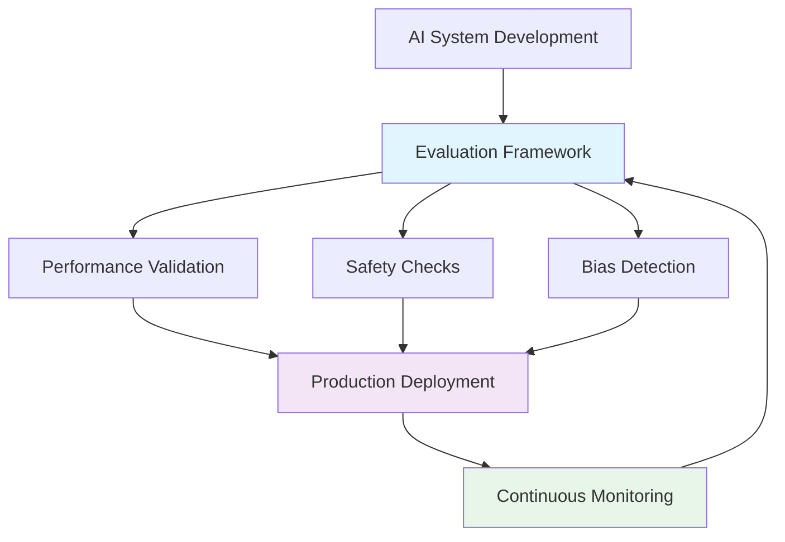
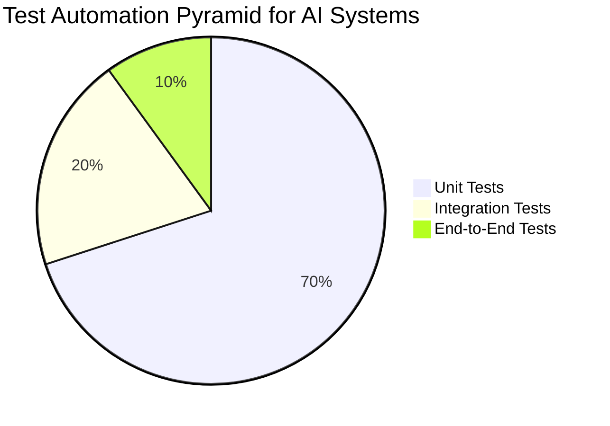
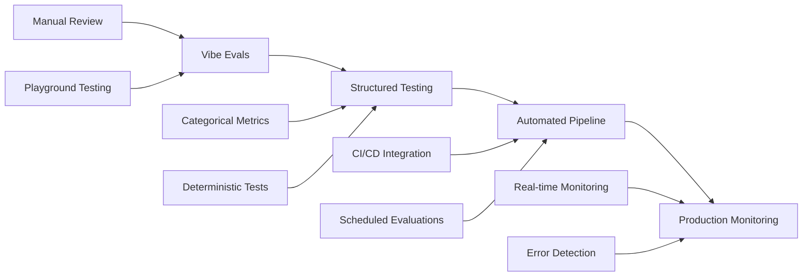
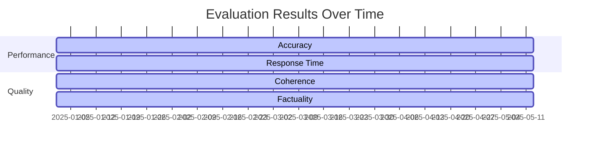
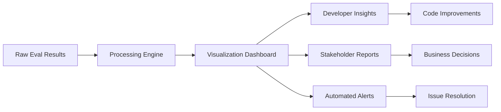

---
categories:
- ai
- testing
- evaluation
- best-practices
date: 2025-05-13
excerpt: Learn how to build robust AI evaluation frameworks that ensure reliable performance,
  catch errors early, and scale with your applications. This comprehensive guide covers
  core principles, implementation strategies, and practical examples for creating
  effective eval pipelines.
header_image_path: /assets/img/blog/headers/2025-05-13-evals-best-practices.jpg
image_credit: Photo by National Cancer Institute on Unsplash
image_credit_url: https://unsplash.com/photos/gree-fur-W2OVh2w2Kpo
layout: post
permalink: /evals-best-practices/
tags:
- evals
- ai-testing
- llm-evaluation
- testing-pyramid
- categorical-evaluation
thumbnail_path: /assets/img/blog/thumbnails/2025-05-13-evals-best-practices.jpg
title: 'Building Effective AI Testing Frameworks: Best Practices for Implementing
  Evals'
---

# Building Effective AI Testing Frameworks: Best Practices for Implementing Evals

In the rapidly evolving landscape of AI and Large Language Models (LLMs), the importance of robust evaluation frameworks cannot be overstated. As AI systems become more complex and widely deployed, the need for comprehensive testing strategies has never been more critical. This guide explores best practices for implementing effective "evals" (evaluations) that ensure your AI systems perform reliably, safely, and efficiently.

## Why Evals Matter More Than Ever

With AI systems powering everything from customer service chatbots to code generation tools, evaluation frameworks serve as the foundation of trust and reliability. According to recent industry surveys, 97% of businesses consider unit testing as extremely important in their testing strategy, and this principle extends directly to AI evaluation systems.



## Core Principles of Evaluation Systems

Based on comprehensive research and industry best practices, here are the fundamental principles that should guide your eval implementation:

### 1. Embrace Categorical Over Numerical Evaluations

**Stop using numerical scores (1-10) or confidence scores for evaluations.** Instead, use rubrics and categorical systems that provide clearer, more actionable feedback.

**Why Categorical Evaluations Win:**
- **Clarity**: "fast" vs. "slow" tells you exactly what's wrong
- **Actionability**: Categories directly suggest what needs improvement
- **Consistency**: Rubrics reduce evaluator bias and subjectivity
- **Debuggability**: Easier to understand why something failed

```python
# ❌ Avoid this - numbers are hard to interpret
eval_score = 7.3  # What does this actually mean?
confidence_score = 0.82  # Is this good enough?

# ✅ Use this - categorical evaluations with rubrics
from enum import Enum

class PacingCategory(Enum):
    SLOW = "slow"      # < 2 activities per hour
    MEDIUM = "medium"  # 2-4 activities per hour  
    FAST = "fast"      # > 4 activities per hour

class QualityRubric(Enum):
    LOW = "low"        # Missing key components, unclear objectives
    MEDIUM = "medium"  # Has most components, some unclear areas
    HIGH = "high"      # All components present, clear and engaging

class BiasDetection(Enum):
    NONE = "none"          # No bias detected
    MINOR = "minor"        # Some potentially biased language
    SIGNIFICANT = "significant"  # Clear bias present

# Implementation with clear criteria
class LessonPlanEvaluator:
    def evaluate_pacing(self, lesson_plan) -> PacingCategory:
        activities_per_hour = len(lesson_plan.activities) / (lesson_plan.duration / 60)
        
        if activities_per_hour < 2:
            return PacingCategory.SLOW
        elif activities_per_hour <= 4:
            return PacingCategory.MEDIUM
        else:
            return PacingCategory.FAST
    
    def evaluate_quality(self, lesson_plan) -> QualityRubric:
        score = 0
        
        # Clear rubric criteria
        if lesson_plan.has_objectives: score += 1
        if lesson_plan.has_structured_activities: score += 1
        if lesson_plan.has_assessment: score += 1
        if lesson_plan.engagement_score > 0.7: score += 1
        
        if score <= 1:
            return QualityRubric.LOW
        elif score <= 3:
            return QualityRubric.MEDIUM
        else:
            return QualityRubric.HIGH

# Results are immediately actionable
eval_result = {
    "pacing": PacingCategory.SLOW,        # Clear issue: too few activities
    "quality": QualityRubric.HIGH,        # Good overall structure
    "bias_detected": BiasDetection.NONE,  # No bias concerns
    "cost_efficient": True,               # Simple boolean works too
}
```

### 2. Build Incrementally

Start with basic testing and gradually advance to more sophisticated methods. This mirrors the proven software testing pyramid approach.



### 3. Focus on Structured Outputs

Whenever possible, design your AI components to return structured data that can be easily validated. This approach helps you break your problems down into smaller, more manageable components that can be tested individually.

**Example: Breaking Down Lesson Plan Generation**

Instead of having your LLM return a monolithic text response, structure it into testable components:

```python
@dataclass
class LessonPlanOutput:
    # Main content
    title: str
    objectives: List[str]
    activities: List[Activity]
    duration_minutes: int
    
    # Evaluation components
    estimated_cost: float  # Can be tested: assert cost < 5.0
    difficulty_level: str  # Categorical: "beginner" | "intermediate" | "advanced"
    
    # Bias detection components
    bias_flags: List[str]  # e.g., ["gender_bias", "cultural_bias"]
    inclusive_language_score: str  # "low" | "medium" | "high"
    
    # Quality metrics
    engagement_features: List[str]  # ["interactive", "visual", "collaborative"]
    pacing: str  # "slow" | "medium" | "fast"

# Example structured prompt for LLM
def create_lesson_plan_prompt(topic: str, duration: int):
    return f"""
    Create a lesson plan for: {topic} (Duration: {duration} minutes)
    
    Return your response as JSON with this exact structure:
    {{
        "title": "Clear, descriptive title",
        "objectives": ["List of 3-5 learning objectives"],
        "activities": [
            {{
                "name": "Activity name",
                "type": "lecture|interactive|assessment",
                "duration_minutes": 10,
                "description": "What students will do"
            }}
        ],
        "estimated_cost": 2.50,
        "difficulty_level": "beginner",
        "bias_flags": [],
        "pacing": "medium"
    }}
    """

# Testing becomes granular and precise
def test_lesson_plan_structure():
    result = generate_lesson_plan("Python variables", 45)
    
    # Test cost component
    assert result.estimated_cost < 5.0
    assert result.estimated_cost > 0
    
    # Test bias detection component
    assert "gender_bias" not in result.bias_flags
    
    # Test pacing component
    assert result.pacing in ["slow", "medium", "fast"]
    
    # Test content quality
    assert len(result.objectives) >= 3
    assert any(activity.type == "interactive" for activity in result.activities)
```

This structured approach enables you to:
- Test individual aspects of the output
- Create focused evaluation metrics
- Debug specific failure modes
- Aggregate results across components

## Building an Effective Eval Pipeline

### Start with "Vibe Evals"

Begin with manual testing by running your prompts (e.g., in playground environments) and carefully examining the outputs. This human-in-the-loop approach helps you understand your system's behavior before automating evaluations.

**Vibe evals are particularly powerful for:**
- **Tone and Style Evaluation**: Human judgment is often the best way to assess if your AI's communication style matches your brand voice
- **Initial Quality Assessment**: Getting a feel for what good vs. poor outputs look like
- **Edge Case Discovery**: Identifying unusual scenarios that might not emerge in formal testing

Here's how to systematically approach vibe evals:

```python
# Start by writing test cases that work
def test_customer_support_tone():
    """Vibe eval: Check if responses sound helpful and professional"""
    prompt = "A customer is frustrated about delayed shipping. Respond professionally."
    
    # Run in playground and manually assess:
    # - Does it acknowledge the frustration?
    # - Is the tone appropriate?
    # - Does it offer concrete solutions?
    
    # Then convert to automated test
    response = get_llm_response(prompt)
    assert not contains_dismissive_language(response)
    assert contains_empathy_markers(response)
    assert offers_solution(response)

# Write end-to-end tests that run your prompt chain
def test_lesson_plan_generation_e2e():
    """End-to-end test for lesson plan generation pipeline"""
    user_input = {
        "subject": "Python basics",
        "duration": 60,
        "level": "beginner"
    }
    
    # This could use pytest to run the full pipeline
    result = lesson_plan_pipeline.run(user_input)
    
    # Vibe check: manually review the generated lesson plan
    # Then add assertions based on what you observe
    assert result.has_clear_objectives
    assert result.activities_count >= 3
    assert result.estimated_cost < 5.0
```



### Capture Intermediate Steps as Probes

Don't just test final outputs—evaluate each step of your pipeline. This approach allows you to:

- Identify where failures occur
- Debug more efficiently
- Build trust in your system incrementally

**Implementing Probes:**

```python
class PipelineWithProbes:
    def __init__(self):
        self.probes = {}
    
    def run_step(self, step_name, func, *args, **kwargs):
        """Execute a step and capture output for evaluation"""
        result = func(*args, **kwargs)
        
        # Store as probe for individual testing
        self.probes[step_name] = result
        return result
    
    def generate_lesson_plan(self, topic, duration):
        # Each step is testable individually
        intent = self.run_step("intent_extraction", 
                               self.extract_intent, topic)
        
        content = self.run_step("content_generation", 
                               self.generate_content, intent, duration)
        
        formatted = self.run_step("formatting", 
                                 self.format_output, content)
        
        return formatted

# Test individual components via probes
def test_intent_extraction_probe():
    pipeline = PipelineWithProbes()
    pipeline.generate_lesson_plan("Python loops", 45)
    
    intent = pipeline.probes["intent_extraction"]
    assert intent.topic == "loops"
    assert intent.programming_language == "python"
```

**Alternative to Probes - Modular Architecture:**

Instead of probes, you can design your system with clean interfaces that make each component naturally testable:

```python
# Alternative: Each component returns structured data
class IntentExtractor:
    def extract(self, user_input: str) -> Intent:
        # Returns structured output that's easy to test
        return Intent(
            topic=self._extract_topic(user_input),
            difficulty_level=self._extract_level(user_input),
            estimated_duration=self._extract_duration(user_input)
        )

class ContentGenerator:
    def generate(self, intent: Intent) -> Content:
        # Each component has clear inputs and outputs
        return Content(
            activities=self._create_activities(intent),
            resources=self._select_resources(intent),
            assessments=self._design_assessments(intent)
        )

# Testing becomes straightforward
def test_content_generator():
    generator = ContentGenerator()
    intent = Intent(topic="variables", difficulty="beginner", duration=30)
    
    content = generator.generate(intent)
    assert len(content.activities) >= 2
    assert content.activities[0].type == "introduction"
```

### Create Golden Datasets Continuously

Use production data to build and maintain golden datasets over time. This ensures your evaluations remain relevant and reflect real-world usage patterns.

**Key Strategy: Review Diffs in Raw Output AND Structured Evaluations**

```python
class GoldenDatasetBuilder:
    def __init__(self):
        self.golden_samples = []
        self.prod_data_buffer = []
    
    def capture_prod_sample(self, input_data, raw_output, structured_eval):
        """Capture production data with both raw and structured results"""
        sample = {
            "timestamp": datetime.now(),
            "input": input_data,
            "raw_output": raw_output,
            "structured_eval": structured_eval,
            "version": self.model_version
        }
        self.prod_data_buffer.append(sample)
    
    def review_and_promote_to_golden(self, review_criteria):
        """Human review process to select golden samples"""
        for sample in self.prod_data_buffer:
            # Compare raw outputs
            if self._meets_raw_output_criteria(sample['raw_output']):
                # Compare structured evaluations
                if self._meets_structured_eval_criteria(sample['structured_eval']):
                    # Promote to golden dataset
                    self.golden_samples.append(sample)
    
    def generate_diff_report(self, new_outputs, golden_outputs):
        """Generate diff report for both raw and structured outputs"""
        report = {
            "raw_output_diffs": [],
            "structured_eval_diffs": []
        }
        
        for i, (new, golden) in enumerate(zip(new_outputs, golden_outputs)):
            # Raw output diff
            raw_diff = self._compute_text_diff(new['raw_output'], 
                                               golden['raw_output'])
            if raw_diff:
                report["raw_output_diffs"].append({
                    "sample_id": i,
                    "diff": raw_diff,
                    "significance": self._assess_raw_diff_significance(raw_diff)
                })
            
            # Structured evaluation diff
            struct_diff = self._compute_structured_diff(new['structured_eval'],
                                                        golden['structured_eval'])
            if struct_diff:
                report["structured_eval_diffs"].append({
                    "sample_id": i,
                    "diff": struct_diff,
                    "categories_changed": list(struct_diff.keys()),
                    "regression_risk": self._assess_regression_risk(struct_diff)
                })
        
        return report

# Example usage
def test_against_golden_dataset():
    golden_samples = load_golden_dataset("lesson_plans_v1")
    
    for sample in golden_samples:
        # Run current model
        current_output = model.generate(sample['input'])
        current_eval = evaluator.evaluate(current_output)
        
        # Compare against golden
        raw_diff = compare_raw_outputs(current_output.text, 
                                      sample['raw_output'])
        
        struct_diff = compare_structured_evals(current_eval, 
                                              sample['structured_eval'])
        
        # Alert if significant changes
        if raw_diff.significance == "high":
            log_alert(f"Significant raw output change in sample {sample['id']}")
        
        if struct_diff.has_regressions:
            log_alert(f"Evaluation regression in {struct_diff.changed_categories}")

# Visualization of diffs over time
def visualize_golden_dataset_evolution():
    """Track how your golden dataset evolves with production data"""
    metrics = {
        "dataset_size": [],
        "coverage_by_category": {},
        "quality_distribution": [],
        "bias_flag_frequency": []
    }
    
    # Generate reports showing:
    # 1. How raw outputs are changing
    # 2. Which evaluation categories are most stable
    # 3. Which edge cases are being captured
    # 4. Quality trends over time
```

**Best Practices for Golden Dataset Management:**

1. **Regular Review Cycles**: Set up weekly/monthly reviews of production data
2. **Diff Prioritization**: Focus on diffs that impact business metrics
3. **Version Control**: Track changes to golden datasets like code
4. **Automated Alerts**: Set up alerts for significant deviations from golden samples
5. **Category Balancing**: Ensure golden dataset covers all evaluation categories

## Implementation Best Practices

### Follow Testing Pyramid Principles

The testing pyramid, originally introduced by Mike Cohn, applies directly to AI evaluation:

1. **Unit Tests (70%)**: Test individual components
2. **Integration Tests (20%)**: Test component interactions
3. **End-to-End Tests (10%)**: Test complete workflows

```python
# Unit test example for AI component
def test_sentiment_analyzer():
    analyzer = SentimentAnalyzer()
    result = analyzer.analyze("I love this product!")
    assert result.sentiment == "positive"
    assert result.confidence > 0.8

# Integration test example
def test_chatbot_pipeline():
    response = chatbot.process_user_input("How do I reset my password?")
    assert response.intent == "password_reset"
    assert response.contains_helpful_info == True
```

### Use Probes for System Introspection

Implement probes to examine specific nodes in your system, allowing you to understand internal states and decision points.

### Build Visualization Tools

Create visual tools to compare outputs across different runs and versions. This helps identify patterns and regressions quickly.



## Practical Example: Lesson Plan Evaluation

Here's a real-world example of implementing categorical evaluations:

```python
class LessonPlanEvaluator:
    def evaluate(self, lesson_plan):
        results = {
            "pacing": self._evaluate_pacing(lesson_plan),
            "bias_detected": self._check_bias(lesson_plan),
            "cost_efficient": self._check_cost(lesson_plan),
            "quality_score": self._assess_quality(lesson_plan)
        }
        return EvaluationResult(**results)
    
    def _evaluate_pacing(self, plan):
        # Categorical evaluation: slow/medium/fast
        activities_per_hour = len(plan.activities) / plan.duration_hours
        if activities_per_hour < 2:
            return "slow"
        elif activities_per_hour <= 4:
            return "medium"
        else:
            return "fast"
```

## Runtime Evaluation Strategies

### Build Deterministic Validations

Wherever possible, implement mathematical validation for numerical outputs:

```python
def validate_financial_summary(summary):
    # Row-wise validation
    for transaction in summary.transactions:
        assert transaction.debit + transaction.credit == transaction.balance
    
    # Cross-field calculations
    total_cash = sum(t.cash_value for t in summary.transactions)
    assert total_cash == summary.total_cash_value
    
    # Column-wise validation
    mutual_fund_total = sum(t.mutual_fund_value for t in summary.transactions)
    assert mutual_fund_total == summary.total_mutual_fund_value
```

### Multiple Validation Methods

Implement various validation approaches:
- Row-wise validation
- Column-wise validation
- Cross-field calculations
- Range checks and boundary conditions

## Error Handling and Iteration

### Record All Errors

Maintain comprehensive logs of all errors and inconsistencies. This creates a valuable dataset for improving your evaluation criteria.

### Human Review Options

Provide mechanisms for human review of flagged items, especially for edge cases that automated systems might miss.

### Fast Iteration Loops

Design your system to support rapid iteration:

```python
class EvalRunner:
    def run_focused_eval(self, component, context):
        """Run evaluation on specific component with focused context"""
        result = self.evaluate(component, context)
        if result.needs_human_review:
            return self.queue_for_review(result)
        return result
```

## Visualization and Tooling

### Build Custom Visualization Tools

Create specialized tools for your evaluation results:

- Diff views to compare outputs across runs
- Easy navigation between test cases
- Quick iteration and feedback loops

### Use Modern UI Tools

Leverage tools like v0 or similar platforms for rapid UI prototyping of evaluation dashboards.



## Production Deployment Strategy

### Start Simple

1. Begin with basic "vibe evals" and ship to production
2. Collect production data to build golden datasets
3. Implement more sophisticated testing over time
4. Build automated systems for error detection and correction

### Focus on Rapid Iteration

Rather than perfect initial implementation, prioritize:
- Quick feedback loops
- Continuous improvement
- Data-driven refinements

## Current Trends and Best Practices in 2025

### Modern Evaluation Frameworks

The top LLM evaluation frameworks in 2025 include:

1. **DeepEval**: Offers 14+ LLM evaluation metrics (both for RAG and fine-tuning use cases), updated with the latest research in the LLM evaluation field
2. **OpenAI Evals**: Flexible framework for custom test design
3. **Humanloop**: Enterprise-focused with security and compliance features
4. **LangChain**: Integration with broader AI application stack

### Key Evaluation Metrics

Modern AI evaluation focuses on:
- **Accuracy**: Correctness of responses
- **Faithfulness**: Alignment with source material
- **Relevance**: Appropriate responses to queries
- **Toxicity**: Detection of harmful content
- **Bias**: Fairness across different groups

```python
# Modern evaluation metric example
from deepeval.metrics import AnswerRelevancyMetric, FaithfulnessMetric

def comprehensive_eval(response, context, query):
    relevancy = AnswerRelevancyMetric()
    faithfulness = FaithfulnessMetric()
    
    relevancy_score = relevancy.measure(response, query)
    faithfulness_score = faithfulness.measure(response, context)
    
    return {
        "relevancy": relevancy_score,
        "faithfulness": faithfulness_score,
        "overall_pass": all(score.score > 0.8 for score in [relevancy_score, faithfulness_score])
    }
```

## Conclusion

Building effective AI evaluation frameworks requires a strategic approach that balances comprehensive testing with practical implementation. By following the principles outlined in this guide—embracing categorical evaluations, building incrementally, and maintaining fast iteration loops—you can create robust eval systems that scale with your AI applications.

Remember that evaluation is not a one-time activity but an ongoing process that evolves with your system. Start simple, iterate quickly, and always prioritize actionable insights over complex metrics.

### Key Takeaways

1. Use categorical evaluations instead of numerical scores
2. Follow the testing pyramid principles (70% unit, 20% integration, 10% E2E)
3. Build deterministic validations wherever possible
4. Maintain comprehensive error logs and golden datasets
5. Create visualization tools for quick pattern recognition
6. Start with simple implementations and iterate rapidly

As AI systems continue to evolve, the quality of your evaluation framework will directly impact the reliability and trustworthiness of your applications. Invest in building robust evals now, and your future self will thank you.

---

*Looking to implement these evaluation best practices in your AI project? Start with the frameworks mentioned in this post and adapt them to your specific use case. Remember, the best eval system is the one that helps you build better AI applications.*