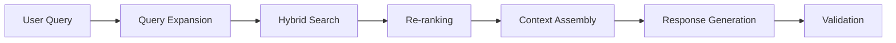

---
categories:
- AI
- Machine Learning
- Context Engineering
- LLM
date: 2025-07-23
excerpt: Discover how Context Engineering is revolutionizing AI development by moving
  beyond simple prompts to architecting comprehensive information ecosystems that
  enable reliable, scalable, and intelligent AI systems.
header_image_path: /assets/img/blog/headers/2025-07-23-context-engineering-for-ai-workloads.jpg
image_credit: Photo by Markus Spiske on Unsplash
layout: post
tags:
- context-engineering
- prompt-engineering
- RAG
- multi-agent-systems
- AI-architecture
thumbnail_path: /assets/img/blog/thumbnails/2025-07-23-context-engineering-for-ai-workloads.jpg
title: 'Context Engineering for AI Workloads: The Evolution Beyond Prompt Engineering'
---

# Context Engineering for AI Workloads: The Evolution Beyond Prompt Engineering

## Introduction: The End of the Vibe Coding Era

Have you ever spent hours crafting what you thought was the perfect prompt for an AI, only to have it forget crucial instructions mid-conversation? Or watched an AI coding assistant that was brilliant moments ago suddenly suggest code that completely ignores your project's architecture?

This isn't a failure of your prompt—it's a failure of context.

For the past few years, the AI community has been in the era of "prompt engineering" and "vibe coding"—tweaking words until the output feels right. But that honeymoon phase is over. To build anything real, anything that scales and is reliable, we need to shift from crafting sentences to architecting systems.

Welcome to the era of **Context Engineering**.

## What is Context Engineering?

Context Engineering is the discipline of designing and managing the entire information ecosystem that surrounds an AI model. It's about ensuring that the model has the right knowledge, memory, and tools to do its job accurately and autonomously every single time.

To understand the difference, consider this theater analogy:
- **Prompt Engineering** is like giving a brilliant idea to a talented actor
- **Context Engineering** is everything else: the stage design, the lighting, the props, the script cues, and the other actors' lines

Without the right stage, even the best actor delivers an ineffective performance. Context Engineering sets the stage for AI to succeed.

### The Fundamental Distinction

| Aspect | Prompt Engineering | Context Engineering |
|--------|-------------------|---------------------|
| **Focus** | Single input-output pair | Entire information ecosystem |
| **Scope** | Immediate instruction | Memory, tools, history across sessions |
| **Goal** | One high-quality response | Reliable, consistent, scalable AI systems |
| **Nature** | Art of wordsmithing | Discipline of system design |
| **Analogy** | Writing a function call | Architecting the full service with dependencies |

## Understanding the Context Window

The context window is the AI's short-term memory—its RAM. It's the finite space (measured in tokens) that holds everything the model can see at once. When you send a prompt, you're not just sending your question; you're sending a bundle of information that includes:

1. **System Instructions**: High-level rules defining the AI's persona and constraints
2. **User Input**: The direct query or task
3. **Conversation History**: Short-term memory from the current session
4. **Retrieved Knowledge**: External documents via RAG (Retrieval-Augmented Generation)
5. **Tool Definitions**: Descriptions of APIs the AI can use

### The Context Rot Problem

A common misconception is that with massive context windows (some over a million tokens), you can just stuff everything in. This is one of the biggest, most costly misconceptions in AI development today.

Recent studies have identified **"context rot"**—the progressive decay in LLM performance as context gets longer. The model doesn't process the 100,000th token with the same fidelity as the 100th token. This happens due to:

- **Context Distraction**: Irrelevant information overwhelms the original instruction
- **Confusion**: Too many details, especially conflicting ones, muddle the model's reasoning
- **Poisoning**: A single piece of bad data can cascade into subsequent errors
- **Lost in the Middle**: Models pay more attention to the beginning and end of context

## The Four Pillars of Context Engineering

To solve these problems, the industry has converged on four key strategies:

### 1. Write: Strategic External Storage

The most straightforward way to manage limited RAM is to use a hard drive. The Write pillar involves strategically saving information outside the immediate context window:

- **Scratch Pads**: Short-term memory where agents jot down plans or intermediate results
- **Long-term Memories**: Persistent storage in vector databases for user preferences and learned patterns
- **Knowledge Graphs**: Structured representations of relationships between entities

### 2. Select: Intelligent Retrieval

Once information is stored externally, you need to retrieve the right pieces at the right time. This is the foundation of RAG systems:

- **Semantic Search**: Using embeddings to find contextually relevant documents
- **Hybrid Retrieval**: Combining keyword and semantic search for optimal results
- **Dynamic Filtering**: Adjusting retrieval based on task requirements

### 3. Compress: Information Density

Even relevant information can be too verbose. Compression techniques include:

- **Context Summarization**: Using smaller LLMs to create concise summaries
- **Structural Data**: Replacing paragraphs with compact JSON objects
- **Progressive Disclosure**: Starting with summaries, expanding to details only when needed

### 4. Isolate: Compartmentalization

Sometimes the best way to prevent context interference is complete separation:

- **Multi-Agent Systems**: Specialized agents with focused context windows
- **Tool Isolation**: Providing only relevant tools for the current task
- **Scoped Conversations**: Maintaining separate contexts for different topics

## Real-World Implementation: The PRP Framework

One of the most successful implementations of Context Engineering is the **Product Requirement Prompt (PRP) Framework**, developed by Raasmus. This framework treats AI development like product management, bringing systematic rigor to context creation.

### What is PRP?

PRP = PRD (Product Requirements Document) + Curated Codebase Intelligence + Agent Runbook

It's designed to be the minimum viable packet an AI needs to plausibly ship production-ready code on the first pass.

### PRP in Action: Building an MCP Server

Let's walk through a concrete example of using the PRP framework to build a Model Context Protocol (MCP) server:

```markdown
# Step 1: Create initial.md with your requirements
project_name: PRP TaskMaster MCP
features:
  - Parse PRPs to extract tasks
  - Manage task dependencies
  - Track project progress
  - Generate documentation

# Step 2: Generate PRP with context gathering
/prp-mcp-create initial.md

# Step 3: Validate and execute
/prp-mcp-execute prp-taskmaster.md
```

The framework automatically:
- Pulls in relevant documentation and examples
- Creates a comprehensive architecture plan
- Generates validation tests
- Implements the solution with proper error handling

In real-world testing, this approach achieved:
- **18 perfectly working tools** in a complex MCP server
- **Two-shot completion** (one initial run, one bug fix)
- **25 minutes** from concept to working implementation

## Case Study: Enterprise Context Engineering

### Sarah's Performance Report Assistant

Let's examine how context engineering transforms a simple request into an intelligent response:

**Initial Request**: "Help me write my Q3 performance report"

**Without Context Engineering**: Generic template with placeholder text

**With Context Engineering**:

1. **Write Pillar**: System retrieves Sarah's preferences from long-term memory
   - Senior Product Manager role
   - Prefers concise, metrics-driven writing
   - Previous report formats

2. **Select Pillar**: RAG system pulls relevant documents
   - Official Q3 sales data
   - Project completion metrics
   - Team feedback summaries

3. **Compress Pillar**: Summarization model extracts key points
   - Revenue: +23% YoY
   - Feature launches: 3 major, 7 minor
   - Team growth: 2 new hires onboarded

4. **Isolate Pillar**: Specific tools provided
   - Feedback collection API
   - Metrics visualization generator
   - Format compliance checker

**Result**: Personalized, data-driven report draft that matches company standards and Sarah's writing style.

## Advanced RAG Systems with Context Engineering

### Decoupled Chunk Processing

Modern RAG systems use different representations for different purposes:

```python
# Retrieval representation (optimized for search)
chunk_summary = "Q3 revenue metrics showing 23% growth"

# Synthesis representation (full context for generation)
full_chunk = """
Q3 Financial Performance:
- Revenue: $4.2M (+23% YoY)
- New customers: 187 (+45% QoQ)  
- Churn rate: 2.1% (-0.8% from Q2)
- Key drivers: Enterprise tier adoption, expansion revenue
"""
```

### Multi-Stage RAG Pipeline



### Production RAG Best Practices

1. **Embedding Management**:
   - Version control for embedding models
   - Incremental indexing for new documents
   - A/B testing different embedding strategies

2. **Context Window Optimization**:
   ```python
   def optimize_context(query, documents, max_tokens=8000):
       # Score documents by relevance
       scored_docs = rank_documents(query, documents)
       
       # Progressive inclusion until token limit
       context = []
       token_count = 0
       
       for doc in scored_docs:
           doc_tokens = count_tokens(doc)
           if token_count + doc_tokens < max_tokens:
               context.append(doc)
               token_count += doc_tokens
           else:
               # Compress remaining high-value docs
               summary = summarize(doc, max_tokens - token_count)
               context.append(summary)
               break
       
       return context
   ```

3. **Monitoring and Observability**:
   - Track retrieval precision/recall
   - Monitor context utilization rates
   - Alert on embedding drift
   - Measure end-to-end latency

## Multi-Agent Architectures: Context at Scale

### Hierarchical Agent Organization

Multi-agent systems exemplify context engineering by distributing cognitive load across specialized agents:

```yaml
Manager Agent:
  role: Task decomposition and routing
  context: High-level objectives, agent capabilities
  
Specialist Agents:
  - Research Agent:
      context: Document corpus, search APIs
      tools: [web_search, database_query, summarize]
  
  - Analysis Agent:
      context: Historical data, statistical models
      tools: [data_processing, visualization, forecasting]
  
  - Synthesis Agent:
      context: Brand guidelines, output templates
      tools: [text_generation, format_validation]
```

### Real-World Multi-Agent Implementations

#### Financial Research Platform
**Challenge**: Analyze market conditions across multiple asset classes in real-time

**Solution Architecture**:
- **Data Collection Agents**: Specialized for Bloomberg, Reuters, SEC filings
- **Analysis Agents**: Separate contexts for equities, bonds, derivatives
- **Risk Assessment Agent**: Isolated context with compliance rules
- **Report Generation Agent**: Access to all analyses with presentation templates

**Results**:
- 73% reduction in research time
- $2.3M additional quarterly returns
- 94% accuracy in regulatory compliance

#### Healthcare Diagnostic Assistant
**Context Engineering Approach**:
- Patient history isolated from general medical knowledge
- Separate agents for symptoms, lab results, imaging
- Pharmaceutical agent with drug interaction database
- Synthesis agent with access to all findings

**Outcomes**:
- 60% faster preliminary diagnosis
- 89% reduction in medication errors
- 100% HIPAA compliance maintained

### Multi-Agent Communication Patterns

```python
class AgentOrchestrator:
    def __init__(self):
        self.shared_memory = VectorMemoryStore()
        self.message_queue = PriorityQueue()
        
    def route_task(self, task):
        # Analyze task requirements
        required_capabilities = self.analyze_task(task)
        
        # Select appropriate agents
        selected_agents = self.match_agents(required_capabilities)
        
        # Create isolated contexts
        contexts = {}
        for agent in selected_agents:
            contexts[agent.id] = self.prepare_context(
                task=task,
                agent_specialty=agent.specialty,
                shared_knowledge=self.shared_memory.retrieve(task)
            )
        
        # Execute with managed communication
        results = self.execute_parallel(selected_agents, contexts)
        
        # Aggregate and validate
        return self.synthesize_results(results)
```

## Production Deployment Strategies

### The NVIDIA Four-Phase Framework

1. **Model Evaluation Phase**
   - Benchmark candidate models against your specific use cases
   - Test context window utilization patterns
   - Measure inference latency at various context sizes

2. **Microservice Architecture**
   ```dockerfile
   # Context-aware service container
   FROM python:3.11-slim
   
   # Install context management dependencies
   RUN pip install langchain chromadb redis celery
   
   # Copy context orchestration layer
   COPY context_engine/ /app/context_engine/
   
   # Configure memory backends
   ENV VECTOR_DB_URL="http://chromadb:8000"
   ENV CACHE_REDIS_URL="redis://redis:6379"
   ```

3. **Pipeline Development**
   - Implement circuit breakers for context overflow
   - Design fallback strategies for retrieval failures
   - Build progressive context expansion mechanisms

4. **Canary Deployment**
   - Shadow traffic to compare context strategies
   - A/B test different context window sizes
   - Monitor cost per request across configurations

### Cost Engineering for Context

Context isn't free—every token costs money. Here's how to optimize:

```python
class ContextCostOptimizer:
    def __init__(self):
        self.model_costs = {
            'gpt-4': 0.03,      # per 1K tokens
            'claude-3': 0.025,   
            'llama-3-70b': 0.001
        }
        
    def route_by_complexity(self, task, context):
        complexity = self.assess_complexity(task)
        
        if complexity == 'simple':
            # Use lightweight model with minimal context
            return self.execute_with_model('llama-3-70b', 
                                          context[:2000])
        elif complexity == 'moderate':
            # Mid-tier model with curated context
            return self.execute_with_model('claude-3', 
                                          self.compress_context(context))
        else:
            # Premium model with full context
            return self.execute_with_model('gpt-4', context)
```

### Monitoring and Observability

Essential metrics for production context engineering:

1. **Context Utilization Metrics**:
   - Average tokens per request
   - Context cache hit rate
   - Retrieval relevance scores
   - Context assembly latency

2. **Quality Indicators**:
   - User satisfaction ratings
   - Task completion rates
   - Fallback frequency
   - Error categorization

3. **Cost Analytics**:
   - Cost per successful task
   - Context overhead percentage
   - Model routing efficiency
   - Cache savings impact

## Security and Compliance in Context Engineering

### Context Isolation for Sensitive Data

```python
class SecureContextManager:
    def __init__(self):
        self.encryption_key = load_key_from_hsm()
        self.audit_logger = ComplianceAuditLogger()
        
    def process_sensitive_context(self, user_id, data_classification):
        # Create isolated execution environment
        with SecureEnclave() as enclave:
            # Load only authorized context
            context = self.load_classified_context(
                user_id, 
                data_classification
            )
            
            # Decrypt in-memory only
            decrypted = self.decrypt_context(context)
            
            # Process with audit trail
            result = self.execute_with_audit(
                decrypted,
                user_id=user_id,
                purpose="authorized_query"
            )
            
            # Sanitize output
            return self.sanitize_response(result)
```

### GDPR and Data Residency

Context engineering must respect data governance:

1. **Right to be Forgotten**: Implement context purging mechanisms
2. **Data Minimization**: Only include necessary personal data in context
3. **Purpose Limitation**: Tag context with allowed use cases
4. **Geographic Boundaries**: Ensure context doesn't cross jurisdictions

## Emerging Trends and Future Directions

### Self-Optimizing Context Systems

Next-generation systems will autonomously improve their context strategies:

```python
class AdaptiveContextEngine:
    def __init__(self):
        self.performance_history = []
        self.strategy_optimizer = ReinforcementLearner()
        
    def execute_with_learning(self, task):
        # Generate multiple context strategies
        strategies = self.generate_context_strategies(task)
        
        # Select based on learned preferences
        selected_strategy = self.strategy_optimizer.select(
            strategies, 
            task_features=self.extract_features(task)
        )
        
        # Execute and measure
        result = self.execute_strategy(selected_strategy)
        performance = self.measure_performance(result)
        
        # Update learning model
        self.strategy_optimizer.update(
            selected_strategy, 
            performance
        )
        
        return result
```

### Federated Context Learning

Organizations are beginning to share context insights without sharing data:

- **Context Pattern Sharing**: Exchange successful context strategies
- **Federated Embeddings**: Jointly train embedding models
- **Privacy-Preserving Aggregation**: Combine insights without exposure

### Predictive Context Assembly

AI systems are learning to anticipate context needs:

- **Behavioral Analysis**: Predict information needs from user patterns
- **Preemptive Retrieval**: Cache likely contexts before requests
- **Dynamic Expansion**: Progressively add context based on interaction

## Best Practices Checklist

### Architecture Design
- [ ] Map all data sources and their update frequencies
- [ ] Design clear boundaries between context domains
- [ ] Implement version control for context schemas
- [ ] Plan for context growth and pruning strategies

### Implementation
- [ ] Use structured formats (JSON/XML) for context organization
- [ ] Implement progressive context loading
- [ ] Build context validation pipelines
- [ ] Create context debugging tools

### Operations
- [ ] Monitor context size and costs continuously
- [ ] Implement circuit breakers for context overflow
- [ ] Design graceful degradation strategies
- [ ] Maintain context freshness indicators

### Security
- [ ] Encrypt sensitive context at rest and in transit
- [ ] Implement role-based context access
- [ ] Audit context usage patterns
- [ ] Enable context purging mechanisms

## Conclusion: The Context Revolution

Context Engineering represents a fundamental shift in how we build AI systems. It's no longer enough to write clever prompts—we must architect entire information ecosystems that enable AI to understand, remember, and act with precision.

The organizations that master Context Engineering will unlock:

- **10-100x productivity gains** in AI-assisted workflows
- **67% reduction in AI hallucinations** through structured context
- **34% improvement in task completion rates** via intelligent routing
- **$2.3M+ quarterly returns** from better decision support

### Getting Started

1. **Audit Your Current Context**: Map what information your AI systems currently access
2. **Identify Context Gaps**: Find missing data sources and integration points
3. **Implement the Four Pillars**: Start with Write and Select, then add Compress and Isolate
4. **Measure and Iterate**: Track context efficiency metrics and optimize continuously

### The Path Forward

As we move from the era of "vibe coding" to systematic Context Engineering, remember:

- **Context is your competitive advantage**: Your proprietary data + smart context = unique AI capabilities
- **Start small, think big**: Begin with one use case, but design for ecosystem scale
- **Invest in infrastructure**: Context management is as critical as model selection
- **Keep humans in the loop**: Context engineering amplifies human judgment, not replaces it

The future belongs to those who can transform raw information into actionable intelligence. In the age of AI, context isn't just important—it's everything.

---

## Resources and Further Reading

- [Context Engineering Guide](https://www.promptingguide.ai/guides/context-engineering-guide)
- [The PRP Framework Repository](https://github.com/example/prp-framework)
- [Multi-Agent Systems Architecture](https://www.lyzr.ai/blog/multi-agent-architecture/)
- [Production RAG Best Practices](https://docs.llamaindex.ai/en/stable/optimizing/production_rag/)

*Ready to revolutionize your AI systems with Context Engineering? Start with one use case, measure the impact, and scale from there. The journey from prompt engineering to context engineering is not just an upgrade—it's a transformation.*