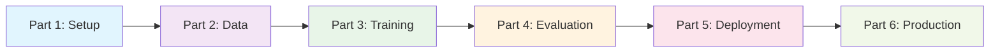

> 🚀 **Complete Implementation Available**: All code, configurations, and examples from this series are available in the [GitHub repository](https://github.com/saptak/fine-tuning-small-llms). Get started with a single command!

# Complete Guide: Fine-Tuning Small LLMs with Docker Desktop

Welcome to the complete overview of our comprehensive **6-part series** on fine-tuning small language models using Docker Desktop. This series takes you from absolute beginner to production deployment, providing everything you need to build, train, evaluate, and deploy your own custom LLM applications.

## 🎯 What You'll Achieve

By the end of this series, you'll have:

✅ **Production-Ready LLM Application** with web interface and API  
✅ **80% Faster Training** using Unsloth optimization techniques  
✅ **Complete Development Environment** with Docker and GPU support  
✅ **Advanced Monitoring** with Prometheus and Grafana dashboards  
✅ **Enterprise Security** with authentication and rate limiting  
✅ **Cost Optimization** strategies for efficient resource usage  
✅ **Disaster Recovery** with automated backups and restoration  

## 📚 Series Overview

### The Journey: From Zero to Production



Our series follows a logical progression that mirrors real-world AI development:

1. **Foundation**: Environment setup and tooling
2. **Preparation**: High-quality data creation and model selection
3. **Training**: Efficient fine-tuning with modern techniques
4. **Validation**: Comprehensive evaluation and testing
5. **Deployment**: Production-ready containerized services
6. **Operations**: Enterprise monitoring, scaling, and optimization

## 🔗 Complete GitHub Repository

**🚀 [fine-tuning-small-llms](https://github.com/saptak/fine-tuning-small-llms)**

Get started immediately with our complete reference implementation:

```bash
git clone https://github.com/saptak/fine-tuning-small-llms.git
cd fine-tuning-small-llms
./scripts/quick_start.sh
```

**What's included:**
- Complete Docker-based development environment
- Ready-to-use datasets and training configurations
- Production deployment stack with monitoring
- Interactive web interfaces and API endpoints
- Comprehensive documentation and examples

---
author: Saptak
categories:
- AI
- Machine Learning
- Docker
- LLM
- Fine-tuning
- Series
date: 2025-07-25 15:00:00 -0800
description: Complete overview of our comprehensive 6-part series on fine-tuning small
  language models with Docker Desktop. From environment setup to production deployment,
  learn everything you need to build production-ready AI applications.
featured: true
featured_image: /assets/images/llm-fine-tuning-series-overview.jpg
header_image_path: /assets/img/blog/headers/2025-07-25-fine-tuning-small-llms-complete-series-overview.jpg
image_credit: Photo by Patrick Martin on Unsplash
layout: post
repository: https://github.com/saptak/fine-tuning-small-llms
series: Fine-Tuning Small LLMs with Docker Desktop
tags:
- llm
- fine-tuning
- docker
- unsloth
- production
- overview
- tutorial-series
thumbnail_path: /assets/img/blog/thumbnails/2025-07-25-fine-tuning-small-llms-complete-series-overview.jpg
title: 'Complete Guide: Fine-Tuning Small LLMs with Docker Desktop - 6-Part Series
  Overview'
toc: true
---

### [Part 2: Data Preparation and Model Selection](https://saptak.github.io/2025/07/25/fine-tuning-small-llms-part2-data-preparation/)

**📊 Quality Data: The Foundation of Great Models**

Master the art of creating high-quality training datasets and selecting the optimal base model for your use case.

**What You'll Learn:**
- Dataset creation strategies for different domains (SQL, code, support)
- Data quality validation and syntax checking
- Format conversion between Alpaca, Chat, and Completion formats
- Model selection framework based on resources and use case
- Data augmentation techniques for dataset expansion

**Key Deliverables:**
- ✅ Comprehensive dataset creation toolkit
- ✅ Data validation and quality assurance framework
- ✅ Format conversion utilities
- ✅ Smart model recommendation system

**Time Investment:** 2-3 hours  
**Difficulty:** Intermediate

**💡 Pro Tip:** Quality beats quantity - 500 high-quality examples outperform 5,000 mediocre ones!

---
author: Saptak
categories:
- AI
- Machine Learning
- Docker
- LLM
- Fine-tuning
- Series
date: 2025-07-25 15:00:00 -0800
description: Complete overview of our comprehensive 6-part series on fine-tuning small
  language models with Docker Desktop. From environment setup to production deployment,
  learn everything you need to build production-ready AI applications.
featured: true
featured_image: /assets/images/llm-fine-tuning-series-overview.jpg
header_image_path: /assets/img/blog/headers/2025-07-25-fine-tuning-small-llms-complete-series-overview.jpg
image_credit: Photo by Patrick Martin on Unsplash
layout: post
repository: https://github.com/saptak/fine-tuning-small-llms
series: Fine-Tuning Small LLMs with Docker Desktop
tags:
- llm
- fine-tuning
- docker
- unsloth
- production
- overview
- tutorial-series
thumbnail_path: /assets/img/blog/thumbnails/2025-07-25-fine-tuning-small-llms-complete-series-overview.jpg
title: 'Complete Guide: Fine-Tuning Small LLMs with Docker Desktop - 6-Part Series
  Overview'
toc: true
---

### [Part 4: Evaluation and Testing](https://saptak.github.io/2025/07/25/fine-tuning-small-llms-part4-evaluation/)

**🎯 Quality Assurance: Measuring Model Performance**

Implement comprehensive evaluation frameworks to ensure your fine-tuned model meets quality standards.

**What You'll Learn:**
- Multi-metric evaluation: BLEU, ROUGE, METEOR, BERTScore
- A/B testing framework for model comparison
- Domain-specific evaluation (SQL syntax validation, code correctness)
- Human evaluation setup and management
- Performance benchmarking and regression testing

**Key Deliverables:**
- ✅ Automated evaluation pipeline with multiple metrics
- ✅ A/B testing framework for model comparison
- ✅ Interactive evaluation dashboard
- ✅ Quality assurance and regression testing suite

**Time Investment:** 1-2 hours  
**Difficulty:** Intermediate

**📊 Evaluation Coverage:** Test accuracy, relevance, fluency, and task-specific correctness

---
author: Saptak
categories:
- AI
- Machine Learning
- Docker
- LLM
- Fine-tuning
- Series
date: 2025-07-25 15:00:00 -0800
description: Complete overview of our comprehensive 6-part series on fine-tuning small
  language models with Docker Desktop. From environment setup to production deployment,
  learn everything you need to build production-ready AI applications.
featured: true
featured_image: /assets/images/llm-fine-tuning-series-overview.jpg
header_image_path: /assets/img/blog/headers/2025-07-25-fine-tuning-small-llms-complete-series-overview.jpg
image_credit: Photo by Patrick Martin on Unsplash
layout: post
repository: https://github.com/saptak/fine-tuning-small-llms
series: Fine-Tuning Small LLMs with Docker Desktop
tags:
- llm
- fine-tuning
- docker
- unsloth
- production
- overview
- tutorial-series
thumbnail_path: /assets/img/blog/thumbnails/2025-07-25-fine-tuning-small-llms-complete-series-overview.jpg
title: 'Complete Guide: Fine-Tuning Small LLMs with Docker Desktop - 6-Part Series
  Overview'
toc: true
---

### [Part 6: Production, Monitoring, and Scaling](https://saptak.github.io/2025/07/25/fine-tuning-small-llms-part6-production/)

**🏭 Enterprise Grade: Monitoring, Security, and Optimization**

Complete your journey with enterprise-grade monitoring, security, auto-scaling, and cost optimization.

**What You'll Learn:**
- Advanced monitoring with Prometheus and Grafana
- Security implementation: JWT, rate limiting, WAF
- Auto-scaling strategies and resource optimization
- Cost management and usage analytics
- Disaster recovery and backup procedures

**Key Deliverables:**
- ✅ Comprehensive monitoring and alerting system
- ✅ Multi-layer security framework
- ✅ Auto-scaling and performance optimization
- ✅ Cost tracking and optimization tools
- ✅ Disaster recovery and backup solutions

**Time Investment:** 3-4 hours  
**Difficulty:** Advanced

**🛡️ Enterprise Ready:** Security, compliance, monitoring, and 99.9% uptime capabilities

---
author: Saptak
categories:
- AI
- Machine Learning
- Docker
- LLM
- Fine-tuning
- Series
date: 2025-07-25 15:00:00 -0800
description: Complete overview of our comprehensive 6-part series on fine-tuning small
  language models with Docker Desktop. From environment setup to production deployment,
  learn everything you need to build production-ready AI applications.
featured: true
featured_image: /assets/images/llm-fine-tuning-series-overview.jpg
header_image_path: /assets/img/blog/headers/2025-07-25-fine-tuning-small-llms-complete-series-overview.jpg
image_credit: Photo by Patrick Martin on Unsplash
layout: post
repository: https://github.com/saptak/fine-tuning-small-llms
series: Fine-Tuning Small LLMs with Docker Desktop
tags:
- llm
- fine-tuning
- docker
- unsloth
- production
- overview
- tutorial-series
thumbnail_path: /assets/img/blog/thumbnails/2025-07-25-fine-tuning-small-llms-complete-series-overview.jpg
title: 'Complete Guide: Fine-Tuning Small LLMs with Docker Desktop - 6-Part Series
  Overview'
toc: true
---

## 📚 Complete Series Navigation

| Part | Topic | Focus | Time | Difficulty |
|------|-------|--------|------|------------|
| **[Part 1](https://saptak.github.io/2025/07/25/fine-tuning-small-llms-part1-setup-environment/)** | Setup and Environment | Foundation | 30-60 min | Beginner |
| **[Part 2](https://saptak.github.io/2025/07/25/fine-tuning-small-llms-part2-data-preparation/)** | Data Preparation | Quality Data | 2-3 hours | Intermediate |
| **[Part 3](https://saptak.github.io/2025/07/25/fine-tuning-small-llms-part3-training/)** | Fine-Tuning with Unsloth | Efficient Training | 1-4 hours | Intermediate-Advanced |
| **[Part 4](https://saptak.github.io/2025/07/25/fine-tuning-small-llms-part4-evaluation/)** | Evaluation and Testing | Quality Assurance | 1-2 hours | Intermediate |
| **[Part 5](https://saptak.github.io/2025/07/25/fine-tuning-small-llms-part5-deployment/)** | Deployment with Ollama | Production Ready | 2-3 hours | Intermediate-Advanced |
| **[Part 6](https://saptak.github.io/2025/07/25/fine-tuning-small-llms-part6-production/)** | Production & Monitoring | Enterprise Grade | 3-4 hours | Advanced |

---
author: Saptak
categories:
- AI
- Machine Learning
- Docker
- LLM
- Fine-tuning
- Series
date: 2025-07-25 15:00:00 -0800
description: Complete overview of our comprehensive 6-part series on fine-tuning small
  language models with Docker Desktop. From environment setup to production deployment,
  learn everything you need to build production-ready AI applications.
featured: true
featured_image: /assets/images/llm-fine-tuning-series-overview.jpg
header_image_path: /assets/img/blog/headers/2025-07-25-fine-tuning-small-llms-complete-series-overview.jpg
image_credit: Photo by Patrick Martin on Unsplash
layout: post
repository: https://github.com/saptak/fine-tuning-small-llms
series: Fine-Tuning Small LLMs with Docker Desktop
tags:
- llm
- fine-tuning
- docker
- unsloth
- production
- overview
- tutorial-series
thumbnail_path: /assets/img/blog/thumbnails/2025-07-25-fine-tuning-small-llms-complete-series-overview.jpg
title: 'Complete Guide: Fine-Tuning Small LLMs with Docker Desktop - 6-Part Series
  Overview'
toc: true
---

*Found this series helpful? Share it with others who might benefit from learning these techniques. Your feedback and contributions make this resource better for everyone!*
