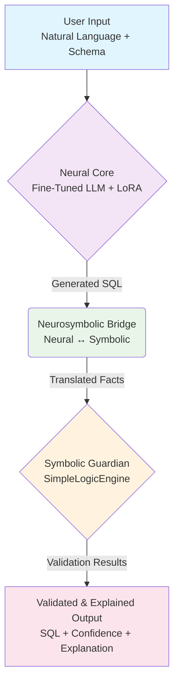

# How to Build a Neurosymbolic Adapter: A Developer's Guide

## From Fine-Tuning to Full-Fledged Reasoning

In our [previous series on fine-tuning small LLMs](https://saptak.in/writing/2025/07/25/fine-tuning-small-llms-complete-series-overview), we walked through the entire process of taking a base language model and adapting it for a specific task. We covered everything from setting up a Docker environment and preparing a high-quality dataset to using Unsloth for efficient LoRA fine-tuning, and finally deploying and monitoring the model in a production environment. We demonstrated that it's possible to achieve impressive performance on a specific task, even on consumer-grade hardware.

However, fine-tuning alone, no matter how effective, runs into a wall. Language models, at their core, are probabilistic pattern matchers. They don't *understand* logic, constraints, or the ground truth of a structured environment like a database schema. For a task like SQL generation, this presents critical challenges:

-   **Semantic Errors**: An LLM can generate perfectly valid SQL that is logically incorrect for the user's request.
-   **Constraint Violations**: It may ignore `PRIMARY KEY`, `FOREIGN KEY`, or `NOT NULL` constraints because it doesn't comprehend their meaning.
-   **Lack of Explainability**: When it makes a mistake, it cannot explain *why* in a deterministic, logical way.
-   **Brittleness**: A slight change in the schema or a novel query can lead to unpredictable and incorrect results.

To overcome these limitations, we need to go beyond simple fine-tuning. We need to build a system that combines the generative power of neural networks with the rigorous, verifiable logic of a symbolic reasoning system. This is the essence of **neurosymbolic AI**.

This guide is the next chapter in our journey. We will show you how to build a **Neurosymbolic SQL Adapter** from the ground up—a system that not only generates SQL but also understands, validates, and explains it. We'll move from simply fine-tuning a model to architecting a robust, reliable, and production-ready hybrid AI.

## The Goal: A Hybrid AI for SQL

A neurosymbolic SQL adapter is a hybrid AI system that bridges the gap between neural language models and symbolic reasoning engines. It enhances fine-tuned SQL language models with:

- **Symbolic Logic Validation**: Real-time constraint checking against a database schema.
- **Explainable Reasoning**: Human-readable explanations for generated queries and validation results.
- **Constraint Enforcement**: Guarantees that generated SQL adheres to database rules.
- **Confidence Assessment**: Quantifies the system's uncertainty about its output.

## Architecture: The Two Worlds Collide

Our system is composed of two primary components that work in concert: the **Neural Core** for generation and the **Symbolic Guardian** for validation. A sophisticated **Bridge Layer** connects them, allowing them to communicate.



Let's build each of these components step-by-step.

## Part 1: Building the Neural Core - The SQL Generator

The Neural Core is responsible for the heavy lifting of translating natural language into a SQL query. It's built around a powerful base LLM and made efficient with LoRA.

### The `NeurosymbolicAdapter`

The heart of our neural core is the `NeurosymbolicAdapter`. This PyTorch module wraps a base language model and integrates parameter-efficient fine-tuning (PEFT) using LoRA. This allows us to adapt a massive model for our specific SQL generation task without retraining all of its billions of parameters.

The configuration is managed by a simple dataclass, `AdapterConfig`, which defines the LoRA parameters and the dimensions for our neurosymbolic components.

```python
# src/adapters/neurosymbolic_adapter.py

@dataclass
class AdapterConfig:
    """Configuration for neurosymbolic adapter"""
    lora_r: int = 16
    lora_alpha: int = 32
    lora_dropout: float = 0.1
    target_modules: List[str] = None
    bridge_dim: int = 512
    symbolic_dim: int = 256
    # ... and other configs
```

The adapter itself is a `nn.Module` that loads the base model and applies the LoRA configuration. It's designed to be extended with our other neurosymbolic components.

```python
# src/adapters/neurosymbolic_adapter.py

class NeurosymbolicAdapter(nn.Module):
    """
    Neurosymbolic Adapter for SQL Generation
    """
    def __init__(self, base_model_name: str, config: Optional[AdapterConfig] = None):
        super().__init__()
        self.config = config or AdapterConfig()
        self.base_model = self._load_base_model(base_model_name)
        self.lora_model = self._setup_lora_adapter()

        # These will be connected later
        self.bridge_layer = None
        self.confidence_estimator = None
        self.fact_extractor = None

    def forward(self, input_ids: torch.Tensor, ...):
        # Standard language model forward pass
        model_outputs = self.lora_model.forward(...)
        logits = model_outputs.logits
        hidden_states = model_outputs.last_hidden_state

        # ... hooks for neurosymbolic components ...

        return NeurosymbolicOutput(logits=logits, ...)
```

## Part 2: Building the Symbolic Guardian - The SQL Validator

An LLM might generate syntactically correct SQL that is semantically nonsense or violates database constraints. Our Symbolic Guardian acts as a gatekeeper, ensuring the generated SQL is valid and logical.

### The Challenge: Escaping Dependency Hell

Initially, we considered using established reasoning engines like PyReason. However, we quickly ran into persistent compilation issues with its dependencies like `numba` and `LLVM`, which varied across Python versions and operating systems.

```bash
# Typical PyReason errors we encountered:
ERROR: Cannot unify int64 and Tuple(...) for 'i.24'
ERROR: Could not find a `llvm-config` binary
ERROR: numba compilation failed
```

### Our Solution: The `SimpleLogicEngine`

To ensure our adapter was production-ready and easy to deploy, we built our own reasoning engine from scratch. The `SimpleLogicEngine` is a pure-Python, zero-dependency forward-chaining engine designed specifically for SQL constraint validation.

It operates on two simple concepts: `LogicFact` and `LogicRule`.

```python
# src/reasoning/simple_logic_engine.py

@dataclass(frozen=True)
class LogicFact:
    predicate: str
    arguments: tuple
    confidence: float = 1.0

@dataclass
class LogicRule:
    head: LogicFact
    body: List[LogicFact]
    confidence: float = 1.0
```

The engine's core is the `reason` method, which iteratively applies rules to the set of known facts to derive new facts. We pre-load it with rules that define common SQL constraint violations.

```python
# src/reasoning/simple_logic_engine.py

class SimpleLogicEngine:
    def __init__(self):
        self.facts: Set[LogicFact] = set()
        self.rules: List[LogicRule] = []
        self._initialize_sql_rules()

    def _initialize_sql_rules(self):
        # Rule for foreign key violations
        self.add_rule_from_string(
            "violation(foreign_key_invalid) :- foreign_key(T1, C1, T2, C2), missing_reference(T1, C1, T2, C2)"
        )
        # Rule for NOT NULL violations
        self.add_rule_from_string(
            "violation(not_null) :- not_null_constraint(Table, Column), null_value(Table, Column)"
        )
        # ... and 4 other built-in rule types

    def reason(self, max_iterations: int = 10) -> Dict[str, Any]:
        """Forward chaining reasoning with violation detection"""
        # ... implementation ...
```

### From SQL to Facts: The `SQLToFactsConverter`

How does the `SimpleLogicEngine` know about the SQL query? We use the `SQLToFactsConverter`. This utility parses a SQL query string and a database schema into a list of `LogicFact`s.

For example, the query `SELECT name FROM users WHERE id = 1` becomes a set of facts:

```
query_type(select)
query_references_table(users)
query_references_column(users, name)
query_has_condition(...)
query_has_literal(1, integer)
```

The converter uses `sqlparse` and regular expressions to analyze the query and schema, creating a symbolic representation for the logic engine to process.

```python
# src/reasoning/sql_to_facts.py

class SQLToFactsConverter:
    def __init__(self, knowledge_base: Optional[SQLKnowledgeBase] = None):
        self.logger = logging.getLogger(__name__)
        self.knowledge_base = knowledge_base

    def convert_query_to_facts(self, sql_query: str) -> List[str]:
        facts = []
        analysis = self.analyze_query(sql_query)

        facts.append(f"query_type({analysis.query_type.value.lower()})")
        for table in analysis.tables:
            facts.append(f"query_references_table({table})")
        # ... and so on
        return facts
```

## Part 3: The Neurosymbolic Bridge - Connecting the Two Worlds

This is where the magic happens. The `BridgeLayer` is the component that makes our system truly *neurosymbolic*. It translates the rich, continuous representations from the neural network's hidden states into the discrete, logical world of the symbolic engine.

The `BridgeLayer` is a sophisticated `nn.Module` containing its own transformer blocks. It takes the final hidden state from the LLM and processes it to produce a `SymbolicContext`.

```python
# src/adapters/bridge_layer.py

@dataclass
class SymbolicContext:
    """Container for symbolic reasoning context"""
    embeddings: torch.Tensor
    facts: Optional[List[str]] = None
    attention_weights: Optional[torch.Tensor] = None
```

The bridge uses a series of projections and specialized `SymbolicTransformerBlock`s to refine the neural representation. A key innovation here is the use of learned **SQL concept embeddings**. We create embeddings for ~100 common SQL concepts (e.g., `SELECT`, `JOIN`, `PRIMARY_KEY`) and use attention mechanisms to determine which concepts the LLM is "thinking" about at each point in the generated query.

```python
# src/adapters/bridge_layer.py

class BridgeLayer(nn.Module):
    def __init__(self, neural_dim: int = 4096, symbolic_dim: int = 512, ...):
        super().__init__()
        # ... projections, transformer layers ...

        # Learned representations for SQL concepts
        self.concept_embeddings = nn.Embedding(100, symbolic_dim)
        self.concept_names = self._initialize_concept_names() # ["SELECT", "FROM", ...]

    def forward(self, neural_representations: torch.Tensor, ...) -> SymbolicContext:
        # Project neural -> bridge space
        bridge_repr = self.neural_to_bridge(neural_representations)

        # Apply symbolic transformer layers
        x = bridge_repr
        for layer in self.transformer_layers:
            x, attn_weights = layer(x)

        # Project bridge -> symbolic space
        symbolic_embeddings = self.bridge_to_symbolic(x)

        # Extract facts and other symbolic info
        extracted_facts = self._extract_facts(symbolic_embeddings, ...)

        return SymbolicContext(
            embeddings=symbolic_embeddings,
            facts=extracted_facts,
            ...
        )
```

This bridge allows for a much deeper integration than simply passing the final text output from one component to the next.

## Part 4: The Conductor - Orchestrating the System

The `NeurosymbolicSQLModel` is the conductor that orchestrates our entire ensemble. It brings together the neural generator, the symbolic validator, and the bridge that connects them.

Its main method, `generate_sql`, follows a clear, logical flow:
1.  Take a natural language `instruction` and a `schema`.
2.  Use the `NeurosymbolicAdapter` (the neural core) to generate a candidate SQL query.
3.  Take the generated SQL and pass it to the `SimpleLogicEngine` (the symbolic guardian) for validation against the schema.
4.  Package everything up into a neat `NeurosymbolicResult`.

```python
# src/integration/hybrid_model.py

class NeurosymbolicSQLModel:
    def __init__(self, ...):
        # Initialize symbolic components
        self.reasoning_engine = PyReasonEngine(...)
        self.facts_converter = SQLToFactsConverter(...)

        # Initialize neural components
        self.model_manager = ModelManager(...)
        self.neural_adapter = self.model_manager.load_model(...)

    def generate_sql(self, instruction: str, schema: ...) -> NeurosymbolicResult:
        # 1. Generate SQL with the neural adapter
        generation_result = self._neural_sql_generation(instruction, schema)
        generated_sql = generation_result['sql']

        # 2. Validate the generated SQL with the symbolic engine
        validation_result = self.reasoning_engine.validate_sql(generated_sql, schema)

        # 3. Package and return the final result
        return NeurosymbolicResult(
            sql=generated_sql,
            is_valid=validation_result.is_valid,
            confidence=validation_result.confidence,
            violations=validation_result.violations,
            explanation=self._generate_explanation(...),
            neural_confidence=generation_result['confidence'],
            ...
        )
```

The final output, `NeurosymbolicResult`, contains everything the end-user needs: the query, its validity, a confidence score, a list of violations, and a human-readable explanation.

```python
# src/integration/hybrid_model.py

@dataclass
class NeurosymbolicResult:
    """Result from neurosymbolic SQL processing"""
    sql: str
    is_valid: bool
    confidence: float
    violations: List[str]
    explanation: Optional[str] = None
    reasoning_trace: Optional[List[str]] = None
    neural_confidence: Optional[float] = None
    generation_method: str = "mock"
```

## How to Use It: A Practical Example

Putting it all together is straightforward. The `examples/basic_integration.py` script shows how to initialize the model and use it to generate and validate SQL.

```python
# examples/basic_integration.py

from src.integration.hybrid_model import NeurosymbolicSQLModel

# 1. Initialize the model
model = NeurosymbolicSQLModel(
    base_model="unsloth/llama-3.1-8b-instruct-bnb-4bit"
)

# 2. Define instruction and schema
instruction = "Find all customers who have placed orders worth more than $1000"
schema = "customers (id, name, email), orders (id, customer_id, amount, order_date)"

# 3. Generate and validate
result = model.generate_sql(
    instruction=instruction,
    schema=schema
)

# 4. Print the results
print(f"Generated SQL:
{result.sql}")
print(f"Is Valid: {result.is_valid}")
print(f"Confidence: {result.confidence:.2f}")
if not result.is_valid:
    print(f"Violations: {result.violations}")
```

This simple interface provides access to the full power of the neurosymbolic pipeline.

## Production Deployment Guide

A key goal of this project was to create a system that is not just a research prototype but is ready for production. The following sections provide a comprehensive guide to deploying the Neurosymbolic SQL Adapter in a real-world environment.

### Prerequisites

#### System Requirements
```yaml
Minimum Configuration:
  RAM: 16GB (32GB recommended)
  GPU: 8GB VRAM (RTX 3060 or better)
  Storage: 50GB free space
  CPU: 4+ cores

Recommended Configuration:
  RAM: 32GB+
  GPU: 16GB+ VRAM (RTX 4080/A100)
  Storage: 100GB+ SSD
  CPU: 8+ cores with AVX support
```

#### Python Environment
```bash
# Python 3.8+ (tested on 3.8, 3.9, 3.10, 3.11, 3.13)
python --version  # Should be 3.8+
```

### Step 1: Environment Setup

#### Create Virtual Environment
```bash
# Using venv (recommended)
python -m venv neurosymbolic-env
source neurosymbolic-env/bin/activate  # Linux/Mac
# or
neurosymbolic-env\Scripts\activate  # Windows

# Using conda (alternative)
conda create -n neurosymbolic python=3.11
conda activate neurosymbolic
```

#### Install Dependencies
```bash
# Clone the repository
git clone https://github.com/saptak/neurosymbolic-sql-adapter.git
cd neurosymbolic-sql-adapter

# Install core dependencies
pip install torch>=2.0.0 transformers>=4.30.0 peft>=0.4.0
pip install networkx>=3.1 sqlparse>=0.4.4 pandas>=2.0.0
pip install numpy>=1.24.0 pyyaml>=6.0 tqdm>=4.65.0

# Install development dependencies (optional)
pip install pytest>=7.4.0 black>=23.3.0 isort>=5.12.0
```

### Step 2: Configuration Setup

#### Create Production Configuration
```yaml
# configs/production_config.yaml
neurosymbolic:
  reasoning_engine: "SimpleLogicEngine"
  confidence_threshold: 0.8
  max_reasoning_iterations: 10
  enable_explanation: true

neural:
  model_name: "unsloth/llama-3.1-8b-instruct-bnb-4bit"
  adapter_config:
    r: 16
    alpha: 32
    target_modules: ["q_proj", "v_proj", "k_proj", "o_proj"]
    dropout: 0.1

validation:
  enable_constraint_checking: true
  enable_confidence_estimation: true
  violation_tolerance: 0

logging:
  level: "INFO"
  file: "logs/neurosymbolic.log"
  format: "% (asctime)s - % (name)s - % (levelname)s - % (message)s"
```

#### Database Schema Configuration
```json
{
  "users": {
    "columns": {
      "id": {"type": "INTEGER", "nullable": false},
      "email": {"type": "VARCHAR(255)", "nullable": false},
      "name": {"type": "VARCHAR(100)", "nullable": false}
    },
    "primary_key": ["id"],
    "unique_constraints": [["email"]]
  },
  "orders": {
    "columns": {
      "id": {"type": "INTEGER", "nullable": false},
      "user_id": {"type": "INTEGER", "nullable": false},
      "total": {"type": "DECIMAL(10,2)", "nullable": false}
    },
    "primary_key": ["id"],
    "foreign_keys": [{"columns": ["user_id"], "references": ["users", "id"]}]
  }
}
```

### Step 3: Application Initialization

#### Basic Production Setup
```python
# main.py
import logging
from src.integration.hybrid_model import HybridModel
from src.reasoning.pyreason_engine import PyReasonEngine

# Configure logging
logging.basicConfig(
    level=logging.INFO,
    format='%(asctime)s - %(name)s - %(levelname)s - %(message)s',
    handlers=[
        logging.FileHandler('logs/neurosymbolic.log'),
        logging.StreamHandler()
    ]
)

def initialize_neurosymbolic_adapter():
    """Initialize the neurosymbolic SQL adapter for production"""

    # Load configuration
    config_path = "configs/production_config.yaml"

    # Initialize reasoning engine
    reasoning_engine = PyReasonEngine(config_path)

    # Initialize hybrid model
    hybrid_model = HybridModel(
        config_path=config_path,
        reasoning_engine=reasoning_engine
    )

    # Verify system status
    status = hybrid_model.get_system_status()
    logging.info(f"System initialized: {status}")

    return hybrid_model

if __name__ == "__main__":
    adapter = initialize_neurosymbolic_adapter()
    print("Neurosymbolic SQL Adapter ready for production!")
```

### Step 4: API Integration

#### Flask REST API Example
```python
# api.py
from flask import Flask, request, jsonify
from main import initialize_neurosymbolic_adapter
import logging

app = Flask(__name__)
adapter = initialize_neurosymbolic_adapter()

@app.route('/generate-sql', methods=['POST'])
def generate_sql():
    """Generate SQL with neurosymbolic validation"""
    try:
        data = request.json
        natural_language = data.get('query')
        schema = data.get('schema')

        # Generate SQL with validation
        result = adapter.generate_and_validate_sql(
            natural_language=natural_language,
            schema=schema
        )

        return jsonify({
            'sql_query': result.sql_query,
            'is_valid': result.is_valid,
            'confidence': result.confidence,
            'violations': result.violations,
            'explanation': result.explanation,
            'reasoning_trace': result.reasoning_trace
        })

    except Exception as e:
        logging.error(f"SQL generation error: {e}")
        return jsonify({'error': str(e)}), 500

@app.route('/health', methods=['GET'])
def health_check():
    """Health check endpoint"""
    status = adapter.get_system_status()
    return jsonify(status)

if __name__ == '__main__':
    app.run(host='0.0.0.0', port=8000, debug=False)
```

#### FastAPI Alternative
```python
# fastapi_api.py
from fastapi import FastAPI, HTTPException
from pydantic import BaseModel
from main import initialize_neurosymbolic_adapter
import logging

app = FastAPI(title="Neurosymbolic SQL Adapter API", version="1.0.0")
adapter = initialize_neurosymbolic_adapter()

class SQLRequest(BaseModel):
    query: str
    schema: dict

class SQLResponse(BaseModel):
    sql_query: str
    is_valid: bool
    confidence: float
    violations: list
    explanation: str
    reasoning_trace: list

@app.post("/generate-sql", response_model=SQLResponse)
async def generate_sql(request: SQLRequest):
    """Generate SQL with neurosymbolic validation"""
    try:
        result = adapter.generate_and_validate_sql(
            natural_language=request.query,
            schema=request.schema
        )

        return SQLResponse(
            sql_query=result.sql_query,
            is_valid=result.is_valid,
            confidence=result.confidence,
            violations=result.violations,
            explanation=result.explanation,
            reasoning_trace=result.reasoning_trace
        )

    except Exception as e:
        logging.error(f"SQL generation error: {e}")
        raise HTTPException(status_code=500, detail=str(e))

@app.get("/health")
async def health_check():
    """Health check endpoint"""
    return adapter.get_system_status()
```

### Step 5: Docker Deployment

#### Dockerfile
```dockerfile
# Dockerfile
FROM python:3.11-slim

# Set working directory
WORKDIR /app

# Install system dependencies
RUN apt-get update && apt-get install -y \
    git \
    curl \
    && rm -rf /var/lib/apt/lists/*

# Copy requirements first (for better caching)
COPY requirements.txt .

# Install Python dependencies
RUN pip install --no-cache-dir -r requirements.txt

# Copy application code
COPY . .

# Create logs directory
RUN mkdir -p logs

# Set environment variables
ENV PYTHONPATH=/app
ENV NEUROSYMBOLIC_CONFIG_PATH=/app/configs/production_config.yaml

# Expose port
EXPOSE 8000

# Health check
HEALTHCHECK --interval=30s --timeout=30s --start-period=5s --retries=3 \
    CMD curl -f http://localhost:8000/health || exit 1

# Run application
CMD ["python", "api.py"]
```

#### Docker Compose for Production
```yaml
# docker-compose.yml
version: '3.8'

services:
  neurosymbolic-adapter:
    build: .
    ports:
      - "8000:8000"
    environment:
      - PYTHONPATH=/app
      - NEUROSYMBOLIC_CONFIG_PATH=/app/configs/production_config.yaml
    volumes:
      - ./logs:/app/logs
      - ./configs:/app/configs
    restart: unless-stopped
    healthcheck:
      test: ["CMD", "curl", "-f", "http://localhost:8000/health"]
      interval: 30s
      timeout: 10s
      retries: 3
    deploy:
      resources:
        limits:
          memory: 8G
        reservations:
          memory: 4G

  nginx:
    image: nginx:alpine
    ports:
      - "80:80"
      - "443:443"
    volumes:
      - ./nginx.conf:/etc/nginx/nginx.conf
      - ./ssl:/etc/nginx/ssl
    depends_on:
      - neurosymbolic-adapter
    restart: unless-stopped

  prometheus:
    image: prom/prometheus
    ports:
      - "9090:9090"
    volumes:
      - ./prometheus.yml:/etc/prometheus/prometheus.yml
    restart: unless-stopped

  grafana:
    image: grafana/grafana
    ports:
      - "3000:3000"
    environment:
      - GF_SECURITY_ADMIN_PASSWORD=admin
    volumes:
      - grafana-storage:/var/lib/grafana
    restart: unless-stopped

volumes:
  grafana-storage:
```

### Step 6: Monitoring and Logging

#### Prometheus Metrics Configuration
```yaml
# prometheus.yml
global:
  scrape_interval: 15s

scrape_configs:
  - job_name: 'neurosymbolic-adapter'
    static_configs:
      - targets: ['neurosymbolic-adapter:8000']
    metrics_path: '/metrics'
    scrape_interval: 5s
```

#### Application Metrics
```python
# metrics.py
from prometheus_client import Counter, Histogram, Gauge, start_http_server
import time

# Metrics
sql_generation_requests = Counter('sql_generation_requests_total', 'Total SQL generation requests')
sql_generation_duration = Histogram('sql_generation_duration_seconds', 'SQL generation duration')
sql_validation_accuracy = Gauge('sql_validation_accuracy', 'SQL validation accuracy')
active_reasoning_sessions = Gauge('active_reasoning_sessions', 'Active reasoning sessions')

def track_metrics(func):
    """Decorator to track function metrics"""
    def wrapper(*args, **kwargs):
        sql_generation_requests.inc()
        start_time = time.time()

        try:
            result = func(*args, **kwargs)
            sql_validation_accuracy.set(result.confidence)
            return result
        finally:
            sql_generation_duration.observe(time.time() - start_time)

    return wrapper

# Start metrics server
start_http_server(8001)
```

### Step 7: Production Deployment Commands

#### Build and Deploy
```bash
# Build Docker image
docker build -t neurosymbolic-sql-adapter:latest .

# Run with Docker Compose
docker-compose up -d

# Check logs
docker-compose logs -f neurosymbolic-adapter

# Health check
curl http://localhost:8000/health

# Test SQL generation
curl -X POST http://localhost:8000/generate-sql \
  -H "Content-Type: application/json" \
  -d '{
    "query": "Find all users who have placed orders over $100",
    "schema": {
      "users": {"columns": {"id": "INTEGER", "name": "VARCHAR"}},
      "orders": {"columns": {"id": "INTEGER", "user_id": "INTEGER", "total": "DECIMAL"}}
    }
  }'
```

#### Kubernetes Deployment (Advanced)
```yaml
# k8s-deployment.yaml
apiVersion: apps/v1
kind: Deployment
metadata:
  name: neurosymbolic-adapter
spec:
  replicas: 3
  selector:
    matchLabels:
      app: neurosymbolic-adapter
  template:
    metadata:
      labels:
        app: neurosymbolic-adapter
    spec:
      containers:
      - name: neurosymbolic-adapter
        image: neurosymbolic-sql-adapter:latest
        ports:
        - containerPort: 8000
        resources:
          requests:
            memory: "4Gi"
            cpu: "1000m"
          limits:
            memory: "8Gi"
            cpu: "2000m"
        env:
        - name: PYTHONPATH
          value: "/app"
        livenessProbe:
          httpGet:
            path: /health
            port: 8000
          initialDelaySeconds: 30
          periodSeconds: 10
        readinessProbe:
          httpGet:
            path: /health
            port: 8000
          initialDelaySeconds: 5
          periodSeconds: 5

---
author: ''
categories:
- AI
- Machine Learning
- SQL
- Neurosymbolic AI
- Tutorial
date: 2025-08-25
description: A detailed, narrative guide to building a neurosymbolic SQL adapter from
  scratch, combining neural language models with a custom symbolic reasoning engine
  for enhanced SQL generation.
featured: true
header_image_path: /assets/img/blog/headers/2025-08-25-neurosymbolic-sql-adapter.jpg
image: /assets/images/neurosymbolic-sql-adapter-architecture.png
image_credit: Photo by Rick Rothenberg on Unsplash
image_credit_url: https://unsplash.com/photos/a-close-up-of-a-bunch-of-blue-objects-JkAj6DY4iq0
layout: post
tags:
- PyTorch
- Transformers
- LoRA
- Symbolic Reasoning
- SQL Generation
- Production AI
- Python
thumbnail_path: /assets/img/blog/thumbnails/2025-08-25-neurosymbolic-sql-adapter.jpg
title: 'How to Build a Neurosymbolic Adapter: A Developer''s Guide'
toc: true
---

### About This Project

This project was developed to demonstrate and address challenges in AI-powered SQL generation while maintaining production-grade reliability and performance. The focus was on creating a robust neurosymbolic system that combines the best of neural and symbolic approaches.
