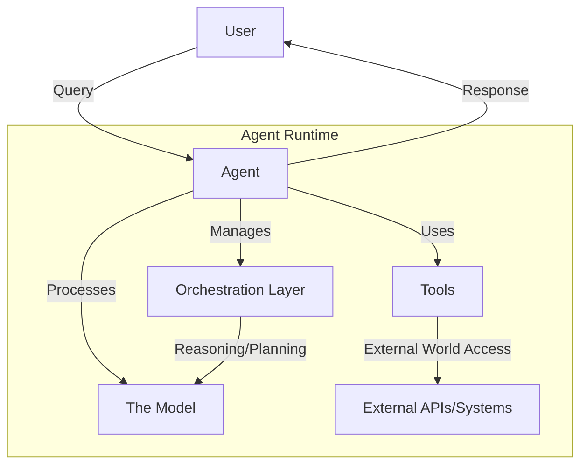
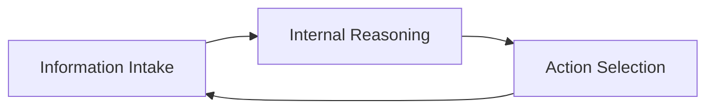
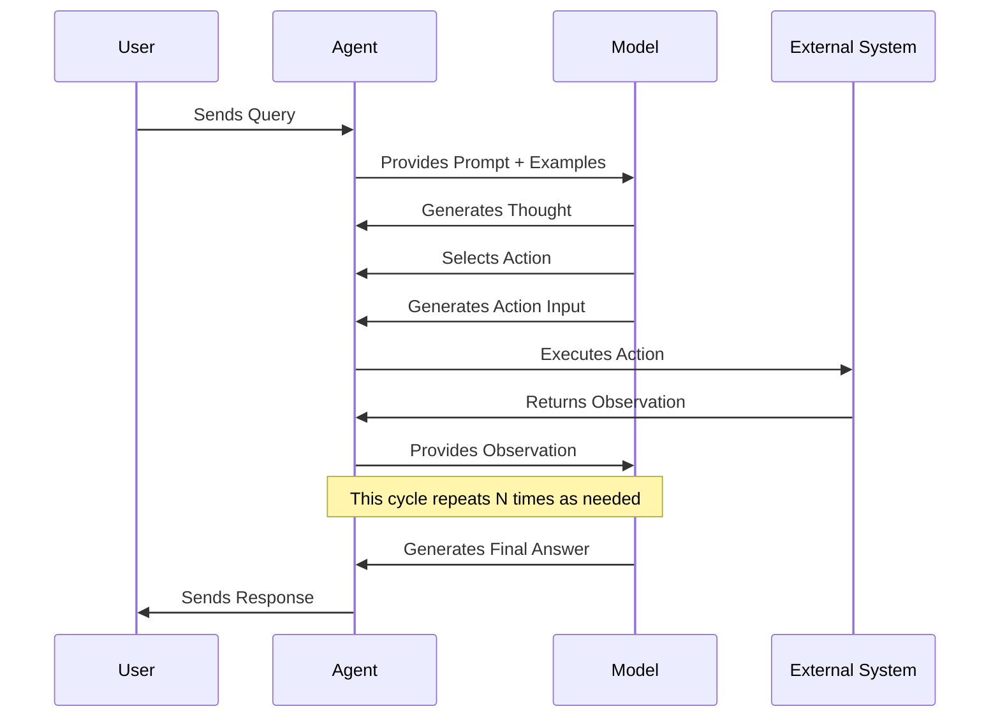
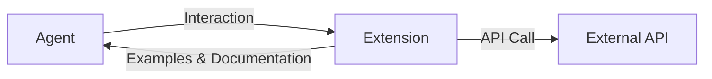
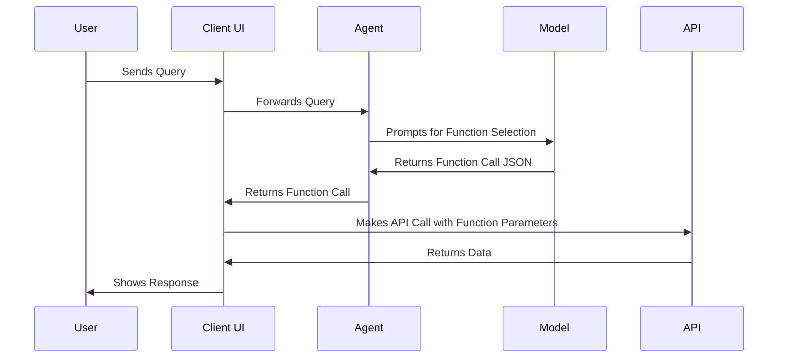
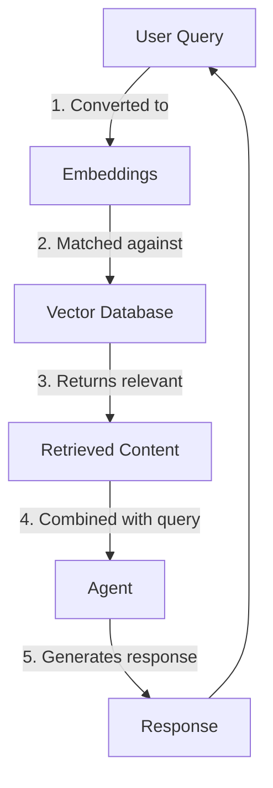
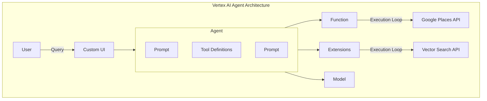

# Understanding AI Agents: Architecture, Components, and Implementation

AI Agents represent one of the most significant advancements in artificial intelligence systems. Unlike traditional language models that simply generate text, agents can perceive, reason, plan, and act to achieve specific goals. This post explores the architecture, components, and implementation strategies for building effective AI agents.

## What Is an AI Agent?

In its most fundamental form, an AI agent can be defined as follows:

> An application that attempts to achieve a goal by observing the world and acting upon it using the tools that it has at its disposal.

Agents are autonomous systems designed to operate independently with minimal human intervention. They're proactive in their approach to reaching goals, able to reason about next steps even without explicit instructions. At Anthropic, systems are categorized based on an important architectural distinction between workflows (where LLMs and tools follow predefined code paths) and agents (where LLMs dynamically direct their own processes and tool usage).

The most effective agents combine reasoning capabilities, logic frameworks, and access to external information through a well-orchestrated architecture.

## Core Components of AI Agents

Every effective agent architecture consists of three essential components:



### The Model

The model refers to the language model (LM) that serves as the centralized decision-maker for agent processes. This can be a single model or multiple LMs working together. The key requirements for these models include:

1. Following instruction-based reasoning
2. Implementing logical frameworks (like ReAct, Chain-of-Thought)
3. Supporting multi-turn conversations

Models can be general-purpose, multimodal, or fine-tuned based on the specific needs of the agent architecture.

### The Orchestration Layer

The orchestration layer defines the cyclical process governing how an agent:
1. Takes in information
2. Performs internal reasoning
3. Uses that reasoning to inform its next action or decision

This loop continues until the agent reaches its goal or a stopping point. The complexity of this layer varies greatly depending on the agent's purpose and can range from simple decision rules to complex chained logic with additional ML algorithms.



### The Tools

Tools bridge the gap between an agent's internal capabilities and the external world. They allow agents to interact with external systems, access real-time data, and perform actions beyond the capabilities of the language model alone.

There are three primary types of tools:

1. **Extensions**: Agent-side tools that connect to external APIs through standardized interfaces
2. **Functions**: Client-side tools that allow the model to generate parameters for functions executed elsewhere
3. **Data Stores**: Vector databases and other storage systems that provide access to structured and unstructured data

## Cognitive Architectures: How Agents Operate

The orchestration layer implements what's known as a "cognitive architecture" - the framework that governs how an agent processes information and makes decisions. Popular cognitive architectures include:

### ReAct Framework

ReAct (Reasoning + Acting) provides a thought process strategy for language models to reason and take action on user queries. The process typically follows this sequence:



### Chain-of-Thought (CoT)

Chain-of-Thought enables reasoning through intermediate steps, allowing the model to break complex problems into manageable parts. There are various sub-techniques like self-consistency, active-prompt, and multimodal CoT.

### Tree-of-Thoughts (ToT)

Tree-of-Thoughts allows the model to explore various thought chains as intermediate steps, facilitating strategic lookahead for complex problem-solving.

## Tools In Depth

### Extensions

Extensions bridge the gap between agents and APIs by:
1. Teaching the agent how to use specific API endpoints via examples
2. Teaching the agent what arguments are needed for successful API calls



Extensions are crafted independently but included in the agent's configuration. They contain built-in examples that help the agent select which extension to use for a specific task.

### Functions

Functions differ from extensions in that:
1. Functions generate parameters but don't execute API calls
2. Function execution happens client-side, not agent-side

This gives developers more control over data flow and system execution.



### Data Stores

Data stores provide access to information beyond the model's training data. They typically use vector embeddings to represent different types of content:

1. Website content
2. Structured data (PDF, Word, CSV, etc.)
3. Unstructured data (HTML, TXT, etc.)

This implementation is often called Retrieval-Augmented Generation (RAG).



## Targeted Learning Approaches

To enhance agent performance, several learning approaches can be implemented:

1. **In-context learning**: Providing the model with prompts, tools, and few-shot examples at inference time
2. **Retrieval-based in-context learning**: Dynamically populating prompts with relevant information retrieved from external storage
3. **Fine-tuning**: Training a model on specific examples before deployment

## Building Agents with LangChain

[LangChain](https://python.langchain.com/) provides a convenient framework for building agents by "chaining" together sequences of logic, reasoning, and tool calls. Here's a simplified example:

```python
from langgraph.prebuilt import create_react_agent
from langchain_core.tools import tool
from langchain_community.utilities import SerpAPIWrapper
from langchain_community.tools import GooglePlacesTool

@tool
def search(query: str):
    """Use the SerpAPI to run a Google Search."""
    search = SerpAPIWrapper()
    return search.run(query)

@tool
def places(query: str):
    """Use the Google Places API to run a Google Places Query."""
    places = GooglePlacesTool()
    return places.run(query)

model = ChatVertexAI(model="gemini-1.5-flash-001")
tools = [search, places]
agent = create_react_agent(model, tools)
```

## Production-Grade Agents with Vertex AI

For production applications, platforms like Google's Vertex AI simplify the process by offering a fully managed environment with all the fundamental components needed for agent development.

Using a natural language interface, developers can define:
- Goals and task instructions
- Tools and extensions
- Sub-agents for task delegation
- Examples for learning

The platform also provides development tools for testing, evaluation, debugging, and improving agent performance.



## Best Practices for Building Effective Agents

Based on insights from industry leaders like Anthropic, here are key best practices for building effective agents:

1. **Start simple**: Find the simplest solution possible and only increase complexity when needed. Agentic systems often trade latency and cost for better task performance.

2. **Choose the right architecture**: Workflows offer predictability for well-defined tasks, while agents provide flexibility for open-ended problems.

3. **Implement proper evaluation**: Create robust evaluation frameworks to measure agent performance and identify areas for improvement.

4. **Consider human oversight**: Design agents with appropriate feedback mechanisms and intervention points for human oversight.

5. **Focus on specific domains**: Agents perform best when designed for well-defined problem spaces with clear success criteria.

## Conclusion

AI Agents represent a powerful evolution in AI application development. By combining reasoning capabilities, tool usage, and structured decision frameworks, agents can autonomously solve complex problems that would be challenging for traditional language models.

The most effective agents balance flexibility and control, leveraging the right combination of models, tools, and orchestration techniques. As the field evolves, we can expect even more sophisticated agents capable of tackling increasingly complex real-world challenges.

## References

1. Wiesinger, J., Marlow, P., & Vuskovic, V. (2024). Agents. Google.
2. Schluntz, E., & Zhang, B. (2024). Building Effective Agents. Anthropic.
3. LangChain Documentation. (2024). Building Agents with LangChain.
